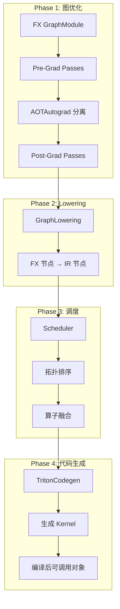

# PyTorch Inductor 源码解析（一）：整体架构概览

## 引言

PyTorch Inductor 是 PyTorch 2.0 引入的新一代深度学习编译器，作为 `torch.compile` 的默认后端，负责将 FX 图转换为优化的机器代码。本文将从源码角度深入剖析 Inductor 的整体架构设计。

**源码位置**: 主要位于 `torch/_inductor/` 目录

---

## 1. Inductor 在 PyTorch 编译栈中的位置

### 1.1 完整编译流程

```
用户代码 → TorchDynamo → AOTAutograd → Inductor → 优化代码
```

Inductor 处于编译流程的**后端优化阶段**，接收来自 AOTAutograd 的函数式 FX 图，输出优化后的可执行代码。

### 1.2 调用链路源码分析

#### 第一步：torch.compile 入口

**文件**: `torch/__init__.py` (torch.compile 定义)

```python
# torch/__init__.py: ~L1700
def compile(
    model: Union[torch.nn.Module, Callable],
    *,
    mode: Optional[str] = None,
    backend: Union[str, Callable] = "inductor",
    ...
) -> Union[torch.nn.Module, Callable]:
    """
    Torch.compile 主入口函数
    """
    # 创建 OptimizedModule 包装器
    # 设置 eval_frame 回调
```

#### 第二步：Dynamo 捕获图

**文件**: `torch/_dynamo/eval_frame.py`

Dynamo 通过字节码捕获生成 FX Graph，详细实现参考 `torch/_dynamo/eval_frame.py` 和 `torch/_dynamo/convert_frame.py`。

#### 第三步：Inductor 后端注册

**文件**: `torch/_dynamo/backends/inductor.py`

```python
# torch/_dynamo/backends/inductor.py: L19-L31
@register_backend
def inductor(*args: Any, **kwargs: Any) -> Any:
    """
    Inductor 后端注册函数
    被 torch.compile(backend="inductor") 调用
    """
    with dynamo_timed("inductor_import", log_pt2_compile_event=True):
        # 延迟导入，避免不必要的内存加载
        # 预热异步编译进程池
        from torch._inductor.async_compile import maybe_warm_pool

        maybe_warm_pool()

        # 导入核心编译函数
        from torch._inductor.compile_fx import compile_fx

    return compile_fx(*args, **kwargs)
```

**关键点**:
- 第 21 行：使用 `dynamo_timed` 记录导入耗时
- 第 25-27 行：预热异步编译进程池，加速后续编译
- 第 29 行：懒加载 `compile_fx` 主编译函数

---

## 2. Inductor 核心编译流程

### 2.1 compile_fx 主函数

**文件**: `torch/_inductor/compile_fx.py`

```python
# torch/_inductor/compile_fx.py: L114-L117
from .fx_passes.joint_graph import joint_graph_passes
from .fx_passes.post_grad import post_grad_passes, view_to_reshape
from .fx_passes.pre_grad import pre_grad_passes
from .graph import GraphLowering
```

核心编译流程在 `compile_fx_inner` 函数中实现：

```python
# torch/_inductor/compile_fx.py: ~L450 (compile_fx_inner)
def compile_fx_inner(
    gm: GraphModule,
    example_inputs: List[InputType],
    # ... 其他参数
):
    """
    Inductor 核心编译函数
    """
    # 1. 图优化 passes
    # 2. GraphLowering 转换
    # 3. 调度与融合
    # 4. 代码生成
```

### 2.2 编译流程详解



**核心编译函数**: `compile_fx_inner` 位于 `torch/_inductor/compile_fx.py:787`

---

## 3. Inductor 核心组件详解

### 3.1 组件总览表

| 组件 | 源码位置 | 核心类/函数 | 功能描述 |
|------|----------|-------------|----------|
| **编译入口** | `torch/_inductor/compile_fx.py` | `compile_fx()`, `compile_fx_inner()` | FX 图编译主函数 |
| **图 Lowering** | `torch/_inductor/graph.py` | `GraphLowering` | 将 FX 图转换为 Inductor IR |
| **IR 系统** | `torch/_inductor/ir.py` | `TensorBox`, `StorageBox`, `Buffer` | 中间表示定义 |
| **Lowerings** | `torch/_inductor/lowering.py` | `lowerings` 注册表 | 算子到 IR 的转换规则 |
| **调度器** | `torch/_inductor/scheduler.py` | `Scheduler`, `SchedulerNode` | 调度与算子融合 |
| **代码生成** | `torch/_inductor/codegen/` | `TritonCodegen`, `CppCodegen` | 生成 Triton/C++ 代码 |
| **FX Passes** | `torch/_inductor/fx_passes/` | `pre_grad_passes`, `post_grad_passes` | 图优化 passes |
| **配置系统** | `torch/_inductor/config.py` | `config` 模块 | 编译配置项 |

### 3.2 GraphLowering：核心转换引擎

**文件**: `torch/_inductor/graph.py`

```python
# torch/_inductor/graph.py: L344
class GraphLowering(torch.fx.Interpreter):
    """
    将 FX Graph 转换为 Inductor IR 的核心类
    
    继承自 torch.fx.Interpreter，通过解释执行 FX 图来构建 IR
    """
    
    def __init__(
        self,
        gm: torch.fx.GraphModule,
        shape_env: Optional[ShapeEnv] = None,
        # ... 其他参数
    ) -> None:
        super().__init__(gm)
        
        # L387-391: 形状环境初始化
        if shape_env is None:
            shape_env = ShapeEnv()
            self.reuse_shape_env = False
        else:
            self.reuse_shape_env = True
        self._shape_env = shape_env
        
        # L399: 尺寸变量代数系统
        self.sizevars = SizeVarAllocator(shape_env)
        
        # L400-401: 图输入管理
        self.graph_input_names: list[str] = []
        self.graph_inputs: dict[str, Union[TensorBox, TorchBindObject, sympy.Expr]] = {}
        
        # L421-422: IR 节点列表
        self.buffers: list[ir.Buffer] = []
        self.operations: list[ir.Operation] = []
        
        # L487: 调度器引用（代码生成时设置）
        self.scheduler: torch._inductor.scheduler.Scheduler = None
```

**关键方法**:

```python
# torch/_inductor/graph.py: ~L650
def run_node(self, node: torch.fx.Node):
    """
    解释执行 FX 节点，调用对应的 lowering 函数
    """
    self.current_node = node
    
    # 获取 lowering 实现
    lowering = get_lowering_for_node(node)
    
    # 执行 lowering，生成 IR 节点
    result = lowering(*args, **kwargs)
    
    return result
```

### 3.3 IR 系统核心类

**文件**: `torch/_inductor/ir.py`

IR 设计遵循"Box-Storage-Buffer"三层模式：

```python
# torch/_inductor/ir.py: L155-L194
""" [Note: Inductor IR]

Inductor's IR is produced by executing 'lowering' code (see lowering.py).

核心设计原则:
1. TensorBox 是所有 lowering 函数的输入/输出类型
2. TensorBox 可以指向 View 或 StorageBox
3. StorageBox 引入 Layout 概念，指向 Buffer
4. Buffer 是实际的内存分配和计算单元

表示链:
- 直接存储：TensorBox → StorageBox → Buffer
- 视图操作：TensorBox → View → StorageBox → Buffer
"""
```

**核心类层次**:

```
IRNode (抽象基类)
├── TensorBox (张量盒子)
│   └── 指向 StorageBox 或 View
├── Buffer (缓冲区)
│   ├── InputBuffer (输入/常量)
│   └── ComputedBuffer (计算结果)
│       ├── Pointwise (逐元素操作)
│       └── Reduction (归约操作)
└── View (视图)
    ├── ExpandView (广播)
    ├── PermuteView (转置)
    ├── SqueezeView (压缩)
    └── BaseView (切片/索引)
```

### 3.4 Scheduler：调度与融合

**文件**: `torch/_inductor/scheduler.py`

```python
# torch/_inductor/scheduler.py: L100-L136
@dataclasses.dataclass
class FusionResult:
    """融合结果表示"""
    should_fuse: Optional[bool] = None
    callable_fn: Optional[Callable[[], bool]] = None
    future: Optional[LambdaFuture] = None

# L126-135
@dataclasses.dataclass
class PendingFusion:
    """待处理的融合请求"""
    callable_fn: Callable[[], bool]
    node1: BaseSchedulerNode
    node2: BaseSchedulerNode
    future: Optional[LambdaFuture] = None
```

**调度流程**:

```python
# torch/_inductor/scheduler.py: ~L1400
class Scheduler:
    """
    负责:
    1. 构建依赖图
    2. 拓扑排序
    3. 节点分组（融合）
    4. 生成调度顺序
    """
    
    def __init__(self, graph):
        self.graph = graph
        self.nodes = []  # 待调度节点
        self.fusion_groups = []  # 融合组
        
    def schedule(self):
        # 1. 拓扑排序
        # 2. 尝试融合相邻节点
        # 3. 输出调度顺序
        pass
```

---

## 4. 数据流与代码流

### 4.1 数据流图


### 4.2 关键数据结构流转

| 阶段 | 输入 | 输出 | 核心处理 |
|------|------|------|----------|
| **Lowering** | FX Node | TensorBox/Buffer | `graph.py:run_node()` |
| **调度** | IR 节点列表 | SchedulerNode 列表 | `scheduler.py:schedule()` |
| **融合** | SchedulerNode | FusedSchedulerNode | `scheduler.py:fuse_nodes()` |
| **Codegen** | SchedulerNode | Triton/C++ 源码 | `codegen/triton.py` |

---

## 5. 配置系统

### 5.1 配置模块结构

**文件**: `torch/_inductor/config.py`

```python
# torch/_inductor/config.py: ~L50
class InductorConfig:
    """Inductor 配置项容器"""
    
    # 编译模式
    max_autotune: bool = False
    coordinate_descent_tuning: bool = False
    
    # Triton 相关
    triton: TritonConfig = field(default_factory=TritonConfig)
    
    # 优化开关
    dce: bool = True  # Dead Code Elimination
    fusion: bool = True
    
    # AOTInductor
    aot_indductor: AOTConfig = field(default_factory=AOTConfig)
```

### 5.2 常用配置项

```python
import torch._inductor.config as config

# 启用 max-autotune 模式
config.max_autotune = True

# 启用坐标下降调优
config.coordinate_descent_tuning = True

# 启用 Triton CUDAGraphs
config.triton.cudagraphs = True

# 调试模式
config.verbose = True
```

---

## 6. 异步编译架构

### 6.1 异步编译池

**文件**: `torch/_inductor/async_compile.py`

```python
# torch/_inductor/async_compile.py: ~L100
class AsyncCompile:
    """
    异步编译管理器
    
    使用进程池并行编译多个 kernel，减少编译时间
    """
    
    def __init__(self):
        self.pool = ProcessPoolExecutor()
        
    def submit(self, kernel_fn):
        """提交 kernel 进行异步编译"""
        return self.pool.submit(kernel_fn)
```

### 6.2 预热机制

**文件**: `torch/_inductor/async_compile.py`

```python
# torch/_inductor/async_compile.py: ~L800
def maybe_warm_pool():
    """
    预热异步编译进程池
    
    在首次编译前启动 worker 进程，避免编译延迟
    """
    if config.async_compile:
        async_compile.warmup()
```

---

## 7. 源码阅读路线图

### 7.1 推荐阅读顺序

```
1. torch/_dynamo/backends/inductor.py (入口)
2. torch/_inductor/compile_fx.py (主编译函数)
3. torch/_inductor/graph.py (GraphLowering)
4. torch/_inductor/ir.py (IR 定义)
5. torch/_inductor/lowering.py (Lowering 规则)
6. torch/_inductor/scheduler.py (调度融合)
7. torch/_inductor/codegen/triton.py (代码生成)
```

### 7.2 关键代码行索引

| 文件 | 行号范围 | 内容 |
|------|----------|------|
| `backends/inductor.py` | L19-31 | 后端注册 |
| `compile_fx.py` | L450-600 | compile_fx_inner 主函数 |
| `graph.py` | L343-497 | GraphLowering 初始化 |
| `graph.py` | L650-750 | run_node 节点执行 |
| `ir.py` | L155-194 | IR 设计说明注释 |
| `scheduler.py` | L100-136 | 融合结果定义 |
| `config.py` | L50-200 | 配置类定义 |

---

## 8. 总结

本文从源码角度介绍了 PyTorch Inductor 的整体架构：

1. **编译流程**: TorchDynamo 捕获 → AOTAutograd 分离 → Inductor 优化 → 代码生成
2. **核心组件**: GraphLowering、IR 系统、Scheduler、Codegen
3. **设计模式**: Box-Storage-Buffer 三层 IR 设计
4. **性能优化**: 异步编译、算子融合、autotune

后续文章将深入剖析每个组件的实现细节。

---

**下一篇**: [PyTorch Inductor 源码解析（二）：IR 系统设计](./02-inductor-ir-design.md)
