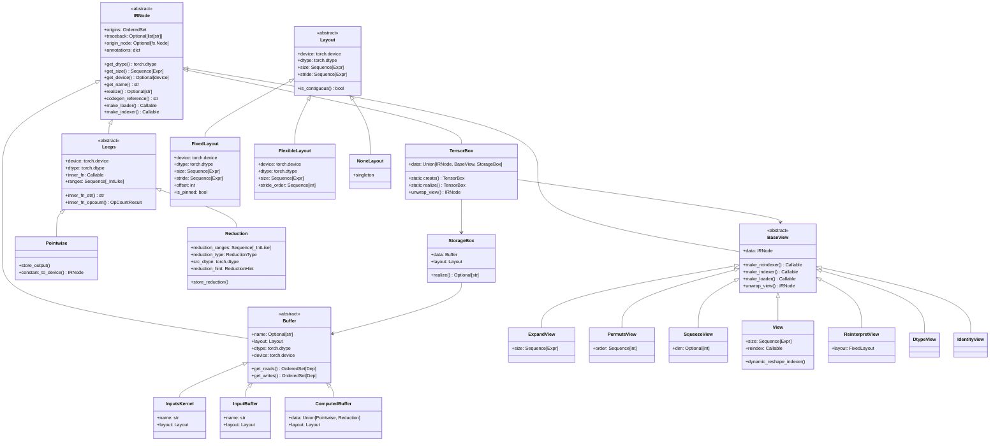

# PyTorch Inductor 源码解析（二）：IR 系统设计

## 引言

PyTorch Inductor 的中间表示（IR）系统是整个编译器的核心。IR 设计的质量直接决定了编译器优化的能力和代码生成的效率。本文深入剖析 Inductor 的 IR 设计，包括其核心类层次、视图机制和计算表示。

**源码位置**: `torch/_inductor/ir.py` (共约 4000 行)

---

## 1. IR 设计哲学

### 1.1 设计原则

Inductor 的 IR 设计遵循"Box-Storage-Buffer"三层模式，这一设计的核心思想在源码注释中有明确说明：

**文件**: `torch/_inductor/ir.py`

```python
# torch/_inductor/ir.py: L155-L194
""" [Note: Inductor IR]

Inductor's IR is produced by executing 'lowering' code (see lowering.py).
Each lowering is registered to a particular aten operator, and expects inputs
that correspond to the aten schema. However, in place of torch Tensor inputs,
lowerings expect Inductor TensorBox inputs.

TensorBox IR represents torch tensors. Tensors are sometimes single objects owning
storage, and sometimes views of another Tensor's storage. Mutating tensor operations
(such as add_()) affect the underlying storage and any associated views. Other operations
(such as .t_()) update metadata about the current view but don't modify the underlying storage.

To model this in Inductor, the IR distinguishes between TensorBox, View, StorageBox and Buffer.

TensorBox is the top level IR construct that any lowering should produce and maps to 
a torch.Tensor output from an operation. But just as torch.Tensors take different forms, 
TensorBox IR can reference View IR or directly reference StorageBox IRs.

Some Inductor lowerings produce new sets of 'Box'es, while others (such as .t() or other 
view ops) may take an existing TensorBox and point it to a new underlying View IR.

Tensors that directly own storage are represented as a chain of:
    TensorBox → StorageBox → Buffer
where Buffer is a simple (1D) allocation, and StorageBox introduces the concept of a Layout.

If you mutate the data of such a tensor, we swing the StorageBox pointer to point to a 
new buffer (leaving the old buffer unmodified and functionalizing the operation).

Tensors backed by views add one more indirection to the IR.
    TensorBox → View → StorageBox → Buffer
In these cases, the underlying StorageBox/Buffer will be shared with the pre-view TensorBox.

Computation is represented by Operation nodes, with each operation producing 1
or more output Buffers. In the case of mutations, these will be new Buffers that have 
the mutated buffer listed in its get_mutation_names().

It is also possible to have an InputBuffer for which there is no corresponding Operation,
e.g. it may be a graph input or compile time constant.
"""
```

### 1.2 核心设计概念

| 概念 | 作用 | 对应 PyTorch 语义 |
|------|------|------------------|
| **TensorBox** | 顶层 IR，所有 lowering 的输入/输出类型 | `torch.Tensor` |
| **StorageBox** | 引入 Layout 概念，管理内存布局 | Tensor 的 storage + stride |
| **Buffer** | 实际内存分配和计算单元 | 底层内存分配 |
| **View** | 视图变换，不改变底层存储 | `view()`, `transpose()`, `squeeze()` 等 |

---

## 2. IR 类层次结构

### 2.1 完整类图



### 2.2 IRNode 基类

**文件**: `torch/_inductor/ir.py`

```python
# torch/_inductor/ir.py: L540-L795
class IRNode:
    """
    Base class for all intermediate representation (IR) nodes in TorchInductor.
    Note: This is an abstract base class. Most methods raise NotImplementedError
    and must be overridden by concrete subclasses.
    """
    
    # L548-556: 溯源信息（用于调试和错误报告）
    _current_origins: ClassVar[OrderedSet[Any]] = OrderedSet()
    origins: OrderedSet[Any] = dataclasses.field(init=False)  # 创建位置溯源
    traceback: Optional[list[str]] = dataclasses.field(init=False)  # Python 调用栈
    origin_node: Optional[torch.fx.Node] = dataclasses.field(init=False)  # 来源 FX 节点
    annotations: dict[str, Any] = dataclasses.field(init=False)  # 元数据注解
    
    # L558-566: 上下文管理器，用于设置当前 IR 节点的溯源
    @staticmethod
    @contextlib.contextmanager
    def current_origins(origins: OrderedSet[Node]) -> Generator[None, None, None]:
        old = IRNode._current_origins
        IRNode._current_origins = old | origins
        try:
            yield
        finally:
            IRNode._current_origins = old
    
    # L587-595: __post_init__ 设置溯源信息
    def __post_init__(self) -> None:
        origins = OrderedSet(self._current_origins)
        self._post_init_setattr("origins", origins)
        self._post_init_setattr(
            "traceback", traceback.format_stack() if config.debug_ir_traceback else None
        )
        self._post_init_setattr("origin_node", None)
        self._post_init_setattr("annotations", {})
    
    # L597-598: 获取读取的 buffer 名称
    def get_read_names(self) -> OrderedSet[str]:
        return OrderedSet(dep.name for dep in self.get_reads())
    
    # L669-676: 获取数据类型
    def get_dtype(self) -> torch.dtype:
        return self.dtype
    
    def maybe_get_dtype(self) -> Optional[torch.dtype]:
        try:
            return self.get_dtype()
        except NotImplementedError:
            return None
    
    # L700-714: 获取形状/大小
    def get_size(self) -> Sequence[Expr]:
        raise NotImplementedError(f"get_size() is not implemented by {type(self)}!")
    
    def maybe_get_size(self) -> Optional[Sequence[_IntLike]]:
        try:
            return self.get_size()
        except NotImplementedError:
            return None
    
    @property
    def shape(self) -> Union[_IntLike, sympy.Rel, Sequence[_IntLike]]:
        return self.get_size()
    
    def get_numel(self) -> Expr:
        return sympy_product(self.get_size())
    
    # L719-735: realize 方法 - 物化延迟计算
    def realize(self) -> Optional[str]:
        """
        如果 IRNode 引用的数据尚未物化（例如，它是一个 Pointwise/Reduction，
        可能还有更多计算可以融合），则将 IRNode 物化到物理内存中，
        结束向其融合的可能性，但允许多个用户访问数据而无需重新计算。
        
        TODO: 每个 IRNode 都应该有这个实现
        """
        raise NotImplementedError(f"realize NYI on {type(self)}")
    
    # L751-758: 生成数据加载器
    def make_loader(self) -> Callable[[Sequence[Expr]], OpsValue]:
        raise NotImplementedError(type(self).__name__)
    
    # L754-758: 生成索引器
    def make_indexer(self) -> Callable[[Sequence[Expr]], Expr]:
        raise NotImplementedError(type(self).__name__)
```

**关键方法解析**：

| 方法 | 用途 | 调用场景 |
|------|------|----------|
| `get_size()` | 获取张量形状 | 代码生成、调度 |
| `get_dtype()` | 获取数据类型 | 类型检查、代码生成 |
| `get_device()` | 获取设备 | 设备放置、调度 |
| `realize()` | 物化延迟计算 | 多次读取、融合边界 |
| `make_loader()` | 生成加载函数 | 代码生成 |
| `make_indexer()` | 生成索引函数 | 视图变换 |

---

## 3. TensorBox：顶层 IR

### 3.1 TensorBox 定义

**文件**: `torch/_inductor/ir.py`

```python
# torch/_inductor/ir.py: ~L1400
@dataclasses.dataclass
class TensorBox(IRNode):
    """
    TensorBox 是 Inductor IR 的顶层抽象，代表一个 torch.Tensor
    
    核心特性:
    1. 所有 lowering 函数的输入和输出都是 TensorBox
    2. 可以指向 StorageBox（直接存储）或 BaseView（视图）
    3. 支持延迟物化（lazy realization）
    """
    data: Union[IRNode, BaseView, StorageBox]
    
    @classmethod
    def create(cls, data: Union[IRNode, BaseView, StorageBox]) -> "TensorBox":
        """
        创建 TensorBox 的工厂方法
        
        Args:
            data: 底层 IR 节点（Buffer、View 等）
        
        Returns:
            TensorBox 实例
        """
        return cls(data=data)
    
    def realize(self) -> Optional[str]:
        """
        物化 TensorBox，确保数据被实际分配到内存
        
        调用场景:
        1. 同一数据被多次读取（避免重复计算）
        2. 需要作为其他 kernel 的输入
        3. 是图的输出节点
        """
        if isinstance(self.data, BaseView):
            self.data.realize()
            return self.data.get_name()
        elif isinstance(self.data, StorageBox):
            return self.data.realize()
        return None
    
    def unwrap_view(self) -> IRNode:
        """
        解包所有视图层，返回底层 IR 节点
        
        用途: 获取实际的数据源
        """
        x: IRNode = self
        while isinstance(x, BaseView):
            x = x.data
        return x
```

### 3.2 TensorBox 使用示例

```python
# lowering.py 中的典型用法
@lowerings.register(aten.add.Tensor)
def add_lowering(a: TensorBox, b: TensorBox) -> TensorBox:
    """
    aten.add 的 lowering 实现
    
    输入：两个 TensorBox
    输出：一个新的 TensorBox（包含 Pointwise IR）
    """
    def inner_fn(idx):
        return ops.add(
            a.make_loader()(idx),
            b.make_loader()(idx)
        )
    
    # 创建 Pointwise IR 节点
    return Pointwise.create(
        device=a.get_device(),
        dtype=torch.promote_types(a.get_dtype(), b.get_dtype()),
        inner_fn=inner_fn,
        ranges=a.get_size(),  # 假设 a 和 b 形状相同
    )
```

---

## 4. StorageBox 与 Layout

### 4.1 StorageBox 定义

**文件**: `torch/_inductor/ir.py`

```python
# torch/_inductor/ir.py: ~L2750
@ir_dataclass
class StorageBox(IRNode):
    """
    StorageBox 代表一个有具体内存布局的缓冲区
    
    核心作用:
    1. 引入 Layout 概念（size, stride, offset）
    2. 管理 Buffer 的物化
    3. 处理原地操作（通过重定向到新 Buffer）
    """
    data: Buffer
    layout: Layout  # 内存布局
    
    def realize(self) -> Optional[str]:
        """
        物化 StorageBox
        
        如果 data 是 ComputedBuffer，则会实际分配内存并生成计算代码
        如果 data 已经是 InputBuffer，则无需操作
        """
        if isinstance(self.data, ComputedBuffer):
            # 触发代码生成
            self.data.codegen()
            return self.data.get_name()
        return None
    
    def get_size(self) -> Sequence[Expr]:
        return self.layout.size
    
    def get_stride(self) -> Sequence[Expr]:
        return self.layout.stride
```

### 4.2 Layout 层次

**文件**: `torch/_inductor/ir.py`

```python
# torch/_inductor/ir.py: ~L2000
@dataclasses.dataclass
class Layout(IRNode):
    """
    Layout 抽象基类，定义内存布局的接口
    """
    device: torch.device
    dtype: torch.dtype
    size: Sequence[Expr]
    
    def is_contiguous(self) -> bool:
        """检查是否连续存储"""
        raise NotImplementedError
    
    def is_stride_ordered(self, order: Sequence[int]) -> bool:
        """检查是否符合指定的 stride 顺序"""
        raise NotImplementedError


@dataclasses.dataclass
class FixedLayout(Layout):
    """
    固定的内存布局，有明确的 stride
    
    属性:
        stride: 每个维度的步幅
        offset: 起始偏移量
        is_pinned: 是否锁定内存（用于 GPU 传输）
    """
    stride: Sequence[Expr]
    offset: int = 0
    is_pinned: bool = False
    
    def is_contiguous(self) -> bool:
        """检查是否内存连续"""
        expected_strides = FlexibleLayout.contiguous_strides(self.size)
        return list(self.stride) == list(expected_strides)
    
    def should_pad_strides(self) -> bool:
        """检查是否需要填充 stride（用于性能优化）"""
        # 实现细节...
        pass


@dataclasses.dataclass
class FlexibleLayout(Layout):
    """
    灵活的内存布局，只指定 stride 顺序
    
    用于优化 pass 中，允许编译器选择最优的具体 stride
    """
    stride_order: Sequence[int] = ()
    allow_indexing: bool = False
    
    @staticmethod
    def contiguous_strides(size: Sequence[Expr]) -> Sequence[Expr]:
        """计算连续存储的 strides"""
        strides = []
        stride = 1
        for s in reversed(size):
            strides.append(stride)
            stride *= s
        return list(reversed(strides))


class NoneLayout(Layout):
    """
    空布局，用于没有实际输出的操作（如常数）
    """
    size = []
    stride = []
    
    @classmethod
    def singleton(cls):
        return cls(device=None, dtype=None)
```

### 4.3 Layout 转换流程

```python
# torch/_inductor/ir.py: L2748-L2805
def as_storage_and_layout(
    x: IRNode,
    freeze: bool = True,
    want_contiguous: bool = False,
) -> tuple[StorageBox, Layout]:
    """
    将任意 IRNode 转换为 (StorageBox, Layout) 对
    
    Args:
        x: 输入 IRNode
        freeze: 是否冻结布局（不允许后续优化）
        want_contiguous: 是否要求连续布局
    
    Returns:
        (StorageBox, Layout) 对
    
    Raises:
        NotImplementedError: 如果无法转换
    """
    if isinstance(x, StorageBox):
        return x, x.layout
    
    if isinstance(x, TensorBox):
        return as_storage_and_layout(x.data, freeze, want_contiguous)
    
    if isinstance(x, BaseView):
        buffer, _ = as_storage_and_layout(x.data, freeze, want_contiguous)
        return buffer, x.layout
    
    raise NotImplementedError(f"Cannot convert {type(x)} to storage and layout")


# torch/_inductor/ir.py: L2728-L2733
def is_storage_and_layout(x: IRNode) -> bool:
    """检查 IRNode 是否已经有具体的 storage 和 layout"""
    try:
        as_storage_and_layout(x, freeze=False)
        return True
    except NotImplementedError:
        return False
```

---

## 5. Buffer 类型层次

### 5.1 Buffer 分类

```python
# torch/_inductor/ir.py: ~L800
@ir_dataclass
class Buffer(IRNode):
    """
    Buffer 抽象基类，代表实际的内存分配
    
    子类:
    - InputBuffer: 图输入或常量
    - ComputedBuffer: 计算产生的缓冲区
    - ExternKernel: 外部 kernel（如 cuBLAS）
    """
    name: Optional[str]
    layout: Layout
    dtype: torch.dtype
    device: torch.device
    
    @abstractmethod
    def get_reads(self) -> OrderedSet[Dep]:
        """获取读取依赖"""
        pass
    
    @abstractmethod
    def get_writes(self) -> OrderedSet[Dep]:
        """获取写入依赖"""
        pass


# torch/_inductor/ir.py: ~L850
@ir_dataclass
class InputBuffer(Buffer):
    """
    输入缓冲区，代表图的输入或编译时常量
    
    特点:
    - 没有对应的 Operation
    - 由外部提供数据
    """
    pass


# torch/_inductor/ir.py: ~L900
@ir_dataclass
class ComputedBuffer(Buffer):
    """
    计算缓冲区，由 Inductor 计算产生
    
    属性:
        data: 计算逻辑（Pointwise 或 Reduction）
        layout: 内存布局
    """
    data: Union[Pointwise, Reduction]
    
    def get_reads(self) -> OrderedSet[Dep]:
        """从计算逻辑中提取读取依赖"""
        return self.data.get_reads()
    
    def get_writes(self) -> OrderedSet[Dep]:
        """获取写入依赖"""
        return OrderedSet([MemoryDep(self.name, ...)])
```

### 5.2 Pointwise 计算

**文件**: `torch/_inductor/ir.py`

```python
# torch/_inductor/ir.py: L1070-L1108
@ir_dataclass
class Pointwise(Loops):
    """
    逐元素计算的 IR 表示
    
    适用算子:
    - 算术运算：add, sub, mul, div
    - 激活函数：relu, sigmoid, tanh
    - 类型转换：to, view_as
    
    特点:
    - 每个输出元素独立计算
    - 易于融合
    """
    
    def make_loader(self) -> Callable[[Sequence[Expr]], OpsValue]:
        """生成数据加载函数"""
        if self.is_zero_elements():
            return partial(nop_loader_fn, dtype=self.dtype)
        return self.inner_fn
    
    def store_output(
        self,
        output_name: Optional[str],
        indexer: Callable[[Sequence[Expr]], Expr],
        vars: Sequence[Expr],
    ) -> None:
        """存储输出到指定位置"""
        loader = self.make_loader()
        return ops.store(output_name or "unnamed", indexer(vars), loader(vars))
    
    def constant_to_device(self, device: torch.device) -> IRNode:
        """将此计算移动到指定设备（要求所有读取都是常量）"""
        loader = self.make_loader()
        loader = patch.object(ConstantBuffer, "override_device", device)(loader)
        return Pointwise(
            device=device,
            dtype=self.dtype,
            inner_fn=loader,
            ranges=self.ranges,
        )
```

### 5.3 Reduction 计算

**文件**: `torch/_inductor/ir.py`

```python
# torch/_inductor/ir.py: L1220-L1288
@ir_dataclass
class Reduction(Loops):
    """
    归约计算的 IR 表示
    
    适用算子:
    - 求和：sum, nansum
    - 最值：max, min, argmax, argmin
    - 统计：mean, var, std
    
    属性:
        reduction_ranges: 归约维度
        reduction_type: 归约类型 ("sum", "max", etc.)
        src_dtype: 源数据类型
        dst_dtype: 目标数据类型
        reduction_hint: 归约优化提示
    """
    reduction_ranges: Sequence[_IntLike]
    reduction_type: ReductionType
    src_dtype: torch.dtype
    reduction_hint: ReductionHint
    
    def store_reduction(
        self,
        output_name: Optional[str],
        indexer: Callable[[Sequence[Expr]], Expr],
        vars: Sequence[Expr],
        reduction_vars: Sequence[Symbol],
    ) -> None:
        """存储归约结果"""
        value = ops.reduction(
            self.dtype,
            self.src_dtype,
            self.reduction_type,
            self.inner_fn(vars, reduction_vars),
        )
        ops.store_reduction(output_name or "unnamed", indexer(vars), value)
    
    @staticmethod
    def num_splits(
        device: torch.device,
        dst_dtype: torch.dtype,
        src_dtype: torch.dtype,
        inner_fn: Callable[..., Any],
        ranges: Sequence[_IntLike],
        reduction_ranges: Sequence[_IntLike],
        reduction_type: ReductionType,
        reduction_numel: Expr,
        input_node: Optional[IRNode] = None,
    ) -> tuple[ReductionHint, _IntLike]:
        """
        计算归约操作的分块策略
        
        考虑因素:
        - GPU SM 数量
        - 每个线程的元素数
        - 是否支持单元素归约
        
        Returns:
            (ReductionHint, split_factor)
        """
        reduction_numel_hint = V.graph.sizevars.symbolic_hint(reduction_numel)
        numel_hint = V.graph.sizevars.symbolic_hint(sympy_product(ranges))
        
        props = DeviceProperties.create(device)
        num_sm = props.multi_processor_count
        min_elements_per_thread = 32
        
        # ... 详细实现见 L1301-L1400
```

---

## 6. 视图（View）机制

### 6.1 BaseView 抽象类

**文件**: `torch/_inductor/ir.py`

```python
# torch/_inductor/ir.py: L2836-L2931
@ir_dataclass
class BaseView(IRNode):
    """
    视图操作的抽象基类
    
    视图特点:
    - 不改变底层存储
    - 通过 reindex 映射新索引到旧索引
    - 可以链式组合
    """
    data: IRNode  # 被视图的数据
    
    def make_reindexer(self) -> Callable[[Sequence[Expr]], Sequence[Expr]]:
        """生成重索引函数（新索引 → 旧索引）"""
        raise NotImplementedError
    
    def make_indexer(self) -> Callable[[Sequence[Expr]], Expr]:
        """
        生成索引器
        
        组合 inner 的索引器和 reindex 函数
        """
        inner = self.data.make_indexer()
        reindex = self.make_reindexer()
        
        def indexer(idx: Sequence[Expr]) -> Expr:
            return inner(reindex(idx))
        
        return indexer
    
    def make_loader(self) -> Callable[[Sequence[Expr]], OpsValue]:
        """
        生成加载器
        
        组合 inner 的加载器和 reindex 函数
        """
        inner = self.data.make_loader()
        reindex = self.make_reindexer()
        
        def loader(idx: Sequence[Expr]) -> OpsValue:
            return inner(reindex(idx))
        
        return loader
    
    def unwrap_view(self) -> IRNode:
        """解包所有视图层，返回底层 IR"""
        x: IRNode = self
        while isinstance(x, BaseView):
            x = x.data
        return x
```

### 6.2 ExpandView（广播视图）

**文件**: `torch/_inductor/ir.py`

```python
# torch/_inductor/ir.py: L2934-L3000
@ir_dataclass
class ExpandView(BaseView):
    """
    广播（expand）操作的视图表示
    
    实现方式:
    - 将广播维度的 stride 设为 0
    - 读取时重复使用同一元素
    """
    size: Sequence[Expr]
    
    @classmethod
    def create(cls, x: IRNode, new_size: Sequence[_IntLike]) -> BaseView:
        """
        创建 ExpandView
        
        如果输入已经有 storage 和 layout，直接创建 ReinterpretView
        否则创建 ExpandView
        """
        new_size = cls._normalize_size(x, new_size)
        
        if is_storage_and_layout(x):
            storage, old_layout = as_storage_and_layout(x)
            skip = len(new_size) - len(old_layout.size)
            assert skip >= 0
            
            # 计算新 stride（广播维度 stride=0）
            new_stride = [sympy.S.Zero] * skip
            for stride, size in zip(old_layout.stride, old_layout.size):
                new_stride.append(
                    stride if not V.graph.sizevars.is_size_one_or_false(size) 
                    else sympy.S.Zero
                )
            
            new_layout = FixedLayout(
                old_layout.device,
                old_layout.dtype,
                list(new_size),
                new_stride,
                old_layout.offset,
                old_layout.is_pinned,
            )
            return ReinterpretView(data=storage, layout=new_layout)
        
        # 无法直接 reinterpret，创建 ExpandView
        return cls(data=x, size=list(new_size))
```

### 6.3 SqueezeView（压缩视图）

**文件**: `torch/_inductor/ir.py`

```python
# torch/_inductor/ir.py: L3080-L3142
@ir_dataclass
class SqueezeView(BaseView):
    """
    squeeze 操作的视图表示
    
    移除大小为 1 的维度
    """
    dim: Optional[int] = None
    
    @classmethod
    def create(cls, x: IRNode, dim: Optional[int] = None) -> BaseView:
        """创建 SqueezeView"""
        
        if is_storage_and_layout(x):
            storage, old_layout = as_storage_and_layout(x)
            
            # 计算新 size 和 stride
            if dim is None:
                # 移除所有大小为 1 的维度
                new_size = [
                    s for s in old_layout.size 
                    if not V.graph.sizevars.is_size_one_or_false(s)
                ]
            else:
                assert old_layout.size[dim] == 1
                new_size = [s for i, s in enumerate(old_layout.size) if i != dim]
            
            new_stride = FlexibleLayout.contiguous_strides(new_size)
            new_layout = FixedLayout(
                old_layout.device,
                old_layout.dtype,
                new_size,
                new_stride,
                old_layout.offset,
                old_layout.is_pinned,
            )
            return ReinterpretView(data=storage, layout=new_layout)
        
        # 使用通用 View
        if dim is None:
            return View.create(x, [s for s in x.get_size() if s != 1])
        else:
            return View.create(x, [s for i, s in enumerate(x.get_size()) if i != dim])
    
    @staticmethod
    def squeezer(size: Sequence[Expr]) -> tuple[list[int], Callable]:
        """
        生成 squeeze 变换
        
        Returns:
            (new_size, reindex_fn)
        """
        new_size = [s for s in size if s != 1]
        not_one = [i for i, s in enumerate(size) if s != 1]
        length = len(size)
        
        def reindex(index: Sequence[Expr]) -> tuple[Expr, ...]:
            assert len(index) == len(not_one)
            new_index: list[Expr] = [sympy.S.Zero] * length
            for idx, s in zip(not_one, index):
                new_index[idx] = s
            return tuple(new_index)
        
        return new_size, reindex
```

### 6.4 View（通用视图）

**文件**: `torch/_inductor/ir.py`

```python
# torch/_inductor/ir.py: L3182-L3322
@ir_dataclass
class View(GenericView):
    """
    通用视图，处理任意 reshape 操作
    
    核心算法:
    1. 尝试计算有效的 output strides
    2. 如果成功，创建 ReinterpretView
    3. 如果失败（非连续输入 + 复杂 reshape），需要物化
    """
    
    @classmethod
    def create(cls, x: IRNode, new_size: Sequence[Expr]) -> IRNode:
        """
        创建 View 的工厂方法
        
        决策流程:
        1. 检查形状是否相同 → 直接返回
        2. 检查是否有 unbacked symbols → 需要 contiguous
        3. 检查输入是否 contiguous → 可直接 reinterpret
        4. 尝试计算有效 strides → 成功则 reinterpret
        5. 否则 fallback 到动态 reshape
        """
        assert isinstance(new_size, Sequence)
        old_size, new_size = cls.resolve_negative_size(x.get_size(), new_size)
        
        # 跳过无意义的视图
        if V.graph.sizevars.statically_known_list_equals(old_size, new_size):
            return x
        
        unbacked_symbols_in_sizes = (
            len(free_unbacked_symbols(old_size)) > 0 or
            len(free_unbacked_symbols(new_size)) > 0
        )
        is_contiguous = is_contiguous_storage_and_layout(x)
        
        # 情况 1: 输入连续，输出也使用连续 strides
        if is_contiguous:
            return create_reinterpret_view(
                x, new_size, FlexibleLayout.contiguous_strides(new_size)
            )
        
        # 情况 2: 无法获取 storage/layout（如 Pointwise 节点）
        if not is_storage_and_layout(x):
            return handle_unbacked_or_dynamic_reshape(x)
        
        # 情况 3: 尝试计算有效 strides
        storage, old_layout = as_storage_and_layout(x, freeze=False)
        
        # 使用 PyTorch 内部的 stride 计算逻辑
        from torch._subclasses.fake_impls import _compute_stride
        new_stride_symint = _compute_stride(
            old_size, old_layout.stride, new_size,
            size_oblivious=unbacked_symbols_in_sizes,
        )
        
        if new_stride_symint is not None:
            # 可以创建 ReinterpretView
            return create_reinterpret_view(x, new_size, new_stride_symint)
        
        # 无法 reinterpret，需要物化或动态 reshape
        return handle_unbacked_or_dynamic_reshape(x)
    
    @staticmethod
    def resolve_negative_size(
        old_size: Sequence[Expr], new_size: Sequence[Expr]
    ) -> tuple[list[Expr], list[Expr]]:
        """处理 -1 维度"""
        new_size = [V.graph.sizevars.simplify(x) for x in new_size]
        old_size = [V.graph.sizevars.simplify(x) for x in old_size]
        
        new_size = list(new_size)
        for i in range(len(new_size)):
            if new_size[i] == -1:
                new_size[i] = sympy.S.One
                new_size[i] = CleanDiv(
                    sympy_product(old_size), sympy_product(new_size)
                )
                break
        
        # 验证元素总数不变
        V.graph.sizevars.check_equals(
            sympy_product(old_size), sympy_product(new_size)
        )
        return old_size, new_size
```

---

## 7. IR 操作与代码生成

### 7.1 OpsValue 与虚拟执行

**文件**: `torch/_inductor/virtualized.py`

```python
# torch/_inductor/virtualized.py
class OpsValue:
    """
    虚拟执行时的值表示
    
    在 IR 构建阶段，我们不生成实际代码，而是构建
    一个计算图（OpsValue 节点），稍后再进行代码生成
    """
    pass


class ops:
    """
    虚拟操作集合
    
    这些操作在 IR 构建时被调用，生成 OpsValue 节点
    在代码生成时，这些节点被转换为实际代码
    """
    
    @staticmethod
    def add(a: OpsValue, b: OpsValue) -> OpsValue:
        """加法操作"""
        return _ops.add(a, b)
    
    @staticmethod
    def mul(a: OpsValue, b: OpsValue) -> OpsValue:
        """乘法操作"""
        return _ops.mul(a, b)
    
    @staticmethod
    def store(name: str, index: Expr, value: OpsValue) -> None:
        """存储操作"""
        _ops.store(name, index, value)
    
    @staticmethod
    def reduction(
        dst_dtype: torch.dtype,
        src_dtype: torch.dtype,
        reduction_type: str,
        body: OpsValue,
    ) -> OpsValue:
        """归约操作"""
        return _ops.reduction(dst_dtype, src_dtype, reduction_type, body)
```

### 7.2 从 IR 到代码

IR 到代码的转换流程：

```
IR 节点 → make_loader()/make_indexer() → 
LoopBody → SIMDKernel → Triton/C++ 代码
```

**代码生成入口**:

```python
# torch/_inductor/codegen/triton.py
class TritonKernel(Codegen):
    """
    Triton 代码生成器
    
    输入：SchedulerNode（包含 IR 节点和调度信息）
    输出：Triton 源代码字符串
    """
    
    def codegen(self, node: SchedulerNode) -> str:
        """生成 Triton 代码"""
        # 1. 生成 kernel 签名
        # 2. 生成索引计算
        # 3. 生成循环体
        # 4. 生成存储操作
        pass
```

---

## 8. 源码阅读指南

### 8.1 关键代码行索引

| 文件 | 行号范围 | 内容 |
|------|----------|------|
| `ir.py` | L155-L194 | IR 设计说明注释 |
| `ir.py` | L540-L795 | IRNode 基类 |
| `ir.py` | L935-L1060 | Loops 抽象类 |
| `ir.py` | L1070-L1108 | Pointwise 类 |
| `ir.py` | L1220-L1288 | Reduction 类 |
| `ir.py` | L2836-L2931 | BaseView 抽象类 |
| `ir.py` | L2934-L3000 | ExpandView 类 |
| `ir.py` | L3080-L3142 | SqueezeView 类 |
| `ir.py` | L3182-L3322 | View 类 |

### 8.2 调试技巧

```python
# 启用 IR 调试输出
import torch._inductor.config as config
config.debug_ir_traceback = True  # 记录 IR 创建栈

# 打印 IR 节点
from torch._inductor.ir import TensorBox
node = ...  # 某个 IR 节点
print(node)  # 使用 __str__ 方法
print(repr(node))  # 使用 __repr__ 方法

# 查看溯源信息
print(node.origins)  # 创建位置
print(node.traceback)  # Python 调用栈
print(node.origin_node)  # 来源 FX 节点
```

---

## 9. 总结

本文详细介绍了 PyTorch Inductor 的 IR 系统设计：

1. **设计哲学**: Box-Storage-Buffer 三层模式，支持延迟物化和视图链
2. **核心类**: IRNode、TensorBox、StorageBox、Buffer、View
3. **计算表示**: Pointwise（逐元素）和 Reduction（归约）
4. **视图机制**: ExpandView、SqueezeView、PermuteView、View
5. **代码生成**: 通过 make_loader()/make_indexer() 转换为可执行代码

理解 IR 系统是理解 Inductor 后续组件（Lowering、Scheduler、Codegen）的基础。

---

**下一篇**: [PyTorch Inductor 源码解析（三）：Lowering 机制详解](./03-lowering-mechanism.md)
