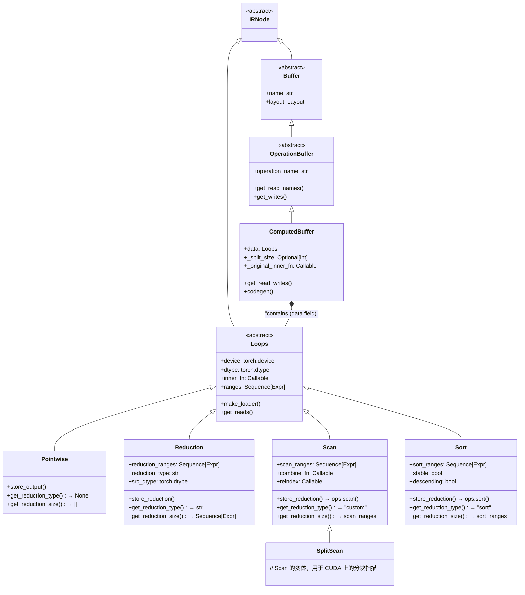

# PyTorch Inductor 源码解析（二.一）：Buffer 与计算类型详解

## 引言

本文档是对 [02-inductor-ir-design.md](./02-inductor-ir-design.md) 中 **Buffer 类型层次** 部分的补充说明，详细解释 `Buffer`、`Pointwise` 和 `Reduction` 三者之间的关系。

**核心关系一句话总结**：
> `ComputedBuffer` 是计算结果的容器，它包含一个 `Loops` 类型的计算描述（`data` 字段），而 `Loops` 的具体实现是 `Pointwise` 或 `Reduction`。

---

## 1. 类层次关系图



---

## 2. 核心概念解析

### 2.1 职责分工表

| 类型 | 职责 | 类比 |
|------|------|------|
| **ComputedBuffer** | 计算结果的**容器**，管理内存分配、依赖关系、代码生成入口 | 类似 C++ 中的 `std::vector` 对象本身 |
| **Pointwise** | **逐元素计算**的逻辑描述（如 `a + b`） | 类似 `for i: out[i] = a[i] + b[i]` |
| **Reduction** | **归约计算**的逻辑描述（如 `sum`, `max`） | 类似 `for i: out[i] = sum_j(a[i, j])` |
| **Scan** | **扫描/前缀和**的逻辑描述（如 `cumsum`） | 类似 `for j: out[i, j] = out[i, j-1] + in[i, j]` |
| **Sort** | **排序**的逻辑描述（如 `sort`, `argsort`） | 类似 `out[i, :] = sort(in[i, :])` |

### 2.2 关键源码片段

#### ComputedBuffer 定义（L4689-4750）

```python
# torch/_inductor/ir.py: L4689
@ir_dataclass
class ComputedBuffer(OperationBuffer):
    """
    代表在 kernel 执行期间计算的缓冲区（而非输入）
    
    核心字段:
        data: Loops 类型 - 实际计算逻辑的描述
        _split_size: 用于 split reduction 优化
        _original_inner_fn: 原始 inner_fn（split 时保留）
    """
    data: Loops  # ← Pointwise, Reduction, Scan, 或 Sort
    
    def get_read_writes(self) -> dependencies.ReadWrites:
        """从 inner_fn 中提取读写依赖"""
        if isinstance(self.data, Reduction):
            return extract_read_writes(
                self.data.make_loader(),
                self.data.get_size(),
                self.data.get_reduction_size(),
            )
        else:  # Pointwise
            return extract_read_writes(
                self.data.make_loader(),
                self.data.get_size(),
            )
    
    def get_reads(self) -> OrderedSet[Dep]:
        return self.get_read_writes().reads
    
    def get_writes(self) -> OrderedSet[Dep]:
        # 写入自己的 buffer
        return OrderedSet([MemoryDep(self.name, ...)])
```

#### Pointwise 定义（L1070-1109）

```python
# torch/_inductor/ir.py: L1070
@ir_dataclass
class Pointwise(Loops):
    """
    逐元素计算的 IR 表示
    
    数学形式：output[i] = f(input_1[i], input_2[i], ...)
    
    特点:
    - 输出和输入的索引是一一对应的
    - 没有归约维度
    - 易于融合（多个 pointwise 可以合并成一个 kernel）
    """
    
    def make_loader(self) -> Callable[[Sequence[Expr]], OpsValue]:
        """生成加载函数"""
        if self.is_zero_elements():
            return partial(nop_loader_fn, dtype=self.dtype)
        return self.inner_fn  # 直接使用 inner_fn
    
    def get_reduction_type(self) -> None:
        """Pointwise 没有归约类型"""
        return None
    
    def get_reduction_size(self) -> Sequence[Expr]:
        """Pointwise 没有归约维度"""
        return []
    
    def store_output(
        self,
        output_name: Optional[str],
        indexer: Callable[[Sequence[Expr]], Expr],
        vars: Sequence[Expr],  # 索引变量
    ) -> None:
        """存储输出"""
        loader = self.make_loader()
        # 对每个索引 vars，计算 loader(vars) 并存到 indexer(vars)
        return ops.store(output_name, indexer(vars), loader(vars))
```

#### Reduction 定义（L1220-1289）

```python
# torch/_inductor/ir.py: L1220
@ir_dataclass
class Reduction(Loops):
    """
    归约计算的 IR 表示
    
    数学形式：output[i] = reduce_j(f(input_1[i, j], ...))
    
    其中:
        - ranges: 输出维度（如 [i]）
        - reduction_ranges: 归约维度（如 [j]）
        - reduction_type: "sum", "max", "argmax" 等
    
    示例: sum(x, dim=1) for x shape (N, M)
        ranges = [N]           # 输出形状
        reduction_ranges = [M]  # 归约掉的维度
    """
    reduction_ranges: Sequence[_IntLike]  # 归约维度
    reduction_type: ReductionType          # 归约类型
    src_dtype: torch.dtype                 # 源数据类型
    reduction_hint: ReductionHint          # 优化提示
    
    def get_reduction_type(self) -> Optional[str]:
        return self.reduction_type
    
    def get_reduction_size(self) -> Sequence[Expr]:
        return self.reduction_ranges
    
    def inner_fn_args(self) -> Sequence[Sequence[Expr]]:
        """
        Reduction 的 inner_fn 需要两组索引:
        1. index: 输出维度索引（非归约维度）
        2. rindex: 归约维度索引
        """
        index = self._index(self.ranges)           # 如 [i]
        rindex = self._index(self.reduction_ranges, SymT.R0_INDEX)  # 如 [r0]
        return (index, rindex)  # inner_fn(index, rindex)
    
    def store_reduction(
        self,
        output_name: Optional[str],
        indexer: Callable[[Sequence[Expr]], Expr],
        vars: Sequence[Expr],       # 输出索引
        reduction_vars: Sequence[Symbol],  # 归约索引
    ) -> None:
        """
        存储归约结果
        
        关键：使用 ops.reduction 包装 inner_fn 的结果
        """
        value = ops.reduction(
            self.dtype,
            self.src_dtype,
            self.reduction_type,
            self.inner_fn(vars, reduction_vars),  # 注意：传入两组索引
        )
        ops.store_reduction(output_name, indexer(vars), value)
```

---

## 3. 数据流与代码生成

### 3.1 完整的数据流

```
FX Graph
   ↓
Lowering (lowering.py)
   ↓
创建 Pointwise/Reduction 节点
   ↓
封装到 ComputedBuffer.data
   ↓
Scheduler 调度（决定融合）
   ↓
代码生成（codegen）
   ↓
Triton/C++ Kernel
```

### 3.2 代码生成示例

#### Pointwise 代码生成

假设我们有 `c = a + b`，其中 `a`, `b`, `c` 都是形状 `(N,)` 的张量：

```python
# IR 构建阶段（lowering.py）
def inner_fn(idx):
    a_loader = a.make_loader()  # 加载 a[idx]
    b_loader = b.make_loader()  # 加载 b[idx]
    return ops.add(a_loader(idx), b_loader(idx))

pointwise = Pointwise(
    device=cpu,
    dtype=torch.float32,
    inner_fn=inner_fn,
    ranges=[N],  # 输出形状
)

buffer = ComputedBuffer(
    name="c_buf",
    layout=FlexibleLayout(cpu, torch.float32, [N]),
    data=pointwise,
)
```

生成的伪代码：

```python
# 代码生成阶段
for i in range(N):
    c[i] = a[i] + b[i]  # 直接逐元素计算
```

#### Reduction 代码生成

假设我们有 `c = sum(a, dim=1)`，其中 `a` 形状 `(N, M)`，`c` 形状 `(N,)`：

```python
# IR 构建阶段
def inner_fn(idx, ridx):
    # idx = [i], ridx = [r0]
    a_loader = a.make_loader()
    return a_loader(idx + ridx)  # 加载 a[i, r0]

reduction = Reduction(
    device=cpu,
    dtype=torch.float32,
    inner_fn=inner_fn,
    ranges=[N],           # 输出维度
    reduction_ranges=[M],  # 归约维度
    reduction_type="sum",
    src_dtype=torch.float32,
)

buffer = ComputedBuffer(
    name="c_buf",
    layout=FlexibleLayout(cpu, torch.float32, [N]),
    data=reduction,
)
```

生成的伪代码：

```python
# 代码生成阶段
for i in range(N):
    acc = 0  # 归约初始值
    for r0 in range(M):  # 归约循环
        acc += a[i, r0]
    c[i] = acc
```

---

## 4. 关键区别对比表

| 特性 | Pointwise | Reduction | Scan | Sort |
|------|-----------|-----------|------|------|
| **索引参数** | `inner_fn(index)` | `inner_fn(index, rindex)` | `inner_fn(reindex(index, scan_index))` | `inner_fn(reindex(index, sort_index))` |
| **归约类型** | `None` | `"sum"`, `"max"`, ... | `"custom"` | `"sort"` |
| **特殊维度** | 无 | `reduction_ranges` | `scan_ranges` | `sort_ranges` |
| **存储方法** | `store_output()` | `store_reduction()` | `store_reduction()` → `ops.scan()` | `store_reduction()` → `ops.sort()` |
| **代码生成** | 单层循环 | 双层循环（外层 + 归约内层） | 双层循环（扫描前缀和） | 双层循环（排序） |
| **融合能力** | 高 | 低（通常是融合边界） | 低 | 低 |
| **典型算子** | add, mul, relu, sigmoid | sum, mean, max, argmax | cumsum, cumprod, softmax | sort, argsort |
| **CombineFn** | 无 | 内置（add/max 等） | 用户自定义 | 内置排序逻辑 |
| **输出索引** | 单输出 | 单输出 | `output_index` 选择多输出之一 | `output_index` 选择多输出之一 |

---

## 5. 其他 Loops 类型：Scan 和 Sort

除了 `Pointwise` 和 `Reduction`，`Loops` 还有两个子类用于更复杂的计算模式。

### 5.1 Scan（扫描/前缀和）

**源码**：`torch/_inductor/ir.py: L2367-L2565`

```python
@ir_dataclass
class Scan(Loops):
    """
    扫描操作（前缀和/累积和）
    
    数学形式：output[i, j] = combine(output[i, j-1], input[i, j])
    
    典型算子：
    - cumsum: 累积和
    - cumprod: 累积积
    - softmax: 需要前缀扫描
    
    与 Reduction 的区别：
    - Reduction: 归约维度被"压缩"，输出形状变小
    - Scan: 保持输出形状与输入相同，每个位置存储中间结果
    """
    scan_ranges: list[Integer]                      # 扫描维度
    size: list[Integer]                             # 输出形状
    combine_fn: Callable[[tuple, tuple], tuple]     # 合并函数
    reindex: Callable[[Sequence, Sequence], Sequence]  # 重索引
    dtypes: tuple[torch.dtype, ...]                 # 多输出类型
    inner_fns: tuple[Callable, ...]                 # 多输入函数
    output_index: int                               # 选择输出索引
    
    def store_reduction(self, output_name, indexer, vars, scan_vars):
        idx = self.reindex(vars, scan_vars)
        values = tuple(inner_fn(idx) for inner_fn in self.inner_fns)
        result = ops.scan(self.dtypes, self.combine_fn, values)
        return ops.store(output_name, indexer(idx), result[self.output_index])
```

**示例**：`cumsum(x, dim=1)`

```python
# 输入：x shape (N, M)
# 输出：out shape (N, M), out[i, j] = sum(x[i, 0:j+1])

def inner_fn(idx):
    # idx = [i, j]
    return x.make_loader()(idx)

scan = Scan(
    device=cpu,
    dtypes=(torch.float32,),
    inner_fns=(inner_fn,),
    size=[N, M],
    axis=1,  # 沿 dim=1 扫描
    combine_fn=lambda a, b: (a[0] + b[0],),  # 累加
)
```

### 5.2 Sort（排序）

**源码**：`torch/_inductor/ir.py: L2575-L2725`

```python
@ir_dataclass
class Sort(Loops):
    """
    排序操作
    
    数学形式：output[i] = sort(input[i, :], stable, descending)
    
    典型算子：
    - sort: 返回值和索引
    - argsort: 只返回索引
    
    特点:
    - 类似 Reduction，有 sort_ranges
    - 输出形状与输入相同（不压缩维度）
    - 使用 ops.sort 进行代码生成
    """
    sort_ranges: list[Integer]                      # 排序维度
    size: list[Integer]                             # 输出形状
    reindex: Callable[[Sequence, Sequence], Sequence]  # 重索引
    dtypes: tuple[torch.dtype, ...]                 # (值类型，索引类型)
    inner_fns: tuple[Callable, ...]                 # 多输入函数
    output_index: int                               # 0=值，1=索引
    stable: bool                                    # 稳定排序
    descending: bool                                # 降序
    
    def store_reduction(self, output_name, indexer, vars, reduction_vars):
        idx = self.reindex(vars, reduction_vars)
        values = tuple(inner_fn(idx) for inner_fn in self.inner_fns)
        result = ops.sort(self.dtypes, values, self.stable, self.descending)
        return ops.store(output_name, indexer(idx), result[self.output_index])
```

**示例**：`sort(x, dim=1, descending=True)`

```python
# 输入：x shape (N, M)
# 输出：values shape (N, M), indices shape (N, M)

def value_fn(idx):
    return x.make_loader()(idx)

def index_fn(idx):
    return ops.constant(0, torch.int64)  # 初始索引

sort = Sort(
    device=cpu,
    dtypes=(torch.float32, torch.int64),
    inner_fns=(value_fn, index_fn),
    size=[N, M],
    axis=1,
    stable=True,
    descending=True,
    output_index=0,  # 先存储值
)
```

### 5.3 SplitScan

```python
@ir_dataclass
class SplitScan(Scan):
    """
    Scan 的变体，用于 CUDA 上的分块扫描
    
    当 scan_numel 较大时，使用分块策略：
    1. 每个 block 计算局部扫描
    2. 计算 block 间的前缀和
    3. 合并结果
    """
    pass  # 继承 Scan，使用不同的 codegen 路径
```

---

## 6. ComputedBuffer 的核心作用

## 6. ComputedBuffer 的核心作用

### 6.1 为什么需要 ComputedBuffer？

既然 `Pointwise` 和 `Reduction` 已经描述了计算逻辑，为什么还需要 `ComputedBuffer` 这一层？

**答案**：`ComputedBuffer` 负责**计算之外**的事情：

1. **内存管理**：分配实际内存（通过 `Layout`）
2. **依赖追踪**：记录读取了哪些 buffer，写入了哪个 buffer
3. **调度接口**：为 Scheduler 提供融合决策的接口
4. **代码生成入口**：`codegen()` 方法是代码生成的起点

### 6.2 ComputedBuffer 的关键方法

```python
# torch/_inductor/ir.py: L4750-L4850
@ir_dataclass
class ComputedBuffer(OperationBuffer):
    data: Loops  # Pointwise 或 Reduction
    
    def get_read_names(self) -> OrderedSet[str]:
        """获取读取的 buffer 名称列表"""
        return self.data.get_read_names()
    
    def get_writes(self) -> OrderedSet[Dep]:
        """获取写入依赖（总是写入自己的 name）"""
        return OrderedSet([MemoryDep(self.name, ...)])
    
    def codegen(self, wrapper: "PythonWrapperCodegen", kernel: "Kernel") -> None:
        """
        代码生成入口
        
        流程:
        1. 根据 self.data 类型选择生成 Pointwise 或 Reduction 代码
        2. 使用 self.layout 计算索引
        3. 调用 self.data.store_output() 或 self.data.store_reduction()
        """
        if isinstance(self.data, Pointwise):
            self._codegen_pointwise(wrapper, kernel)
        elif isinstance(self.data, Reduction):
            self._codegen_reduction(wrapper, kernel)
        # ...
```

---

## 7. 实例分析

### 7.1 示例：`c = relu(a + b)`

```python
# 1. a + b 生成 Pointwise1
def add_inner_fn(idx):
    return ops.add(a.make_loader()(idx), b.make_loader()(idx))

pointwise1 = Pointwise(device=cpu, dtype=torch.float32, inner_fn=add_inner_fn, ranges=[N])
buffer1 = ComputedBuffer(name="tmp1", layout=..., data=pointwise1)

# 2. relu 生成 Pointwise2
def relu_inner_fn(idx):
    return ops.relu(buffer1.make_loader()(idx))

pointwise2 = Pointwise(device=cpu, dtype=torch.float32, inner_fn=relu_inner_fn, ranges=[N])
buffer2 = ComputedBuffer(name="c", layout=..., data=pointwise2)

# 3. Scheduler 可能融合两个 Pointwise
# 融合后等效于：
def fused_inner_fn(idx):
    return ops.relu(ops.add(a.make_loader()(idx), b.make_loader()(idx)))

fused_pointwise = Pointwise(device=cpu, dtype=torch.float32, inner_fn=fused_inner_fn, ranges=[N])
fused_buffer = ComputedBuffer(name="c", layout=..., data=fused_pointwise)
```

### 7.2 示例：`c = sum(relu(a), dim=1)`

```python
# 1. relu(a) 生成 Pointwise
def relu_inner_fn(idx):
    return ops.relu(a.make_loader()(idx))

pointwise = Pointwise(device=cpu, dtype=torch.float32, inner_fn=relu_inner_fn, ranges=[N, M])
pointwise_buffer = ComputedBuffer(name="tmp1", layout=..., data=pointwise)

# 2. sum 生成 Reduction
def sum_inner_fn(idx, ridx):
    # idx = [i], ridx = [r0]
    return pointwise_buffer.make_loader()(idx + ridx)

reduction = Reduction(
    device=cpu,
    dtype=torch.float32,
    inner_fn=sum_inner_fn,
    ranges=[N],           # 输出维度
    reduction_ranges=[M],  # 归约维度
    reduction_type="sum",
    src_dtype=torch.float32,
)
reduction_buffer = ComputedBuffer(name="c", layout=..., data=reduction)

# 3. Scheduler 可能融合 Pointwise 到 Reduction
# 融合后等效于：
def fused_inner_fn(idx, ridx):
    return ops.relu(a.make_loader()(idx + ridx))

fused_reduction = Reduction(
    device=cpu,
    dtype=torch.float32,
    inner_fn=fused_inner_fn,
    ranges=[N],
    reduction_ranges=[M],
    reduction_type="sum",
    src_dtype=torch.float32,
)
fused_buffer = ComputedBuffer(name="c", layout=..., data=fused_reduction)
```

---

## 9. 从 Aten IR 到 Inductor IR 的转换流程

### 9.1 整体架构

```
┌─────────────────────────────────────────────────────────────────┐
│                    PyTorch 源代码                                │
│                    torch.add(a, b)                              │
└─────────────────────────────────────────────────────────────────┘
                              ↓
┌─────────────────────────────────────────────────────────────────┐
│              Dynamo 捕获 (torch._dynamo)                         │
│         将 Python 代码转换为 FX Graph (Aten IR)                    │
│                                                                 │
│    graph:                                                        │
│      %a : [num_users=1] = placeholder[target=a]                 │
│      %b : [num_users=1] = placeholder[target=b]                 │
│      %add : [num_users=1] = call_function[target=aten.add]      │
│      return add                                                 │
└─────────────────────────────────────────────────────────────────┘
                              ↓
┌─────────────────────────────────────────────────────────────────┐
│           Inductor GraphLowering (torch/_inductor/graph.py)    │
│                                                                 │
│    GraphLowering.run_node() 执行每个 FX 节点:                      │
│    1. 查找 lowering 字典中对应的实现                             │
│    2. 调用 lowering 函数生成 Inductor IR                         │
└─────────────────────────────────────────────────────────────────┘
                              ↓
┌─────────────────────────────────────────────────────────────────┐
│              Lowering 函数 (torch/_inductor/lowering.py)        │
│                                                                 │
│    @register_lowering(aten.add.Tensor)                          │
│    def add_lowering(a: TensorBox, b: TensorBox) -> TensorBox:   │
│        def inner_fn(idx):                                       │
│            return ops.add(a.make_loader()(idx),                 │
│                          b.make_loader()(idx))                  │
│        return Pointwise.create(...)  # 创建 Inductor IR          │
└─────────────────────────────────────────────────────────────────┘
                              ↓
┌─────────────────────────────────────────────────────────────────┐
│                  Inductor IR (Loops 类型)                        │
│                                                                 │
│    Pointwise / Reduction / Scan / Sort                          │
│    封装到 ComputedBuffer.data                                   │
└─────────────────────────────────────────────────────────────────┘
```

### 9.2 Lowering 注册机制

**文件**: `torch/_inductor/lowering.py: L114, L529`

```python
# lowering.py: L114
lowerings: dict[Union[Callable[..., Any], str], Callable[..., Any]] = {}

# lowering.py: L529
def register_lowering(
    aten_fn,
    broadcast=False,
    type_promotion_kind=ELEMENTWISE_TYPE_PROMOTION_KIND.DEFAULT,
    convert_input_to_bool=False,
    lowering_dict=lowerings,
) -> Callable[[Callable[_P, _T]], Callable[_P, _T]]:
    """
    将 Aten 算子注册到 lowering 字典
    
    用法:
        @register_lowering(aten.add.Tensor)
        def add_lowering(a: TensorBox, b: TensorBox) -> TensorBox:
            ...
    """
    return functools.partial(
        _register_lowering,
        aten_fn,
        broadcast=broadcast,
        type_promotion_kind=type_promotion_kind,
        convert_input_to_bool=convert_input_to_bool,
        lowering_dict=lowerings,
    )
```

### 9.3 各类计算的 Lowering 示例

#### Pointwise lowering（以 `add` 为例）

**文件**: `torch/_inductor/lowering.py`

```python
@register_lowering(aten.add.Tensor)
def add_lowering(a: TensorBox, b: TensorBox) -> TensorBox:
    """
    aten.add → Pointwise IR
    
    流程:
    1. 接收 TensorBox 输入（Aten IR 的产物）
    2. 创建 inner_fn 描述逐元素计算
    3. 返回 Pointwise.create() 创建的 TensorBox
    """
    def inner_fn(idx):
        return ops.add(
            a.make_loader()(idx),
            b.make_loader()(idx)
        )
    
    return Pointwise.create(
        device=a.get_device(),
        dtype=torch.promote_types(a.get_dtype(), b.get_dtype()),
        inner_fn=inner_fn,
        ranges=a.get_size(),
    )
```

#### Reduction lowering（以 `sum` 为例）

**文件**: `torch/_inductor/lowering.py: L6292`

```python
@register_lowering(aten.sum)
def sum_lowering(x: TensorBox, dim: Optional[list[int]] = None) -> TensorBox:
    """
    aten.sum → Reduction IR
    
    流程:
    1. 确定归约维度 (reduction_ranges)
    2. 确定输出维度 (ranges)
    3. 创建 inner_fn(idx, ridx) 描述归约逻辑
    4. 返回 Reduction.create()
    """
    if dim is None:
        # 归约所有维度
        reduction_ranges = x.get_size()
        ranges = []
    else:
        # 归约指定维度
        reduction_ranges = [x.get_size()[d] for d in dim]
        ranges = [s for i, s in enumerate(x.get_size()) if i not in dim]
    
    def inner_fn(idx, ridx):
        # idx: 输出索引, ridx: 归约维度索引
        full_idx = [*idx[:dim[0]], *ridx, *idx[dim[0]:]]  # 简化版
        return x.make_loader()(full_idx)
    
    return Reduction.create(
        device=x.get_device(),
        dst_dtype=x.get_dtype(),
        src_dtype=x.get_dtype(),
        inner_fn=inner_fn,
        ranges=ranges,
        reduction_ranges=reduction_ranges,
        reduction_type="sum",
    )
```

#### Scan lowering（以 `cumsum` 为例）

**文件**: `torch/_inductor/lowering.py: L6723-L6744`

```python
@register_lowering(aten.cumsum)
def cumsum(x, axis=None, dtype=None):
    """
    aten.cumsum → Scan IR
    
    cumsum 是典型的前缀和扫描操作:
    - 输出形状与输入相同
    - 每个位置存储从起点到该位置的累积和
    """
    if (
        is_integer_dtype(x.get_dtype()) or is_boolean_dtype(x.get_dtype())
    ) and dtype is None:
        dtype = torch.int64

    if len(x.get_size()) == 0:
        return to_dtype(x, dtype, copy=True)

    # 定义 combine_fn：前缀和的合并逻辑
    def combine_fn(a_tuple, b_tuple):
        (a,) = a_tuple
        (b,) = b_tuple
        return (ops.add(a, b),)  # 累加

    kwargs = _make_scan_inner(x, axis=axis, dtype=dtype)
    (result,) = ir.Scan.create(**kwargs, combine_fn=combine_fn)
    
    if result is None:
        # Fallback to Aten 实现
        return fallback_cumsum(x, dim=axis, dtype=dtype)
    return result
```

#### Sort lowering（以 `sort` 为例）

**文件**: `torch/_inductor/lowering.py: L6895-L6937`

```python
@register_lowering(aten.sort.stable, type_promotion_kind=None)
def sort_stable(x, *, stable=None, dim=-1, descending=False):
    """
    aten.sort → Sort IR
    
    sort 返回两个值:
    - values: 排序后的值
    - indices: 排序后的索引
    """
    if stable is None:
        stable = False

    shape = x.get_size()
    device = x.get_device()
    dim = canonicalize_dim(len(shape), dim)
    
    if len(shape) == 0:
        return clone(x), _full(0, device, torch.int64, shape)

    dim_size = shape[dim] if len(shape) else 1
    
    # 创建初始索引张量
    indices = iota(dim_size, start=0, step=1, dtype=torch.int16, device=device)
    indices = expand(indices, shape)

    # 创建 Sort IR
    values, indices = ir.Sort.create(
        device=device,
        dtypes=(x.dtype, indices.dtype),  # 多输出：值和索引
        inner_fns=(x.make_loader(), indices.make_loader()),
        size=shape,
        axis=dim,
        stable=stable,
        descending=descending,
    )
    
    if values is None:
        # Fallback to Aten 实现
        return sort_fallback(x, stable=stable, dim=dim, descending=descending)

    assert indices is not None
    return values, to_dtype(indices, torch.int64)
```

### 9.4 GraphLowering 执行流程

**文件**: `torch/_inductor/graph.py: L1683`

```python
class GraphLowering(torch.fx.Interpreter):
    """
    解释执行 FX Graph，将每个节点转换为 Inductor IR
    """
    
    def run_node(self, n: torch.fx.Node) -> object:
        """Lower and execute a single FX node into Inductor IR."""
        
        if is_call_function:
            args, kwargs = self.fetch_args_kwargs_from_env(n)
            
            # 通过 super().run_node() 最终调用 lowering 函数
            if (
                n.op == "call_function"
                and isinstance(n.target, torch._ops.OpOverload)
                and n.target in lowerings  # 查找注册的 lowering
            ):
                # 调用 lowering 函数，返回 TensorBox（Inductor IR）
                result = lowerings[n.target](*args, **kwargs)
            else:
                # 没有 lowering，使用 fallback
                result = fallback_handler(n.target)(*args, **kwargs)
        
        # 将生成的 IR 节点添加到 buffers 列表
        self.buffers.extend(collect_buffers(result))
        
        return result
```

### 9.5 完整转换示例

假设用户代码：`c = sum(relu(a + b), dim=1)`

| 阶段 | 表示形式 | 代码/数据结构 |
|------|----------|---------------|
| **Python** | 源代码 | `c = torch.sum(torch.relu(torch.add(a, b)), dim=1)` |
| **Aten IR** | FX Graph | 4 个节点：placeholder(a), placeholder(b), call_function(add), call_function(relu), call_function(sum) |
| **Inductor IR** | Loops | 1. `Pointwise` (add) <br> 2. `Pointwise` (relu) <br> 3. `Reduction` (sum) |
| **Buffer** | ComputedBuffer | 3 个 `ComputedBuffer`，每个包含一个 `Loops` 子类 |
| **Scheduler** | Fusion | 可能融合为 1 个 kernel |
| **Codegen** | Triton/C++ | 生成的 GPU/CPU 代码 |

---

## 11. 总结

```
┌─────────────────────────────────────────────────────────────┐
│                      ComputedBuffer                         │
│  ┌───────────────────────────────────────────────────────┐  │
│  │  name: "output_buf"                                   │  │
│  │  layout: FixedLayout(...)                             │  │
│  │  data: ─────────────────────────────────────────────┐ │  │
│  └─────────────────────────────────────────────────────│─┘  │
│                                                        ↓      │
│  ┌─────────────────────────────────────────────────────────┐ │
│  │  Loops (abstract)                                       │ │
│  │    device: torch.device                                 │ │
│  │    dtype: torch.dtype                                   │ │
│  │    inner_fn: Callable                                   │ │
│  │    ranges: Sequence[Expr]                               │ │
│  └─────────────────────────────────────────────────────────┘ │
│                         ↑                       ↑             │
│                         │                       │             │
│    ┌────────────────────┴──────┬────────────────┴──────────┐ │
│    │                           │                           │ │
│ ┌──┴───────┐           ┌───────┴────────┐         ┌────────┴───────┐
│ │Pointwise │           │   Reduction    │         │    Scan        │
│ │───────── │           │────────────────│         │────────────────│
│ │inner_fn( │           │inner_fn(       │         │inner_fn(       │
│ │  index)  │           │  index, rindex)│         │  reindex(...)) │
│ │reduction │           │reduction="sum" │         │reduction="cust.│
│ │= None    │           │ranges=[N]      │         │scan_ranges=[M] │
│ │ranges=   │           │reduct_ranges=[M]│        │combine_fn=...  │
│ │  [N,M]   │           │                │         │                │
│ └──────────┘           └────────────────┘         └────────────────┘
│                                                            ↑
│                              ┌─────────────────────────────┘
│                              │
│                     ┌────────┴──────────┐
│                     │  Sort (sort op)   │
│                     │───────────────────│
│                     │sort_ranges=[M]    │
│                     │stable=true/false  │
│                     │descending=true/fal│
│                     └───────────────────┘
└─────────────────────────────────────────────────────────────┘
```

**核心要点**：

1. `ComputedBuffer` 是**容器**，`Loops`（`Pointwise`/`Reduction`/`Scan`/`Sort`）是**内容**
2. `Pointwise` 用于逐元素计算，`Reduction` 用于归约计算
3. `Scan` 用于前缀和/扫描操作（如 `cumsum`），保持输出形状
4. `Sort` 用于排序操作，返回排序后的值和索引
5. 区分关键：是否有 `reduction_ranges`/`scan_ranges`/`sort_ranges` 和对应的类型
6. 代码生成时，`ComputedBuffer.codegen()` 根据 `data` 的类型调用不同的生成逻辑

---

**下一篇**: [PyTorch Inductor 源码解析（三）：Lowering 机制详解](./03-lowering-mechanism.md)
