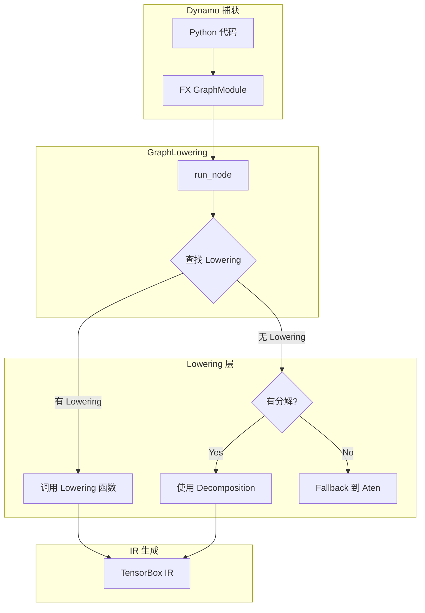

# PyTorch Inductor 源码解析（三）：Lowering 机制详解

## 引言

Lowering 是编译器将高层算子转换为底层 IR 的关键步骤。在 PyTorch Inductor 中，Lowering 机制负责将 FX 图中的 Aten 算子转换为 Inductor 的 IR 节点（TensorBox、Pointwise、Reduction 等）。本文深入剖析 Inductor 的 Lowering 机制。

**源码位置**: `torch/_inductor/lowering.py` (约 2500 行)

---

## 1. Lowering 概述

### 1.1 什么是 Lowering

Lowering（降低/降维）是编译器术语，指将高层抽象的操作转换为低层表示的过程。在 Inductor 中：

```
FX 图 (Aten 算子) → Lowering → Inductor IR (TensorBox/Buffer)
```

### 1.2 Lowering 位置



### 1.3 核心数据结构

**文件**: `torch/_inductor/lowering.py`

```python
# torch/_inductor/lowering.py: L113-L131
log = logging.getLogger(__name__)

# Lowering 注册表：算子 → 实现函数
lowerings: dict[Union[Callable[..., Any], str], Callable[..., Any]] = {}

# 布局约束表：算子 → 布局约束函数
_maybe_layout_constraints: dict[
    torch._ops.OpOverload, Optional[Callable[..., Any]]
] = {}

# Fallback 算子集合
fallbacks = OrderedSet[torch._ops.OpOverload]()

# 需要实化输入的算子
needs_realized_inputs = OrderedSet[torch._ops.OpOverload]()

# 算子命名空间
aten = torch.ops.aten
prims = torch.ops.prims
```

---

## 2. Lowering 注册系统

### 2.1 注册装饰器

**文件**: `torch/_inductor/lowering.py`

```python
# torch/_inductor/lowering.py: L529-L548
def register_lowering(
    aten_fn,
    broadcast=False,
    type_promotion_kind: Optional[
        ELEMENTWISE_TYPE_PROMOTION_KIND
    ] = ELEMENTWISE_TYPE_PROMOTION_KIND.DEFAULT,
    convert_input_to_bool=False,
    lowering_dict=lowerings,
) -> Callable[[Callable[_P, _T]], Callable[_P, _T]]:
    """
    注册 Lowering 函数的装饰器
    
    Args:
        aten_fn: Aten 算子（如 aten.add.Tensor）
        broadcast: 是否应用广播
        type_promotion_kind: 类型提升策略
        convert_input_to_bool: 是否将输入转换为 bool（用于逻辑运算）
        lowering_dict: 注册表（默认使用全局 lowerings）
    
    Returns:
        装饰器函数
    """
    return functools.partial(
        _register_lowering,
        aten_fn,
        broadcast=broadcast,
        type_promotion_kind=type_promotion_kind,
        convert_input_to_bool=convert_input_to_bool,
        lowering_dict=lowering_dict,
    )
```

### 2.2 内部注册函数

**文件**: `torch/_inductor/lowering.py`

```python
# torch/_inductor/lowering.py: L476-L526
def _register_lowering(
    aten_fn,
    decomp_fn: Callable[..., Any],
    broadcast: bool,
    type_promotion_kind: Optional[ELEMENTWISE_TYPE_PROMOTION_KIND],
    convert_input_to_bool: bool,
    lowering_dict: dict[Union[Callable[..., Any], str], Callable[..., Any]],
):
    """
    将 Lowering 函数注册到字典中
    
    内部包装逻辑:
    1. 参数变换（广播、类型提升）
    2. IR 验证
    3. 错误处理
    """
    
    @functools.wraps(decomp_fn)
    def wrapped(*args, **kwargs):
        args: list[Any] = list(args)
        kwargs: dict[str, Any] = dict(kwargs)
        
        # 处理可迭代参数解包
        unpacked = False
        if len(args) == 1 and isinstance(args[0], (list, tuple)):
            unpacked = True
            args = list(args[0])
        
        # 检查 fallback 状态
        if not all(
            (fn in fallbacks or in_namespace(fn, "_c10d_functional")) for fn in aten_fn
        ):
            assert not any(x == "out" for x in kwargs), \
                "out= ops aren't yet supported"
        
        # 参数变换：广播、类型提升
        args, kwargs = transform_args(
            args, kwargs, broadcast, type_promotion_kind, convert_input_to_bool
        )
        
        if unpacked:
            args = [args]
        
        # 调用实际 Lowering 函数
        out = decomp_fn(*args, **kwargs)
        
        # 验证生成的 IR 节点
        validate_ir(out)
        
        return out
    
    # 获取所有 overload 变体
    aten_fn = get_overloads(aten_fn)
    
    # 批量注册
    lowering_dict.update(dict.fromkeys(aten_fn, wrapped))
    return wrapped
```

### 2.3 逐元素 Lowering 注册

**文件**: `torch/_inductor/lowering.py`

```python
# torch/_inductor/lowering.py: L903-L945
def register_pointwise(
    aten_fn,
    name=None,
    broadcast=True,
    type_promotion_kind=ELEMENTWISE_TYPE_PROMOTION_KIND.DEFAULT,
    convert_input_to_bool=False,
    override_return_dtype=None,
    override_fn_when_input_bool=None,
    allow_alpha=False,
    triton_fallback=None,
):
    """
    注册逐元素算子的快捷装饰器
    
    自动完成:
    1. 创建 pointwise 包装函数
    2. 注册类型传播规则
    3. 同时注册 aten 和 prims 两个命名空间
    """
    name = name or aten_fn.__name__
    fn = ops_wrapper(name)  # 获取 ops 命名空间的函数
    
    # 注册类型传播规则
    register_op_dtype_propagation_rules(
        name, type_promotion_kind, override_return_dtype
    )
    
    # 处理 bool 输入的覆盖函数
    if override_fn_when_input_bool is not None:
        override_fn_when_input_bool = ops_wrapper(override_fn_when_input_bool)
    
    # 创建 pointwise 函数
    fn = make_pointwise(
        fn,
        override_return_dtype=override_return_dtype,
        override_fn_when_input_bool=override_fn_when_input_bool,
        allow_alpha=allow_alpha,
        triton_fallback=triton_fallback,
    )
    
    # 注册到 lowerings 字典
    fn = register_lowering(
        aten_fn,
        broadcast=broadcast,
        type_promotion_kind=type_promotion_kind,
        convert_input_to_bool=convert_input_to_bool,
    )(fn)
    
    # 同时注册 prims 命名空间
    if hasattr(prims, name):
        register_lowering(
            getattr(prims, name),
            type_promotion_kind=None,
            convert_input_to_bool=convert_input_to_bool,
        )(fn)
    return fn
```

### 2.4 使用示例

```python
# torch/_inductor/lowering.py: ~L1200
@register_lowering(aten.add.Tensor, broadcast=True)
def add_lowering(a: TensorBox, b: TensorBox) -> TensorBox:
    """
    aten.add.Tensor 的 Lowering 实现
    
    输入：两个 TensorBox（可能形状不同，需要广播）
    输出：逐元素相加的 TensorBox
    """
    def inner_fn(idx):
        return ops.add(
            a.make_loader()(idx),
            b.make_loader()(idx)
        )
    
    return Pointwise.create(
        device=a.get_device(),
        dtype=torch.promote_types(a.get_dtype(), b.get_dtype()),
        inner_fn=inner_fn,
        ranges=broadcast_shapes(a.get_size(), b.get_size()),
    )
```

---

## 3. 分解表（Decomposition Table）

### 3.1 分解机制

当算子没有直接的 Lowering 实现时，Inductor 使用分解表将复杂算子分解为基本算子。

**文件**: `torch/_inductor/decomposition.py`

```python
# torch/_inductor/decomposition.py: L64-L136
inductor_decompositions = get_decompositions(
    [
        # 自适应池化
        aten._adaptive_avg_pool2d_backward,
        
        # 索引操作
        aten.index_select,
        aten.addmv,
        
        # 激活函数
        aten.gelu,
        aten.leaky_relu,
        aten.elu,
        
        # 归一化
        aten.native_batch_norm,
        aten.native_group_norm,
        aten.native_layer_norm,
        
        # Softmax
        aten._softmax,
        aten._log_softmax,
        
        # 其他
        aten.arange,
        aten.flip,
        aten.dist,
        # ... 更多
    ]
)

# 合并 core_aten 和 inductor 专用分解
decompositions = {**core_aten_decompositions(), **inductor_decompositions}
```

### 3.2 排除的分解

某些分解虽然存在于 core_aten 中，但 Inductor 选择不使用：

```python
# torch/_inductor/decomposition.py: L114-L136
decomps_to_exclude: list[Union[torch._ops.OpOverload, torch._ops.OpOverloadPacket]] = [
    aten._unsafe_index,       # 使用 Inductor 自己的索引实现
    aten.clamp_max,           # 直接使用 Lowering
    aten.clamp_min,           # 直接使用 Lowering
    aten.glu,                 # Inductor 直接降低此算子
    aten.silu,                # Inductor 使用精确的 eager 分解
    aten.split.Tensor,        # Inductor 直接降低此算子
    aten.squeeze,             # Inductor 直接降低此算子
    aten.sum,                 # Inductor 直接降低此算子
    aten.baddbmm,             # 会上溢到 fp32，性能问题
    # ...
]

remove_decompositions(decompositions, decomps_to_exclude)
```

### 3.3 注册自定义分解

```python
# torch/_inductor/decomposition.py: L139-L145
def register_decomposition(
    ops: Union[_GenericOperator, list[_GenericOperator]],
) -> Callable[[Callable[_P, _T]], Callable[_P, _T]]:
    """注册自定义分解"""
    for op in ops if isinstance(ops, list) else [ops]:
        if op in decompositions:
            log.warning("duplicate decomp: %s", ops)
    return decomp.register_decomposition(ops, decompositions)


# 示例：注册自定义分解
@register_decomposition([aten.clamp])
@pw_cast_for_opmath_non_tensor_args
def clamp(
    x: torch.Tensor,
    min: Optional[torch.types.Number] = None,
    max: Optional[torch.types.Number] = None,
) -> torch.Tensor:
    if min is not None:
        x = torch.minimum(x, torch.tensor(min))
    if max is not None:
        x = torch.maximum(x, torch.tensor(max))
    return x
```

---

## 4. Pointwise Lowering

### 4.1 make_pointwise 函数

**文件**: `torch/_inductor/lowering.py`

```python
# torch/_inductor/lowering.py: L630-L716
def make_pointwise(
    fn,
    override_return_dtype=None,
    override_device=None,
    override_fn_when_input_bool=None,
    allow_alpha=False,
    triton_fallback=None,
):
    """
    创建逐元素 Lowering 函数的包装器
    
    Args:
        fn: 底层操作函数（如 ops.add）
        override_return_dtype: 覆盖返回类型
        override_device: 覆盖设备
        override_fn_when_input_bool: 当输入为 bool 时的替代函数
        allow_alpha: 是否支持 alpha 参数
        triton_fallback: Triton fallback 实现
    
    Returns:
        包装后的 Lowering 函数
    """
    def inner(*inputs: TensorBox, alpha=None):
        # 处理 Triton fallback
        if triton_fallback is not None and any(
            isinstance(inp, IRNode) and is_triton(inp) for inp in inputs
        ):
            assert not allow_alpha
            return triton_fallback(*inputs)
        
        # 常量提升
        inputs = promote_constants(inputs, override_return_dtype)
        
        # 处理 alpha 参数
        if allow_alpha:
            if alpha is not None and alpha != 1:
                inputs = list(inputs)
                inputs[-1] = mul(inputs[-1], alpha)
        else:
            assert alpha is None
        
        # 获取加载器
        loaders = [x.make_loader() for x in inputs]
        ranges = inputs[0].get_size()
        dtype = override_return_dtype or inputs[0].get_dtype()
        
        # 验证形状兼容性
        for other in inputs[1:]:
            assert isinstance(other, ir.BaseConstant) or len(ranges) == len(
                other.get_size()
            ), f"ndim mismatch {fn} {ranges} {other.get_size()}"
        
        # 创建 inner_fn（核心计算逻辑）
        def inner_fn(index):
            assert len(index) == len(ranges), f"wrong ndim {index} {ranges}"
            
            if dtype == torch.bool and override_fn_when_input_bool is not None:
                return override_fn_when_input_bool(*[load(index) for load in loaders])
            else:
                inputs_loaded = []
                for inp_index, load in enumerate(loaders):
                    out = load(index)
                    inp_dtype = inputs[inp_index].get_dtype()
                    
                    # 低精度模拟（用于调试）
                    if emulate_precision_casts and inp_dtype in low_pr_fp:
                        downcast = ops.to_dtype(out, inp_dtype, use_compute_types=False)
                        out = ops.to_dtype(downcast, inp_dtype)
                    inputs_loaded.append(out)
                
                out = fn(*inputs_loaded)
                
                # 输出类型转换
                if emulate_output_cast:
                    downcast = ops.to_dtype(out, dtype, use_compute_types=False)
                    return ops.to_dtype(downcast, dtype)
                return out
        
        # 确定设备
        device = override_device or inputs[0].get_device()
        
        # 创建 Pointwise IR 节点
        return Pointwise.create(
            device=device,
            dtype=dtype,
            inner_fn=inner_fn,
            ranges=ranges,
        )
    
    return inner
```

### 4.2 常见 Pointwise Lowering

```python
# torch/_inductor/lowering.py: ~L1100
# 加法
register_pointwise(aten.add.Tensor, allow_alpha=True)

# 减法
register_pointwise(aten.sub.Tensor, allow_alpha=True)

# 乘法
register_pointwise(aten.mul.Tensor)

# 除法
register_pointwise(aten.div.Tensor)

# ReLU
register_pointwise(aten.relu)

# Sigmoid
register_pointwise(aten.sigmoid)

# Tanh
register_pointwise(aten.tanh)

# GELU
register_pointwise(aten.gelu)

# Sqrt
register_pointwise(aten.sqrt)

# Exp
register_pointwise(aten.exp)

# Log
register_pointwise(aten.log)

# Where
@register_lowering(aten.where, broadcast=False, type_promotion_kind=None)
def where(cond, a, b):
    def fn(*args):
        return ops.where(*args)
    
    # 处理常量
    if isinstance(a, (float, int)):
        a = constant_like(a)(b)
    if isinstance(b, (float, int)):
        b = constant_like(b)(a)
    
    # ...
```

---

## 5. Reduction Lowering

### 5.1 Reduction 创建

**文件**: `torch/_inductor/lowering.py`

```python
# torch/_inductor/lowering.py: ~L1300
@register_lowering(aten.sum.dim_IntList, type_promotion_kind=None)
def sum_lowering(
    x: TensorBox,
    dim: Optional[list[int]] = None,
    keepdim: bool = False,
    dtype: Optional[torch.dtype] = None,
) -> TensorBox:
    """
    aten.sum 的 Lowering 实现
    
    Args:
        x: 输入 TensorBox
        dim: 归约维度
        keepdim: 是否保持维度
        dtype: 输出类型
    
    Returns:
        归约后的 TensorBox
    """
    # 确定归约维度
    if dim is None:
        dim = list(range(len(x.get_size())))
    
    # 规范化维度（处理负索引）
    dim = [canonicalize_dim(len(x.get_size()), d) for d in dim]
    
    # 分离归约维度和非归约维度
    ranges = [s for i, s in enumerate(x.get_size()) if i not in dim]
    reduction_ranges = [x.get_size()[i] for i in dim]
    
    # 确定输出类型
    if dtype is None:
        dtype = get_promoted_dtype(x, type_promotion_kind=ELEMENTWISE_TYPE_PROMOTION_KIND.DEFAULT)
    
    # 创建 inner_fn
    def inner_fn(idx, reduction_idx):
        # 合并索引
        full_idx = []
        reduction_iter = iter(reduction_idx)
        for i in range(len(x.get_size())):
            if i in dim:
                full_idx.append(next(reduction_iter))
            else:
                full_idx.append(idx.pop(0))
        
        return x.make_loader()(full_idx)
    
    # 创建 Reduction IR
    return Reduction.create(
        device=x.get_device(),
        dst_dtype=dtype,
        src_dtype=x.get_dtype(),
        inner_fn=inner_fn,
        ranges=ranges,
        reduction_ranges=reduction_ranges,
        reduction_type="sum",
    )
```

### 5.2 归约类型

```python
# 支持的归约类型
REDUCTION_TYPES = {
    "sum": ops.sum,
    "prod": ops.prod,
    "max": ops.maximum,
    "min": ops.minimum,
    "argmax": ops.argmax,
    "argmin": ops.argmin,
    "mean": ops.mean,
    "any": ops.any,
    "all": ops.all,
    "welford_reduce": ops.welford_reduce,  # 用于 var/std
}
```

### 5.3 Welford 归约（方差/标准差）

```python
# torch/_inductor/lowering.py: ~L1500
@register_lowering(aten.var_mean.correction, type_promotion_kind=None)
def var_mean_lowering(
    x: TensorBox,
    dim: Optional[list[int]] = None,
    *,
    correction: Optional[Union[int, float]] = None,
    keepdim: bool = False,
) -> tuple[TensorBox, TensorBox]:
    """
    使用 Welford 算法计算方差和均值
    
    Welford 算法优势:
    1. 数值稳定性好
    2. 可在线计算
    3. 易于并行化
    """
    # 创建 Welford 归约
    return WelfordReduction.create(
        device=x.get_device(),
        dtype=torch.float32,  # Welford 使用 fp32 中间结果
        inner_fns=[...],  # x, x^2 的加载函数
        ranges=...,
        reduction_ranges=...,
        reduction_type="welford_reduce",
    )
```

---

## 6. 视图 Lowering

### 6.1 View 操作

**文件**: `torch/_inductor/lowering.py`

```python
# torch/_inductor/lowering.py: ~L1700
@register_lowering(aten.view, type_promotion_kind=None)
def view_lowering(x: TensorBox, size: list[int]) -> TensorBox:
    """
    aten.view 的 Lowering 实现
    
    通过创建 View IR 节点实现，不改变底层存储
    """
    return TensorBox(View.create(x, size))


@register_lowering(aten.transpose.int, type_promotion_kind=None)
def transpose_lowering(x: TensorBox, dim0: int, dim1: int) -> TensorBox:
    """
    aten.transpose 的 Lowering 实现
    
    创建 PermuteView 节点
    """
    order = list(range(len(x.get_size())))
    order[dim0], order[dim1] = order[dim1], order[dim0]
    return TensorBox(PermuteView.create(x, order))


@register_lowering(aten.squeeze.dim, type_promotion_kind=None)
def squeeze_lowering(x: TensorBox, dim: Optional[int] = None) -> TensorBox:
    """
    aten.squeeze 的 Lowering 实现
    
    创建 SqueezeView 节点
    """
    return TensorBox(SqueezeView.create(x, dim))


@register_lowering(aten.expand, type_promotion_kind=None)
def expand_lowering(x: TensorBox, size: list[int]) -> TensorBox:
    """
    aten.expand 的 Lowering 实现
    
    创建 ExpandView 节点
    """
    return TensorBox(ExpandView.create(x, size))
```

### 6.2 视图链示例

```python
# 视图操作链式调用
# x.view(10, 20).transpose(0, 1).squeeze(0)
# 生成 IR:
# TensorBox(
#   SqueezeView(
#     PermuteView(
#       View(x, [10, 20]),
#       [1, 0]
#     ),
#     dim=0
#   )
# )
```

---

## 7. 复杂算子 Lowering

### 7.1 矩阵乘法

**文件**: `torch/_inductor/lowering.py`

```python
# torch/_inductor/lowering.py: ~L1800
@register_lowering(aten.mm, type_promotion_kind=None)
def mm_lowering(a: TensorBox, b: TensorBox) -> TensorBox:
    """
    矩阵乘法 Lowering
    
    根据设备类型选择不同实现:
    - GPU: 使用 Triton 模板或 cuBLAS
    - CPU: 使用 MKL 或 C++ 模板
    """
    # 添加布局约束：需要特定 stride 顺序
    add_needs_realized_inputs([aten.mm])
    
    # 根据设备选择后端
    if is_gpu(a.get_device()):
        return triton_mm_lowering(a, b)
    else:
        return cpp_mm_lowering(a, b)
```

### 7.2 卷积

```python
# torch/_inductor/lowering.py: ~L1900
@register_lowering(aten.convolution, type_promotion_kind=None)
def conv_lowering(
    x: TensorBox,
    weight: TensorBox,
    bias: Optional[TensorBox],
    stride: list[int],
    padding: list[int],
    dilation: list[int],
    transposed: bool,
    output_padding: list[int],
    groups: int,
) -> TensorBox:
    """
    卷积 Lowering
    
    根据配置选择实现:
    1. 模板实现（Triton/C++）
    2. cuDNN/cuDNNL 后端
    3. Fallback 到 Aten
    """
    # 检查是否使用模板
    if config.use_template_backend:
        return template_conv_lowering(...)
    
    # 检查是否有专用后端
    if has_cudnn():
        return cudnn_conv_lowering(...)
    
    # Fallback
    return fallback_handler(aten.convolution)(...)
```

### 7.3 索引操作

```python
# torch/_inductor/lowering.py: ~L2000
@register_lowering(aten.select, type_promotion_kind=None)
def select_lowering(x: TensorBox, dim: int, index: int) -> TensorBox:
    """
    aten.select 的 Lowering（索引切片）
    
    通过修改 indexer 实现，不复制数据
    """
    def reindex(idx):
        # 在指定维度插入固定索引
        new_idx = list(idx)
        new_idx.insert(dim, sympy.Integer(index))
        return new_idx
    
    return TensorBox(GenericView.create(x, ..., reindex))
```

---

## 8. Fallback 机制

### 8.1 Fallback 注册

**文件**: `torch/_inductor/lowering.py`

```python
# torch/_inductor/lowering.py: ~L2200
def fallback_handler(
    aten_fn: torch._ops.OpOverload,
    add_to_fallback_set: bool = True,
) -> Callable[..., Any]:
    """
    创建 Fallback 处理器
    
    当 Inductor 无法处理某算子时，回退到 Aten 实现
    
    Args:
        aten_fn: 需要 fallback 的算子
        add_to_fallback_set: 是否添加到 fallback 集合
    
    Returns:
        Fallback 处理函数
    """
    def handler(*args, **kwargs):
        # 调用 Aten 实现
        return aten_fn(*args, **kwargs)
    
    if add_to_fallback_set:
        fallbacks.add(aten_fn)
    
    return handler


# 添加到 Fallback 允许列表
FALLBACK_ALLOW_LIST = OrderedSet([
    "torchvision::roi_align",
    "aten::index_add",
])
```

### 8.2 Fallback 决策流程

```python
# torch/_inductor/graph.py: ~L700
def run_node(self, node: torch.fx.Node):
    """
    FX 节点执行流程
    """
    self.current_node = node
    target = node.target
    
    # 1. 查找 Lowering
    if target in lowerings:
        lowering = lowerings[target]
        args, kwargs = self.fetch_args_kwargs_from_env(node)
        return lowering(*args, **kwargs)
    
    # 2. 查找分解
    if target in decompositions:
        decomp_fn = decompositions[target]
        return self.decompose_node(node, decomp_fn)
    
    # 3. Fallback
    if should_fallback(node):
        return self.fallback_node(node)
    
    # 4. 错误
    raise MissingOperatorWithDecomp(f"No lowering for {target}")
```

---

## 9. 参数处理

### 9.1 广播处理

**文件**: `torch/_inductor/lowering.py`

```python
# torch/_inductor/lowering.py: L551-L574
def broadcast_symbolic_shapes(a, b):
    """
    基于符号形状的广播逻辑
    
    特点:
    - 0 和 1 有具体值
    - 其他形状是符号公式
    - 优先选择较短的符号公式
    """
    b = tuple(b)
    if not a or a == b:
        return b
    
    output = []
    for x, y in itertools.zip_longest(reversed(a), reversed(b), fillvalue=sympy.S.One):
        if V.graph.sizevars.is_size_one_or_false(y):
            output.append(x)
        elif V.graph.sizevars.is_size_one_or_false(x):
            output.append(y)
        else:
            V.graph.sizevars.check_equals(x, y)
            if len(sympy.expand(y).free_symbols) < len(sympy.expand(x).free_symbols):
                output.append(y)  # 优先选择较短的公式
            else:
                output.append(x)
    return tuple(reversed(output))
```

### 9.2 类型提升

```python
# torch/_inductor/lowering.py: L302-L319
def get_promoted_dtype(
    *args: Any,
    type_promotion_kind: ELEMENTWISE_TYPE_PROMOTION_KIND,
    return_compute_dtype: bool = False,
) -> torch.dtype:
    """
    计算类型提升后的 dtype
    
    Args:
        args: 输入参数
        type_promotion_kind: 提升策略
        return_compute_dtype: 是否返回计算 dtype
    
    Returns:
        提升后的 dtype
    """
    def construct_input(inp: Any) -> Any:
        if isinstance(inp, (Number, sympy.Basic)):
            return inp
        else:
            dim = len(inp.get_size())
            return torch.zeros([1] * dim, dtype=inp.get_dtype())
    
    inps = [construct_input(arg) for arg in args]
    compute_dtype, result_dtype = elementwise_dtypes(
        *inps, type_promotion_kind=type_promotion_kind
    )
    return compute_dtype if return_compute_dtype else result_dtype
```

### 9.3 常量提升

```python
# torch/_inductor/lowering.py: L577-L627
def promote_constants(inputs, override_return_dtype=None, type_promotion_kind=None):
    """
    将常量提升为 TensorBox
    
    常量包括:
    - Python int/float
    - sympy 表达式
    """
    # 没有常量，直接返回
    if not any(isinstance(x, (sympy.Basic, int, float)) for x in inputs):
        return inputs
    
    # 全是常量
    if all(isinstance(x, (int, float, sympy.Basic)) for x in inputs):
        dtype = override_return_dtype or get_promoted_dtype(*inputs, type_promotion_kind=type_promotion_kind)
        
        def const_func(x):
            if isinstance(x, sympy.Basic):
                return ir.IndexingConstant(index=x, dtype=dtype, device=decode_device(None))
            else:
                return ir.Constant(value=x, dtype=dtype, device=decode_device(None))
        
        return [const_func(x) for x in inputs]
    
    # 混合情况：将常量扩展为与 tensor 相同的形状
    ex = next(x for x in inputs if isinstance(x, (TensorBox, ExpandView, ir.Constant)))
    out = []
    for x in inputs:
        if isinstance(x, (int, float)):
            out.append(
                ExpandView.create(
                    ir.Constant(value=x, dtype=ex.get_dtype(), device=ex.get_device()),
                    list(ex.get_size()),
                )
            )
        elif isinstance(x, sympy.Basic):
            out.append(
                ExpandView.create(
                    IndexingConstant(index=x, dtype=ex.get_dtype(), device=ex.get_device()),
                    list(ex.get_size()),
                )
            )
        else:
            out.append(x)
    
    return out
```

---

## 10. 源码阅读指南

### 10.1 关键代码行索引

| 文件 | 行号范围 | 内容 |
|------|----------|------|
| `lowering.py` | L113-L131 | 核心数据结构定义 |
| `lowering.py` | L476-L526 | `_register_lowering` 内部函数 |
| `lowering.py` | L529-L548 | `register_lowering` 装饰器 |
| `lowering.py` | L630-L716 | `make_pointwise` 函数 |
| `lowering.py` | L903-L945 | `register_pointwise` 装饰器 |
| `lowering.py` | L1300-1400 | Reduction Lowering 示例 |
| `lowering.py` | L2200-2250 | Fallback 机制 |
| `decomposition.py` | L64-L136 | 分解表定义 |

### 10.2 调试技巧

```python
# 查看已注册的 Lowering
from torch._inductor.lowering import lowerings
print(f"Registered lowerings: {len(lowerings)}")

# 查看特定算子是否有 Lowering
import torch._inductor.lowering as lowering_module
print(f"aten.add.Tensor in lowerings: {torch.ops.aten.add.Tensor in lowering_module.lowerings}")

# 查看分解表
from torch._inductor.decomposition import decompositions
print(f"Decompositions: {len(decompositions)}")

# 启用 Lowering 日志
import logging
logging.getLogger("torch._inductor.lowering").setLevel(logging.DEBUG)
```

---

## 11. 总结

本文详细介绍了 PyTorch Inductor 的 Lowering 机制：

1. **注册系统**: `register_lowering` 装饰器，支持批量注册 overload 变体
2. **分解表**: 将复杂算子分解为基本算子，可选择性排除
3. **Pointwise Lowering**: `make_pointwise` 包装器，处理广播和类型提升
4. **Reduction Lowering**: 归约操作的特殊处理，支持多输出（Welford）
5. **视图 Lowering**: 通过 View IR 节点实现，不复制数据
6. **Fallback 机制**: 无法处理时回退到 Aten 实现
7. **参数处理**: 广播、类型提升、常量提升

Lowering 是 Inductor 编译流程的核心环节，理解 Lowering 机制对于开发自定义算子和调试编译问题至关重要。

---

**下一篇**: [PyTorch Inductor 源码解析（四）：图优化 Passes](./04-fx-passes.md)
