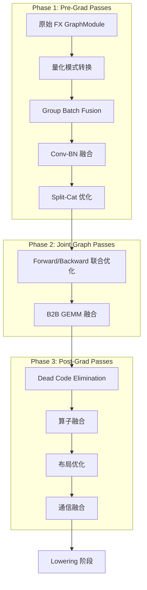
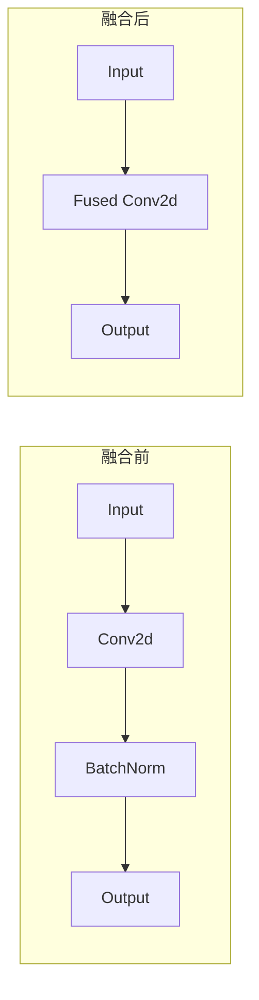
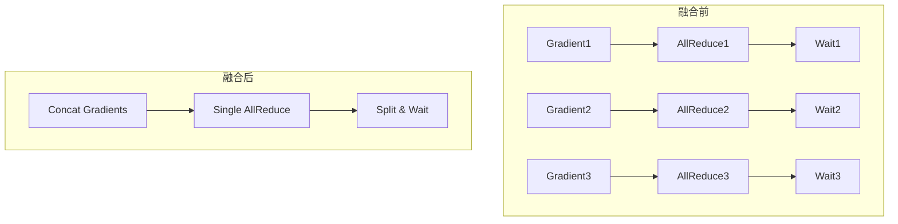
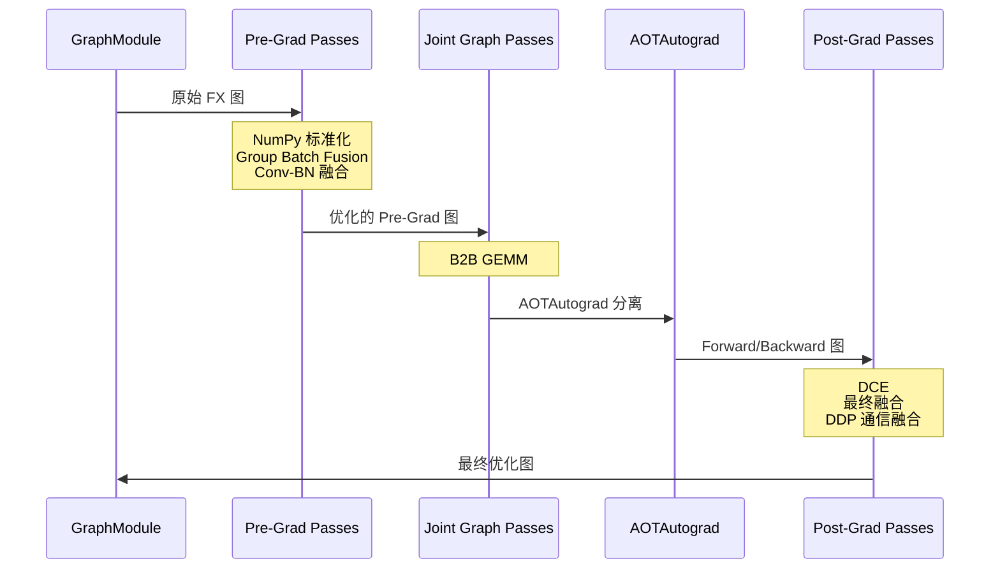

# PyTorch Inductor 源码解析（四）：图优化 Passes

## 引言

PyTorch Inductor 在编译过程中会执行多个阶段的图优化 Passes，这些 Passes 负责将原始的 FX 图转换为更适合生成高效代码的形式。本文深入分析 Inductor 的图优化系统。

**源码位置**: `torch/_inductor/fx_passes/` 目录

---

## 1. Pass 执行阶段

### 1.1 三阶段 Pass 架构

Inductor 的图优化 Passes 分为三个主要阶段：



### 1.2 各阶段特点对比

| 阶段 | 执行时机 | IR 特点 | 主要优化目标 |
|------|----------|--------|-------------|
| **Pre-Grad** | Lowering 之前 | 未 functionalized，未 normalized | 模式匹配融合、Conv-BN 合并 |
| **Joint Graph** | 前后向联合 | 同时处理 forward 和 backward | 跨图优化、激活重计算 |
| **Post-Grad** | Functionalization 之后 | 已 functionalized 和 normalized | 死代码消除、最终融合 |

---

## 2. Pre-Grad Passes 详解

### 2.1 入口函数

**文件**: `torch/_inductor/fx_passes/pre_grad.py`

```python
# torch/_inductor/fx_passes/pre_grad.py:287-370
def pre_grad_passes(
    gm: torch.fx.GraphModule,
    example_inputs: Sequence[object] = (),
    add_passes: str | None = None,
    remove_passes: str | None = None,
) -> torch.fx.GraphModule:
    """
    Apply passes on the input FX graph using Torch IR.

    WARNING:
    The IR before grad is not functional or normalized, so it is harder
    to write passes on this IR. Passes must be safe with respect to
    aliasing and mutation and need to handle all possible arg schemas.

    Consider adding a new pass to post_grad.py or joint_graph.py which
    are after functionalization and normalization.
    """
    if config.pattern_matcher:
        lazy_init()  # L305: 初始化模式匹配器
        
        # L311-312: 如果是 predispatch 模式，运行专门的 passes
        if config.is_predispatch:
            _run_pre_dispatch_passes(gm, example_inputs, add_passes, remove_passes)
        else:
            # L317: 融合 FX 图
            if example_inputs is not None:
                gm = fuse_fx(gm, example_inputs)
            
            # L318: NumPy 兼容性标准化
            numpy_compat_normalization(gm.graph)
            
            # L320-322: 运行 normalization pass
            if "normalization_pass" in config.pre_grad_fusion_options:
                pattern_matcher_pass = PRE_GRAD_PATTERNS["normalization_pass"]
                pattern_matcher_pass.apply(gm.graph)
            
            # L323-325: Group Batch Fusion
            GraphTransformObserver(gm, "group_batch_fusion_passes").apply_graph_pass(
                lambda graph: group_batch_fusion_passes(graph, pre_grad=True)
            )
            
            # L326-348: 运行配置的模式匹配 passes
            for pass_name in config.pre_grad_fusion_options:
                if pass_name in PRE_GRAD_FUSIONS or pass_name == "normalization_pass":
                    continue
                pattern_matcher_pass = PRE_GRAD_PATTERNS[pass_name]
                counter = config.pre_grad_fusion_options[pass_name].get("counter", 1)
                for _ in range(counter):
                    pattern_matcher_pass.apply(gm.graph)
            
            # L350-355: Conv-BN 融合和 Gumbel-Max Trick
            GraphTransformObserver(gm, "efficient_conv_bn_eval_pass").apply_graph_pass(
                efficient_conv_bn_eval_pass.apply
            )
            GraphTransformObserver(gm, "apply_gumbel_max_trick_pass").apply_graph_pass(
                apply_gumbel_max_trick_pass.apply
            )

    # L357-360: 用户自定义 pass
    if config.pre_grad_custom_pass is not None:
        GraphTransformObserver(gm, "pre_grad_custom_pass").apply_graph_pass(
            config.pre_grad_custom_pass
        )

    # L362: 拓扑排序
    stable_topological_sort(gm.graph)
    
    # L364-366: 量化提升
    quant_lift_up(gm)
    
    # L368-369: 图校验和重新编译
    gm.graph.lint()
    gm.recompile()
```

**关键点**:
- 第 296-299 行：文档说明 Pre-Grad IR 未 functionalized/normalized，编写 pass 需注意 aliasing 和 mutation
- 第 305 行：`lazy_init()` 延迟初始化模式匹配器
- 第 323-325 行：Group Batch Fusion 是核心优化
- 第 350-355 行：Conv-BN 融合和 Gumbel-Max Trick 是独立于模式匹配的优化

### 2.2 Pre-Grad Pass 列表

**文件**: `torch/_inductor/fx_passes/split_cat.py`

```python
# torch/_inductor/fx_passes/split_cat.py:48-66
pre_grad_pass_names = [
    "normalization_pass",
    "remove_split_with_size_one_pass",
    "merge_getitem_cat_pass",
    "merge_stack_tahn_unbind_pass",
    "merge_splits_pass",
    "mutate_cat_pass",
    "split_cat_pass",
    "unbind_stack_pass",
    "split_cat_to_slices_pass",
    "unbind_cat_to_view_pass",
    "split_stack_to_cats_pass",
    "unbind_stack_to_slices_pass",
    "move_reshape_out_of_split_stack_pass",
    "einsum_to_pointwise_pass",
]
```

---

## 3. 核心优化 Passes 详解

### 3.1 Group Batch Fusion（批量融合）

**文件**: `torch/_inductor/fx_passes/group_batch_fusion.py`

Group Batch Fusion 是 Pre-Grad 阶段的核心优化，负责识别和融合可合并的算子模式。

```python
# torch/_inductor/fx_passes/group_batch_fusion.py:~L400
def group_batch_fusion_passes(
    graph: torch.fx.Graph,
    pre_grad: bool = True,
) -> None:
    """
    批量融合 Passes
    
    Args:
        graph: FX Graph
        pre_grad: True 表示 Pre-Grad 阶段，False 表示 Post-Grad 阶段
    """
    # 1. 构建融合组
    # 2. 应用融合规则
    # 3. 更新图结构
```

**融合类型** (`PRE_GRAD_FUSIONS` 和 `POST_GRAD_FUSIONS`):

| 融合类型 | 描述 | 示例 |
|---------|------|------|
| `fuse_chunk_squeeze_cat` | Chunk+Squeeze+Cat 融合 | 并行计算后合并 |
| `fuse_split_linear_add` | Split+Linear+Add 融合 | MoE 架构常见 |
| `remove_reshape` | 冗余 Reshape 删除 | 连续的形状变换 |

### 3.2 Efficient Conv-BN Eval 融合

**文件**: `torch/_inductor/fx_passes/efficient_conv_bn_eval.py`

基于论文 ["Efficient ConvBN Blocks for Transfer Learning and Beyond"](https://arxiv.org/abs/2305.11624) 实现。

**文件**: `torch/_inductor/fx_passes/efficient_conv_bn_eval.py:17-76`

```python
def efficient_conv_bn_eval(
    bn: nn.modules.batchnorm._BatchNorm, 
    conv: nn.modules.conv._ConvNd, 
    x: torch.Tensor
):
    """
    实现基于 https://arxiv.org/abs/2305.11624
    "Efficient ConvBN Blocks for Transfer Learning and Beyond"
    
    利用卷积和仿射变换的结合律：
    normalize (weight conv feature) = (normalize weight) conv feature
    
    适用场景:
    - Eval 模式的 ConvBN 块（验证阶段）
    - 训练阶段（需设置 bn.training=False）
    
    优势:
    - 减少内存占用
    - 降低计算成本
    - 略微降低数值稳定性
    """
    assert bn.running_var is not None
    assert bn.running_mean is not None

    # L40-54: 处理特殊情况（无 affine transform 的 BN，无 bias 的 Conv）
    weight_on_the_fly = conv.weight
    if conv.bias is not None:
        bias_on_the_fly = conv.bias
    else:
        bias_on_the_fly = torch.zeros_like(bn.running_var)

    if bn.weight is not None:
        bn_weight = bn.weight
    else:
        bn_weight = torch.ones_like(bn.running_var)

    if bn.bias is not None:
        bn_bias = bn.bias
    else:
        bn_bias = torch.zeros_like(bn.running_var)

    # L57-66: 计算融合系数
    # shape of [C_out, 1, 1, 1] in Conv2d
    target_shape = [-1] + [1] * (conv.weight.ndim - 1)
    if isinstance(conv, nn.modules.conv._ConvTransposeNd):
        target_shape[:2] = [target_shape[1], target_shape[0]]
    
    weight_coeff = torch.rsqrt(bn.running_var + bn.eps).reshape(target_shape)
    coefff_on_the_fly = bn_weight.view_as(weight_coeff) * weight_coeff

    # L66-70: 融合权重和偏置
    weight_on_the_fly = weight_on_the_fly * coefff_on_the_fly
    bias_on_the_fly = bn_bias + coefff_on_the_fly.flatten() * (
        bias_on_the_fly - bn.running_mean
    )

    # L72-74: 使用融合后的参数执行卷积
    input = x
    params = {"weight": weight_on_the_fly, "bias": bias_on_the_fly}
    output = functional_call(conv, params, input)
    return output
```

**融合原理**:



**数学推导**:

```
BN 输出 = γ * (x - μ) / √(σ² + ε) + β
Conv 输出 = W * x + b

融合后：
W' = W * γ / √(σ² + ε)
b' = γ * (b - μ) / √(σ² + ε) + β
```

### 3.3 Split-Cat 优化

**文件**: `torch/_inductor/fx_passes/split_cat.py`

Split-Cat 模式在 Transformer 架构中非常常见（如 Multi-Head Attention）。

**文件**: `torch/_inductor/fx_passes/split_cat.py:48-97`

```python
# L48-49: Pass 注册表
PRE_GRAD_PATTERNS: dict[str, PatternMatcherPass] = {}
POST_GRAD_PATTERNS: dict[str, PatternMatcherPass] = {}

# L51-66: Pre-Grad Pass 名称列表
pre_grad_pass_names = [
    "normalization_pass",
    "remove_split_with_size_one_pass",
    "merge_getitem_cat_pass",
    "merge_splits_pass",
    "mutate_cat_pass",
    "split_cat_pass",
    # ...
]

# L68-77: Post-Grad Pass 名称列表
post_grad_pass_names = [
    "normalization_aten_pass",
    "decompose_mm_pass",
    "unbind_stack_aten_pass",
    "shape_padding_multiplier",
    "split_cat_aten_pass",
    # ...
]
```

**典型优化模式**:

```python
# 优化前
split_result = torch.split(x, [64, 64, 64], dim=1)
head1 = linear1(split_result[0])
head2 = linear2(split_result[1])
head3 = linear3(split_result[2])
output = torch.cat([head1, head2, head3], dim=1)

# 优化后（融合为一个 Kernel）
output = fused_split_cat_linear(x)
```

---

## 4. Joint Graph Passes

### 4.1 入口函数

**文件**: `torch/_inductor/fx_passes/joint_graph.py`

```python
# torch/_inductor/fx_passes/joint_graph.py:82-86
# 三个阶段：pass_patterns[0] → [1] → [2]
pass_patterns = [
    PatternMatcherPass(),
    PatternMatcherPass(),
    PatternMatcherPass(),
]
```

### 4.2 核心优化：B2B GEMM 融合

**文件**: `torch/_inductor/fx_passes/b2b_gemm.py`

Back-to-Back GEMM 融合将连续的矩阵乘法合并为一个操作。

```python
# torch/_inductor/fx_passes/b2b_gemm.py:~L100
B2B_GEMM_PASS = PatternMatcherPass(pass_name="b2b_gemm_pass")

# 典型模式：
# (A @ B) @ C → fused_b2b_gemm(A, B, C)
```

## 5. Post-Grad Passes 详解

### 5.1 入口函数

**文件**: `torch/_inductor/fx_passes/post_grad.py`

**文件**: `torch/_inductor/fx_passes/post_grad.py:113-212`

```python
def post_grad_passes(gm: torch.fx.GraphModule, is_inference: bool):
    """
    Passes that run on after grad. This is called once on the forwards
    graph and once on the backwards graph.

    The IR here has been normalized and functionalized.
    """
    GraphTransformObserver = functools.partial(
        torch.fx.passes.graph_transform_observer.GraphTransformObserver,
        subsystem="post_grad_passes",
    )

    # L125-126: 移除 FSDP2 unsharded 参数的图输入使用
    if not torch._dynamo.config.skip_fsdp_hooks:
        remove_fsdp2_unsharded_param_graph_input_usage(gm.graph)

    # L128-130: 死代码消除（DCE）
    if config.dce:
        gm.graph.eliminate_dead_code()

    # L132-135: 推理模式下的局部性重排序
    if is_inference and config.reorder_for_locality:
        GraphTransformObserver(gm, "reorder_for_locality").apply_graph_pass(
            reorder_for_locality
        )

    # L139-142: 用户自定义 Pre-Pass
    if post_grad_custom_pre_pass := config.post_grad_custom_pre_pass:
        GraphTransformObserver(gm, "post_grad_custom_pre_pass").apply_graph_pass(
            post_grad_custom_pre_pass
        )

    # L144-158: MKL-DNN 相关优化（CPU 后端）
    if torch._C._has_mkldnn:
        if (
            config.cpp.enable_grouped_gemm_template
            and config.max_autotune
            and "CPP" in config.max_autotune_gemm_backends
        ):
            from .mkldnn_fusion import grouped_gemm_pass
            grouped_gemm_pass(gm.graph)

        if config.cpp.enable_concat_linear:
            from .quantization import concat_linear_woq_int4
            concat_linear_woq_int4(gm)

    # L160-163: 移除 Profiler 操作（防止阻塞融合）
    GraphTransformObserver(gm, "remove_profiler_ops").apply_graph_pass(
        _remove_profiler_ops
    )

    # L165-205: 模式匹配器 Passes
    if config.pattern_matcher:
        lazy_init()
        
        # L168-169: Group Batch Fusion
        GraphTransformObserver(gm, "remove_noop_ops").apply_graph_pass(
            remove_noop_ops
        )
        
        # L174-177: 运行三个阶段的模式匹配
        for i, patterns in enumerate(pass_patterns):
            GraphTransformObserver(gm, f"pass_pattern_{i}").apply_graph_pass(
                patterns.apply
            )
        
        # L178-181: 分区 Scatter 优化（如启用）
        if config.partitioned_scatter_enabled:
            GraphTransformObserver(gm, "partitioned_scatter_optimization").apply_graph_pass(
                partitioned_scatter_optimization_pass
            )
        
        # L182-203: 运行配置的融合选项
        for pass_name in config.post_grad_fusion_options:
            if pass_name in POST_GRAD_FUSIONS or pass_name in OPTIMUS_EXCLUDE_POST_GRAD:
                continue
            pattern_matcher_pass = POST_GRAD_PATTERNS[pass_name]
            GraphTransformObserver(gm, pass_name).apply_graph_pass(
                pattern_matcher_pass.apply
            )

    # L207-208: Micro-Pipeline TP（张量并行）
    if config._micro_pipeline_tp:
        micro_pipeline_tp_pass(gm.graph)

    # L210-212: DDP 通信融合
    if config._fuse_ddp_communication:
        GraphTransformObserver(gm, "fuse_ddp_communication").apply_graph_pass(
            lambda graph: fuse_ddp_communication(graph)
        )
```

### 5.2 DDP 通信融合

**文件**: `torch/_inductor/fx_passes/ddp_fusion.py`

**文件**: `torch/_inductor/fx_passes/ddp_fusion.py:63-100`

```python
@dataclass(unsafe_hash=True)
class CommBlock:
    """
    通信块表示
    
    Attributes:
        shape: 通信数据的形状
        node_list: 属于该通信块的节点列表
        inputs: 输入节点
        wait_nodes: 等待节点（异步通信完成）
        comm_node: 通信节点（如 allreduce）
        outputs: 输出节点集合
    """
    shape: torch.Size | list[torch.Size]
    node_list: list[fx.Node]
    inputs: list[fx.Node]
    wait_nodes: list[fx.Node]
    comm_node: fx.Node
    outputs: OrderedSet[fx.Node]


def get_comm_block(comm_node: fx.Node) -> CommBlock | None:
    """
    给定一个 collective 节点（如 allreduce），找出属于该通信的所有节点
    
    Args:
        comm_node: 目标通信/collective 节点
    
    Returns:
        封装相关节点（如 wait_node）的 CommBlock
    """
    node_list = []
    wait_nodes = []
    inputs, _ = tree_flatten((comm_node.args, comm_node.kwargs))
    input_nodes = [inp for inp in inputs if isinstance(inp, fx.Node)]
    
    # L90: 中间输出操作类型
    intermediate_outputs = ("split", "reshape", "getitem", "detach", "alias")

    # L92-100: 处理只有一个用户的简单情况
    first_user = next(iter(comm_node.users))
    if (
        len(comm_node.users) == 1
        and first_user.target is torch.ops._c10d_functional.wait_tensor.default
    ):
        # Collective with only one output
        node_list = [comm_node, first_user]
        wait_nodes.append(first_user)
```

**融合效果**:



---

### 5.3 Post-Grad Pass 列表

**文件**: `torch/_inductor/fx_passes/split_cat.py`

```python
# torch/_inductor/fx_passes/split_cat.py:68-77
post_grad_pass_names = [
    "normalization_aten_pass",
    "decompose_mm_pass",
    "unbind_stack_aten_pass",
    "shape_padding_multiplier",
    "pad_aten_mm_pass",
    "split_cat_aten_pass",
    "select_cat_aten_pass",
    "move_view_after_cat_aten_pass",
]
```

---

## 6. 模式匹配器系统

### 6.1 PatternMatcherPass

**文件**: `torch/_inductor/pattern_matcher.py`

Inductor 使用模式匹配器来识别和替换特定的算子模式。

```python
# torch/_inductor/pattern_matcher.py:~L100
class PatternMatcherPass:
    """
    模式匹配 Pass 基类
    
    通过注册图模式（graph pattern）来识别和替换特定的算子序列
    """
    
    def __init__(self, pass_name: str = "", subsystem: str = ""):
        self.pass_name = pass_name
        self.subsystem = subsystem
        self.patterns = []
        
    def apply(self, graph: torch.fx.Graph) -> int:
        """
        应用模式匹配到图上
        
        Returns:
            成功匹配并替换的次数
        """
        match_count = 0
        for pattern in self.patterns:
            match_count += pattern.apply(graph)
        return match_count
```

### 6.2 注册图模式

```python
from torch._inductor.pattern_matcher import register_graph_pattern

@register_graph_pattern(PRE_GRAD_PATTERNS["split_cat_pass"])
def split_cat_pattern():
    """
    注册 Split-Cat 模式
    
    模式示例:
        split = torch.split(x, sizes)
        cat = torch.cat([f(s) for s in split])
    """
    x = KeywordArg("x")
    sizes = KeywordArg("sizes")
    
    pattern = CallFunction(torch.split, x, sizes)
    # ... 定义完整的模式
```

---

## 7. 内存估计器

**文件**: `torch/_inductor/fx_passes/memory_estimator.py`

内存估计器用于分析图的内存使用情况，优化内存分配。

**文件**: `torch/_inductor/fx_passes/memory_estimator.py:17-67`

```python
@dataclass(frozen=True)
class StorageKey:
    """存储键，用于唯一标识一个存储"""
    storage: torch.UntypedStorage
    device: torch.device

    def __hash__(self) -> int:
        return self.storage._cdata


class GraphAliasTracker:
    """
    追踪 FX 图中的存储分配和使用关系
    
    区分:
    - 新鲜分配（fresh allocations）: 分配新存储的节点（非视图/别名）
    - 使用（uses）: 使用存储作为输入的节点
    """
    
    def __init__(self, nodes: list[fx.Node]):
        # L44: 节点到新鲜分配的映射
        self.node_to_fresh_allocations: dict[fx.Node, OrderedSet[StorageKey]] = {}
        
        # L47: 存储到分配者的映射
        self.storage_to_allocator: dict[StorageKey, fx.Node] = {}
        
        # L50: 节点使用的存储集合
        self.node_to_storage_uses: dict[fx.Node, OrderedSet[StorageKey]] = {}
        
        # L53-55: 存储到使用者的映射
        self.storage_to_uses: dict[StorageKey, OrderedSet[fx.Node]] = defaultdict(
            OrderedSet
        )
        
        # L58: 存储到最后一个使用者的映射
        self.storage_to_last_user: dict[StorageKey, fx.Node] = {}
        
        # L61-63: 节点到最后使用存储的映射
        self.node_to_storages_last_used: dict[fx.Node, OrderedSet[StorageKey]] = (
            defaultdict(OrderedSet)
        )
```

---

## 8. Pass 执行流程总览

### 8.1 完整 Pass 流程图



### 8.2 Pass 执行流程图

---

## 9. 源码阅读指南

### 9.1 核心文件索引

| 文件 | 行号范围 | 内容 |
|------|----------|------|
| `pre_grad.py` | L287-370 | `pre_grad_passes` 主函数 |
| `pre_grad.py` | L59-67 | `lazy_init` 初始化 |
| `post_grad.py` | L113-217 | `post_grad_passes` 主函数 |
| `post_grad.py` | L726+ | `lazy_init` 初始化 |
| `joint_graph.py` | L82-86 | `pass_patterns` 定义 |
| `split_cat.py` | L48-97 | Pass 名称列表和注册表 |
| `efficient_conv_bn_eval.py` | L17-76 | Conv-BN 融合实现 |
| `ddp_fusion.py` | L63-100 | `CommBlock` 数据类 (Post-Grad) |
| `group_batch_fusion.py` | ~L400 | `group_batch_fusion_passes` |
| `memory_estimator.py` | L17-67 | `GraphAliasTracker` 类 |

### 9.2 推荐阅读顺序

```
1. torch/_inductor/fx_passes/pre_grad.py (Pre-Grad 入口)
2. torch/_inductor/fx_passes/post_grad.py (Post-Grad 入口)
3. torch/_inductor/fx_passes/split_cat.py (Pass 列表定义)
4. torch/_inductor/fx_passes/efficient_conv_bn_eval.py (Conv-BN 融合)
5. torch/_inductor/fx_passes/group_batch_fusion.py (批量融合)
6. torch/_inductor/fx_passes/ddp_fusion.py (DDP 通信融合，Post-Grad)
7. torch/_inductor/fx_passes/memory_estimator.py (内存估计)
8. torch/_inductor/pattern_matcher.py (模式匹配器)
```

---

## 10. 三阶段 Pass 详细列表

### 10.1 Pre-Grad Passes（完整列表）

**执行时机**: AOTAutograd 追踪之前，IR 未 functionalized/normalized

**入口函数**: `torch/_inductor/fx_passes/pre_grad.py:pre_grad_passes()`

#### 10.1.1 模式匹配 Passes（PRE_GRAD_PATTERNS）

| Pass 名称 | 描述 | 典型模式 |
|----------|------|---------|
| `normalization_pass` | NumPy 兼容性标准化 | 将 NumPy 风格操作标准化 |
| `remove_split_with_size_one_pass` | 移除 split size=1 | `split(x, 1)` → `unsqueeze` |
| `merge_getitem_cat_pass` | 合并 getitem+cat | 反向操作抵消 |
| `merge_stack_tahn_unbind_pass` | 合并 stack+tanh+unbind | 激活函数融合 |
| `merge_splits_pass` | 合并多个 splits | 减少 split 操作数量 |
| `mutate_cat_pass` | Cat 变异优化 | 原地 cat 操作 |
| `split_cat_pass` | Split-Cat 融合 | `cat(split(x))` → `x` |
| `unbind_stack_pass` | Unbind-Stack 融合 | `stack(unbind(x))` → `x` |
| `split_cat_to_slices_pass` | Split-Cat 转切片 | 转为切片操作 |
| `unbind_cat_to_view_pass` | Unbind-Cat 转 view | 转为 view 操作 |
| `split_stack_to_cats_pass` | Split-Stack 转 cat | 转为 cat 操作 |
| `unbind_stack_to_slices_pass` | Unbind-Stack 转切片 | 转为切片操作 |
| `move_reshape_out_of_split_stack_pass` | 移动 reshape | 优化 reshape 位置 |
| `einsum_to_pointwise_pass` | Einsum 转 pointwise | 转为点积操作 |

#### 10.1.2 Group Batch Fusion Passes（PRE_GRAD_FUSIONS）

| Pass 名称 | 描述 | 典型模式 |
|----------|------|---------|
| `batch_linear_lhs` | 批量 Linear（左乘） | 多个线性变换合并 |
| `batch_linear` | 批量 Linear | `[linear(x_i) for i in range(n)]` |
| `batch_layernorm` | 批量 LayerNorm | 多个 LayerNorm 合并 |
| `batch_tanh` | 批量 Tanh | `[tanh(x_i) for i in range(n)]` |
| `batch_sigmoid` | 批量 Sigmoid | `[sigmoid(x_i) for i in range(n)]` |
| `batch_relu` | 批量 ReLU | `[relu(x_i) for i in range(n)]` |
| `batch_detach` | 批量 Detach | 多个 detach 合并 |
| `batch_nan_to_num` | 批量 NanToNum | 多个 nan_to_num 合并 |
| `batch_clamp` | 批量 Clamp | 多个 clamp 合并 |
| `batch_dropout` | 批量 Dropout | 多个 dropout 合并 |

#### 10.1.3 其他 Pre-Grad 优化

| 优化名称 | 描述 | 源码位置 |
|---------|------|---------|
| `fuse_fx` | FX 图融合（含 Permute 融合） | `pre_grad.py:391` |
| `efficient_conv_bn_eval_pass` | Conv-BN 融合（Eval 模式） | `pre_grad.py:350` |
| `apply_gumbel_max_trick_pass` | Gumbel-Max Trick | `pre_grad.py:353` |
| `quant_lift_up` | 量化提升 | `pre_grad.py:364` |
| `linear_permute_fusion` | Linear+Permute 融合 | `pre_grad.py:749` |
| `permute_linear_fusion` | Permute+Linear 融合 | `pre_grad.py:790` |
| `permute_matmul_fusion` | Permute+Matmul 融合 | `pre_grad.py:824` |
| `fuse_conv_bn` | Conv-BN 模块融合 | `pre_grad.py:447` |
| `remove_identity` | 移除 Identity 层 | `pre_grad.py:431` |

---

### 10.2 Joint Graph Passes（完整列表）

**执行时机**: AOTAutograd 分离前后向图之后，同时处理 forward 和 backward

**入口函数**: `torch/_inductor/fx_passes/joint_graph.py:joint_graph_passes()`

#### 10.2.1 核心优化

| Pass 名称 | 描述 | 典型模式 |
|----------|------|---------|
| `canonicalize_aten_ir_passes` | ATen IR 标准化 | 量化映射标准化 |
| `constant_fold_uniform_value` | 常量折叠（均匀值） | `full([shape], value)` |
| `remove_no_op` | 移除无操作 | `+0`, `-0`, `*1`, `/1` |
| `remove_redundant_views` | 移除冗余 view | 重复的 `view.dtype` |
| `auto_chunker` | 自动 Chunk | `chunk()` 模式匹配 |
| `replace_random_passes` | 随机操作替换 | 随机数生成优化 |

#### 10.2.2 模式匹配 Passes（patterns）

| Pass 名称 | 描述 | 典型模式 |
|----------|------|---------|
| `fix_iota_device` | Iota 设备修复 | `arange(cpu)` → `arange(cuda)` |
| `pointless_convert` | 冗余类型转换 | `convert(convert(x))` |
| `pointless_view` | 冗余 View | `view(x, x.shape)` → `x` |
| `pointless_view_pair` | 冗余 View 对 | `view(view(x))` → `x` |
| `pointless_permute_pair` | 冗余 Permute 对 | `permute(permute(x))` → `x` |
| `bmm_to_mm` | BMM 转 MM | `bmm(x[0:1], y[0:1])` → `mm` |
| `mul_softmax_pattern` | Mul-Softmax 优化 | `scale * softmax(x)` |
| `div_softmax_pattern` | Div-Softmax 优化 | `softmax(x) / scale` |
| `scatter_upon_const_tensor` | Scatter+Full 融合 | `scatter(full(...))` → `where` |

---

### 10.3 Post-Grad Passes（完整列表）

**执行时机**: Functionalization 和 Normalization 之后

**入口函数**: `torch/_inductor/fx_passes/post_grad.py:post_grad_passes()`

#### 10.3.1 基础优化

| Pass 名称 | 描述 | 源码位置 |
|----------|------|---------|
| `remove_fsdp2_unsharded_param_graph_input_usage` | 移除 FSDP2 未分片参数使用 | `post_grad.py:126` |
| `eliminate_dead_code` | 死代码消除（DCE） | `post_grad.py:128` |
| `reorder_for_locality` | 局部性重排序（推理模式） | `post_grad.py:132` |
| `remove_profiler_ops` | 移除 Profiler 操作 | `post_grad.py:160` |
| `remove_noop_ops` | 移除无操作 | `post_grad.py:170` |
| `remove_assert_ops` | 移除 Assert 操作 | `post_grad.py:171` |

#### 10.3.2 Group Batch Fusion Passes（POST_GRAD_FUSIONS）

| Pass 名称 | 描述 | 典型模式 |
|----------|------|---------|
| `batch_linear_post_grad` | 批量 Linear（Post-Grad） | 后向传播中的批量线性 |
| `group_linear` | 分组 Linear | 分组线性变换 |
| `batch_aten_tanh` | ATen Tanh 批量 | `aten.tanh` 批量 |
| `batch_aten_sigmoid` | ATen Sigmoid 批量 | `aten.sigmoid` 批量 |
| `batch_aten_relu` | ATen ReLU 批量 | `aten.relu` 批量 |
| `batch_aten_add` | ATen Add 批量 | `aten.add` 批量 |
| `batch_aten_sub` | ATen Sub 批量 | `aten.sub` 批量 |
| `batch_aten_div` | ATen Div 批量 | `aten.div` 批量 |
| `batch_aten_mul` | ATen Mul 批量 | `aten.mul` 批量 |

#### 10.3.3 模式匹配 Passes（POST_GRAD_PATTERNS）

| Pass 名称 | 描述 | 典型模式 |
|----------|------|---------|
| `normalization_aten_pass` | ATen 标准化 | ATen IR 标准化 |
| `decompose_mm_pass` | MM 分解 | 矩阵乘法分解 |
| `unbind_stack_aten_pass` | Unbind-Stack（ATen） | `unbind+stack` 融合 |
| `shape_padding_multiplier` | Shape Padding | 形状填充优化 |
| `pad_aten_mm_pass` | Pad-MM 融合 | `pad+mm` 融合 |
| `split_cat_aten_pass` | Split-Cat（ATen） | `split+cat` 融合 |
| `select_cat_aten_pass` | Select-Cat 融合 | `select+cat` 融合 |
| `move_view_after_cat_aten_pass` | 移动 View | `view` 移到 `cat` 后 |

#### 10.3.4 高级优化

| Pass 名称 | 描述 | 源码位置 |
|----------|------|---------|
| `grouped_gemm_pass` | 分组 GEMM（MKL-DNN） | `post_grad.py:150` |
| `concat_linear_woq_int4` | Concat-Linear（WOQ Int4） | `post_grad.py:154` |
| `partitioned_scatter_optimization_pass` | 分区 Scatter 优化 | `post_grad.py:178` |
| `B2B_GEMM_PASS` | Back-to-Back GEMM 融合 | `post_grad.py:204` |
| `fuse_ddp_communication` | DDP 通信融合 | `post_grad.py:210` |
| `micro_pipeline_tp_pass` | Micro-Pipeline TP | `post_grad.py:207` |

#### 10.3.5 分布式通信 Bucketing

| Pass 名称 | 描述 | 配置项 |
|----------|------|--------|
| `bucket_reduce_scatters` | Reduce-Scatter 分桶 | `bucket_reduce_scatters_fx` |
| `bucket_all_reduces` | All-Reduce 分桶 | `bucket_all_reduces_fx` |
| `bucket_all_gathers` | All-Gather 分桶 | `bucket_all_gathers_fx` |

#### 10.3.6 重叠调度

| Pass 名称 | 描述 | 配置项 |
|----------|------|--------|
| `schedule_overlap_bucketing_from_inductor_configs` | 重叠调度 | `aten_distributed_optimizations` |

#### 10.3.7 变异操作处理（保持 invariant）

| Pass 名称 | 描述 | 源码位置 |
|----------|------|---------|
| `reinplace_inplaceable_ops` | 原地操作替换 | `post_grad.py:352` |
| `decompose_triton_kernel_wrapper_functional` | Triton Kernel 分解 | `post_grad.py:356` |
| `decompose_auto_functionalized` | Auto-Functionalized 分解 | `post_grad.py:358` |
| `reinplace_fsdp_all_gather` | FSDP All-Gather 原地化 | `post_grad.py:362` |
| `decompose_scan_to_while_loop` | Scan 转 While-Loop | `post_grad.py:365` |
| `decompose_map_to_while_loop` | Map 转 While-Loop | `post_grad.py:368` |

---

## 11. 总结

本章详细介绍了 PyTorch Inductor 的图优化 Passes 系统：

1. **三阶段架构**: Pre-Grad → Joint Graph → Post-Grad
2. **核心优化**:
   - Group Batch Fusion：批量融合
   - Efficient Conv-BN Eval：Conv-BN 合并
   - Split-Cat 优化：Transformer 常见模式
   - DDP 通信融合：分布式训练优化
3. **模式匹配器**: 声明式定义和替换图模式
4. **内存估计**: 追踪存储分配和使用，优化内存布局

图优化 Passes 是 Inductor 性能优化的关键环节，通过消除冗余操作、融合可合并的算子、优化内存使用等方式，显著提升生成的机器代码的执行效率。

---

**下一篇**: [PyTorch Inductor 源码解析（五）：调度算法与算子融合](./05-scheduler.md)

---

## 附录：Pass 配置示例

```python
import torch._inductor.config as config

# ===== Pass 启用/禁用配置 =====

# 启用模式匹配器
config.pattern_matcher = True

# Pre-Grad 融合选项
config.pre_grad_fusion_options = {
    "split_cat_pass": {"counter": 2},  # 运行 2 次
    "merge_splits_pass": {"counter": 1},
}

# Post-Grad 融合选项
config.post_grad_fusion_options = {
    "split_cat_aten_pass": {"counter": 1},
}

# 死代码消除
config.dce = True

# 局部性重排序（仅推理模式）
config.reorder_for_locality = True

# DDP 通信融合
config._fuse_ddp_communication = True
config._fuse_ddp_communication_passes = ["fuse_ddp_with_concat_op"]
config._fuse_ddp_bucket_size = 256  # MB

# 自定义 Pass
config.pre_grad_custom_pass = my_custom_pass
config.post_grad_custom_pre_pass = my_custom_pre_pass
config.joint_custom_pre_pass = my_joint_pre_pass
config.joint_custom_post_pass = my_joint_post_pass
config.post_grad_custom_post_pass = my_post_pass

# Bucketing 配置
config.bucket_reduce_scatters_fx = "size"  # 或 "none"
config.bucket_all_reduces_fx = "size"
config.bucket_all_gathers_fx = "none"

# 重叠调度配置
config.aten_distributed_optimizations.enable_overlap_scheduling = True
config.aten_distributed_optimizations.insert_overlap_deps = True
config.aten_distributed_optimizations.enable_fusion_regions = True
```
