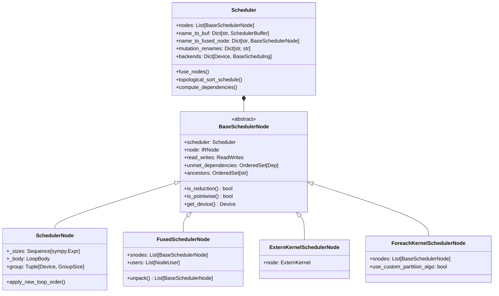
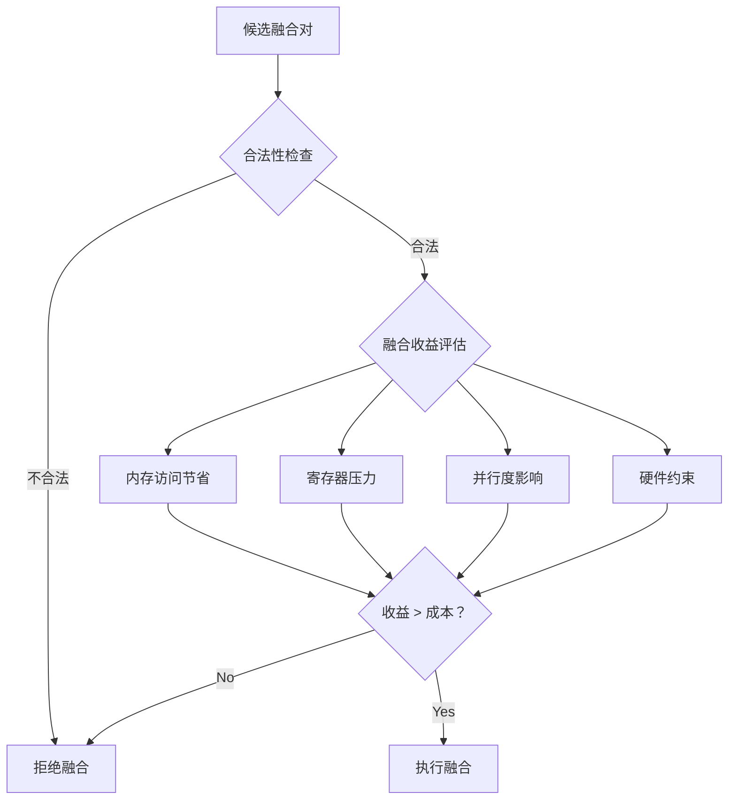
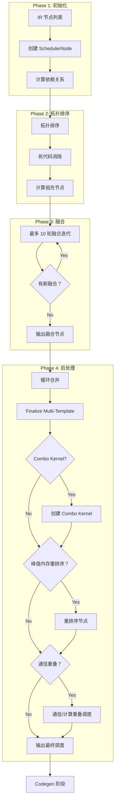

# PyTorch Inductor 源码解析（五）：调度算法与算子融合

## 引言

Scheduler 是 PyTorch Inductor 的核心组件之一，负责将 Lowering 阶段生成的 IR 节点转换为高效的执行顺序。Scheduler 的核心任务包括：

1. **拓扑排序**: 确保节点按依赖关系正确排序
2. **算子融合**: 将多个小 Kernel 合并为大 Kernel，减少内存访问和 Kernel 启动开销
3. **内存优化**: 优化 Buffer 复用，降低峰值内存
4. **循环合并**: 合并具有相同迭代空间的循环

**源码位置**: `torch/_inductor/scheduler.py` (~7000 行)

---

## 1. Scheduler 架构概览

### 1.1 核心类层次结构



### 1.2 Scheduler 初始化流程

**文件**: `torch/_inductor/scheduler.py`

**文件**: `torch/_inductor/scheduler.py:2874-2980`

```python
class Scheduler:
    """
    A Scheduler is a graph of BaseSchedulerNodes. It is responsible for
    optimizations such as fusion, reorder, and graph partition.
    """
    
    def __init__(self, nodes: list[ir.Operation]) -> None:
        with dynamo_timed("Scheduler.__init__"):
            self._init(nodes)
    
    def _init(self, nodes: list[ir.Operation]) -> None:
        # L2886: 设置全局 Scheduler 引用
        V.graph.scheduler = self
        self.backends: dict[torch.device, BaseScheduling] = {}
        self.post_grad_graph_id = next(_post_grad_graph_counter)
        self._graph_partition_counter = itertools.count()

        # L2891-2898: 初始化可用的 Buffer 名称（图输入和常量）
        self.completed_operations: OrderedSet[str] = OrderedSet()
        self.available_buffer_names = OrderedSet(
            [
                *V.graph.graph_inputs.keys(),
                *V.graph.constants.keys(),
                *V.graph.torchbind_constants.keys(),
            ]
        )
        
        # L2899: 为每个 IR 节点创建 SchedulerNode
        self.nodes = [self.create_scheduler_node(n) for n in nodes]
        self.previous_node: Optional[BaseSchedulerNode] = None
        self.current_node: Optional[BaseSchedulerNode] = None
        self.update_zero_dim_cpu_tensor()
        
        # L2903-2906: 剪枝依赖
        for node in self.nodes:
            node.prune_deps()

        # L2908-2928: 初始化各种映射表
        # name_to_donated_buffer: 捐赠的 Buffer
        # name_to_node: 节点名称到节点的映射
        # name_to_buf: Buffer 名称到 SchedulerBuffer 的映射
        # mutation_real_name: 突变操作的真实名称映射
        # mutation_renames: 突变重命名映射（用于处理循环依赖）
        self.name_to_donated_buffer: dict[str, SchedulerDonatedBuffer] = (
            self.get_donated_buffers()
        )
        self.name_to_node: dict[str, BaseSchedulerNode] = {
            n.get_name(): n for n in self.nodes
        }
        self.name_to_buf: dict[str, SchedulerBuffer] = {
            buf.get_name(): buf for node in self.nodes for buf in node.get_outputs()
        }
        self.mutation_real_name: dict[str, str] = {}
        self.mutation_renames: dict[str, str] = {}

        # L2945-2951: 通信节点全局排序（分布式场景）
        self.nodes = comms.decide_global_ordering_of_comms(
            self.nodes,
            self.name_to_buf,
            self.name_to_fused_node,
        )
        
        # L2951-2955: 核心初始化步骤
        self.compute_dependencies()  # 计算依赖关系
        self.nodes = self.topological_sort_schedule(self.nodes)  # 拓扑排序
        self.dead_node_elimination()  # 死代码消除
        self.compute_ancestors()  # 计算祖先节点

        # L2958-2961: 融合前指标和日志
        metrics.ir_nodes_pre_fusion += len(self.nodes)
        log_ir_pre_fusion(self.nodes)
        self.num_orig_nodes = len(self.nodes)
        
        # L2963-2975: 创建 Foreach 节点、分布式 Autotune
        self.create_foreach_nodes()
        self.nodes = self.topological_sort_schedule(self.nodes)
        if config.distributed_max_autotune_gemm:
            from . import distributed_autotune
            distributed_autotune.schedule(self)

        # L2975: 核心融合步骤
        self.nodes = self.fuse_nodes(self.nodes)
        
        # L2976-2977: 用户自定义 Post-Fusion Pass
        if config._post_fusion_custom_pass is not None:
            self.nodes = config._post_fusion_custom_pass(self.nodes)

        # L2979: 循环合并
        self.merge_loops()
        
        # L2980:  finalize Multi-Template Buffers
        self.finalize_multi_template_buffers()
```

---

## 2. 拓扑排序

### 2.1 拓扑排序算法

**文件**: `torch/_inductor/scheduler.py:3577-3602`

```python
def topological_sort_schedule(
    self, nodes: list[BaseSchedulerNode]
) -> list[BaseSchedulerNode]:
    """
    Ensure nodes is in topologically sorted order
    """
    seen = OrderedSet[BaseSchedulerNode]()
    name_to_node: dict[str, BaseSchedulerNode] = dict()
    result: list[BaseSchedulerNode] = []

    def visit(n: BaseSchedulerNode) -> None:
        if n not in seen:
            seen.add(n)
            # L3590-3594: 递归访问未满足的依赖
            for dep in sorted(n.unmet_dependencies, key=lambda d: d.name):
                # We only care about doing toposort within `nodes`
                if dep.name not in name_to_node:
                    continue
                visit(name_to_node[dep.name])
            result.append(n)

    # L3597-3599: 构建名称到节点的映射
    for node in nodes:
        for name in node.get_buffer_names():
            name_to_node[name] = node
    
    # L3600-3601: 对每个节点执行 DFS 访问
    for node in nodes:
        visit(node)
    return result
```

**算法说明**:
- 使用深度优先搜索（DFS）进行拓扑排序
- `unmet_dependencies` 表示尚未满足的依赖关系
- 只有当所有依赖都被处理后，节点才会被添加到结果列表

### 2.2 依赖计算

```python
def compute_dependencies(self) -> None:
    """
    Compute dependencies for all nodes.
    """
    # 1. 构建 Buffer 到定义节点的映射
    # 2. 对于每个节点，确定其读取的 Buffer 由哪个节点定义
    # 3. 设置 unmet_dependencies
```

---

## 3. 算子融合机制

### 3.1 融合入口函数

**文件**: `torch/_inductor/scheduler.py:3697-3730`

```python
def fuse_nodes(self, nodes: list[BaseSchedulerNode]) -> list[BaseSchedulerNode]:
    """
    Combine eligible nodes into FusedSchedulerNodes.
    """
    with dynamo_timed(
        "Scheduler.fused_nodes", log_pt2_compile_event=True, log_waitcounter=True
    ):
        # L3704-3723: 最多 10 轮融合迭代
        for i in range(10):
            old_len = len(nodes)
            fusion_log.debug(
                "===== attempting fusion (%d/10): %d nodes =====",
                i + 1,
                old_len,
            )
            nodes = self.fuse_nodes_once(nodes, is_reorder_round=False)
            new_len = len(nodes)
            fusion_log.debug(
                "completed fusion round (%d/10): fused %d nodes into %d nodes\n",
                i + 1,
                old_len,
                new_len,
            )
            # L3719-3723: 如果没有更多可融合的节点，提前退出
            if new_len == old_len or new_len == 1:
                fusion_log.debug(
                    "===== fusion complete (%d iterations) =====", i + 1
                )
                break

        # L3725-3729: 如果启用了 Loop Order 优化，再执行一轮
        if (
            config.loop_ordering_after_fusion
            or config.loop_index_inversion_in_fusion
        ):
            nodes = self.fuse_nodes_once(nodes, is_reorder_round=True)
        return nodes
```

**关键点**:
- 第 3704 行：最多执行 10 轮融合
- 第 3719 行：如果一轮融合没有产生任何变化，提前退出
- 第 3725-3729 行：如果启用了 `loop_ordering_after_fusion`，执行额外的融合轮次

### 3.2 单轮融合流程

**文件**: `torch/_inductor/scheduler.py:4592-4661`

```python
def fuse_nodes_once(
    self,
    nodes: list[BaseSchedulerNode],
    is_reorder_round: bool,
) -> list[BaseSchedulerNode]:
    """
    Combine eligible nodes into FusedSchedulerNodes.

    This relies on two key functions to control the logic:
        - self.can_fuse(): checks if a fusion is legal
        - self.score_fusion(): assigns priority to a given fusion
    """
    # L3604: 剪枝冗余依赖
    self.prune_redundant_deps(nodes)
    fused_nodes = OrderedSet(nodes)
    
    # L3615-3618: 待处理的融合（用于异步编译和 Benchmark）
    pending_fusions: dict[
        BaseSchedulerNode,
        PendingFusion,
    ] = {}

    # L3625-3628: 获取所有可能的融合对
    possible_fusions = self.get_possible_fusions(
        nodes,
        is_reorder_round,
    )

    # L3630-3635: 处理 Prologue 融合（如果启用）
    if (
        (config.max_autotune_gemm or config.max_autotune)
        and config.prologue_fusion
        and config.epilogue_fusion
    ):
        self._handle_template_overlap(possible_fusions, deferred_prologue_fusions)

    # L3637-3643: 尝试融合节点对
    self._try_fusion_pairs(
        possible_fusions,
        pending_fusions,
        template_fusion_nodes,
        fused_nodes,
        is_reorder_round,
    )
    
    # L3644: 完成待处理的融合
    self._finish_pending_fusions(fused_nodes, pending_fusions)

    # L3646-3647: 评估 Template 融合
    self._evaluate_pending_template_fusions(template_fusion_nodes, fused_nodes)

    # L3659-3660: 按拓扑顺序排序
    nodes = sorted(fused_nodes, key=lambda x: x.min_order)
    nodes = self.topological_sort_schedule(nodes)
    return nodes
```

### 3.3 融合合法性判断 (can_fuse)

**文件**: `torch/_inductor/scheduler.py:269-370`

```python
def can_fuse(cls, node1: BaseSchedulerNode, node2: BaseSchedulerNode) -> bool:
    """
    Check whether we can fuse two reductions with mix loop orders.
    """
    # L273-274: 检查配置是否启用混合顺序归约
    if not config.triton.mix_order_reduction:
        return False

    # L277-278: C++ Wrapper 不支持
    if V.graph.cpp_wrapper:
        return False

    # L280-287: 仅支持 GPU (CUDA/XPU) 和 Triton 后端
    if not node1.is_gpu() or not node2.is_gpu():
        return False
    device_type = node1.get_device().type
    if (
        device_type not in ("cuda", "xpu")
        or get_current_backend(device_type) != "triton"
    ):
        return False
    
    # L288-289: 仅支持归约操作融合
    if not node1.is_reduction() or not node2.is_reduction():
        return False

    # L291-295: 检查是否存在生产者/消费者关系
    if (node1.ancestors & node2.get_operation_names()) or (
        node2.ancestors & node1.get_operation_names()
    ):
        return False

    # L298-299: 检查是否为混合归约顺序
    if not cls.has_mix_reduction_orders(node1, node2):
        return False

    # L302-304: 检查是否有共同的 Buffer 访问
    common_reads = MixOrderReduction.get_common_read(node1, node2)
    if len(common_reads) == 0:
        return False
    # ... 更多检查
```

### 3.4 融合评分 (score_fusion)

**文件**: `torch/_inductor/scheduler.py:5741-5792`

```python
def score_fusion_memory(
    self,
    node1: BaseSchedulerNode,
    node2: BaseSchedulerNode,
    count_bytes: bool = True,
    return_is_mix_order_reduction: bool = False,
    allow_mix_order_reduction: bool = True,
) -> int | tuple[int, bool]:
    """
    The first term in our fusion score that estimates number of saved
    memory operations.
    """
    # L5761-5767: 混合顺序归约的评分
    if allow_mix_order_reduction and MixOrderReduction.can_fuse(node1, node2):
        score = MixOrderReduction.get_fusion_score(node1, node2)
        return _construct_return_value(score, True)

    # L5769-5770: 计算依赖长度
    node1_dep_len = len(node1.read_writes.reads) + len(node1.read_writes.writes)
    node2_dep_len = len(node2.read_writes.reads) + len(node2.read_writes.writes)

    # L5773-5785: 优化：迭代较小的集合
    if min(node1_dep_len, node2_dep_len) * 4 < max(node1_dep_len, node2_dep_len):
        if node1_dep_len > node2_dep_len:
            node1, node2 = node2, node1

        deps = [
            dep
            for dep in node1.read_writes.reads | node1.read_writes.writes
            if dep in node2.read_writes.reads or dep in node2.read_writes.writes
        ]

        return _construct_return_value(
            sum(self.dep_size_hint(dep, count_bytes) for dep in deps), False
        )

    # L5787-5792: 计算共同的内存依赖
    common_memory_deps = (node1.read_writes.reads | node1.read_writes.writes) & (
        node2.read_writes.reads | node2.read_writes.writes
    )
    return _construct_return_value(
        sum(self.dep_size_hint(dep) for dep in common_memory_deps), False
    )
```

**评分策略**:
- 融合评分基于**节省的内存操作数量**
- 共同的内存依赖越多，融合收益越大
- 混合顺序归约有特殊的评分逻辑

### 3.5 FusedSchedulerNode

**文件**: `torch/_inductor/scheduler.py:1866-2080`

```python
class FusedSchedulerNode(BaseSchedulerNode):
    """
    融合后的调度节点，封装多个 SchedulerNode
    
    融合后的节点作为一个整体进行调度和代码生成
    """
    
    def __init__(self, scheduler: Scheduler, snodes: list[BaseSchedulerNode]) -> None:
        super().__init__(scheduler)
        init_group_node(self, scheduler, snodes)
        self.users: list[NodeUser] = []
        # L1985: 以最大的 reduction 节点的 group 为准
        self.group = max(snodes, key=lambda x: int(x.is_reduction())).group

    @cache_on_self
    def get_name(self) -> str:
        # L1989: 名称是所有子节点名称的连接
        return "_".join([x.get_name() for x in self.snodes])

    @cache_on_self
    def get_buffer_names(self) -> OrderedSet[str]:
        # L1996: Buffer 名称是所有子节点 Buffer 名称的并集
        return OrderedSet.union(*[x.get_buffer_names() for x in self.snodes])

    def get_outputs(self) -> list[SchedulerBuffer]:
        # L1998-2002: 输出是所有子节点输出的合并
        result: list[SchedulerBuffer] = []
        for node in self.snodes:
            result.extend(node.get_outputs())
        return result

    @cache_on_self
    def is_reduction(self) -> bool:
        # L2049-2050: 只要有一个子节点是 reduction，就是 reduction
        return any(x.is_reduction() for x in self.snodes)

    @cache_on_self
    def is_template(self) -> bool:
        # L2061-2062: 只要有一个子节点是 template，就是 template
        return any(x.is_template() for x in self.snodes)
```

---

## 4. 融合决策策略

### 4.1 融合决策考虑因素

融合决策需要综合考虑以下因素：



### 4.2 融合收益计算

| 因素 | 说明 | 计算方式 |
|------|------|----------|
| **内存访问节省** | 融合后减少的全局内存访问 | `score_fusion_memory` 计算共同依赖大小 |
| **寄存器压力** | 融合后寄存器使用量增加 | 基于 `numels` 和 `reduction_dims` 估算 |
| **并行度** | 融合对 SM 占用率的影响 | 基于 `num_warps` 和 `blocks` 计算 |
| **硬件约束** | GPU SM 数量、共享内存限制 | 通过 `device_properties` 获取 |

### 4.3 融合优先级

**文件**: `torch/_inductor/scheduler.py:5794-5824`

```python
def get_possible_fusions_with_highest_priority(
    self, possible_fusions: list[tuple[BaseSchedulerNode, BaseSchedulerNode]]
) -> list[tuple[BaseSchedulerNode, BaseSchedulerNode]]:
    """
    按优先级对融合对进行分组，仅返回最高优先级的融合对
    """
    possible_fusions_group_by_priority: dict[
        int, list[tuple[BaseSchedulerNode, BaseSchedulerNode]]
    ] = {}

    # L3805-3818: 按优先级分组
    for node1, node2 in possible_fusions:
        assert node1.get_device() == node2.get_device()
        device = node1.get_device()
        fusion_pair_priority = int(
            self.get_backend(device).get_fusion_pair_priority(node1, node2)
        )
        if fusion_pair_priority not in possible_fusions_group_by_priority:
            possible_fusions_group_by_priority[fusion_pair_priority] = [
                (node1, node2),
            ]
        else:
            possible_fusions_group_by_priority[fusion_pair_priority].append(
                (node1, node2)
            )
    
    # L3820-3824: 返回最高优先级（数值最小）的融合对
    possible_fusions_with_highest_priority = min(
        possible_fusions_group_by_priority.items(), key=operator.itemgetter(0)
    )[1]
    return possible_fusions_with_highest_priority
```

---

## 5. Scheduler 节点类型

### 5.1 节点类型总览

| 节点类型 | 源码位置 | 描述 |
|---------|----------|------|
| **SchedulerNode** | `L1491-1865` | 标准调度节点，封装 ComputedBuffer 或 TemplateBuffer |
| **FusedSchedulerNode** | `L1866-2120` | 融合后的节点，封装多个 SchedulerNode |
| **ExternKernelSchedulerNode** | `L2123-2687` | 外部 Kernel 节点（如 Aten 调用） |
| **ForeachKernelSchedulerNode** | `L2690-2872` | Foreach 类型的节点（批量操作） |
| **GroupedSchedulerNode** | - | 分组节点（临时状态） |

### 5.2 SchedulerNode 核心属性

**文件**: `torch/_inductor/scheduler.py:1491-1550`

```python
class SchedulerNode(BaseSchedulerNode):
    """
    A SchedulerNode is a node for scheduling that encapsulates either
    a ComputedBuffer or a TemplateBuffer.
    """
    
    _sizes: tuple[Sequence[sympy.Expr], ...]
    _body: LoopBody

    def __init__(
        self,
        scheduler: Scheduler,
        node: Union[ir.ComputedBuffer, ir.TemplateBuffer],
    ) -> None:
        super().__init__(scheduler)
        self._init_from_node(node)
        self._compute_attrs()

    def _compute_attrs(
        self,
        extra_indexing_constraints: Optional[tuple[dict[Any, Any], list[Any]]] = None,
        recompute_sizes_body_func: Optional[Callable[_P, _T]] = None,
    ) -> None:
        # L1514-1519: 简化和重排序
        self._sizes, body = self.node.simplify_and_reorder(
            extra_indexing_constraints=extra_indexing_constraints,
            recompute_sizes_body_func=recompute_sizes_body_func,
        )
        self._body = body

        # L1521-1523: 计算 group（设备 + 迭代空间）
        device = self.node.get_device_or_error()
        group_fn = self.scheduler.get_backend(device).group_fn
        self.group = (device, group_fn(self._sizes))

        # L1527-1529: 判断是否需要标准化
        should_normalize = not config.loop_ordering_after_fusion or not is_gpu(
            device.type
        )

        # L1531-1540: 设置读写依赖
        if isinstance(self.node, ir.TemplateBuffer):
            self.set_read_writes(
                self.node.extract_read_writes(normalize=should_normalize)
            )
        else:
            self.set_read_writes(
                dependencies.extract_read_writes(
                    self._body, *self._sizes, normalize=should_normalize
                )
            )
```

---

## 6. 内存优化

### 6.1 内存规划

**文件**: `torch/_inductor/scheduler.py:5845-5870`

```python
def free_buffers(self) -> None:
    """Free any buffers that are no longer needed"""
    for name in sorted(
        self.buffer_names_to_free
        - V.graph.removed_buffers
        - V.graph.wrapper_code.freed
    ):
        if name in self.name_to_buf:
            buf = self.name_to_buf[name]
            if buf.can_free():
                V.graph.wrapper_code.codegen_free(buf.node)
        # ... 处理图输入和其他类型
```

### 6.2 峰值内存重排序

**文件**: `torch/_inductor/scheduler.py:2996-3005`

```python
# L2996-3005: 如果启用峰值内存重排序
if config.reorder_for_peak_memory:
    from .memory import reorder_for_peak_memory

    self.nodes = reorder_for_peak_memory(
        self.nodes,
        self.name_to_buf,
        self.name_to_fused_node,
        OrderedSet(V.graph.graph_inputs.keys()),
        OrderedSet(V.graph.get_output_names()),
    )
```

### 6.3 最后使用计算

**文件**: `torch/_inductor/scheduler.py:5834-5843`

```python
def compute_last_usage(self) -> None:
    """
    Populate node.last_usage recursively (also for the nodes within a FusedSchedulerNode)
    """
    future_used_buffers = OrderedSet(V.graph.get_output_names())

    # L3841-3843: 反向遍历，计算每个节点的最后使用
    for node in reversed(self.nodes):
        node.set_last_usage(future_used_buffers, self.mutation_real_name)
        future_used_buffers.update(node.last_usage)
```

---

## 7. 高级优化

### 7.1 通信/计算重叠

**文件**: `torch/_inductor/scheduler.py:3007-3056`

```python
# L3009-3035: 通信/计算重叠调度（如果启用）
if not config.deterministic and config.reorder_for_compute_comm_overlap:
    # L3013-3015: 分配内存规划信息
    if not config.reorder_for_peak_memory:
        from .memory import assign_memory_planning_info_for_scheduler_buffers
        assign_memory_planning_info_for_scheduler_buffers(
            self.nodes, self.name_to_buf
        )

    # L3031-3035: 对齐分布式 Rank 间的运行时估计
    if (
        used_non_deterministic_runtime_estimations()
        and config_comms.runtime_estimations_align_across_all_distributed_ranks
    ):
        from .comms import align_runtime_estimations_across_all_distributed_ranks
        align_runtime_estimations_across_all_distributed_ranks(self.nodes)

    # L3056: 重排序节点以实现通信/计算重叠
    self.nodes = comms.reorder_compute_and_comm_for_overlap(self.nodes)
```

### 7.2 Combo Kernel

**文件**: `torch/_inductor/scheduler.py:2986-3000`

```python
# L2986-2992: 创建 Combo Kernel 节点（如果启用）
if config.combo_kernels:
    with dynamo_timed(
        "Scheduler.create_combo_kernel_nodes",
        log_pt2_compile_event=True,
        log_waitcounter=True,
    ):
        self.create_combo_kernel_nodes(num_ck_nodes=None)
```

### 7.3 图分区优化

**文件**: `torch/_inductor/scheduler.py:3059-3068`

```python
# L3059-3067: 图分区优化（如果启用）
if (
    config.graph_partition
    and config.triton.cudagraphs
    and config.triton.reorder_for_reducing_graph_partitions
):
    self.nodes = self.maybe_reorder_for_minimizing_partition(self.nodes)
    self.nodes = self.reorder_for_partition_with_simple_dependency(self.nodes)
```

---

## 8. 调度流程总览

### 8.1 完整调度流程图



### 8.2 配置项

```python
import torch._inductor.config as config

# ===== 融合相关配置 =====

# 启用模式匹配器
config.pattern_matcher = True

# 最大融合 Buffer 组尝试次数
config.max_fusion_buffer_group_pairwise_attempts = 10

# ===== Loop Order 相关 =====

# 融合后进行 Loop Order 优化
config.loop_ordering_after_fusion = True

# 融合中的 Loop Index 反转
config.loop_index_inversion_in_fusion = True

# ===== 内存优化相关 =====

# 为峰值内存重排序
config.reorder_for_peak_memory = True

# ===== 通信优化相关 =====

# 为计算/通信重叠重排序
config.reorder_for_compute_comm_overlap = True

# 融合 DDP 通信
config._fuse_ddp_communication = True

# ===== Combo Kernel 相关 =====

# 启用 Combo Kernels
config.combo_kernels = True

# Combo Kernels Autotune
config.combo_kernels_autotune = 1

# ===== 图分区相关 =====

# 启用图分区
config.graph_partition = True

# 为减少图分区重排序
config.triton.reorder_for_reducing_graph_partitions = True

# ===== 自定义 Pass =====

# 融合前自定义 Pass
config._pre_fusion_custom_pass = my_custom_pass

# 融合后自定义 Pass
config._post_fusion_custom_pass = my_custom_pass
```

---

## 9. 源码阅读指南

### 9.1 核心文件索引

| 文件 | 行号范围 | 内容 |
|------|----------|------|
| `scheduler.py` | L2874-3070 | `Scheduler.__init__` 和 `_init` |
| `scheduler.py` | L3577-3602 | `topological_sort_schedule` |
| `scheduler.py` | L3697-3730 | `fuse_nodes` 主函数 |
| `scheduler.py` | L4592-4661 | `fuse_nodes_once` 单轮融合 |
| `scheduler.py` | L269-370 | `can_fuse` 合法性判断 |
| `scheduler.py` | L5741-5792 | `score_fusion_memory` 融合评分 |
| `scheduler.py` | L1491-1550 | `SchedulerNode` 核心类 |
| `scheduler.py` | L1866-2080 | `FusedSchedulerNode` 融合节点 |
| `scheduler.py` | L5834-5843 | `compute_last_usage` 最后使用计算 |
| `scheduler.py` | L5845-5870 | `free_buffers` 释放 Buffer |

### 9.2 推荐阅读顺序

```
1. torch/_inductor/scheduler.py:2874-3070 (Scheduler 初始化)
2. torch/_inductor/scheduler.py:3577-3602 (拓扑排序)
3. torch/_inductor/scheduler.py:3697-3730 (融合入口)
4. torch/_inductor/scheduler.py:4592-4661 (单轮融合流程)
5. torch/_inductor/scheduler.py:1491-1550 (SchedulerNode)
6. torch/_inductor/scheduler.py:1866-2080 (FusedSchedulerNode)
7. torch/_inductor/scheduler.py:269-370 (can_fuse 判断)
8. torch/_inductor/scheduler.py:5741-5792 (融合评分)
```

---

## 10. 总结

本章详细介绍了 PyTorch Inductor 的调度算法与算子融合机制：

1. **Scheduler 架构**: BaseSchedulerNode 层次结构，Scheduler 核心管理类
2. **拓扑排序**: 基于 DFS 的依赖排序算法
3. **融合机制**: 多轮迭代融合，合法性判断，评分优先
4. **融合决策**: 内存访问节省、寄存器压力、并行度、硬件约束
5. **节点类型**: SchedulerNode、FusedSchedulerNode、ExternKernelSchedulerNode
6. **内存优化**: Buffer 释放、峰值内存重排序、最后使用计算
7. **高级优化**: 通信/计算重叠、Combo Kernel、图分区

Scheduler 是 Inductor 性能优化的核心环节，通过智能的算子融合和调度顺序优化，显著减少 Kernel 启动开销和内存访问延迟。

---

**下一篇**: [PyTorch Inductor 源码解析（六）：代码生成系统](./06-codegen.md)
