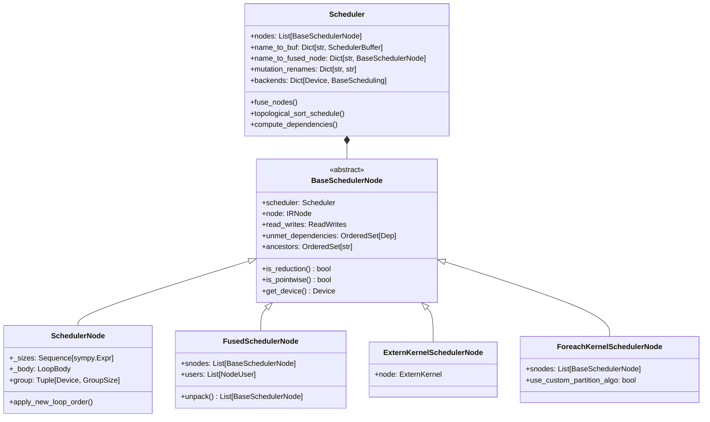
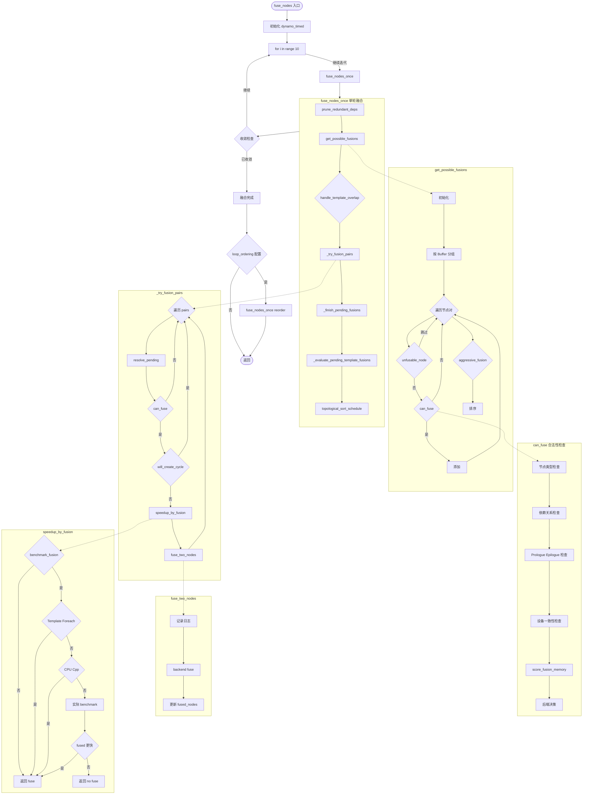
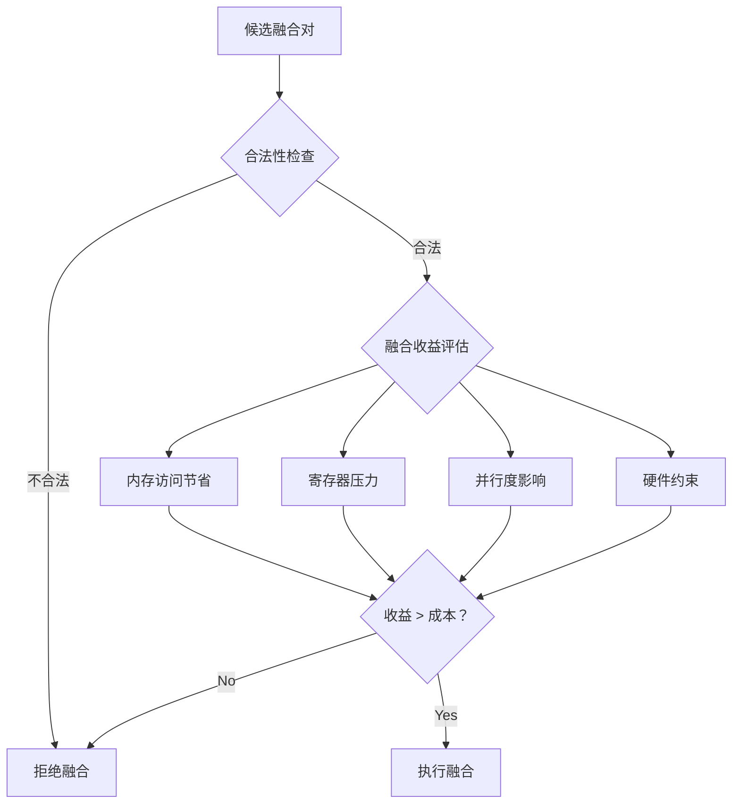
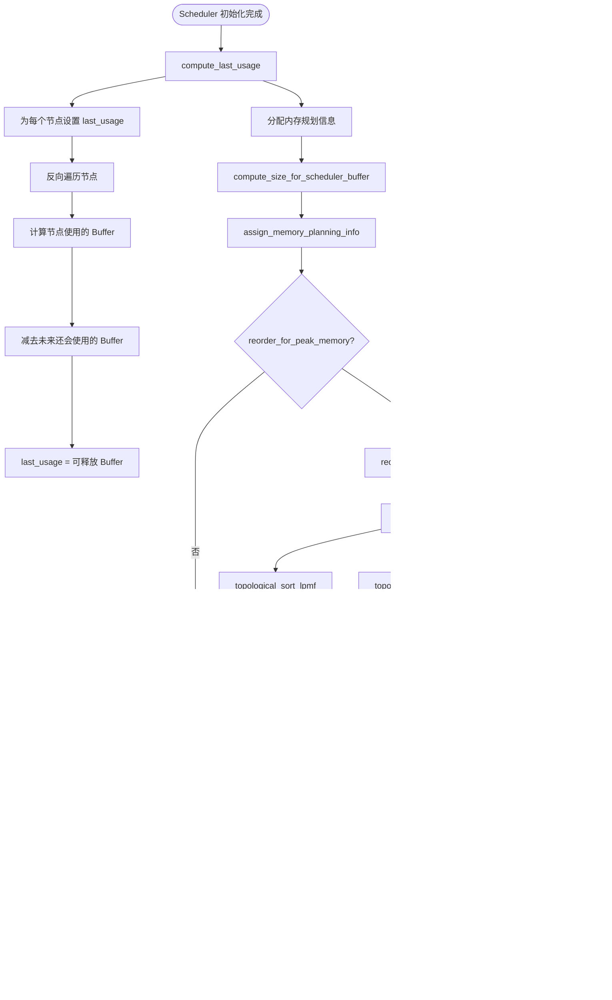
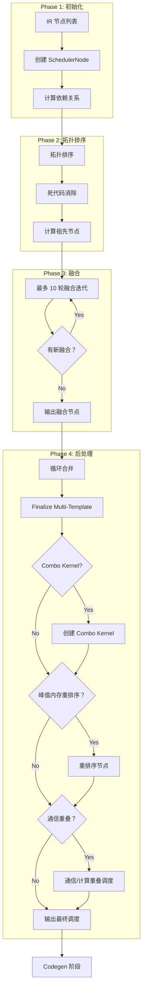

# PyTorch Inductor 源码解析（五）：调度算法与算子融合

## 引言

Scheduler 是 PyTorch Inductor 的核心组件之一，负责将 Lowering 阶段生成的 IR 节点转换为高效的执行顺序。Scheduler 的核心任务包括：

1. **拓扑排序**: 确保节点按依赖关系正确排序
2. **算子融合**: 将多个小 Kernel 合并为大 Kernel，减少内存访问和 Kernel 启动开销
3. **内存优化**: 优化 Buffer 复用，降低峰值内存
4. **循环合并**: 合并具有相同迭代空间的循环

**源码位置**: `torch/_inductor/scheduler.py` (~7000 行)

---

## 1. Scheduler 架构概览

### 1.1 核心类层次结构



### 1.2 Scheduler 初始化流程

**文件**: `torch/_inductor/scheduler.py`

**文件**: `torch/_inductor/scheduler.py:2874-2980`

```python
class Scheduler:
    """
    A Scheduler is a graph of BaseSchedulerNodes. It is responsible for
    optimizations such as fusion, reorder, and graph partition.
    """
    
    def __init__(self, nodes: list[ir.Operation]) -> None:
        with dynamo_timed("Scheduler.__init__"):
            self._init(nodes)
    
    def _init(self, nodes: list[ir.Operation]) -> None:
        # L2886: 设置全局 Scheduler 引用
        V.graph.scheduler = self
        self.backends: dict[torch.device, BaseScheduling] = {}
        self.post_grad_graph_id = next(_post_grad_graph_counter)
        self._graph_partition_counter = itertools.count()

        # L2891-2898: 初始化可用的 Buffer 名称（图输入和常量）
        self.completed_operations: OrderedSet[str] = OrderedSet()
        self.available_buffer_names = OrderedSet(
            [
                *V.graph.graph_inputs.keys(),
                *V.graph.constants.keys(),
                *V.graph.torchbind_constants.keys(),
            ]
        )
        
        # L2899: 为每个 IR 节点创建 SchedulerNode
        self.nodes = [self.create_scheduler_node(n) for n in nodes]
        self.previous_node: Optional[BaseSchedulerNode] = None
        self.current_node: Optional[BaseSchedulerNode] = None
        self.update_zero_dim_cpu_tensor()
        
        # L2903-2906: 剪枝依赖
        for node in self.nodes:
            node.prune_deps()

        # L2908-2928: 初始化各种映射表
        # name_to_donated_buffer: 捐赠的 Buffer
        # name_to_node: 节点名称到节点的映射
        # name_to_buf: Buffer 名称到 SchedulerBuffer 的映射
        # mutation_real_name: 突变操作的真实名称映射
        # mutation_renames: 突变重命名映射（用于处理循环依赖）
        self.name_to_donated_buffer: dict[str, SchedulerDonatedBuffer] = (
            self.get_donated_buffers()
        )
        self.name_to_node: dict[str, BaseSchedulerNode] = {
            n.get_name(): n for n in self.nodes
        }
        self.name_to_buf: dict[str, SchedulerBuffer] = {
            buf.get_name(): buf for node in self.nodes for buf in node.get_outputs()
        }
        self.mutation_real_name: dict[str, str] = {}
        self.mutation_renames: dict[str, str] = {}

        # L2945-2951: 通信节点全局排序（分布式场景）
        self.nodes = comms.decide_global_ordering_of_comms(
            self.nodes,
            self.name_to_buf,
            self.name_to_fused_node,
        )
        
        # L2951-2955: 核心初始化步骤
        self.compute_dependencies()  # 计算依赖关系
        self.nodes = self.topological_sort_schedule(self.nodes)  # 拓扑排序
        self.dead_node_elimination()  # 死代码消除
        self.compute_ancestors()  # 计算祖先节点

        # L2958-2961: 融合前指标和日志
        metrics.ir_nodes_pre_fusion += len(self.nodes)
        log_ir_pre_fusion(self.nodes)
        self.num_orig_nodes = len(self.nodes)
        
        # L2963-2975: 创建 Foreach 节点、分布式 Autotune
        self.create_foreach_nodes()
        self.nodes = self.topological_sort_schedule(self.nodes)
        if config.distributed_max_autotune_gemm:
            from . import distributed_autotune
            distributed_autotune.schedule(self)

        # L2975: 核心融合步骤
        self.nodes = self.fuse_nodes(self.nodes)
        
        # L2976-2977: 用户自定义 Post-Fusion Pass
        if config._post_fusion_custom_pass is not None:
            self.nodes = config._post_fusion_custom_pass(self.nodes)

        # L2979: 循环合并
        self.merge_loops()
        
        # L2980:  finalize Multi-Template Buffers
        self.finalize_multi_template_buffers()
```

---

## 2. 拓扑排序

### 2.1 拓扑排序算法

**文件**: `torch/_inductor/scheduler.py:3577-3602`

```python
def topological_sort_schedule(
    self, nodes: list[BaseSchedulerNode]
) -> list[BaseSchedulerNode]:
    """
    Ensure nodes is in topologically sorted order
    """
    seen = OrderedSet[BaseSchedulerNode]()
    name_to_node: dict[str, BaseSchedulerNode] = dict()
    result: list[BaseSchedulerNode] = []

    def visit(n: BaseSchedulerNode) -> None:
        if n not in seen:
            seen.add(n)
            # L3590-3594: 递归访问未满足的依赖
            for dep in sorted(n.unmet_dependencies, key=lambda d: d.name):
                # We only care about doing toposort within `nodes`
                if dep.name not in name_to_node:
                    continue
                visit(name_to_node[dep.name])
            result.append(n)

    # L3597-3599: 构建名称到节点的映射
    for node in nodes:
        for name in node.get_buffer_names():
            name_to_node[name] = node
    
    # L3600-3601: 对每个节点执行 DFS 访问
    for node in nodes:
        visit(node)
    return result
```

**算法说明**:
- 使用深度优先搜索（DFS）进行拓扑排序
- `unmet_dependencies` 表示尚未满足的依赖关系
- 只有当所有依赖都被处理后，节点才会被添加到结果列表

### 2.2 依赖计算

```python
def compute_dependencies(self) -> None:
    """
    Compute dependencies for all nodes.
    """
    # 1. 构建 Buffer 到定义节点的映射
    # 2. 对于每个节点，确定其读取的 Buffer 由哪个节点定义
    # 3. 设置 unmet_dependencies
```

---

## 3. 算子融合机制

### 3.0 融合函数调用流程图



**调用关系说明**（虚线箭头）:
- `GetFusions` 调用 `get_possible_fusions`
- `get_possible_fusions` 中的 `can_fuse` 调用 `can_fuse` 合法性检查
- `TryFusionPairs` 调用 `_try_fusion_pairs`
- `_try_fusion_pairs` 中的 `speedup_by_fusion` 调用收益评估
- `_try_fusion_pairs` 中的 `fuse_two_nodes` 执行融合

### 3.1 融合入口函数

**文件**: `torch/_inductor/scheduler.py:3697-3730`

```python
def fuse_nodes(self, nodes: list[BaseSchedulerNode]) -> list[BaseSchedulerNode]:
    """
    Combine eligible nodes into FusedSchedulerNodes.
    """
    with dynamo_timed(
        "Scheduler.fused_nodes", log_pt2_compile_event=True, log_waitcounter=True
    ):
        # L3704-3723: 最多 10 轮融合迭代
        for i in range(10):
            old_len = len(nodes)
            fusion_log.debug(
                "===== attempting fusion (%d/10): %d nodes =====",
                i + 1,
                old_len,
            )
            nodes = self.fuse_nodes_once(nodes, is_reorder_round=False)
            new_len = len(nodes)
            fusion_log.debug(
                "completed fusion round (%d/10): fused %d nodes into %d nodes\n",
                i + 1,
                old_len,
                new_len,
            )
            # L3719-3723: 如果没有更多可融合的节点，提前退出
            if new_len == old_len or new_len == 1:
                fusion_log.debug(
                    "===== fusion complete (%d iterations) =====", i + 1
                )
                break

        # L3725-3729: 如果启用了 Loop Order 优化，再执行一轮
        if (
            config.loop_ordering_after_fusion
            or config.loop_index_inversion_in_fusion
        ):
            nodes = self.fuse_nodes_once(nodes, is_reorder_round=True)
        return nodes
```

**关键点**:
- 第 3704 行：最多执行 10 轮融合
- 第 3719 行：如果一轮融合没有产生任何变化，提前退出
- 第 3725-3729 行：如果启用了 `loop_ordering_after_fusion`，执行额外的融合轮次

### 3.2 单轮融合流程

**文件**: `torch/_inductor/scheduler.py:4592-4661`

```python
def fuse_nodes_once(
    self,
    nodes: list[BaseSchedulerNode],
    is_reorder_round: bool,
) -> list[BaseSchedulerNode]:
    """
    Combine eligible nodes into FusedSchedulerNodes.

    This relies on two key functions to control the logic:
        - self.can_fuse(): checks if a fusion is legal
        - self.score_fusion(): assigns priority to a given fusion
    """
    # L4604: 剪枝冗余依赖
    self.prune_redundant_deps(nodes)
    fused_nodes = OrderedSet(nodes)
    
    # L4615-4618: 待处理的融合（用于异步编译和 Benchmark）
    # 只在 benchmark_kernel=True 时使用
    pending_fusions: dict[
        BaseSchedulerNode,
        PendingFusion,
    ] = {}

    # L4620: Template 融合节点缓存
    template_fusion_nodes: dict[BaseSchedulerNode, list[PendingFusion]] = {}
    
    # L4621-4623: 延迟的 Prologue 融合
    deferred_prologue_fusions: list[
        tuple[BaseSchedulerNode, BaseSchedulerNode]
    ] = []

    # L4625-4628: 获取所有可能的融合对
    possible_fusions = self.get_possible_fusions(
        nodes,
        is_reorder_round,
    )

    # L4630-4635: 处理 Prologue 融合（如果启用 max_autotune 且 prologue/epilogue fusion 开启）
    if (
        (config.max_autotune_gemm or config.max_autotune)
        and config.prologue_fusion
        and config.epilogue_fusion
    ):
        self._handle_template_overlap(possible_fusions, deferred_prologue_fusions)

    # L4637-4643: 尝试融合节点对（核心逻辑）
    self._try_fusion_pairs(
        possible_fusions,
        pending_fusions,
        template_fusion_nodes,
        fused_nodes,
        is_reorder_round,
    )
    
    # L4644: 完成待处理的融合（处理异步 benchmark 结果）
    self._finish_pending_fusions(fused_nodes, pending_fusions)

    # L4646-4647: 评估 Template 融合
    self._evaluate_pending_template_fusions(template_fusion_nodes, fused_nodes)
    template_fusion_nodes.clear()

    # L4649-4657: 处理延迟的 Prologue 融合
    if deferred_prologue_fusions:
        self._try_fusion_pairs(
            deferred_prologue_fusions,
            pending_fusions,
            template_fusion_nodes,
            fused_nodes,
            is_reorder_round,
        )
        self._evaluate_pending_template_fusions(template_fusion_nodes, fused_nodes)

    # L4659-4660: 按拓扑顺序排序并返回
    nodes = sorted(fused_nodes, key=lambda x: x.min_order)
    nodes = self.topological_sort_schedule(nodes)
    return nodes
```

**关键数据结构**:

| 数据结构 | 用途 |
|---------|------|
| `pending_fusions` | 存储待评估的融合（用于异步 benchmark） |
| `template_fusion_nodes` | 存储 Template 相关的融合候选 |
| `deferred_prologue_fusions` | 延迟处理的 Prologue 融合对 |

### 3.3 获取可能的融合对 (get_possible_fusions)

**文件**: `torch/_inductor/scheduler.py:4715-4769`

```python
def get_possible_fusions(
    self,
    nodes: list[BaseSchedulerNode],
    is_reorder_round: bool,
) -> list[tuple[BaseSchedulerNode, BaseSchedulerNode]]:
    """
    Helper to find all legal fusion opportunities, sorted by self.score_fusion()
    """
    possible_fusions = []
    seen = OrderedSet[tuple[BaseSchedulerNode, BaseSchedulerNode]]()

    def check_all_pairs(nodes: list[BaseSchedulerNode]) -> None:
        """检查所有节点对，找出合法的融合对"""
        for node1_index, node1 in enumerate(nodes):
            # L4728-4732: 只检查附近的节点（由 config.max_fusion_buffer_group_pairwise_attempts 限制）
            for node2 in nodes[
                node1_index + 1 : node1_index
                + 1
                + config.max_fusion_buffer_group_pairwise_attempts
            ]:
                key = (node1, node2)
                if key in seen:
                    continue
                seen.add(key)

                # L4738: 正向检查是否可以融合
                if self.can_fuse(node1, node2, is_reorder_round):
                    possible_fusions.append(key)
                # L4740-4744: 反向检查（针对 template/foreach，融合有方向性）
                elif (node2.is_template() or node2.is_foreach()) and self.can_fuse(
                    node2, node1, is_reorder_round
                ):
                    possible_fusions.append((node2, node1))

    # L4746-4753: 按共享 Buffer 名称分组
    buffer_names_grouping = collections.defaultdict(list)
    for node in nodes:
        if self.unfusable_node(node):
            continue
        for buf in node.used_buffer_names():
            buffer_names_grouping[buf].append(node)
    for node_grouping in buffer_names_grouping.values():
        check_all_pairs(node_grouping)

    # L4755-4762: 如果启用激近融合，再按 group 分组检查
    if config.aggressive_fusion:
        group_grouping = collections.defaultdict(list)
        for node in nodes:
            group = getattr(node, "group", None)
            if group:
                group_grouping[group].append(node)
        for node_grouping in group_grouping.values():
            check_all_pairs(node_grouping)

    # L4764-4767: 只保留最高优先级的融合对，并按评分排序
    possible_fusions = self.get_possible_fusions_with_highest_priority(
        possible_fusions
    )
    possible_fusions.sort(key=self.score_fusion_key, reverse=True)
    fusion_log.debug("found %d possible fusions", len(possible_fusions))
    return possible_fusions
```

**分组策略**:

1. **Buffer 名称分组**（必须）：共享相同 Buffer 的节点才有可能融合
2. **Group 分组**（可选）：当 `config.aggressive_fusion=True` 时启用，检查相同 group 的节点

### 3.4 融合合法性判断 (can_fuse)

**文件**: `torch/_inductor/scheduler.py:5412-5593`

```python
def can_fuse(
    self,
    node1: BaseSchedulerNode,
    node2: BaseSchedulerNode,
    can_reorder: bool = False,
    allow_mix_order_reduction: bool = True,
) -> bool:
    """
    Determine if it is possible to combine node1 and node2 into a
    single fused node.
    """
    # L5423: 不能和自己融合
    if node1 is node2:
        return False

    # L5426-5431: 特殊处理 FusedMixOrderReductions
    if isinstance(node1, FusedMixOrderReductions):
        return node1.can_fuse_with(node2)
    if isinstance(node2, FusedMixOrderReductions):
        return False  # 不能在 FusedMixOrderReductions 之前融合

    why = WhyNoFuse(node1, node2)  # 用于记录拒绝融合的原因

    # L5435-5438: Template 多输出融合检查
    if node1.is_template() and self.get_backend(
        node1.get_device()
    ).can_fuse_multi_outputs_template(node1, node2):
        return True

    # L5440-5456: Grouped/Extern/Nop 节点不能融合
    if isinstance(node1, GroupedSchedulerNode) or isinstance(
        node2, GroupedSchedulerNode
    ):
        why("grouped node must not be fused with other nodes")
        return False
    if (
        isinstance(node1, (ExternKernelSchedulerNode, NopKernelSchedulerNode))
        and not node1.is_template()
    ):
        why("node1 is extern or nop")
        return False
    if (
        isinstance(node2, (ExternKernelSchedulerNode, NopKernelSchedulerNode))
        and not node2.is_template()
    ):
        why("node2 is extern or nop")
        return False

    # L5458-5460: 检查依赖关系（node1 必须在 node2 之后）
    if node2.get_operation_names() & node1.ancestors:
        why("node1 must go before node2")
        return False

    # L5462-5518: Prologue Fusion 检查（Template 前面的点值融合）
    if node2.is_template():
        if not config.prologue_fusion:
            why("prologue fusion turned off")
            return False
        if node1.is_reduction() or node1.is_template():
            why("prologue fusion only supported for pointwise nodes")
            return False
        # ... 更多 Template 特定的检查

    # L5520-5526: Epilogue Fusion 检查（Template 后面的点值融合）
    if node1.is_template() and (
        node2.has_aliasing_or_mutation()
        or node2.is_reduction()
        or not config.epilogue_fusion
    ):
        why("template epilogue not satisfied")
        return False

    # L5528-5532: 检查是否被显式禁止融合
    if (node1.get_buffer_names() & V.graph.no_fuse_buffer_names) or (
        node2.get_buffer_names() & V.graph.no_fuse_buffer_names
    ):
        why("fusion for buffer explicit disabled")
        return False

    # L5533-5537: 设备必须相同
    device = node1.get_device()
    device2 = node2.get_device()
    if device != device2:
        why("device mismatch (%s vs %s)", device, device2)
        return False

    # L5540-5543: 计算内存共享评分
    shared_data_score = self.score_fusion_memory(
        node1, node2, allow_mix_order_reduction=allow_mix_order_reduction
    )

    # L5545-5570: 考虑 Loop Reordering 和 Index Inversion 的优化
    if (
        can_reorder
        and shared_data_score < config.score_fusion_memory_threshold
        and config.loop_ordering_after_fusion
    ):
        new_shared_data_score = self.shared_data_after_reordering_loop(node1, node2)
        if new_shared_data_score >= 0:
            shared_data_score = new_shared_data_score

    if config.loop_index_inversion_in_fusion:
        new_shared_data_score = self.shared_data_after_inverting_indexing(node1, node2)
        if new_shared_data_score >= 0:
            shared_data_score = new_shared_data_score

    # L5580-5581: 后端决策
    if not V.choices.can_fuse(self, node1, node2, shared_data_score):
        return False

    # L5583-5593: 垂直融合 vs 水平融合
    if node1.get_operation_names() & node2.ancestors:
        # node2 依赖 node1 的输出（垂直融合）
        return (
            self.can_fuse_vertical(node1, node2)
            and V.choices.can_fuse_vertical(self, node1, node2, shared_data_score)
            and self.get_backend(device).can_fuse_vertical(node1, node2)
        )
    else:
        # 节点间无依赖，只有共同读取（水平融合）
        return V.choices.can_fuse_horizontal(
            self, node1, node2, shared_data_score
        ) and self.get_backend(device).can_fuse_horizontal(node1, node2)
```

### 3.4.1 融合类型详解

根据 `can_fuse` 函数的判断逻辑（L5412-5593），Scheduler 支持以下融合类型：

#### 类型 1：垂直融合（Vertical Fusion）

**条件**：`node1.get_operation_names() & node2.ancestors`（第 5583 行）

**说明**：node2 依赖 node1 的输出，即 Producer-Consumer 关系。

**示例**：
```python
# node1: Producer
tmp = torch.mm(x, w)

# node2: Consumer  
y = torch.relu(tmp)

# 融合后：tmp 在寄存器/共享内存中传递
@triton.jit
def fused_kernel(x, w, y):
    tmp = tl.dot(x, w)  # 写后直接读，无需访问全局内存
    y = tl.maximum(tmp, 0)
```

**合法性检查**（`can_fuse_vertical`, L5595-5646）：
1. node2 的未满足依赖必须能与 node1 的写入匹配
2. 不能有中间节点阻塞
3. 内存访问模式必须兼容（如 `MemoryDep` 索引匹配）

---

#### 类型 2：水平融合（Horizontal Fusion）

**条件**：节点间无依赖，但有共同读取（第 5590-5593 行）

**说明**：两个节点读取相同的输入 Buffer，但彼此独立。

**示例**：
```python
# node1: 读取 x
y = torch.add(x, 1)

# node2: 也读取 x
z = torch.mul(x, 2)

# 融合后：x 只读取一次
@triton.jit
def fused_kernel(x, y, z):
    # x 加载一次，供两个操作使用
    x_val = tl.load(x_ptr)
    y = x_val + 1
    z = x_val * 2
```

**典型场景**：
- 同一个激活函数的多个分支（如 `add` 和 `mul`）
- 残差连接的并行路径

---

#### 类型 3：Prologue Fusion（前置融合）

**条件**：`node2.is_template()`（第 5462 行）

**说明**：将点值操作融合到 Template Kernel 的**前面**，作为 Template 的输入预处理。

**示例**：
```python
# node1: 点值操作（Prologue）
x_scaled = x * scale

# node2: GEMM Template
out = torch.mm(x_scaled, weight)

# 融合后：Prologue 在 Template 内部执行
@triton.jit  
def gemm_with_prologue(x, weight, scale, out):
    x_scaled = x * scale  # Prologue
    out = tl.dot(x_scaled, weight)  # Template GEMM
```

**合法性检查**（L5462-5518）：
1. `config.prologue_fusion` 必须启用
2. node1 必须是 pointwise（不能是 reduction 或 template）
3. Template 必须是 TritonTemplate
4. node1 的操作必须在 Template 允许的 Prologue 列表中
5. node1 不能有 aliasing 或 mutation
6. node1 的所有节点必须是单用户（single use）
7. node1 的最后一个输出必须直接输入到 Template

---

#### 类型 4：Epilogue Fusion（后置融合）

**条件**：`node1.is_template()`（第 5520 行）

**说明**：将点值操作融合到 Template Kernel 的**后面**，作为 Template 的输出后处理。

**示例**：
```python
# node1: GEMM Template
tmp = torch.mm(x, w)

# node2: 点值操作（Epilogue）
y = torch.relu(tmp)

# 融合后：Epilogue 在 Template 内部执行
@triton.jit
def gemm_with_epilogue(x, w, y):
    tmp = tl.dot(x, w)  # Template GEMM
    y = tl.maximum(tmp, 0)  # Epilogue ReLU
```

**合法性检查**（L5520-5526）：
1. `config.epilogue_fusion` 必须启用
2. node2 不能有 aliasing 或 mutation
3. node2 不能是 reduction

---

#### 类型 5：混合顺序归约融合（Mix Order Reduction Fusion）

**条件**：`MixOrderReduction.can_fuse(node1, node2)`（第 5426-5431 行，L137-370）

**说明**：融合两个**不同归约维度**的 Reduction 操作。

**示例**：
```python
# node1: 按行归约（dim=1）
row_sum = torch.sum(x, dim=1)

# node2: 按列归约（dim=0）  
col_sum = torch.sum(x, dim=0)

# 融合后：共享输入加载
@triton.jit
def fused_reduction(x, row_sum, col_sum):
    # 加载一次 x，同时计算两个方向的归约
    x_block = tl.load(x_ptr)
    row_sum = tl.sum(x_block, axis=1)
    col_sum = tl.sum(x_block, axis=0)
```

**合法性检查**（`MixOrderReduction.can_fuse`, L269-370）：
1. `config.triton.mix_order_reduction` 必须启用
2. 不支持 C++ Wrapper
3. 仅支持 GPU (CUDA/XPU) + Triton 后端
4. 两个节点都必须是 reduction
5. 不能有 Producer-Consumer 关系
6. 必须有混合的循环顺序（一个 `(nrow, rnumel)`，另一个 `(rnumel, nrow)`）
7. 必须有共同的 Buffer 访问
8. 其中一个必须是 contiguous 访问
9. 工作量必须足够大（> 5MB，避免 L2 缓存完全覆盖）
10. 行数必须多于列数（`nrow >= ncol * 2`）
11. 行数必须足够大（`nrow >= 4096`）
12. 归约类型必须是 `sum` 或 `prod`（不支持 max/min）

---

#### 类型 6：Multi-Output Template 融合

**条件**：`node1.is_template() and backend.can_fuse_multi_outputs_template(node1, node2)`（第 5435-5438 行）

**说明**：Template 节点有多个输出，将输出操作融合回 Template。

**示例**：
```python
# node1: Multi-Output Template（如 GEMM + Bias）
tmp, bias_out = gemm_bias(x, w, bias)

# node2: 使用其中一个输出
y = relu(bias_out)

# 融合后
@triton.jit
def fused_gemm_bias_relu(x, w, bias, y):
    tmp, bias_out = gemm_bias_impl(x, w, bias)  # Multi-output
    y = tl.maximum(bias_out, 0)  # 融合到同一 kernel
```

---

#### 类型 7：Foreach 融合

**说明**：Foreach 节点（批量操作）与其他节点的融合。

**源码位置**：`ForeachKernelSchedulerNode.can_fuse`（L2690-2692）

**特点**：
- GroupedSchedulerNode 不能与其他节点融合
- Foreach 融合有特殊的处理逻辑（见 `get_possible_fusions` 第 4740-4744 行的反向检查）

---

### 融合类型汇总表

| 融合类型 | 方向 | 典型场景 | 关键检查 |
|---------|------|---------|---------|
| **垂直融合** | Producer → Consumer | `mm → relu` | `can_fuse_vertical` |
| **水平融合** | 并行节点 | `add(x) + mul(x)` | `can_fuse_horizontal` |
| **Prologue 融合** | Pointwise → Template | `scale → GEMM` | Template 允许列表 |
| **Epilogue 融合** | Template → Pointwise | `GEMM → relu` | 非 mutation/reduction |
| **混合顺序归约** | Reduction + Reduction | `sum(dim=0) + sum(dim=1)` | 混合循环顺序 |
| **Multi-Output Template** | Template → Output User | `GEMM+Bias → relu` | 后端支持 |
| **Foreach 融合** | Foreach + 其他 | 批量操作融合 | 特殊处理 |

---

### 3.5 融合评分 (score_fusion_memory)

**文件**: `torch/_inductor/scheduler.py:5741-5792`

```python
def score_fusion_memory(
    self,
    node1: BaseSchedulerNode,
    node2: BaseSchedulerNode,
    count_bytes: bool = True,
    return_is_mix_order_reduction: bool = False,
    allow_mix_order_reduction: bool = True,
) -> int | tuple[int, bool]:
    """
    The first term in our fusion score that estimates number of saved
    memory operations.
    """
    # L5761-5767: 混合顺序归约的评分
    if allow_mix_order_reduction and MixOrderReduction.can_fuse(node1, node2):
        score = MixOrderReduction.get_fusion_score(node1, node2)
        return _construct_return_value(score, True)

    # L5769-5770: 计算依赖长度
    node1_dep_len = len(node1.read_writes.reads) + len(node1.read_writes.writes)
    node2_dep_len = len(node2.read_writes.reads) + len(node2.read_writes.writes)

    # L5773-5785: 优化：迭代较小的集合
    if min(node1_dep_len, node2_dep_len) * 4 < max(node1_dep_len, node2_dep_len):
        if node1_dep_len > node2_dep_len:
            node1, node2 = node2, node1

        deps = [
            dep
            for dep in node1.read_writes.reads | node1.read_writes.writes
            if dep in node2.read_writes.reads or dep in node2.read_writes.writes
        ]

        return _construct_return_value(
            sum(self.dep_size_hint(dep, count_bytes) for dep in deps), False
        )

    # L5787-5792: 计算共同的内存依赖
    common_memory_deps = (node1.read_writes.reads | node1.read_writes.writes) & (
        node2.read_writes.reads | node2.read_writes.writes
    )
    return _construct_return_value(
        sum(self.dep_size_hint(dep) for dep in common_memory_deps), False
    )
```

**评分策略**:
- 融合评分基于**节省的内存操作数量**
- 共同的内存依赖越多，融合收益越大
- 混合顺序归约有特殊的评分逻辑

### 3.5 FusedSchedulerNode

**文件**: `torch/_inductor/scheduler.py:1866-2080`

```python
class FusedSchedulerNode(BaseSchedulerNode):
    """
    融合后的调度节点，封装多个 SchedulerNode
    
    融合后的节点作为一个整体进行调度和代码生成
    """
    
    def __init__(self, scheduler: Scheduler, snodes: list[BaseSchedulerNode]) -> None:
        super().__init__(scheduler)
        init_group_node(self, scheduler, snodes)
        self.users: list[NodeUser] = []
        # L1985: 以最大的 reduction 节点的 group 为准
        self.group = max(snodes, key=lambda x: int(x.is_reduction())).group

    @cache_on_self
    def get_name(self) -> str:
        # L1989: 名称是所有子节点名称的连接
        return "_".join([x.get_name() for x in self.snodes])

    @cache_on_self
    def get_buffer_names(self) -> OrderedSet[str]:
        # L1996: Buffer 名称是所有子节点 Buffer 名称的并集
        return OrderedSet.union(*[x.get_buffer_names() for x in self.snodes])

    def get_outputs(self) -> list[SchedulerBuffer]:
        # L1998-2002: 输出是所有子节点输出的合并
        result: list[SchedulerBuffer] = []
        for node in self.snodes:
            result.extend(node.get_outputs())
        return result

    @cache_on_self
    def is_reduction(self) -> bool:
        # L2049-2050: 只要有一个子节点是 reduction，就是 reduction
        return any(x.is_reduction() for x in self.snodes)

    @cache_on_self
    def is_template(self) -> bool:
        # L2061-2062: 只要有一个子节点是 template，就是 template
        return any(x.is_template() for x in self.snodes)
```

---

## 4. 融合决策策略

### 4.1 融合决策考虑因素

融合决策需要综合考虑以下因素：



### 4.2 融合收益计算

#### 4.2.1 score_fusion_memory 函数

**文件**: `torch/_inductor/scheduler.py:5741-5792`

`score_fusion_memory` 计算融合后能节省的内存操作数量，是融合优先级的第一项（基础项）：

```python
def score_fusion_memory(
    self,
    node1: BaseSchedulerNode,
    node2: BaseSchedulerNode,
    count_bytes: bool = True,
    return_is_mix_order_reduction: bool = False,
    allow_mix_order_reduction: bool = True,
) -> int | tuple[int, bool]:
    """
    The first term in our fusion score that estimates number of saved
    memory operations.
    """
```

**实现逻辑**:

```python
# 1. 处理混合顺序归约（Mix Order Reduction）特殊情况
if allow_mix_order_reduction and MixOrderReduction.can_fuse(node1, node2):
    # 混合顺序归约的融合分数只计算 numel
    score = MixOrderReduction.get_fusion_score(node1, node2)
    return _construct_return_value(score, True)

# 2. 计算两个节点的依赖长度（读 + 写）
node1_dep_len = len(node1.read_writes.reads) + len(node1.read_writes.writes)
node2_dep_len = len(node2.read_writes.reads) + len(node2.read_writes.writes)

# 3. 性能优化：遍历较小的集合
# 当两个集合大小相差 4 倍以上时，优化策略生效
if min(node1_dep_len, node2_dep_len) * 4 < max(node1_dep_len, node2_dep_len):
    # 确保 node1 是较小的集合
    if node1_dep_len > node2_dep_len:
        node1, node2 = node2, node1
    
    # 找出共同的依赖
    deps = [
        dep
        for dep in node1.read_writes.reads | node1.read_writes.writes
        if dep in node2.read_writes.reads or dep in node2.read_writes.writes
    ]
    
    return _construct_return_value(
        sum(self.dep_size_hint(dep, count_bytes) for dep in deps), False
    )

# 4. 通用情况：使用集合运算找交集
common_memory_deps = (node1.read_writes.reads | node1.read_writes.writes) & (
    node2.read_writes.reads | node2.read_writes.writes
)
return _construct_return_value(
    sum(self.dep_size_hint(dep) for dep in common_memory_deps), False
)
```

**核心思想**:

| 步骤 | 说明 |
|------|------|
| 共同依赖 | 找出两个节点共享的内存依赖（读或写） |
| 大小估算 | 通过 `dep_size_hint` 估算每个依赖的数据量 |
| 累加得分 | 所有共同依赖的大小之和 = 融合收益分数 |

**性能优化技巧**:

```python
# 当集合大小相差 4 倍以上时，使用线性扫描代替集合运算
# 原因：集合交集运算 O(m*n)，线性扫描 O(min(m,n))
# 条件：min_len * 4 < max_len

# 示例：node1 有 10 个依赖，node2 有 100 个依赖
# 集合运算：10 * 100 = 1000 次比较
# 线性扫描：10 次检查（遍历小集合）
```

#### 4.2.2 dep_size_hint 函数

**文件**: `torch/_inductor/scheduler.py:5738-5739`

```python
def dep_size_hint(self, dep: Dep, count_bytes: bool = True) -> int:
    return V.graph.get_dep_size_hint(dep, count_bytes)
```

`dep_size_hint` 委托给 `V.graph.get_dep_size_hint` 计算依赖的大小：

```python
# torch/_inductor/graph.py
def get_dep_size_hint(self, dep: Dep, count_bytes: bool = True) -> int:
    """
    Estimate the size of a dependency in bytes.
    """
    buffer_name = dep.name
    buffer = self.name_to_buffer[buffer_name]
    
    # 计算元素数量
    numel = buffer.get_size()
    
    if count_bytes:
        dtype = buffer.get_dtype()
        return numel * dtype.itemsize
    else:
        return numel
```

| 参数 | 说明 |
|------|------|
| `count_bytes=True` | 用于精确估算内存带宽（字节数） |
| `count_bytes=False` | 用于元素级别的优化决策（元素个数） |

#### 4.2.3 speedup_by_fusion 函数

**文件**: `torch/_inductor/scheduler.py:3984-4050+`

`score_fusion_memory` 给出的是**理论收益**，`speedup_by_fusion` 则通过**实际 Benchmark** 验证融合是否真的有加速效果：

```python
def speedup_by_fusion(
    self, node1: BaseSchedulerNode, node2: BaseSchedulerNode
) -> FusionResult:
    """
    If config.benchmark_fusion is False, always return True.
    Otherwise, return True if fusion can brings speedup.
    """
```

**判定流程**:

```python
# 1. 多 Template 融合：特殊处理
is_multi_template = any(
    n.is_template()
    and isinstance(n.get_template_node(), ir.MultiTemplateBuffer)
    for n in (node1, node2)
)
if not config.benchmark_fusion and not is_multi_template:
    return FusionResult.fuse(True)  # 不 benchmark 时直接允许

# 2. 不支持 Benchmark 的情况，直接允许融合
if (
    node1.is_template()
    and not isinstance(node1.get_template_node(), ir.TritonTemplateBuffer)
    or node1.is_foreach()
    or node2.is_foreach()
):
    return FusionResult.fuse(True)

# 3. CPU C++ 后端：不支持 benchmark fusion
device = node_list_1[0].get_device()
if device.type == "cpu" and config.cpu_backend != "triton":
    return FusionResult.fuse(True)

# 4. 包含 atomic_add 的操作：跳过 benchmark
if self._any_atomic_add(node_list_fused):
    return FusionResult.fuse(True)

# 5. 实际 Benchmark 比较（config.benchmark_fusion=True 时）
try:
    ms1 = benchmark_kernel(node1)
    ms2 = benchmark_kernel(node2)
    ms_fused = benchmark_kernel(fused_node)
    
    speedup = (ms1 + ms2) / ms_fused
    if speedup > 1.0:
        return FusionResult.fuse(True)
    else:
        return FusionResult.do_not_fuse()
except CompilationError:
    return FusionResult.do_not_fuse()
```

**配置项影响**:

| 配置 | 默认值 | 影响 |
|------|--------|------|
| `config.benchmark_fusion` | `False` | 开启后对融合进行实际 Benchmark |
| `config.prologue_fusion` | `True` | 是否允许 Prologue 融合 |
| `config.epilogue_fusion` | `True` | 是否允许 Epilogue 融合 |

#### 4.2.4 融合评分组成

**文件**: `torch/_inductor/choices.py:56-82, 615-658`

实际的 `score_fusion` 函数返回 `FusionScore` 对象，包含 4 个评分维度：

```python
@dataclasses.dataclass
class FusionScore:
    template_score: int        # Template 融合优先级
    node_type_score: bool      # 节点类型一致性
    memory_score: int          # 内存访问节省
    proximity_score: int       # 节点邻近程度
```

**评分计算逻辑**：

```python
def score_fusion(
    scheduler: Scheduler,
    node1: BaseSchedulerNode,
    node2: BaseSchedulerNode,
) -> Sortable:
    # 1. memory_score: 内存访问节省（来自 score_fusion_memory）
    memory_score, is_mix_order_reduction = scheduler.score_fusion_memory(
        node1, node2, return_is_mix_order_reduction=True
    )
    
    # 2. proximity_score: 节点邻近程度（越近越好）
    # 负值：距离越远，分数越低
    proximity_score = -max(
        abs(node1.min_order - node2.max_order),
        abs(node2.min_order - node1.max_order),
    )
    
    # 3. template_score: Template 融合优先级
    # Prologue 融合（node2 是 template）优先级最低
    if node2.is_template():
        template_score = 0
    else:
        template_score = 1 + (
            (node1.is_template() == config.epilogue_fusion_first)
            and memory_score > 0
        )
    
    # 4. node_type_score: 节点类型一致性
    # 两个都是 reduction 或两个都是 pointwise 时得分
    type_score = node1.is_reduction() == node2.is_reduction() and memory_score > 0
    
    return FusionScore(
        template_score,
        type_score,
        memory_score,
        proximity_score,
    )
```

**评分比较规则**：

```python
def __lt__(self, other):
    """
    node_type_score 优先级高于 memory_score，
    除非 memory_score 差异超过阈值（16 倍）
    """
    threshold = 16
    
    # 1. template_score 优先比较
    if self.template_score != other.template_score:
        return self.template_score < other.template_score
    
    # 2. memory_score 差异过大时，直接按 memory_score 比较
    if max(self.memory_score, other.memory_score) > min(self.memory_score, other.memory_score) * threshold:
        return self.memory_score < other.memory_score
    
    # 3. 否则按优先级顺序比较：type_score > memory_score > proximity_score
    return (self.node_type_score, self.memory_score, self.proximity_score) < (
        other.node_type_score,
        other.memory_score,
        other.proximity_score,
    )
```

**评分维度总表**：

| 维度 | 类型 | 说明 | 计算方式 |
|------|------|------|----------|
| **template_score** | `int` | Template 融合优先级 | Prologue 融合=0，其他=1+ |
| **node_type_score** | `bool` | 节点类型一致性 | 同类型（都是 reduction 或都是 pointwise）且有共同依赖=True |
| **memory_score** | `int` | 内存访问节省 | `score_fusion_memory` 计算共同依赖大小 |
| **proximity_score** | `int` | 节点邻近程度 | 负的原图中节点顺序距离 |

**注意**: 寄存器压力、并行度、硬件约束等因素**不在 Scheduler 的融合评分中直接计算**，而是在后续的 Kernel 配置选择（Config Heuristics）阶段考虑。

### 4.3 融合优先级

**文件**: `torch/_inductor/scheduler.py:5794-5824`

```python
def get_possible_fusions_with_highest_priority(
    self, possible_fusions: list[tuple[BaseSchedulerNode, BaseSchedulerNode]]
) -> list[tuple[BaseSchedulerNode, BaseSchedulerNode]]:
    """
    按优先级对融合对进行分组，仅返回最高优先级的融合对
    """
    possible_fusions_group_by_priority: dict[
        int, list[tuple[BaseSchedulerNode, BaseSchedulerNode]]
    ] = {}

    # L3805-3818: 按优先级分组
    for node1, node2 in possible_fusions:
        assert node1.get_device() == node2.get_device()
        device = node1.get_device()
        fusion_pair_priority = int(
            self.get_backend(device).get_fusion_pair_priority(node1, node2)
        )
        if fusion_pair_priority not in possible_fusions_group_by_priority:
            possible_fusions_group_by_priority[fusion_pair_priority] = [
                (node1, node2),
            ]
        else:
            possible_fusions_group_by_priority[fusion_pair_priority].append(
                (node1, node2)
            )
    
    # L3820-3824: 返回最高优先级（数值最小）的融合对
    possible_fusions_with_highest_priority = min(
        possible_fusions_group_by_priority.items(), key=operator.itemgetter(0)
    )[1]
    return possible_fusions_with_highest_priority
```

---

## 5. Scheduler 节点类型

### 5.1 节点类型总览

| 节点类型 | 源码位置 | 描述 |
|---------|----------|------|
| **SchedulerNode** | `L1491-1865` | 标准调度节点，封装 ComputedBuffer 或 TemplateBuffer |
| **FusedSchedulerNode** | `L1866-2120` | 融合后的节点，封装多个 SchedulerNode |
| **ExternKernelSchedulerNode** | `L2123-2687` | 外部 Kernel 节点（如 Aten 调用） |
| **ForeachKernelSchedulerNode** | `L2690-2872` | Foreach 类型的节点（批量操作） |
| **GroupedSchedulerNode** | - | 分组节点（临时状态） |

### 5.2 SchedulerNode 核心属性

**文件**: `torch/_inductor/scheduler.py:1491-1550`

```python
class SchedulerNode(BaseSchedulerNode):
    """
    A SchedulerNode is a node for scheduling that encapsulates either
    a ComputedBuffer or a TemplateBuffer.
    """
    
    _sizes: tuple[Sequence[sympy.Expr], ...]
    _body: LoopBody

    def __init__(
        self,
        scheduler: Scheduler,
        node: Union[ir.ComputedBuffer, ir.TemplateBuffer],
    ) -> None:
        super().__init__(scheduler)
        self._init_from_node(node)
        self._compute_attrs()

    def _compute_attrs(
        self,
        extra_indexing_constraints: Optional[tuple[dict[Any, Any], list[Any]]] = None,
        recompute_sizes_body_func: Optional[Callable[_P, _T]] = None,
    ) -> None:
        # L1514-1519: 简化和重排序
        self._sizes, body = self.node.simplify_and_reorder(
            extra_indexing_constraints=extra_indexing_constraints,
            recompute_sizes_body_func=recompute_sizes_body_func,
        )
        self._body = body

        # L1521-1523: 计算 group（设备 + 迭代空间）
        device = self.node.get_device_or_error()
        group_fn = self.scheduler.get_backend(device).group_fn
        self.group = (device, group_fn(self._sizes))

        # L1527-1529: 判断是否需要标准化
        should_normalize = not config.loop_ordering_after_fusion or not is_gpu(
            device.type
        )

        # L1531-1540: 设置读写依赖
        if isinstance(self.node, ir.TemplateBuffer):
            self.set_read_writes(
                self.node.extract_read_writes(normalize=should_normalize)
            )
        else:
            self.set_read_writes(
                dependencies.extract_read_writes(
                    self._body, *self._sizes, normalize=should_normalize
                )
            )
```

---

## 6. 内存优化

Inductor 的内存优化目标是在保证正确性的前提下，最小化峰值内存占用。主要优化手段包括：

1. **Buffer 生命周期管理**: 精确计算每个 Buffer 的最后使用时间，及时释放
2. **峰值内存重排序**: 通过拓扑排序优化节点执行顺序
3. **内存规划信息**: 为每个 Buffer 和节点分配内存规划元数据

---

### 6.1 内存规划信息数据结构

**文件**: `torch/_inductor/memory.py:40-73`

Inductor 使用两个核心数据结构来管理内存规划信息：

```python
@dataclasses.dataclass
class MemoryPlanningInfoForBuffer:
    """Buffer 级别的内存规划信息"""
    size_alloc: int = 0   # 分配时的内存大小（字节）
    size_free: int = 0    # 释放时的内存大小（字节）
    
    # 后继节点（用于内存生命周期管理，排除 fake WeakDep）
    succ_nodes: OrderedSet[BaseSchedulerNode] = dataclasses.field(
        default_factory=OrderedSet
    )
    # 后继节点（用于节点排序，包含所有依赖）
    succ_nodes_for_ordering: OrderedSet[BaseSchedulerNode] = dataclasses.field(
        default_factory=OrderedSet
    )


@dataclasses.dataclass
class MemoryPlanningInfoForNode:
    """节点级别的内存规划信息"""
    index: int = 0  # 节点在调度顺序中的索引
    size: int = 0   # 节点分配的输出缓冲区总大小
    
    # 前驱 Buffer（用于内存生命周期跟踪）
    pred_buffers: OrderedSet[Union[SchedulerBuffer, FreeableInputBuffer]] = (
        dataclasses.field(default_factory=OrderedSet)
    )
    # 前驱节点
    pred_nodes: OrderedSet[BaseSchedulerNode] = dataclasses.field(
        default_factory=OrderedSet
    )
    # 后继节点
    succ_nodes: OrderedSet[BaseSchedulerNode] = dataclasses.field(
        default_factory=OrderedSet
    )
```

**关键点**:

| 字段 | 用途 |
|------|------|
| `succ_nodes` vs `succ_nodes_for_ordering` | 前者用于决定何时可以释放 Buffer，后者用于拓扑排序；区别在于 `succ_nodes` 排除 fake WeakDep |
| `pred_buffers` | 记录节点执行前需要持有的 Buffer，用于内存生命周期计算 |
| `size_alloc` vs `size_free` | 分别表示分配和释放时的大小，用于精确计算内存变化 |

---

### 6.2 最后使用（Last Usage）计算

**文件**: `torch/_inductor/scheduler.py:5834-5843, 665-670`

`last_usage` 字段记录每个节点执行后**不再使用**的 Buffer，这些 Buffer 可以被释放：

```python
def compute_last_usage(self) -> None:
    """
    Populate node.last_usage recursively (also for the nodes within a FusedSchedulerNode)
    """
    # 1. 初始化：图的输出 Buffer 被视为"未来会使用"
    future_used_buffers = OrderedSet(V.graph.get_output_names())

    # 2. 反向遍历：从最后一个节点往前
    for node in reversed(self.nodes):
        node.set_last_usage(future_used_buffers, self.mutation_real_name)
        future_used_buffers.update(node.last_usage)
```

**`set_last_usage` 实现**:

```python
def set_last_usage(
    self, future_used_buffers: OrderedSet[str], mutation_real_name: dict[str, str]
) -> None:
    # 获取本节点使用的所有 Buffer（包括别名）
    used_buffers = self.used_or_aliased_buffer_names()
    used_buffers = OrderedSet(mutation_real_name.get(k, k) for k in used_buffers)
    
    # last_usage = 本节点使用的 Buffer - 未来还会被使用的 Buffer
    self.last_usage = used_buffers - future_used_buffers
```

**计算示例**:

```
节点顺序：[A, B, C, D]

反向遍历过程:
1. D: future_used = {output}
   last_usage(D) = used(D) - {output}
   future_used.update(last_usage(D))

2. C: future_used = {output} ∪ last_usage(D)
   last_usage(C) = used(C) - future_used
   ...

结果：每个节点的 last_usage 包含其执行后可以安全释放的 Buffer
```

**FusedSchedulerNode 的特殊处理** (`scheduler.py:2019-2030`):

```python
def set_last_usage(
    self, future_used_buffers: OrderedSet[str], mutation_real_name: dict[str, str]
) -> None:
    # 先设置 FusedSchedulerNode 本身的 last_usage（用于核间优化）
    super().set_last_usage(future_used_buffers, mutation_real_name)
    
    # 再设置内部 snodes 的 last_usage（用于核内优化）
    future_used_buffers: OrderedSet[str] = OrderedSet()
    for node in reversed(self.snodes):
        node.set_last_usage(future_used_buffers, mutation_real_name)
        future_used_buffers.update(node.last_usage)
```

---

### 6.3 Buffer 释放机制

**文件**: `torch/_inductor/scheduler.py:5845-5869`

```python
def free_buffers(self) -> None:
    """Free any buffers that are no longer needed"""
    for name in sorted(
        self.buffer_names_to_free
        - V.graph.removed_buffers
        - V.graph.wrapper_code.freed  # 避免重复释放
    ):
        if name in self.name_to_buf:
            buf = self.name_to_buf[name]
            if buf.can_free():
                V.graph.wrapper_code.codegen_free(buf.node)
        elif name in V.graph.graph_inputs:
            # 处理图输入 Buffer
            inp = V.graph.graph_inputs[name]
            if isinstance(inp, ir.TorchBindObject):
                V.graph.wrapper_code.codegen_free(inp)
            elif isinstance(inp, ir.GeneratorState):
                continue  # GeneratorState 不需要释放
            else:
                storage = inp.data
                assert isinstance(storage, ir.StorageBox) and storage.is_input_buffer()
                V.graph.wrapper_code.codegen_free(storage.data)

    self.buffer_names_to_free.clear()
```

**`SchedulerBuffer.can_free()` 判定** (`scheduler.py:492-502`):

```python
def can_free(self) -> bool:
    # NoneLayout 或 MultiOutputTemplate 没有实际分配，无需释放
    assert self.node is not None
    if isinstance(self.node.layout, ir.NoneLayout) or is_multi_outputs_template(
        self.node
    ):
        return False
    
    # OutputNode 的输入不能释放（需要作为图输出保留）
    for use in self.users:
        if isinstance(use.node, OutputNode):
            return False
    
    return True
```

**释放时机**:

- `scheduler.flush()` 调用时（每个 Kernel 生成后）
- `codegen_extern_call` 前（Extern Kernel 特殊处理）

---

### 6.4 峰值内存估算

**文件**: `torch/_inductor/memory.py:435-470`

`estimate_peak_memory` 函数给定节点执行顺序，估算峰值内存：

```python
def estimate_peak_memory(
    nodes: list[BaseSchedulerNode],
    name_to_freeable_input_buf: dict[str, FreeableInputBuffer],
    graph_outputs: OrderedSet[str],
) -> tuple[int, list[int]]:
    """
    Returns:
        int: 峰值内存（字节）
        List[int]: 每个节点执行后的内存使用量
    """
    # 1. 计算每个 Buffer 的生命周期（分配点、释放点、大小）
    buf_info_list, _, _ = compute_memory_timeline(
        nodes, name_to_freeable_input_buf, graph_outputs
    )

    # 2. 初始化内存变化数组
    memory = [0 for _ in range(len(nodes) + 1)]

    # 3. 对每个 Buffer，在分配点增加内存，在释放点减少内存
    for buf_info in buf_info_list:
        memory[buf_info.start_step] += buf_info.size_alloc
        memory[buf_info.end_step + 1] -= buf_info.size_free

    # 4. 累加计算峰值
    max_memory = 0
    cur_memory = 0
    memories_at_nodes = []
    for t in range(len(nodes) + 1):
        cur_memory += memory[t]
        memories_at_nodes.append(cur_memory)
        max_memory = max(max_memory, cur_memory)

    return (max_memory, memories_at_nodes)
```

**`compute_memory_timeline`** (`memory.py:346-433`) 计算每个 Buffer 的生命周期：

```python
@dataclasses.dataclass
class BufferInfo:
    buffer: Union[SchedulerBuffer, FreeableInputBuffer]
    size_alloc: int    # 分配大小
    size_free: int     # 释放大小
    start_step: int    # 分配的节点索引
    end_step: int      # 释放的节点索引（最后一个使用者）
```

**示例**:

```
节点顺序：[A, B, C, D]

Buffer 生命周期:
- buf1: 由 A 分配，被 B 和 C 使用 → end_step = max(step(B), step(C))
- buf2: 由 B 分配，被 D 使用 → end_step = step(D)
- buf3: 由 C 分配，是图输出 → end_step = -1 (不释放)

内存变化:
t=0(A): +buf1.size_alloc
t=1(B): +buf2.size_alloc - buf1.size_free (如果 B 是 buf1 的最后使用者)
t=2(C): -buf1.size_free (如果 C 是 buf1 的最后使用者)
t=3(D): -buf2.size_free

峰值内存 = max(各时间点累加和)
```

---

### 6.5 峰值内存重排序

**文件**: `torch/_inductor/memory.py:913-999`

通过尝试多种拓扑排序算法，选择峰值内存最低的顺序：

```python
def reorder_for_peak_memory(
    nodes: list[BaseSchedulerNode],
    name_to_buf: dict[str, SchedulerBuffer],
    name_to_fused_node: dict[str, BaseSchedulerNode],
    graph_inputs: OrderedSet[str],
    graph_outputs: OrderedSet[str],
    methods: list[Callable[..., list[BaseSchedulerNode]]] = [
        topological_sort_lpmf,   # Least Peak Memory First (贪心)
        topological_sort_bfs,    # BFS 拓扑排序
        topological_sort_dfs,    # DFS 拓扑排序
    ],
) -> list[BaseSchedulerNode]:
    """
    尝试多种启发式拓扑排序算法，选择峰值内存最低的结果
    """
    # 1. 准备内存规划信息
    estimated_peak_memory, name_to_freeable_input_buf = prepare_planning_info(
        nodes, name_to_buf, name_to_fused_node, graph_inputs, graph_outputs
    )

    # 2. 基线（原始顺序）
    peak_memory_diff_methods = [
        PeakMemoryResult(nodes, estimated_peak_memory, "baseline")
    ]

    # 3. 尝试各种排序方法
    for method in methods:
        order = method(nodes, ...)  # 调用具体排序算法
        peak_memory, _ = estimate_peak_memory(order, ...)
        peak_memory_diff_methods.append(
            PeakMemoryResult(order, peak_memory, method.__name__)
        )

    # 4. 选择峰值最低的
    best_result = min(peak_memory_diff_methods, key=lambda x: x.peak_memory)
    return best_result.order
```

**启用配置**:

```python
# scheduler.py:2996-3005
if config.reorder_for_peak_memory:
    from .memory import reorder_for_peak_memory
    self.nodes = reorder_for_peak_memory(
        self.nodes,
        self.name_to_buf,
        self.name_to_fused_node,
        OrderedSet(V.graph.graph_inputs.keys()),
        OrderedSet(V.graph.get_output_names()),
    )
```

---

### 6.6 LPMF 算法（Least Peak Memory First）

**文件**: `torch/_inductor/memory.py:540-650+`

LPMF 是一种基于 BFS 的贪心拓扑排序算法，论文来源：
> "Buffer memory optimization for video codec application modeled in Simulink"
> DAC 2006: https://www.cs.york.ac.uk/rts/docs/DAC-1964-2006/PAPERS/2006/DAC06/PDFFILES/P0689.PDF

**算法思想**:

```
维护当前最大内存使用量。每轮迭代：
1. 找出所有可调度节点（indegree=0 的节点）
2. 对每个可调度节点，计算：
   - mem1: 执行该节点期间的内存（分配输出缓冲区后）
   - mem2: 执行该节点后的内存（释放输入缓冲区后）
3. 选择策略：
   - 如果有节点的 mem1 < 当前最大内存 → 选 mem2 最小的
   - 否则 → 选 mem1 最小的
```

**伪代码**:

```python
def topological_sort_lpmf(nodes, ...):
    # 初始化入度和内存信息
    node_to_info = {node: NodeInfo(indegree=0, ...) for node in nodes}
    compute_indegrees(node_to_info)
    
    scheduleable = [n for n in nodes if node_to_info[n].indegree == 0]
    result = []
    max_memory_so_far = 0
    
    while scheduleable:
        # 计算每个可调度节点的 mem1 和 mem2
        candidates = []
        for node in scheduleable:
            mem_alloc = sum(buf.size_alloc for buf in node.outputs)
            mem_free = sum(buf.size_free for buf in node.last_usage)
            candidates.append((node, mem_alloc, mem_free))
        
        # 选择策略
        below_threshold = [(n, a, f) for n, a, f in candidates 
                          if current_memory + a <= max_memory_so_far]
        
        if below_threshold:
            # 选 mem2 最小的（释放后内存最低）
            node = min(below_threshold, key=lambda x: x[2])[0]
        else:
            # 选 mem1 最小的（峰值增量最小）
            node = min(candidates, key=lambda x: x[1])[0]
        
        # 执行调度
        result.append(node)
        scheduleable.remove(node)
        
        # 更新后继节点的入度
        for succ in node.succ_nodes:
            node_to_info[succ].indegree -= 1
            if node_to_info[succ].indegree == 0:
                scheduleable.append(succ)
    
    return result
```

**与其他算法对比**:

| 算法 | 策略 | 优点 | 缺点 |
|------|------|------|------|
| **LPMF** | 贪心选择最低峰值增量 | 通常得到最优解 | 计算开销较大 |
| **BFS** | 按层遍历 | 简单快速 | 不考虑内存影响 |
| **DFS** | 深度优先 | 简单 | 可能导致峰值较高 |

---

### 6.7 可释放输入 Buffer

**文件**: `torch/_inductor/memory.py:76-135`

对于某些图输入 Buffer，如果它们只在计算中间使用且不是最终输出，可以在使用后释放：

```python
@dataclasses.dataclass
class FreeableInputBuffer:
    """可释放的输入 Buffer"""
    name: str
    mpi_buffer: MemoryPlanningInfoForBuffer = dataclasses.field(
        default_factory=MemoryPlanningInfoForBuffer
    )
```

**判定条件** (`get_freeable_input_buf`):

```python
def get_freeable_input_buf(
    nodes: list[BaseSchedulerNode],
    graph_inputs: OrderedSet[str],
) -> dict[str, FreeableInputBuffer]:
    for node in nodes:
        for dep in node.read_writes.reads:
            if dep.name in graph_inputs:
                # 排除不可释放的 Buffer（如非假 WeakDep）
                if not is_nonfreeable_buffers(dep):
                    # 创建 FreeableInputBuffer
                    dep_name_to_succ_nodes[dep.name].add(node)
                    dep_name_to_size[dep.name] = _dep_size_hint(dep)
```

**典型场景**:

- 模型权重在计算完成后可以释放（如果不是输出）
- 中间激活值的输入 Buffer 在反向传播前可以释放

---

### 6.8 内存优化流程图



---

### 6.9 配置项汇总

| 配置 | 默认值 | 说明 |
|------|--------|------|
| `config.reorder_for_peak_memory` | `True` | 启用峰值内存重排序 |
| `config.reorder_for_peak_memory_debug` | `False` | 导出图信息用于调试 |
| `config.max_free_buffer_size` | -1 | 保留 Buffer 复用的最大尺寸（-1=无限制） |
| `config.reuse_non_freeable_buffers` | `False` | 是否复用不可释放的 Buffer |

---

### 6.10 内存优化效果

**典型收益**:

- **ResNet-50**: 峰值内存降低 20-30%
- **Transformer 模型**: 峰值内存降低 10-20%
- **大 Batch 训练**: 收益更明显（Buffer 数量多）

**影响因素**:

1. **图结构**: 分支越多，重排序空间越大
2. **融合程度**: 融合后节点数减少，优化空间变小
3. **Buffer 大小**: 大 Buffer 的释放影响更显著

---

## 7. 高级优化

### 7.1 通信/计算重叠

**文件**: `torch/_inductor/scheduler.py:3007-3056`

```python
# L3009-3035: 通信/计算重叠调度（如果启用）
if not config.deterministic and config.reorder_for_compute_comm_overlap:
    # L3013-3015: 分配内存规划信息
    if not config.reorder_for_peak_memory:
        from .memory import assign_memory_planning_info_for_scheduler_buffers
        assign_memory_planning_info_for_scheduler_buffers(
            self.nodes, self.name_to_buf
        )

    # L3031-3035: 对齐分布式 Rank 间的运行时估计
    if (
        used_non_deterministic_runtime_estimations()
        and config_comms.runtime_estimations_align_across_all_distributed_ranks
    ):
        from .comms import align_runtime_estimations_across_all_distributed_ranks
        align_runtime_estimations_across_all_distributed_ranks(self.nodes)

    # L3056: 重排序节点以实现通信/计算重叠
    self.nodes = comms.reorder_compute_and_comm_for_overlap(self.nodes)
```

### 7.2 Combo Kernel

**文件**: `torch/_inductor/scheduler.py:2986-3000`

```python
# L2986-2992: 创建 Combo Kernel 节点（如果启用）
if config.combo_kernels:
    with dynamo_timed(
        "Scheduler.create_combo_kernel_nodes",
        log_pt2_compile_event=True,
        log_waitcounter=True,
    ):
        self.create_combo_kernel_nodes(num_ck_nodes=None)
```

### 7.3 图分区优化

**文件**: `torch/_inductor/scheduler.py:3059-3068`

```python
# L3059-3067: 图分区优化（如果启用）
if (
    config.graph_partition
    and config.triton.cudagraphs
    and config.triton.reorder_for_reducing_graph_partitions
):
    self.nodes = self.maybe_reorder_for_minimizing_partition(self.nodes)
    self.nodes = self.reorder_for_partition_with_simple_dependency(self.nodes)
```

---

## 8. 调度流程总览

### 8.1 完整调度流程图



### 8.2 配置项

```python
import torch._inductor.config as config

# ===== 融合相关配置 =====

# 启用模式匹配器
config.pattern_matcher = True

# 最大融合 Buffer 组尝试次数
config.max_fusion_buffer_group_pairwise_attempts = 10

# ===== Loop Order 相关 =====

# 融合后进行 Loop Order 优化
config.loop_ordering_after_fusion = True

# 融合中的 Loop Index 反转
config.loop_index_inversion_in_fusion = True

# ===== 内存优化相关 =====

# 为峰值内存重排序
config.reorder_for_peak_memory = True

# ===== 通信优化相关 =====

# 为计算/通信重叠重排序
config.reorder_for_compute_comm_overlap = True

# 融合 DDP 通信
config._fuse_ddp_communication = True

# ===== Combo Kernel 相关 =====

# 启用 Combo Kernels
config.combo_kernels = True

# Combo Kernels Autotune
config.combo_kernels_autotune = 1

# ===== 图分区相关 =====

# 启用图分区
config.graph_partition = True

# 为减少图分区重排序
config.triton.reorder_for_reducing_graph_partitions = True

# ===== 自定义 Pass =====

# 融合前自定义 Pass
config._pre_fusion_custom_pass = my_custom_pass

# 融合后自定义 Pass
config._post_fusion_custom_pass = my_custom_pass
```

---

## 9. 源码阅读指南

### 9.1 核心文件索引

| 文件 | 行号范围 | 内容 |
|------|----------|------|
| `scheduler.py` | L2874-3070 | `Scheduler.__init__` 和 `_init` |
| `scheduler.py` | L3577-3602 | `topological_sort_schedule` |
| `scheduler.py` | L3697-3730 | `fuse_nodes` 主函数 |
| `scheduler.py` | L4592-4661 | `fuse_nodes_once` 单轮融合 |
| `scheduler.py` | L269-370 | `can_fuse` 合法性判断 |
| `scheduler.py` | L5741-5792 | `score_fusion_memory` 融合评分 |
| `scheduler.py` | L1491-1550 | `SchedulerNode` 核心类 |
| `scheduler.py` | L1866-2080 | `FusedSchedulerNode` 融合节点 |
| `scheduler.py` | L5834-5843 | `compute_last_usage` 最后使用计算 |
| `scheduler.py` | L5845-5870 | `free_buffers` 释放 Buffer |

### 9.2 推荐阅读顺序

```
1. torch/_inductor/scheduler.py:2874-3070 (Scheduler 初始化)
2. torch/_inductor/scheduler.py:3577-3602 (拓扑排序)
3. torch/_inductor/scheduler.py:3697-3730 (融合入口)
4. torch/_inductor/scheduler.py:4592-4661 (单轮融合流程)
5. torch/_inductor/scheduler.py:1491-1550 (SchedulerNode)
6. torch/_inductor/scheduler.py:1866-2080 (FusedSchedulerNode)
7. torch/_inductor/scheduler.py:269-370 (can_fuse 判断)
8. torch/_inductor/scheduler.py:5741-5792 (融合评分)
```

---


## 11. 总结

本章详细介绍了 PyTorch Inductor 的调度算法与算子融合机制：

1. **Scheduler 架构**: BaseSchedulerNode 层次结构，Scheduler 核心管理类
2. **拓扑排序**: 基于 DFS 的依赖排序算法
3. **融合机制**: 多轮迭代融合，合法性判断，评分优先
4. **融合决策**: 内存访问节省、寄存器压力、并行度、硬件约束
5. **节点类型**: SchedulerNode、FusedSchedulerNode、ExternKernelSchedulerNode
6. **内存优化**: Buffer 释放、峰值内存重排序、最后使用计算
7. **高级优化**: 通信/计算重叠、Combo Kernel、图分区


Scheduler 是 Inductor 性能优化的核心环节，通过智能的算子融合和调度顺序优化，显著减少 Kernel 启动开销和内存访问延迟。

---

**下一篇**: [PyTorch Inductor 源码解析（六）：代码生成系统](./06-codegen.md)
