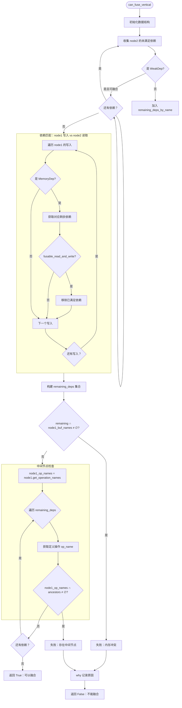

# PyTorch Inductor 源码解析（五.一）：垂直融合判定 can_fuse_vertical

## 引言

在 Inductor 的算子融合机制中，**垂直融合（Vertical Fusion）** 是指将生产者节点（Producer）和消费者节点（Consumer）合并到同一个 Kernel 中的优化技术。这种融合可以减少全局内存访问次数，提高数据复用率，是编译器优化的核心手段之一。

本文详细分析 `torch/_inductor/scheduler.py` 中的 `can_fuse_vertical` 函数，该函数负责判定两个节点是否可以安全地进行垂直融合。

**源码位置**: `torch/_inductor/scheduler.py:5595-5646`

---

## 1. 函数签名与核心逻辑

### 1.1 函数定义

```python
def can_fuse_vertical(
    self, node1: BaseSchedulerNode, node2: BaseSchedulerNode
) -> bool:
    """
    Check if it is legal to fuse a consumer (node2) into a producer (node1).

    We can fuse them if all the reads of node2 either match
    corresponding writes in node1, or are written by nodes that can
    be scheduled before the fusion of node1 and node2.
    """
```

**参数说明**:
- `node1`: 生产者节点（Producer），在调度顺序中先执行
- `node2`: 消费者节点（Consumer），依赖于 `node1` 的输出

**返回值**:
- `True`: 两个节点可以安全融合
- `False`: 不能融合，通过 `WhyNoFuse` 记录原因

### 1.2 核心判定原则

垂直融合的合法性基于以下原则：

1. **依赖匹配原则**: `node2` 的所有读取（reads）要么与 `node1` 的写入（writes）完全匹配，要么由可以在融合前调度的其他节点写入
2. **无冲突原则**: 融合后不能引入内存访问冲突或执行顺序问题
3. **无中间节点原则**: `node1` 和 `node2` 之间不能存在必须独立执行的中间节点

---

## 2. 依赖收集与预处理

### 2.1 初始化

```python
node1_buf_names = node1.get_buffer_names()
why = WhyNoFuse(node1, node2)
remaining_deps_by_name: dict[str, list[Dep]] = defaultdict(list)
```

**关键数据结构**:
- `node1_buf_names`: `node1` 输出的所有 Buffer 名称集合
- `why`: 诊断对象，用于记录融合失败的原因（便于调试日志输出）
- `remaining_deps_by_name`: 按 Buffer 名称分组的**未满足依赖**集合

### 2.2 收集 node2 的未满足依赖

```python
for dep in node2.unmet_dependencies:
    name = self.mutation_renames.get(dep.name, dep.name)
    if isinstance(dep, WeakDep) and self.fusable_weak_dep(dep, node1, node2):
        continue
    remaining_deps_by_name[name].append(dep)
```

**处理流程**:

1. **突变重命名处理**: 通过 `mutation_renames` 获取 Buffer 的真实名称。这是因为 Inductor 在处理原地（in-place）操作时会重命名 Buffer 以追踪数据流
2. **WeakDep 特殊处理**: `WeakDep` 表示对原地突变操作的依赖，如果满足 `fusable_weak_dep` 条件则可以跳过（不阻止融合）

**WeakDep 可融合条件**（见 `fusable_weak_dep` 函数）:
- `WeakDep` 指向的 Buffer 必须是 `node1` 的输出之一
- `node2` 对该 Buffer 的原地突变必须与 `node1` 的读取在相同索引位置
- 不支持 `StarDep`（表示整个 Buffer 的依赖）
- 不支持包含临时符号（`SymT.TMP`）的索引
- 并发读取数必须 ≤ 1（避免竞态条件）

### 2.3 依赖满足检查

```python
for cd in node1.read_writes.writes:
    if not isinstance(cd, MemoryDep):
        continue
    remaining = remaining_deps_by_name.get(
        self.mutation_renames.get(cd.name, cd.name)
    )
    if remaining:
        for rd in remaining:
            if self.fusable_read_and_write(rd, cd):
                remaining.remove(rd)  # noqa: B909
```

**核心逻辑**:

这段代码检查 `node1` 的写入是否能满足 `node2` 的读取依赖：

1. 遍历 `node1` 的所有写入依赖（`read_writes.writes`）
2. 只处理 `MemoryDep` 类型（表示具体的内存访问，包含索引信息）
3. 对于每个 `node2` 中尚未满足的依赖 `rd`，检查是否与 `node1` 的写入 `cd` 匹配

**`fusable_read_and_write` 判定标准**:

```python
def fusable_read_and_write(self, read: Dep, write: MemoryDep) -> bool:
    if isinstance(read, MemoryDep):
        # 1. 检查 Buffer 名称是否匹配（考虑突变重命名）
        read_name = self.mutation_renames.get(read.name, read.name)
        if read_name != write.name:
            return False
        
        # 2. 排除包含临时符号的索引
        if free_symbol_is_type(read.index, SymT.TMP) or \
           free_symbol_is_type(write.index, SymT.TMP):
            return False
        
        # 3. 如果需要循环排序后融合，检查变量数量是否一致
        if config.loop_ordering_after_fusion and read.num_vars != write.num_vars:
            read = read.normalize()
            write = write.normalize()
        
        # 4. 排除需要同步屏障的操作（如 scatter_add_, atomic 操作等）
        if self.mode_requires_synchronization(write.mode):
            return False
        
        # 5. 最终检查：索引相同，尺寸匹配
        return (
            read.index == write.index
            and len(read.size) >= len(write.size)
            and read.size[: len(write.size)] == write.size
        )
    
    elif isinstance(read, StarDep):
        # StarDep 表示对整个 Buffer 的依赖
        read_name = self.mutation_renames.get(read.name, read.name)
        write_name = self.mutation_renames.get(write.name, write.name)
        return (
            read.mode == write.mode
            and write.mode is not None
            and read_name == write_name
        )
    
    return False
```

**关键点**:

| 检查项 | 说明 |
|--------|------|
| 名称匹配 | Buffer 必须相同（考虑原地操作的重命名） |
| 临时符号 | `SymT.TMP` 表示循环嵌套中的临时变量，无法静态判定 |
| 循环变量数 | 如果启用 `loop_ordering_after_fusion`，循环维度必须一致 |
| 同步需求 | 原子操作、scatter 操作等需要线程同步，不能融合 |
| 索引匹配 | 读写必须在相同的索引位置 |
| 尺寸匹配 | 读取的尺寸必须覆盖写入的尺寸 |

---

## 3. 剩余依赖检查

### 3.1 构建剩余依赖集合

```python
remaining_deps = OrderedSet(
    dep.name
    for dep in itertools.chain.from_iterable(remaining_deps_by_name.values())
)
```

经过上一轮的依赖满足检查后，`remaining_deps` 包含了所有**无法被 `node1` 满足**的 `node2` 的依赖。

### 3.2 内存冲突检查

```python
if remaining_deps & node1_buf_names:
    # MemoryDeps didn't match and read different locations of the same buffer.
    # Examples here include:
    #   - MemoryDep("foo", x) != MemoryDep("foo", x + 1)
    #   - MemoryDep("foo", x) != StarDep("foo")
    why("memory deps did not match")
    return False
```

**检查目的**: 如果剩余依赖中存在 `node1` 输出的 Buffer，说明：

1. `node2` 读取了 `node1` 输出的某个 Buffer
2. 但该读取的索引位置与 `node1` 的写入位置**不匹配**

**典型场景**:

- **索引偏移不匹配**: `node1` 写入 `buf[x]`，`node2` 读取 `buf[x+1]`
- **通配符依赖冲突**: `node1` 精确写入 `buf[x]`，`node2` 读取整个 `buf`（`StarDep`）
- **尺寸不匹配**: 写入和读取的区域不完全重叠

这种不匹配会导致融合后 `node2` 读取到错误的数据位置，因此不能融合。

### 3.3 中间节点检查

```python
node1_op_names = node1.get_operation_names()
for name in remaining_deps:
    op_name = self.name_to_buf[name].defining_op_name()
    if node1_op_names & self.name_to_fused_node[op_name].ancestors:
        why("intermediate nodes between node1 & node2")
        return False
```

**检查逻辑**:

1. 获取 `node1` 包含的所有操作名称（对于融合节点，可能包含多个操作）
2. 对于每个剩余依赖，找到定义该 Buffer 的操作（`op_name`）
3. 检查该操作的祖先节点是否与 `node1` 的操作有交集

**判定条件**:

```
node1_op_names ∩ ancestors(defining_op) ≠ ∅  →  不能融合
```

**场景示例**:

```
    A
   / \
  B   C
   \ /
    D
```

假设:
- `node1 = B`（生产 `buf1`）
- `node2 = D`（消费 `buf1` 和 `buf2`）
- `buf2` 由 `C` 定义
- `C` 的祖先包括 `A`，而 `B` 的祖先也包括 `A`

此时 `B` 和 `C` 是兄弟节点，都依赖于 `A`。如果 `D` 依赖于 `C` 的输出 `buf2`，则不能将 `D` 融合到 `B` 中，因为 `C` 必须在 `D` 之前执行。

---

## 4. 完整判定流程图



---

## 5. 关键数据结构详解

### 5.1 Dep 类型层次

```
Dep (依赖基类)
├── MemoryDep(name, index, size, mode)  - 精确的内存访问依赖
├── StarDep(name, mode)                 - 整个 Buffer 的依赖
└── WeakDep(name, mutating_buf)         - 原地突变的弱依赖
```

| 类型 | 说明 | 融合处理 |
|------|------|----------|
| `MemoryDep` | 精确到索引的内存访问 | 检查索引、尺寸、模式是否匹配 |
| `StarDep` | 整个 Buffer 的依赖 | 只能与相同模式的 `StarDep` 融合 |
| `WeakDep` | 原地突变的依赖 | 特殊处理，满足条件可跳过 |

### 5.2 WhyNoFuse 诊断类

```python
class WhyNoFuse:
    def __init__(self, node1: BaseSchedulerNode, node2: BaseSchedulerNode):
        self.name1 = node1.get_name()
        self.name2 = node2.get_name()

    def __call__(self, reason: str, *args: Any) -> None:
        self.reason = reason
        self.args = args
        fusion_log.debug(self)

    def __str__(self) -> str:
        return f"cannot fuse {self.name1} with {self.name2}: " + (
            self.reason % self.args
        )
```

**作用**: 提供融合失败的结构化日志，便于调试和性能分析。

### 5.3 mutation_renames 映射

```python
# 示例：原地操作的重命名
# 原始：buf = add(buf, 1)  # in-place
# 重命名后：buf_v1 = add(buf_v0, 1)
# mutation_renames = {"buf": "buf_v1"}
```

Inductor 通过重命名追踪原地操作的数据流，确保依赖分析的准确性。

---

## 6. 典型场景分析

### 6.1 可融合场景

**场景**: 逐元素操作的链式融合

```python
# 原始 Python 代码
x = torch.randn(100)
y = x * 2      # node1: mul
z = y + 1      # node2: add
w = z.relu()   # node3: relu

# 融合后 Kernel
def fused_kernel(x):
    y = x * 2
    z = y + 1
    w = z.relu()
    return w
```

**判定过程**:
- `node2` 读取 `y`，`node1` 写入 `y` → 完全匹配
- 无剩余依赖 → 通过所有检查 → **可以融合**

### 6.2 不可融合场景：索引偏移

```python
# 原始代码
x = torch.randn(100)
y = x[1:]      # node1: slice
z = y[:-1]     # node2: slice

# 依赖分析
# node1 写入：y[i] = x[i+1]
# node2 读取：y[j] (j != i+1 in general)
```

**判定结果**: 索引不匹配 → **不能融合**

### 6.3 不可融合场景：中间节点

```python
# 原始代码
a = torch.randn(100)
b = a * 2       # node1
c = a + 1       # 中间节点
d = b + c       # node2（依赖于 b 和 c）

# 依赖图
#     a
#    / \
#   b   c
#    \ /
#     d
```

**判定结果**: `node2` 依赖 `c`，而 `c` 是独立于 `node1` 的中间节点 → **不能融合**

### 6.4 不可融合场景：同步需求

```python
# 原始代码
x = torch.randn(100, 100)
y = x.scatter_add(0, index, src)  # node1: 需要原子操作
z = y.sum()                        # node2

# node1 的写入模式：atomic_add（需要同步屏障）
```

**判定结果**: `mode_requires_synchronization` 返回 `True` → **不能融合**

---

## 7. 与其他融合函数的关系

### 7.1 调用链路

```
fuse_nodes()
  └── fuse_nodes_once()
        └── get_possible_fusions()
              └── can_fuse()  ← 总体融合判定
                    ├── can_fuse_vertical()  ← 本文分析
                    ├── can_fuse_horizontal()
                    └── ...
```

### 7.2 相关函数对比

| 函数 | 作用 | 判定维度 |
|------|------|----------|
| `can_fuse()` | 总体融合入口 | 类型、设备、分数等 |
| `can_fuse_vertical()` | 垂直融合判定 | 依赖关系、索引匹配 |
| `can_fuse_horizontal()` | 水平融合判定 | 兄弟节点、输出合并 |
| `fusable_read_and_write()` | 读写匹配判定 | 底层依赖匹配逻辑 |
| `fusable_weak_dep()` | WeakDep 判定 | 原地突变依赖 |

---

## 8. 总结

`can_fuse_vertical` 函数是 PyTorch Inductor 垂直融合的核心判定逻辑，其设计遵循以下原则：

1. **保守策略**: 当存在任何不确定性时，优先选择不融合以保证正确性
2. **精确匹配**: 要求读写索引完全匹配，避免数据竞争
3. **诊断友好**: 通过 `WhyNoFuse` 记录失败原因，便于性能分析
4. **扩展性强**: 通过 `fusable_read_and_write` 等辅助函数，可以针对不同操作类型定制融合策略

理解这个函数的实现对于以下场景至关重要：

- 分析 Inductor 融合决策，优化模型性能
- 添加新的操作类型，确定融合行为
- 调试融合相关的编译错误或性能回退

---

## 参考资料

1. `torch/_inductor/scheduler.py` - 主调度器实现
2. `torch/_inductor/ir.py` - IR 节点和依赖类型定义
3. [PyTorch Inductor 架构文档](./01-inductor-architecture.md)
4. [PyTorch Inductor 调度算法](./05-scheduler.md)
