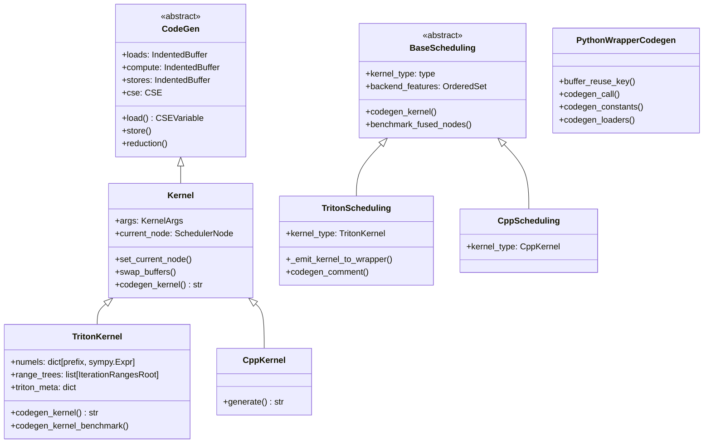
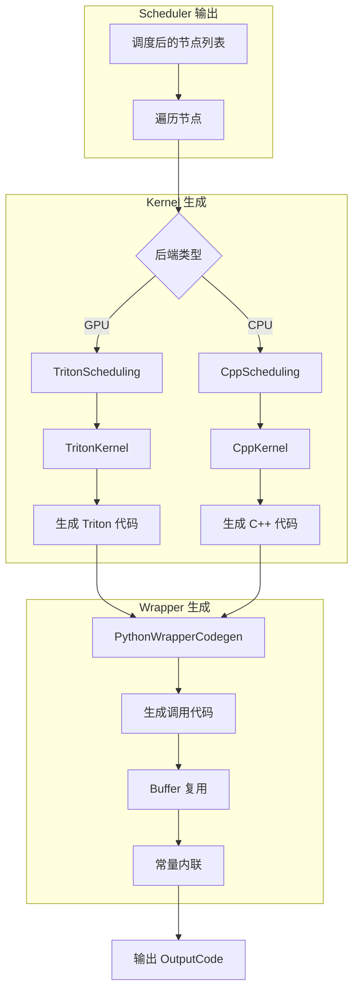
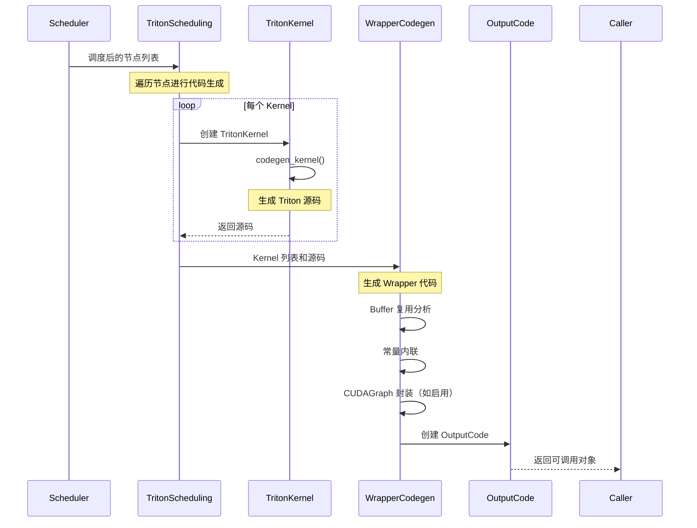

# PyTorch Inductor 源码解析（六）：代码生成系统

## 引言

Codegen（代码生成）是 PyTorch Inductor 编译流程的最后阶段，负责将 Scheduler 优化后的 IR 转换为目标平台的可执行代码。Inductor 支持多种后端：

- **Triton**: GPU Kernel 生成（主要后端）
- **C++**: CPU SIMD 代码生成
- **CUDA**: 原生 CUDA Kernel
- **AOTInductor**: 离线编译生成独立库

**源码位置**: `torch/_inductor/codegen/` 目录

---

## 1. Codegen 架构概览

### 1.1 核心类层次结构



### 1.2 代码生成流程



---

## 2. Kernel 基类设计

### 2.1 Kernel 核心属性

**文件**: `torch/_inductor/codegen/common.py`

**文件**: `torch/_inductor/codegen/common.py:2115-2260`

```python
class Kernel(CodeGen, Generic[CSEVariableType]):
    """
    Kernel 是代码生成的核心类，负责生成单个 Kernel 的代码
    
    所有具体的 Kernel 类型（TritonKernel, CppKernel）都继承自此类
    """
    
    newvar_prefix: str = ""
    suffix: str = ""
    overrides: Optional[Callable[[], OpsHandler[Any]]] = None

    def __init__(
        self, args: Optional[KernelArgs] = None, increase_kernel_count: bool = True
    ) -> None:
        super().__init__()
        if increase_kernel_count:
            # L2124-2126: 统计生成的 Kernel 数量
            metrics.generated_kernel_count += 1
        
        self.args = args or KernelArgs()
        
        # L2128-2130: 三个核心缓冲区
        self.loads = IndentedBuffer()    # 加载操作
        self.compute = IndentedBuffer()  # 计算操作
        self.stores = IndentedBuffer()   # 存储操作

        # L2132-2136: 统计信息
        self.atomic_add_found = False
        self.num_load = 0
        self.num_store = 0
        self.num_reduction = 0

        # L2137: 公共子表达式消除
        self.cse: CSE[CSEVariableType, Any] = CSE(self.newvar_prefix, self.suffix)
        
        # L2138-2139: Buffer 追踪
        self.must_keep_buffers: OrderedSet[str] = OrderedSet()
        self.store_buffer_names: OrderedSet[str] = OrderedSet()

        # L2140-2141: 加载掩码
        self._load_mask: Optional[str] = None
        self._load_other: Union[None, int, float] = None
        
        # L2143-2144: 当前节点和边界信息
        self.current_node: Optional[SchedulerNode] = None
        self.node_to_bounds: Optional[dict[torch.fx.Node, ValueRanges[Any]]] = None

        # L2146-2147: 移除的 Buffer
        self.removed_buffers: OrderedSet[str] = OrderedSet()
        self.inplaced_to_remove: OrderedSet[str] = OrderedSet()

        # L2149-2152: 原地更新 Buffer 映射
        # key: 要写入的 buffer
        # value: 可复用内存的读取 buffer
        self.inplace_update_buffers: dict[str, str] = {}
        
        # L2154: 每个线程处理的最小元素数
        self.min_elem_per_thread = 1
        self.kernel_name: Optional[str] = None
```

**关键设计**:
- 第 2128-2130 行：三个独立的缓冲区（loads/compute/stores）便于代码组织和优化
- 第 2137 行：CSE（公共子表达式消除）减少冗余计算
- 第 2149-2152 行：原地更新缓冲区的映射关系，支持内存复用

### 2.2 核心抽象方法

**文件**: `torch/_inductor/codegen/common.py:2213-2256`

```python
class Kernel(CodeGen, Generic[CSEVariableType]):
    # ...
    
    def load(self, name: str, index: sympy.Expr) -> CSEVariable:
        """
        生成加载操作
        
        Args:
            name: Buffer 名称
            index: 索引表达式
        
        Returns:
            CSEVariable 表示加载的值
        """
        raise NotImplementedError

    def indirect_load(self, name: str, index: sympy.Expr) -> CSEVariable:
        """
        间接加载（依赖于已读取的索引）
        """
        prior = self.loads
        try:
            # L2220-2221: 将加载放入 compute 部分（可能有依赖）
            self.loads = self.compute
            return self.load(name, index)
        finally:
            self.loads = prior

    def store(
        self, name: str, index: sympy.Expr, value: CSEVariable, mode: StoreMode = None
    ) -> None:
        """
        生成存储操作
        
        Args:
            name: Buffer 名称
            index: 索引表达式
            value: 要存储的值
            mode: 存储模式（普通/原子/减少）
        """
        raise NotImplementedError

    def store_reduction(self, name: str, index: sympy.Expr, value: CSEVariable) -> None:
        """生成归约存储操作"""
        raise NotImplementedError

    def reduction(
        self,
        dtype: torch.dtype,
        src_dtype: torch.dtype,
        reduction_type: ReductionType,
        value: Union[CSEVariable, tuple[CSEVariable, ...]],
    ) -> Union[CSEVariable, tuple[CSEVariable, ...]]:
        """
        生成归约操作
        
        Args:
            dtype: 目标数据类型
            src_dtype: 源数据类型
            reduction_type: 归约类型（sum/max/min/...）
            value: 输入值
        """
        raise NotImplementedError
```

### 2.3 上下文管理

**文件**: `torch/_inductor/codegen/common.py:2157-2195`

```python
class Kernel(CodeGen, Generic[CSEVariableType]):
    # ...
    
    @contextlib.contextmanager
    def set_current_node(self, node: SchedulerNode) -> Iterator[None]:
        """
        设置当前处理的节点，用于追踪元数据
        
        这是一个上下文管理器，确保在处理完节点后恢复之前的状态
        """
        prior = self.current_node
        self.current_node = node
        self.node_to_bounds = node._body.bounds().get_bounds()
        try:
            yield
        finally:
            self.current_node = prior

    @contextlib.contextmanager
    def swap_buffers(
        self,
        lb: IndentedBuffer,
        cb: Optional[IndentedBuffer] = None,
        sb: Optional[IndentedBuffer] = None,
    ) -> Iterator[None]:
        """
        临时交换代码缓冲区
        
        用于在生成特定代码段时隔离输出
        
        Args:
            lb: 新的 loads 缓冲区
            cb: 新的 compute 缓冲区（可选，默认与 lb 相同）
            sb: 新的 stores 缓冲区（可选，为 None 时表示禁止 store）
        """
        if cb is None:
            cb = lb
        disallow_stores = sb is None
        if disallow_stores:
            sb = IndentedBuffer()
        
        # L2178-2181: 保存当前缓冲区
        loads = self.loads
        compute = self.compute
        stores = self.stores
        cse = self.cse
        
        # L2182-2185: 交换缓冲区
        self.loads = lb
        self.compute = cb
        self.stores = sb
        self.cse = cse.scoped_copy()
        
        try:
            yield
        finally:
            # L2189-2192: 恢复缓冲区
            self.loads = loads
            self.compute = compute
            self.stores = stores
            self.cse = cse
            
            # L2194-2195: 如果禁止 store，验证没有产生 store
            if disallow_stores:
                assert not sb, "unexpected store inside swap_buffers"
```

---

## 3. Triton 代码生成

### 3.1 TritonKernel 概览

**文件**: `torch/_inductor/codegen/triton.py`

TritonKernel 是 Inductor 生成 GPU Kernel 的核心类，负责将 IR 转换为 Triton 代码。

### 3.2 codegen_kernel 主函数

**文件**: `torch/_inductor/codegen/triton.py:5331-5480`

```python
def codegen_kernel(self, name=None) -> str:
    """
    Convert the TritonKernel from Inductor SIMD IR to triton code,
    including inductor triton heuristics, imports, metadata, and benchmarking infra.
    """
    code = IndentedBuffer()

    # L5339-5360: 计算 size hints
    size_hints = {}
    for prefix, numel in self.numels.items():
        if prefix_is_reduction(prefix) and not self.inside_reduction:
            continue

        numel_hint = V.graph.sizevars.symbolic_hint(numel)
        if not isinstance(numel_hint, (int, sympy.Integer)):
            # L5353-5357: 默认 hint 为 8192（最大支持的 block size）
            size_hint = 8192
        else:
            size_hint = next_power_of_2(int(numel_hint))
        size_hints[prefix] = size_hint

    # L5362-5368: 生成 Triton 导入和驱动设置
    if name is None:
        code.splice(self.gen_common_triton_imports())
        device_type = V.graph.get_current_device_or_throw().type
        if device_type == "cpu":
            code.splice("triton_helpers.set_driver_to_cpu()")
        else:
            code.splice("triton_helpers.set_driver_to_gpu()")

        if config.benchmark_kernel:
            code.splice(self.imports_for_benchmark_kernel())

    # L5373-5383: 处理 SizeArg 签名
    argdefs, _, signature, _ = self.args.python_argdefs()
    for i, arg in enumerate(signature):
        if isinstance(arg, SizeArg):
            symbol = cast(sympy.Symbol, arg.expr)
            if symbol in V.graph.sizevars.inv_precomputed_replacements:
                signature[i] = SizeArg(
                    arg.name, V.graph.sizevars.inv_precomputed_replacements[symbol]
                )

    # L5385-5400: 追踪突变的参数
    mutated_args: OrderedSet[str] = OrderedSet()
    for mutation in self.mutations:
        if mutation in self.args.input_buffers:
            mutated_args.add(self.args.input_buffers[mutation])
        if mutation in self.args.inplace_buffers:
            mutated_args.add(
                cast(InplacedBuffer, self.args.inplace_buffers[mutation]).inner_name
            )
        if mutation in self.args.output_buffers:
            mutated_args.add(self.args.output_buffers[mutation])

    # L5402-5418: Workspace Mutation 处理
    # Note: [Workspace Mutation]
    # workspace 参数被突变，但不会标记为 self.mutations
    # 因为它们的 buffer 是在 codegen 期间添加的
    for argname, arg in zip(argdefs, signature):
        if (
            isinstance(arg, WorkspaceArg)
            and arg.zero_mode == WorkspaceZeroMode.ZERO_ON_CALL
        ):
            mutated_args.add(argname.name)

    # L5423-5432: 添加 range tree 参数
    for tree in self.active_range_trees():
        sizearg = SizeArg(f"{tree.prefix}numel", tree.numel)
        signature.append(sizearg)
        argdefs.append(ArgName(sizearg.name))

    # L5434-5447: 添加 constexpr 参数（BLOCK 大小）
    def add_constexpr_arg(arg_name):
        if triton_version_uses_attrs_dict():
            signature.append(ConstexprArg(arg_name))
        argdefs.append(ArgName(arg_name, is_constexpr=True))

    for tree in self.range_trees:
        if tree.is_reduction and self.persistent_reduction:
            continue
        if tree.tensor_dim is None:
            continue
        add_constexpr_arg(f"{tree.upper()}_BLOCK")

    # L5449-5453: 合作归约和混合顺序归约参数
    if self.cooperative_reduction:
        add_constexpr_arg("RSPLIT")
    if self.mix_order_reduction:
        add_constexpr_arg("RSPLIT_SIZE")
        add_constexpr_arg("NUM_STAGES")

    # L5456-5468: 构建 triton_meta
    triton_meta_signature = signature_to_meta(
        signature, size_dtype=self.index_dtype, argdefs=argdefs
    )
    triton_meta: dict[str, Any] = {
        "signature": triton_meta_signature,
        "device": DeviceProperties.create(V.graph.get_current_device_or_throw()),
        "constants": {},
        "native_matmul": (
            torch._inductor.config.triton.native_matmul
            and ("tl.dot" in str(self.body) or "tl.dot" in str(self.compute))
        ),
        **self.triton_meta_common(),
    }

    # L5470-5473: 合作归约需要 cooperative-grid 启动
    if self.cooperative_reduction:
        triton_meta["launch_cooperative_grid"] = True

    # L5478: 内存优化（仅推理和反向模式启用）
    optimize_mem = V.graph.is_inference or V.graph.is_backward
```

**关键点**:
- 第 5353-5357 行：对于未绑定的 SymInt，使用 8192 作为默认 size hint
- 第 5402-5418 行：Workspace Mutation 的特殊处理（Note: [Workspace Mutation]）
- 第 5470-5473 行：合作归约需要 cooperative-grid 启动以避免挂起
- 第 5478 行：内存优化仅在推理或反向模式启用（训练循环会跳过）

### 3.3 TritonScheduling 后端

**文件**: `torch/_inductor/codegen/triton.py:6036-6104`

```python
class TritonScheduling(SIMDScheduling):
    """Scheduling backend for Triton kernel code generation."""
    
    # L6039: Kernel 类型
    kernel_type: type[Any] = TritonKernel
    
    # L6040-6051: 支持的后端特性
    backend_features = OrderedSet(
        [
            BackendFeature.FOREACH,
            BackendFeature.BUCKETIZE,
            BackendFeature.INPLACE_BUFFERS,
            BackendFeature.MASKED_SCATTER_WITH_INDEX,
            BackendFeature.SCAN,
            BackendFeature.SORT,
            BackendFeature.TRITON_TEMPLATES,
            BackendFeature.TUPLE_REDUCTION,
        ]
    )

    def __init__(self, scheduler: Optional[Scheduler]) -> None:
        super().__init__(scheduler)
        if scheduler is None or not hasattr(scheduler, "nodes"):
            return
        # L6057-6059: 为每个节点设置调试设备字符串
        for node in scheduler.nodes:
            if isinstance(node, (SchedulerNode, FusedSchedulerNode)):
                node.debug_device_str = debug_triton_code

    @classmethod
    def get_backend_features(cls, device: torch.device):
        """获取后端特性，可能根据配置扩展"""
        if (
            config.triton.cooperative_reductions
            or config.triton.force_cooperative_reductions
        ):
            return OrderedSet(
                [*cls.backend_features, BackendFeature.REDUCE_TO_SINGLE_ELEMENT]
            )
        return cls.backend_features

    def codegen_comment(self, node_schedule, kernel_name=None):
        """
        生成 Kernel 注释，包含来源信息
        
        用于调试和性能分析
        """
        wrapper = V.graph.wrapper_code
        origins, _detailed_origins = get_kernel_metadata(node_schedule, wrapper)
        if origins:
            wrapper.make_comment(origins)

        # L6078-6096: 如果启用 debug_fusion，输出融合节点名称列表
        if config.debug_fusion:
            from torch._inductor.scheduler import (
                BaseSchedulerNode,
                ForeachKernelSchedulerNode,
            )

            if not any(
                isinstance(n, ForeachKernelSchedulerNode) for n in node_schedule
            ):
                node_names = [
                    n.get_name()
                    for n in node_schedule
                    if isinstance(n, BaseSchedulerNode)
                ]
                wrapper.make_comment(
                    f"{wrapper.comment} Fused node name list: {', '.join(node_names)}"
                )

        # L6098-6103: 设置追踪上下文
        if kernel_name:
            debug_handle = set_kernel_post_grad_provenance_tracing(
                node_schedule,
                kernel_name,
            )
            wrapper.write_provenance_debug_handle(kernel_name, debug_handle)
```

### 3.4 Kernel 发射到 Wrapper

**文件**: `torch/_inductor/codegen/triton.py:6105-6134`

```python
def _emit_kernel_to_wrapper(
    self,
    wrapper,
    kernel,
    src_code,
    kernel_name,
    subs_name,
    node_schedule,
    kernel_path,
    get_kernel_metadata,
):
    """
    Emit kernel to wrapper, with support for external template handlers.
    
    支持外部模板处理器（如 Helion）覆盖 Kernel 发射逻辑
    """
    # L6117-6126: 允许外部模板处理器覆盖
    if kernel.emit_kernel_override(
        wrapper,
        src_code,
        kernel_name,
        node_schedule,
        kernel_path,
        get_kernel_metadata,
    ):
        return  # External handler handled it

    compile_wrapper = IndentedBuffer()

    # L6130-6134: 如果使用进程池，异步编译
    if async_compile.use_process_pool():
        # The process pool is warm, we can shell out to workers right away
        async_compile.triton(subs_name, src_code)
```

---

## 4. C++ 代码生成

### 4.1 C++ 后端概览

**文件**: `torch/_inductor/codegen/cpp.py`

C++ 后端负责生成 CPU SIMD 代码，支持 MKL-DNN 集成。

**文件**: `torch/_inductor/codegen/cpp.py:89-97`

```python
@functools.cache
def get_export_declaration():
    """获取导出声明（Windows 需要 __declspec(dllexport)）"""
    return "__declspec(dllexport)" if _IS_WINDOWS else ""

# L96-110: 归约类型到 C++ 操作符的映射
NATIVE_OMP_RTYPES = OrderedSet(["+", "*", "^", "||", "min", "max"])
RTYPE_TO_CPP = {
    "sum": "+",
    "prod": "*",
    "xor_sum": "^",
    "and": "&&",
    "or": "||",
    "max":.maximum,
    "min":minimum,
}
```

### 4.2 C++ Kernel 生成

```python
class CppKernel(Kernel):
    """
    C++ Kernel 代码生成
    
    负责生成优化的 CPU SIMD 代码
    """
    
    def generate(self) -> str:
        """
        生成完整的 C++ Kernel 代码
        
        包括:
        1. 函数签名
        2. 并行循环（OpenMP）
        3. SIMD 向量化
        4. 内存访问优化
        """
```

---

## 5. Wrapper 代码生成

### 5.1 PythonWrapperCodegen

**文件**: `torch/_inductor/codegen/wrapper.py`

Wrapper 负责生成调用 Kernel 的 Python 代码，包括：
- Buffer 分配和复用
- 参数绑定
- Kernel 调用序列
- CUDAGraph 支持

**文件**: `torch/_indocrat/codegen/wrapper.py:1077+`

```python
class PythonWrapperCodegen(CodeGen):
    """
    Python Wrapper 代码生成
    
    负责生成调用编译后 Kernel 的 Python 代码
    """
    
    def buffer_reuse_key(self, node: BufferLike) -> ReuseKey:
        """
        生成 Buffer 复用的键
        
        Buffer 可以复用的条件:
        1. 相同的设备
        2. 相同的数据类型
        3. 相同的大小（符号化）
        4. 相同的对齐要求
        """
        storage_size = V.graph.get_allocation_storage_size(node)
        alignment = node.get_name() not in V.graph.unaligned_buffers
        return (
            node.get_device_or_error(),
            node.get_dtype(),
            sympy_str(V.graph.sizevars.simplify(storage_size)),
            alignment,
        )
```

### 5.2 Buffer 复用逻辑

**文件**: `torch/_inductor/codegen/wrapper.py:128-160`

```python
def can_match_buffer_size(input_buf: BufferLike, output_buf: BufferLike):
    """
    判断 input_buf 是否可以原地用于 output_buf
    
    与 buffer_reuse_key 不同，这里允许 input_size >= output_size
    """
    # L131-132: 设备检查
    if input_buf.get_device_or_error() != output_buf.get_device_or_error():
        return False

    # L134-135: 类型检查
    if input_buf.get_dtype() != output_buf.get_dtype():
        return False

    # L137-142: 大小计算
    input_size = V.graph.sizevars.simplify(
        V.graph.get_allocation_storage_size(input_buf)
    )
    output_size = V.graph.sizevars.simplify(
        V.graph.get_allocation_storage_size(output_buf)
    )

    # L144-149: 大小匹配检查
    if sympy_str(input_size) == sympy_str(output_size):
        return True
    
    # L150-153: 允许 input_size >= output_size（有 0.95 容差）
    if statically_known_geq(input_size, output_size):
        return True
    
    return False
```

---

## 6. OutputCode 抽象

### 6.1 OutputCode 基类

**文件**: `torch/_inductor/output_code.py`

**文件**: `torch/_inductor/output_code.py:76-100`

```python
@dataclasses.dataclass
class OutputCode:
    """
    OutputCode 是 Inductor 编译产出的抽象表示
    
    设计目标:
    1. 表示编译后的可调用的对象
    2. 支持序列化（保存/加载）
    3. 支持远程缓存（通过 key 寻址）
    
    实现类型:
    - Python wrapper（默认）
    - AOTInductor（ABI 稳定的二进制文件）
    """
    
    # L80-84: FX 图缓存 key（远程缓存时使用）
    _fx_graph_cache_key: Optional[str] = dataclasses.field(default=None, init=False)
    _fx_graph_cache_debug_lines: Optional[list[str]] = dataclasses.field(
        default=None, init=False
    )

    # L86-87: 编译耗时（纳秒）
    _time_taken_ns: Optional[int] = dataclasses.field(default=None, init=False)

    def __call__(self, inputs: Sequence[Any]) -> Any:
        """
        执行编译后的代码
        
        子类实现具体的调用逻辑
        """
        raise NotImplementedError(type(self))

    def prepare_for_serialization(self) -> None:
        """
        准备序列化
        
        子类实现序列化前的准备工作
        """
        raise NotImplementedError(type(self))

    def post_compile(
        self,
        example_inputs: Sequence[InputType],
        constants: CompiledFxGraphConstants,
        graph_kwargs: _CompileFxKwargs,
    ) -> None:
        """
        编译后处理
        
        用于设置运行时指标、缓存等
        """
```

---

## 7. 代码生成流程详解

### 7.1 完整流程图



### 7.2 关键配置项

```python
import torch._inductor.config as config

# ===== Triton 相关 =====

# 启用 Triton CUDAGraphs
config.triton.cudagraphs = True

# 启用合作归约
config.triton.cooperative_reductions = True

# 启用原生矩阵乘法
config.triton.native_matmul = True

# ===== 调试相关 =====

# 启用 Kernel 基准测试
config.benchmark_kernel = True

# 启用融合调试信息
config.debug_fusion = True

# ===== 编译模式 =====

# 异步编译（使用进程池）
config.async_compile = True

# ===== C++ 后端相关 =====

# 启用 C++ wrapper
config.cpp_wrapper = True

# 启用分组 GEMM 模板
config.cpp.enable_grouped_gemm_template = True
```

---

## 8. 源码阅读指南

### 8.1 核心文件索引

| 文件 | 行号范围 | 内容 |
|------|----------|------|
| `common.py` | L2115-2260 | `Kernel` 基类定义 |
| `common.py` | L1531-2114 | `KernelArgs` 参数定义 |
| `triton.py` | L5331-5480 | `codegen_kernel` 主函数 |
| `triton.py` | L6036-6104 | `TritonScheduling` 后端 |
| `triton.py` | L6105-6134 | `_emit_kernel_to_wrapper` |
| `cpp.py` | L89-110 | C++ 归约操作映射 |
| `wrapper.py` | L100-126 | Buffer 复用键生成 |
| `wrapper.py` | L128-160 | `can_match_buffer_size` |
| `output_code.py` | L76-100 | `OutputCode` 抽象基类 |

### 8.2 推荐阅读顺序

```
1. torch/_inductor/codegen/common.py (Kernel 基类)
2. torch/_inductor/codegen/triton.py (Triton 代码生成)
3. torch/_inductor/codegen/wrapper.py (Wrapper 生成)
4. torch/_inductor/output_code.py (OutputCode 抽象)
5. torch/_inductor/codegen/cpp.py (C++ 代码生成)
```

---

## 9. 总结

本章详细介绍了 PyTorch Inductor 的代码生成系统：

1. **架构设计**: Kernel 基类 + 具体后端（Triton/C++）+ Wrapper 三层架构
2. **Triton 后端**: 生成 GPU Kernel 代码，支持 CUDAGraphs、合作归约等高级特性
3. **C++ 后端**: 生成 CPU SIMD 代码，支持 OpenMP 并行和 MKL-DNN 集成
4. **Wrapper 生成**: Buffer 复用、常量内联、CUDAGraph 封装
5. **OutputCode**: 编译产出的抽象表示，支持序列化和远程缓存

代码生成是 Inductor 编译流程的最终阶段，将优化后的 IR 转换为高效的机器代码，直接决定了生成 Kernel 的性能。

---

**下一篇**: [PyTorch Inductor 源码解析（七）：AOTInductor](./07-aotinductor.md)
