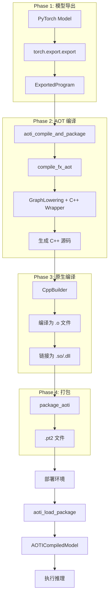

# PyTorch Inductor 源码解析（七）：AOTInductor

## 引言

AOTInductor（Ahead-Of-Time Inductor）是 PyTorch Inductor 的离线编译模式，支持将模型编译为独立的共享库（.so/.dll）或打包为 .pt2 格式文件。AOTInductor 的主要优势包括：

1. **离线编译**: 无需 PyTorch 运行时即可执行
2. **ABI 稳定性**: 编译产物在不同 PyTorch 版本间兼容
3. **部署友好**: 生成的共享库可直接集成到 C++ 应用
4. **序列化支持**: .pt2 格式支持多模型打包和权重嵌入

**源码位置**: 
- 编译入口：`torch/_inductor/__init__.py`
- 包管理：`torch/_inductor/package/`
- C++ 构建：`torch/_inductor/cpp_builder.py`

---

## 1. AOTInductor 架构概览

### 1.1 完整编译流程



### 1.2 使用方式对比

| 方式 | API | 输出 | 适用场景 |
|------|-----|------|----------|
| **即时编译** | `torch.compile()` | Python 可调用对象 | 开发调试 |
| **AOT 编译** | `aot_compile()` | .so/.dll 文件 | C++ 集成 |
| **AOT 打包** | `aoti_compile_and_package()` | .pt2 文件 | 生产部署 |

---

## 2. 编译入口 API

### 2.1 aoti_compile_and_package

**文件**: `torch/_inductor/__init__.py`

**文件**: `torch/_inductor/__init__.py:55-156`

```python
def aoti_compile_and_package(
    exported_program: ExportedProgram,
    _deprecated_unused_args=None,
    _deprecated_unused_kwargs=None,
    *,
    package_path: Optional[FileLike] = None,
    inductor_configs: Optional[dict[str, Any]] = None,
) -> str:
    """
    Compiles the exported program with AOTInductor, and packages it into a .pt2
    artifact specified by the input package_path.
    
    使用示例:
    
    .. code-block:: python
    
        ep = torch.export.export(M(), ...)
        aoti_file = torch._inductor.aoti_compile_and_package(
            ep, package_path="my_package.pt2"
        )
        compiled_model = torch._inductor.aoti_load_package("my_package.pt2")
    
    多模型打包:
    
    .. code-block:: python
    
        ep1 = torch.export.export(M1(), ...)
        aoti_file1 = torch._inductor.aot_compile(
            ep1, ..., options={"aot_inductor.package": True}
        )
        ep2 = torch.export.export(M2(), ...)
        aoti_file2 = torch._inductor.aot_compile(
            ep2, ..., options={"aot_inductor.package": True}
        )
    
        from torch._inductor.package import package_aoti, load_package
    
        package_aoti("my_package.pt2", {"model1": aoti_file1, "model2": aoti_file2})
    
        compiled_model1 = load_package("my_package.pt2", "model1")
        compiled_model2 = load_package("my_package.pt2", "model2")
    
    Args:
        exported_program: 通过 torch.export 导出的程序
        package_path: .pt2 文件的输出路径
        inductor_configs: Inductor 配置字典
    
    Returns:
        生成文件的路径
    """
    from torch.export import ExportedProgram
    from .debug import aot_inductor_minifier_wrapper

    # L111-112: 验证输入类型
    if not isinstance(exported_program, ExportedProgram):
        raise ValueError("Only ExportedProgram is supported")

    # L114-118: 检查 example_inputs 是否设置
    if exported_program.example_inputs is None:
        raise RuntimeError(
            "exported_program.example_inputs is required to be set in order "
            "for AOTInductor compilation."
        )

    # L126-139: 验证 package_path 格式
    assert (
        package_path is None
        or (
            isinstance(package_path, (io.IOBase, IO))
            and package_path.writable()
            and package_path.seekable()
        )
        or (
            isinstance(package_path, (str, os.PathLike))
            and os.fspath(package_path).endswith(".pt2")
        )
    ), (
        f"Expect package path to be a file ending in .pt2, is None, or is a buffer. "
        f"Instead got {package_path}"
    )

    # L141-142: 设置打包标志
    inductor_configs = inductor_configs or {}
    inductor_configs["aot_inductor.package"] = True

    # L144-148: 检查输出路径配置冲突
    if inductor_configs.get("aot_inductor.output_path"):
        raise RuntimeError(
            "Please pass in a package path to aot_inductor_compile() instead "
            "of setting the aot_inductor.output_path config."
        )

    # L150-156: 调用内部函数（带 minifier wrapper）
    return aot_inductor_minifier_wrapper(
        _aoti_compile_and_package_inner,
        exported_program,
        package_path=package_path,
        inductor_configs=inductor_configs,
    )
```

**关键点**:
- 第 111-112 行：仅支持 `ExportedProgram` 输入
- 第 114-118 行：`example_inputs` 是必需的（用于 shape 推导）
- 第 141-142 行：自动设置 `aot_inductor.package = True`
- 第 150-156 行：使用 `aot_inductor_minifier_wrapper` 包装（用于调试最小化）

### 2.2 内部编译函数

**文件**: `torch/_inductor/__init__.py:159-196`

```python
def _aoti_compile_and_package_inner(
    gm: torch.nn.Module,
    args: tuple[Any],
    kwargs: Optional[dict[str, Any]] = None,
    *,
    load_and_run: bool = False,
    check_accuracy: Optional[str] = None,
    package_path: Optional[Union[str, io.BytesIO]] = None,
    inductor_configs: Optional[dict[str, Any]] = None,
):
    """
    See docstring for aoti_compile_and_package.
    
    If `load_and_run` is True, this function will load the compiled model and run it.
    This is for the minifier to check the correctness of the compiled model.
    
    If `check_accuracy` is set, this function will check the accuracy of the compiled
    model against gm.
    """
    from .package import package_aoti

    assert isinstance(gm, torch.fx.GraphModule)

    kwargs = kwargs or {}

    # L194: 调用 aot_compile 生成 AOTI 文件
    aoti_files = aot_compile(gm, args, kwargs, options=inductor_configs)
    assert isinstance(aoti_files, list)

    # L197-206: 处理输出路径
    if package_path is None:
        path = [
            os.path.splitext(file)[0]
            for file in aoti_files
            if not file.endswith(".json")
        ][0]
    else:
        # L205-206: 打包为 .pt2 文件
        path = package_aoti(package_path, aoti_files)

    # L208-220: 如果启用 load_and_run，加载并测试
    if load_and_run:
        from .package import load_package

        compiled_model = load_package(path)
        # ... 运行测试

    return path
```

### 2.3 aoti_load_package

**文件**: `torch/_inductor/__init__.py:239-269`

```python
def aoti_load_package(
    path: FileLike, 
    run_single_threaded: bool = False, 
    device_index: int = -1
) -> AOTICompiledModel:
    """
    Loads the model from the PT2 package.
    
    如果打包了多个模型，此函数加载默认模型。
    要加载特定模型，直接使用 load_package API:
    
    .. code-block:: python
    
        from torch._inductor.package import load_package
    
        compiled_model1 = load_package("my_package.pt2", "model1")
        compiled_model2 = load_package("my_package.pt2", "model2")
    
    Args:
        path: .pt2 文件路径
        run_single_threaded: 是否单线程运行（避免与 CUDAGraphs 冲突）
        device_index: 设备索引（-1 表示默认 CUDA 设备）
    
    Returns:
        AOTICompiledModel 实例
    """
    from torch._inductor.package import load_package

    return load_package(
        path, 
        run_single_threaded=run_single_threaded, 
        device_index=device_index
    )
```

---

## 3. AOT 编译流程

### 3.1 compile_fx_aot

**文件**: `torch/_inductor/compile_fx.py`

**文件**: `torch/_inductor/compile_fx.py:1996-2060`

```python
def compile_fx_aot(
    model_: GraphModule,
    example_inputs_: list[InputType],
    inner_compile: _CompileFxCallable = compile_fx_inner,
    config_patches: Optional[dict[str, Any]] = None,
) -> Union[list[Union[str, Weights]], str, GraphModule]:
    """
    AOT 编译入口函数
    
    Args:
        model_: FX GraphModule
        example_inputs_: 示例输入列表
        inner_compile: 内部编译函数（默认 compile_fx_inner）
        config_patches: 配置补丁字典
    
    Returns:
        编译产物（.so 路径或文件列表）
    """
    assert isinstance(model_, GraphModule), model_

    # L2005: 展开 Tensor 子类参数
    unwrap_tensor_subclass_parameters(model_)

    # L2008: 深拷贝配置
    config_patches: dict[str, Any] = copy.deepcopy(config_patches or {})

    # L2010-2012: 设置 cpp_wrapper=True（AOT 默认使用 C++ wrapper）
    if not (config_patches.get("fx_wrapper", False) or config.fx_wrapper):
        config_patches["cpp_wrapper"] = True

    # L2014-2029: 处理输出路径
    output_path = config_patches.get(
        "aot_inductor.output_path", config.aot_inductor.output_path
    )

    if output_path:
        assert not output_path.endswith(".pt2"), (
            "The output path for aot_compile should not have an extension with .pt2 "
            "this is for specifying the output path for the .so in AOTInductor. "
            "If you would like to package the AOTInductor generated files "
            "into a pt2, please call `torch._inductor.aoti_compile_and_package`."
        )
    else:
        config_patches = {
            **config_patches,
            "aot_inductor.output_path": code_hash(model_.code),
        }

    # L2031-2033: 应用 standalone 配置
    from .utils import maybe_aoti_standalone_config
    config_patches = maybe_aoti_standalone_config(config_patches)

    # L2035-2056: 执行编译
    extern_node_serializer = config_patches.pop("extern_node_serializer", None)
    saved_compile_id = model_.meta.get("dynamo_compile_id", None)
    saved_compile_context = torch._guards.CompileContext(saved_compile_id)
    
    with (
        V.set_aot_compilation(True),  # L2039: 设置 AOT 编译标志
        torch._guards.compile_context(saved_compile_context),
        chromium_event_timed(
            "compile_fx_aot",
            log_pt2_compile_event=True,
            reset_event_log_on_exit=True,
        ),
        get_metrics_context(),
    ):
        compiled_artifacts = compile_fx(
            model_,
            example_inputs_,
            inner_compile=functools.partial(
                inner_compile,
                extern_node_serializer=extern_node_serializer,
            ),
            config_patches=config_patches,
        )

        # L2058-2060: 返回编译产物
        assert isinstance(compiled_artifacts, CompiledAOTI)
        return compiled_artifacts.filename
```

**关键点**:
- 第 2010-2012 行：AOT 编译默认启用 `cpp_wrapper=True`
- 第 2039 行：`V.set_aot_compilation(True)` 设置 AOT 编译标志
- 第 2058-2060 行：返回 `CompiledAOTI` 类型的编译产物

### 3.2 AOT 编译配置

```python
# AOTInductor 常用配置项
inductor_configs = {
    # 输出路径
    "aot_inductor.output_path": "/path/to/output.so",
    
    # 启用打包
    "aot_inductor.package": True,
    
    # 模型名称（用于生成文件）
    "aot_inductor.model_name_for_generated_files": "my_model",
    
    # C++ 后端配置
    "cpp_wrapper": True,
    
    # 启用 CUDAGraphs
    "triton.cudagraphs": True,
    
    # max-autotune 模式
    "max_autotune": True,
}
```

---

## 4. C++ 构建系统

### 4.1 CppBuilder 类

**文件**: `torch/_inductor/cpp_builder.py`

**文件**: `torch/_inductor/cpp_builder.py:1865-1960`

```python
class CppBuilder:
    """
    CppBuilder is a cpp jit builder, supports Windows, Linux and MacOS.
    
    Args:
        name: 
            1. 构建目标名称，最终文件会自动添加扩展名
            2. 支持跨平台（Windows/Linux/MacOS）
        sources:
            源文件列表
        BuildOption:
            构建选项
        output_dir:
            输出目录（默认为当前目录）
    """

    @staticmethod
    def __get_python_module_flags() -> tuple[str, str]:
        """获取 Python 模块编译标志"""
        extension = ".pyd" if _IS_WINDOWS else ".so"
        output_flags = "/Fe" if _IS_WINDOWS else "-o"
        return extension, output_flags

    @staticmethod
    def __get_object_flags() -> tuple[str, str]:
        """获取目标文件编译标志"""
        extension = ".obj" if _IS_WINDOWS else ".o"
        output_flags = "/c /Fo" if _IS_WINDOWS else "-c -o"
        return extension, output_flags

    @staticmethod
    def __get_precompiled_header_flags() -> tuple[str, str]:
        """获取预编译头标志"""
        extension = ".pch" if _IS_WINDOWS or not is_gcc() else ".gch"
        output_flags = "/Fp" if _IS_WINDOWS else "-o"
        return extension, output_flags

    @staticmethod
    def __get_preprocessor_output_flags() -> tuple[str, str]:
        """获取预处理器输出标志"""
        extension = ".i"
        output_flags = "/EP /P" if _IS_WINDOWS else "-E -P -o"
        return extension, output_flags

    def __init__(
        self,
        name: str,
        sources: Union[str, list[str]],
        BuildOption: BuildOptionsBase,
        output_dir: str = "",
    ) -> None:
        # L1913-1920: 初始化编译标志
        self._compiler = ""
        self._cflags_args = ""  # C 编译标志
        self._definitions_args = ""  # 宏定义
        self._include_dirs_args = ""  # 包含目录
        self._ldflags_args = ""  # 链接标志
        self._libraries_dirs_args = ""  # 库目录
        self._libraries_args = ""  # 库文件
        self._passthrough_parameters_args = ""  # 透传参数

        # L1923-1925: 路径管理
        self._orig_source_paths = []
        self._output_dir = ""
        self._target_file = ""

        # L1927-1929: 编译模式
        self._use_relative_path: bool = False
        self._aot_mode: bool = True  # AOT 模式

        self._name = name
        self._target_name = (
            config.aot_inductor.model_name_for_generated_files or "aoti_model"
        )

        # L1936-1950: 构建选项解析
        self._build_option = BuildOption
        self._compiler = BuildOption.get_compiler()
        self._use_relative_path = BuildOption.get_use_relative_path()
        self._aot_mode = BuildOption.get_aot_mode()

        self._output_dir = output_dir
        self._compile_only = BuildOption.get_compile_only()
        self._precompiling = BuildOption.get_precompiling()
        self._preprocessing = BuildOption.get_preprocessing()
        
        # L1947: 三种模式互斥
        assert sum((self._compile_only, self._precompiling, self._preprocessing)) <= 1
        
        self._do_link = not (
            self._compile_only or self._precompiling or self._preprocessing
        )
```

### 4.2 编译流程 (package/package.py)

**文件**: `torch/_inductor/package/package.py:23-79`

```python
def compile_so(aoti_dir: str, aoti_files: list[str], so_path: str) -> str:
    """
    编译 AOTI 生成的文件为共享库
    
    步骤:
    1. 找到 .cpp 源文件和 .o 常量文件
    2. 解析编译标志并构建 .o 文件
    3. 解析链接标志并构建 .so 文件
    4. 附加权重数据（如果有）
    """
    def get_aoti_file_with_suffix(suffix: str) -> str:
        for file in aoti_files:
            if file.endswith(suffix):
                return file
        raise RuntimeError(f"Unable to find file with suffix {suffix}")

    # L31-32: 获取源文件和常量文件
    cpp_file = os.path.join(aoti_dir, get_aoti_file_with_suffix(".cpp"))
    consts_o = os.path.join(aoti_dir, get_aoti_file_with_suffix(".o"))

    file_name = os.path.splitext(cpp_file)[0]

    # L36-49: 编译 .cpp 为 .o
    with open(file_name + "_compile_flags.json") as f:
        compile_flags = json.load(f)

    compile_options = BuildOptionsBase(
        **compile_flags, use_relative_path=config.is_fbcode()
    )
    object_builder = CppBuilder(
        name=file_name,
        sources=cpp_file,
        BuildOption=compile_options,
    )
    output_o = object_builder.get_target_file_path()
    object_builder.build()

    # L51-65: 链接 .o 为 .so
    with open(file_name + "_linker_flags.json") as f:
        linker_flags = json.load(f)

    linker_options = BuildOptionsBase(
        **linker_flags, use_relative_path=config.is_fbcode()
    )
    so_builder = CppBuilder(
        name=os.path.split(so_path)[-1],
        sources=[output_o, consts_o],
        BuildOption=linker_options,
        output_dir=so_path,
    )
    output_so = so_builder.get_target_file_path()
    so_builder.build()

    # L67-77: 附加权重数据（mmapped weights）
    serialized_weights_filename = file_name + "_serialized_weights.bin"
    if serialized_weights_filename in aoti_files:
        with open(serialized_weights_filename, "rb") as f_weights:
            serialized_weights = f_weights.read()

        with open(output_so, "a+b") as f_so:
            so_size = f_so.tell()
            # L75-76: 页对齐权重（16KB 对齐）
            f_so.write(b" " * (16384 - so_size % 16384))
            f_so.write(serialized_weights)

    return output_so
```

**关键点**:
- 第 31-32 行：分离 .cpp 源文件和 .o 常量文件
- 第 36-49 行：使用 `CppBuilder` 编译源文件
- 第 51-65 行：链接目标文件和常量文件
- 第 67-77 行：将序列化权重附加到 .so 文件末尾（16KB 对齐）

---

## 5. 打包系统

### 5.1 package_aoti

**文件**: `torch/_inductor/package/package.py:82-99`

```python
def package_aoti(
    archive_file: FileLike,
    aoti_files: AOTI_FILES,
) -> FileLike:
    """
    Saves the AOTInductor generated files to the PT2Archive format.
    
    Args:
        archive_file: 保存包的文件名
        aoti_files: 可以是:
            - 包含 AOTInductor 文件的目录路径
            - 字典映射模型名称到其 AOTInductor 文件路径
    
    支持的 AOTI 文件类型:
        - .cpp: 生成的 C++ 源码
        - .h: 头文件
        - .o: 编译的目标文件
        - _compile_flags.json: 编译标志
        - _linker_flags.json: 链接标志
        - _serialized_weights.bin: 序列化权重（可选）
    """
    return package_pt2(
        archive_file,
        aoti_files=aoti_files,
    )
```

### 5.2 load_package

**文件**: `torch/_inductor/package/package.py:102-138`

```python
def load_package(
    path: FileLike,
    model_name: str = "model",
    run_single_threaded: bool = False,
    num_runners: int = 1,
    device_index: int = -1,
) -> AOTICompiledModel:
    """
    从 PT2 包加载模型
    
    Args:
        path: .pt2 文件路径
        model_name: 模型名称（多模型打包时使用）
        run_single_threaded: 单线程运行（避免与 CUDAGraphs 冲突）
        num_runners: 运行器数量
        device_index: 设备索引（-1 表示默认）
    
    Returns:
        AOTICompiledModel 实例
    """
    try:
        # L110-118: 尝试使用新的 PT2 加载器
        pt2_contents = load_pt2(
            path,
            run_single_threaded=run_single_threaded,
            num_runners=num_runners,
            device_index=device_index,
        )
        if model_name not in pt2_contents.aoti_runners:
            raise RuntimeError(f"Model {model_name} not found in package")
        return pt2_contents.aoti_runners[model_name]
    except RuntimeError:
        log.warning("Loading outdated pt2 file. Please regenerate your package.")

    # L122-138: 回退到旧版加载器
    if isinstance(path, (io.IOBase, IO)):
        with tempfile.NamedTemporaryFile(suffix=".pt2") as f:
            path.seek(0)
            f.write(path.read())
            loader = torch._C._aoti.AOTIModelPackageLoader(
                f.name, model_name, run_single_threaded, num_runners, device_index
            )
            return AOTICompiledModel(loader)

    path = os.fspath(path)
    loader = torch._C._aoti.AOTIModelPackageLoader(
        path, model_name, run_single_threaded, num_runners, device_index
    )
    return AOTICompiledModel(loader)
```

---

## 6. .pt2 文件格式

### 6.1 文件结构

```
my_package.pt2 (ZIP 格式)
├── model/
│   ├── aoti_model.cpp           # C++ 源码
│   ├── aoti_model.h             # 头文件
│   ├── aoti_model_compile_flags.json  # 编译标志
│   ├── aoti_model_linker_flags.json   # 链接标志
│   ├── aoti_model_constants.o   # 常量目标文件
│   └── aoti_model_serialized_weights.bin  # 序列化权重（可选）
├── metadata.json                # 元数据
└── __manifest__                 # 文件清单
```

### 6.2 元数据内容

```json
{
    "model_name": "my_model",
    "pytorch_version": "2.6.0.dev",
    "inductor_version": "2.6.0",
    "compile_time": "2024-01-15T10:30:00Z",
    "device": "cuda",
    "compute_capability": "8.0",
    "input_specs": [...],
    "output_specs": [...]
}
```

---

## 7. 使用示例

### 7.1 基本使用

```python
import torch
import torch._inductor

# 1. 导出模型
class MyModel(torch.nn.Module):
    def forward(self, x):
        return torch.relu(x @ self.weight)

model = MyModel()
model.weight = torch.nn.Parameter(torch.randn(100, 100))
example_input = torch.randn(32, 100)

# 2. 导出为 ExportedProgram
ep = torch.export.export(model, (example_input,))

# 3. 编译并打包
aoti_file = torch._inductor.aoti_compile_and_package(
    ep,
    package_path="my_model.pt2",
    inductor_configs={
        "max_autotune": True,
        "triton.cudagraphs": True,
    }
)

# 4. 加载并运行
compiled_model = torch._inductor.aoti_load_package("my_model.pt2")
output = compiled_model(example_input)
```

### 7.2 多模型打包

```python
from torch._inductor.package import package_aoti, load_package

# 编译多个模型
ep1 = torch.export.export(Model1(), (input1,))
ep2 = torch.export.export(Model2(), (input2,))

aoti_file1 = torch._inductor.aot_compile(
    ep1, 
    options={"aot_inductor.package": True}
)
aoti_file2 = torch._inductor.aot_compile(
    ep2, 
    options={"aot_inductor.package": True}
)

# 打包到同一文件
package_aoti("multi_model.pt2", {
    "model1": aoti_file1,
    "model2": aoti_file2
})

# 分别加载
compiled_model1 = load_package("multi_model.pt2", "model1")
compiled_model2 = load_package("multi_model.pt2", "model2")
```

### 7.3 C++ 部署

```cpp
// C++ 使用示例
#include <torch/csrc/inductor/aoti_runner/model_container_runner_cpu.h>

int main() {
    // 加载模型
    auto container = torch::aoti::AOTIModelContainerRunnerCpu("my_model.pt2");
    
    // 准备输入
    std::vector<at::Tensor> inputs;
    inputs.push_back(torch::randn({32, 100}));
    
    // 执行推理
    auto outputs = container.run(inputs);
    
    return 0;
}
```

---

## 8. 配置项

### 8.1 AOTInductor 专用配置

```python
import torch._inductor.config as config

# ===== 输出配置 =====

# 输出路径（.so 文件）
config.aot_indductor.output_path = "/path/to/output.so"

# 模型名称（用于生成文件）
config.aot_inductor.model_name_for_generated_files = "my_model"

# 启用打包
config.aot_inductor.package = True

# ===== 编译配置 =====

# C++ wrapper（AOT 默认启用）
config.cpp_wrapper = True

# FX wrapper（与 cpp_wrapper 互斥）
config.fx_wrapper = False

# ===== 性能配置 =====

# max-autotune 模式
config.max_autotune = True

# CUDAGraphs
config.triton.cudagraphs = True

# ===== 调试配置 =====

# 保留中间文件
config.aot_inductor.keep_intermediate = True

# 输出编译日志
config.verbose = True
```

---

## 9. 源码阅读指南

### 9.1 核心文件索引

| 文件 | 行号范围 | 内容 |
|------|----------|------|
| `__init__.py` | L55-156 | `aoti_compile_and_package` 入口 |
| `__init__.py` | L159-196 | `_aoti_compile_and_package_inner` |
| `__init__.py` | L239-269 | `aoti_load_package` |
| `compile_fx.py` | L1996-2060 | `compile_fx_aot` |
| `package/package.py` | L23-79 | `compile_so` C++ 编译 |
| `package/package.py` | L82-99 | `package_aoti` 打包 |
| `package/package.py` | L102-138 | `load_package` 加载 |
| `cpp_builder.py` | L1865-1960 | `CppBuilder` 类 |

### 9.2 推荐阅读顺序

```
1. torch/_inductor/__init__.py (API 入口)
2. torch/_inductor/compile_fx.py (AOT 编译流程)
3. torch/_inductor/package/package.py (打包和加载)
4. torch/_inductor/cpp_builder.py (C++ 构建)
```

---

## 10. 总结

本章详细介绍了 PyTorch AOTInductor 的架构和使用：

1. **编译模式**: 支持即时编译、AOT 编译、AOT 打包三种模式
2. **API 设计**: `aoti_compile_and_package` 和 `aoti_load_package` 简洁易用
3. **编译流程**: ExportedProgram → C++ 源码 → .so 编译 → .pt2 打包
4. **C++ 构建**: `CppBuilder` 跨平台支持（Windows/Linux/MacOS）
5. **打包格式**: .pt2 基于 ZIP，支持多模型和权重嵌入
6. **部署场景**: Python 推理、C++ 集成、生产部署

AOTInductor 是 PyTorch 生产部署的关键工具，通过离线编译生成独立的二进制文件，实现与 PyTorch 运行时的解耦。

---

**下一篇**: [PyTorch Inductor 源码解析（八）：性能优化技术](./08-performance.md)
