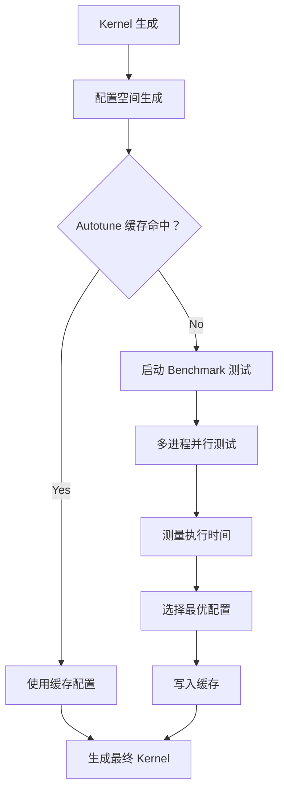

# PyTorch Inductor 源码解析（九）：max-autotune 深度解析

## 引言

`max-autotune` 是 PyTorch Inductor 的最激进性能优化模式，通过 exhaustive search（穷举搜索）找到最优的 Kernel 配置组合。本章深入分析 max-autotune 的工作原理、配置空间生成、多进程调优和缓存机制。

**源码位置**: 
- 配置生成：`torch/_inductor/choices.py`
- 坐标下降调优：`torch/_inductor/runtime/coordinate_descent_tuner.py`
- 多进程调优：`torch/_inductor/autotune_process.py`
- 缓存系统：`torch/_inductor/runtime/autotune_cache.py`
- Triton 启发式：`torch/_inductor/runtime/triton_heuristics.py`

---

## 1. max-autotune 概述

### 1.1 三种编译模式对比

| 模式 | 编译速度 | 运行性能 | 适用场景 |
|------|----------|----------|----------|
| **default** | 快 | 良好 | 开发调试 |
| **reduce-overhead** | 中 | 好 | 减少 CUDA 启动开销 |
| **max-autotune** | 慢 | 最佳 | 生产部署 |
| **max-autotune-no-cudagraphs** | 慢 | 最佳 | 不支持 CUDAGraphs 的场景 |

### 1.2 启用方式

```python
import torch

# 方式 1：使用 mode 参数（推荐）
model = torch.compile(MyModel(), mode="max-autotune")

# 方式 2：使用配置项
import torch._inductor.config as config
config.max_autotune = True

# 方式 3：环境变量（无需修改代码）
# TORCH_COMPILE_MODE=max-autotune python train.py
```

### 1.3 max-autotune 工作流程



---

## 2. 配置空间生成

### 2.1 InductorChoices 类

**文件**: `torch/_inductor/choices.py`

**文件**: `torch/_inductor/choices.py:85-240`

```python
class InductorChoices:
    """
    This class contains a collection of default heuristics that effect performance 
    of our generated code.
    
    你可以通过继承此类来覆盖默认启发式：
    
        class MyHeuristics(InductorChoices):
            ...
        
        torch._inductor.virtualized.V.set_choices_handler(MyHeuristics())
    """
    
    def get_config_heuristics(
        self, device_type: Optional[str] = "cuda"
    ) -> BaseConfigHeuristic:
        """
        根据设备类型获取配置启发式
        
        Returns:
            设备特定的启发式对象
        """
        if device_type == "cuda":
            if torch.version.hip is None:
                return CUDAConfigHeuristic()  # NVIDIA GPU
            else:
                return ROCmConfigHeuristic()  # AMD GPU
        elif device_type == "xpu":
            return XPUConfigHeuristic()  # Intel GPU
        elif device_type == "cpu":
            return CPUConfigHeuristic()  # CPU
        elif device_type == "mtia":
            return MTIAConfigHeuristic()  # MTIA
        else:
            return BaseConfigHeuristic()

    def get_conv_configs(
        self, device_type: Optional[str] = "cuda"
    ) -> partial[Generator[TritonConfig, None, None]]:
        """获取卷积操作的配置生成器"""
        conv_heuristics = self.get_config_heuristics(device_type)
        return conv_heuristics.get_conv_configs()

    def get_flex_attention_fwd_configs(
        self, head_dim: int, dtype: torch.dtype, device_type: Optional[str] = "cuda"
    ) -> list[Any]:
        """获取 Flex Attention 前向传播配置"""
        flex_heuristics = self.get_config_heuristics(device_type)
        return flex_heuristics.get_flex_attn_fwd_configs(head_dim, dtype)

    def get_flex_attention_bwd_configs(
        self, head_dim: int, dtype: torch.dtype, device_type: Optional[str] = "cuda"
    ) -> list[Any]:
        """获取 Flex Attention 反向传播配置"""
        flex_heuristics = self.get_config_heuristics(device_type)
        return flex_heuristics.get_flex_attn_bwd_configs(head_dim, dtype)
```

### 2.2 GEMM 配置空间示例

```python
# 简化示例：GEMM 配置空间生成
def get_gemm_configs():
    """
    生成矩阵乘法的所有可能配置组合
    
    配置维度:
    - BLOCK_M: [16, 32, 64, 128, 256]
    - BLOCK_N: [16, 32, 64, 128, 256]
    - BLOCK_K: [32, 64, 128, 256]
    - num_warps: [4, 8]
    - num_stages: [2, 3, 4, 5]
    
    总组合数：5 × 5 × 4 × 2 × 4 = 800 种
    """
    for BLOCK_M in [16, 32, 64, 128, 256]:
        for BLOCK_N in [16, 32, 64, 128, 256]:
            for BLOCK_K in [32, 64, 128, 256]:
                for num_warps in [4, 8]:
                    for num_stages in [2, 3, 4, 5]:
                        yield Config({
                            'BLOCK_M': BLOCK_M,
                            'BLOCK_N': BLOCK_N,
                            'BLOCK_K': BLOCK_K,
                        }, num_warps=num_warps, num_stages=num_stages)
```

### 2.3 调优参数维度

```
BLOCK_M, BLOCK_N, BLOCK_K   → 矩阵分块大小
num_warps                   → Warp 数量 (4, 8, 16)
num_stages                  → 流水线级数 (2-7)
split_k                     → Split-K 分块数
waves_per_eu                → AMD GPU 特有参数
```

---

## 3. 坐标下降调优 (Coordinate Descent Tuning)

### 3.1 CoordescTuner 类

**文件**: `torch/_inductor/runtime/coordinate_descent_tuner.py`

**文件**: `torch/_inductor/runtime/coordinate_descent_tuner.py:42-249`

```python
class CoordescTuner:
    """
    The coordinate descent tuner. Tune one field/coordinate at a time.
    
    坐标下降调优器：每次只调优一个字段/坐标
    
    TODO: 是否需要同时调优多个字段
    TODO: 如果增加和减少某个字段都能提升性能怎么办（存在多个局部最优）
    """
    
    def __init__(
        self,
        is_mm=False,
        is_native_matmul=False,
        is_mix_order_reduction=False,
        name="unknown",
        size_hints=None,
        inductor_meta=None,
        frozen_fields=None,
    ):
        self.is_mm = is_mm  # 矩阵乘法需要调优 num_stages
        
        # L65-69: Native matmul 限制 ZBLOCK=1
        # Native matmul 代码生成假设 ZBLOCK=1
        # 因为 3D tl.dot 较慢，我们只想在 y 和 x 方向分块
        # tl.dot 也不支持小于 16 的尺寸
        self.is_native_matmul = is_native_matmul
        assert not (self.is_mm and self.is_native_matmul)
        
        self.is_mix_order_reduction = is_mix_order_reduction
        self.cached_benchmark_results = {}  # Benchmark 结果缓存
        self.name = name
        self.size_hints = size_hints
        self.inductor_meta = inductor_meta or {}
        
        # L75-77: 冻结字段（不参与调优）
        self.frozen_fields: OrderedSet[str] = (
            OrderedSet(frozen_fields) if frozen_fields is not None else OrderedSet()
        )

    def get_config_max(self, prefix: str) -> int:
        """获取配置项的最大值"""
        max_block = TRITON_MAX_BLOCK[prefix.upper()]
        size_hint = self.size_hints.get(prefix) if self.size_hints is not None else None
        return min(max_block, size_hint) if size_hint is not None else max_block

    def get_warpsmax(self):
        """获取最大 warp 数量"""
        warp_size = self.inductor_meta.get("warp_size")
        max_threads_per_block = self.inductor_meta.get("max_threads_per_block")
        if warp_size and max_threads_per_block:
            return max_threads_per_block // warp_size
        else:
            return get_max_numwarps()

    def cache_benchmark_result(self, config, timing):
        """缓存 Benchmark 结果"""
        self.cached_benchmark_results[triton_config_to_hashable(config)] = timing

    def lookup_in_cache(self, config):
        """在缓存中查找 Benchmark 结果"""
        return self.cached_benchmark_results.get(triton_config_to_hashable(config))

    def call_func(self, func, config):
        """调用函数（带缓存）"""
        found = self.lookup_in_cache(config)
        if found is not None:
            log.debug("  CACHED")
            return found
        timing = func(config)
        self.cache_benchmark_result(config, timing)
        return timing

    @property
    def tunable_fields(self):
        """
        可调优字段列表
        
        Returns:
            可调优字段名称列表
        """
        out = [
            "XBLOCK",
            "YBLOCK",
            "ZBLOCK",
            # NOTE: 不应该为 persistent reduction 调优 R0_BLOCK
            # 我们依赖 persistent reduction 的 triton.Config
            # 不包含 R0_BLOCK 字段来保证这一点
            "R0_BLOCK",
            "R1_BLOCK",
            # 以下是矩阵乘法特有
            "BLOCK_M",
            "BLOCK_N",
            "BLOCK_K",
            "num_warps",
        ]
        
        # L125-126: 矩阵乘法添加 num_stages
        if self.is_mm:
            out.append("num_stages")
        
        # L127-128: AMD GPU 添加 waves_per_eu
        if self.inductor_meta.get("is_hip") is True:
            out.append("waves_per_eu")
        
        # L129-131: Native matmul 添加 num_stages，移除 ZBLOCK
        if self.is_native_matmul:
            out.append("num_stages")
            out.remove("ZBLOCK")  # ZBLOCK=1 always in native matmul

        # L133-137: 混合顺序归约添加 NUM_STAGES
        if self.is_mix_order_reduction:
            # 与 TritonConfig.num_stages 不同
            # 这个放在 TritonConfig.kwargs["NUM_STAGES"] 中
            # 用于控制 tl.range 的流水线级数
            out.append("NUM_STAGES")

        # L139: 移除冻结字段
        return [f for f in out if f not in self.frozen_fields]

    def value_too_large(self, name: str, val: int) -> bool:
        """判断值是否太大"""
        block_suffix = "BLOCK"
        if name.endswith(block_suffix):
            prefix = name.strip(block_suffix).lower()
            return val > self.get_config_max(prefix)
        if name == "num_warps":
            return val > self.get_warpsmax()
        if name == "waves_per_eu":
            return val > 8
        return False

    def value_too_small(self, name: str, val: int) -> bool:
        """判断值是否太小"""
        # L154-157: Native matmul block size >= 16 (tl.dot 要求)
        if self.is_native_matmul:
            if name in ["YBLOCK", "XBLOCK", "R0_BLOCK"]:
                return val < 16
        # L159-160: 值不能为 0 或负数
        return val <= 0

    def get_neighbour_values(self, name, orig_val, radius=None, include_self=False):
        """
        获取邻域值（radius 步内）
        
        原始值不作为其自身的邻域返回（除非 include_self=True）
        """
        if radius is None:
            radius = 1
        
        # L169-173: NUM_STAGES 特殊处理（需要更大搜索半径）
        if name == "NUM_STAGES":
            # 我们发现 NUM_STAGES=1 有时比 NUM_STAGES=2 好
            # 但 NUM_STAGES=1 又比 NUM_STAGES=3 差
            radius = max(radius, 2)

        assert radius >= 1

        def update(cur_val, inc=True):
            """更新函数"""
            if name in ["num_stages", "NUM_STAGES"]:
                if inc:
                    return cur_val + 1
                else:
                    return cur_val - 1
            else:
                # BLOCK 大小按 2 倍缩放
                if inc:
                    return cur_val * 2
                else:
                    return cur_val // 2

        out = []
        
        # L190-196: 递增循环
        cur_val = orig_val
        for _ in range(radius):
            cur_val = update(cur_val, True)
            if self.value_too_large(name, cur_val):
                break
            out.append(cur_val)

        # L198-204: 递减循环
        cur_val = orig_val
        for _ in range(radius):
            cur_val = update(cur_val, False)
            if self.value_too_small(name, cur_val):
                break
            out.append(cur_val)

        if include_self:
            out.append(orig_val)
        return out

    @staticmethod
    def has_improvement(baseline, test):
        """
        判断是否有性能提升
        
        阈值：0.1% (test < baseline * 0.999)
        """
        threshold = 0.001  # 0.1%
        return test is not None and test < baseline * (1 - threshold)

    def check_all_tuning_directions(
        self,
        func: Callable[["triton.Config"], float],
        best_config,
        best_timing,
    ):
        """
        检查所有调优方向
        
        仅当常规坐标下降调优找不到更好选择时才执行
        我们只有少量可调优字段，所以这应该是可行的
        """
        candidate_values_list = []
        effective_fields = []
        
        # L238-248: 为每个字段生成候选值
        for field in self.tunable_fields:
            old_value = get_field(best_config, field)
            if old_value is None:
                continue
            radius = self.inductor_meta.get("coordinate_descent_search_radius", 1)
            candidate_values = self.get_neighbour_values(
                field,
                old_value,
                radius=radius,
                include_self=True,
            )
            candidate_values_list.append(candidate_values)
            effective_fields.append(field)
        
        # 尝试所有组合
        for values in itertools.product(*candidate_values_list):
            new_config = copy.deepcopy(best_config)
            for field, value in zip(effective_fields, values):
                set_field(new_config, field, value)
            
            if not self.is_valid_config(new_config):
                continue
            
            timing = self.call_func(func, new_config)
            if self.has_improvement(best_timing, timing):
                best_config = new_config
                best_timing = timing
        
        return best_config, best_timing
```

### 3.2 坐标下降算法流程


**适用场景**:
- 配置空间 > 1000 种组合
- 时间预算有限
- 接近最优解即可接受

---

## 4. 多进程调优架构

### 4.1 TuningProcess 类

**文件**: `torch/_inductor/autotune_process.py`

**文件**: `torch/_inductor/autotune_process.py:77-251`

```python
class TuningProcess:
    """
    Class to launch and interact with a benchmarking subprocess.
    
    启动并与 Benchmark 子进程交互的类
    """
    
    @staticmethod
    def process_main(read_pipe: IO[bytes], write_pipe: IO[bytes]) -> None:
        """
        Entry point for the child process.
        
        子进程入口点
        """
        autotuning_log.debug(
            "Started autotune subprocess %s. Visible devices: %s",
            os.getpid(),
            os.environ.get(CUDA_VISIBLE_DEVICES),
        )

        def workloop():
            while True:
                job, extra_env = TuningProcess.recv(read_pipe)
                if job is None:
                    # None is a sentinel for the child to shut down
                    break
                try:
                    if extra_env:
                        os.environ.update(extra_env)
                    result = job()
                except Exception as e:
                    result = e  # 返回异常对象给父进程
                TuningProcess.send(result, write_pipe)

        try:
            workloop()
        except EOFError:
            # The parent closed the pipe
            pass

    @staticmethod
    def send(
        obj: Any, write_pipe: IO[bytes], extra_env: dict[str, str] | None = None
    ) -> None:
        """发送对象到管道"""
        pickle.dump((obj, extra_env), write_pipe)
        write_pipe.flush()

    @staticmethod
    def recv(read_pipe: IO[bytes]) -> Any:
        """从管道接收对象"""
        return pickle.load(read_pipe)

    def __init__(self, device: Optional[int]):
        self.device = device
        self.start()

    def start(self):
        """
        Start the benchmarking subprocess.
        """
        entry = os.path.join(os.path.dirname(__file__), "__autotune_main__.py")

        subproc_read_fd, write_fd = os.pipe()
        read_fd, subproc_write_fd = os.pipe()
        self.write_pipe = os.fdopen(write_fd, "wb")
        self.read_pipe = os.fdopen(read_fd, "rb")

        self.selector = selectors.DefaultSelector()
        self.selector.register(self.read_pipe, selectors.EVENT_READ)

        # L142-148: 构建子进程命令
        cmd = [
            sys.executable,
            entry,
            f"--parent={os.getpid()}",
            f"--read-fd={str(subproc_read_fd)}",
            f"--write-fd={str(subproc_write_fd)}",
        ]
        
        # L149-162: 设置环境变量
        env = {
            **python_subprocess_env(),
            # L153: 禁用 Triton 异步编译池
            "TORCH_WARM_POOL": "0",
            # L155: 设置 LD_LIBRARY_PATH
            "LD_LIBRARY_PATH": get_ld_library_path(),
            # L157-159: 启用带宽分析（可选）
            "TORCHINDUCTOR_PROFILE_WITH_DO_BENCH_USING_PROFILING": "1"
            if config.profile_bandwidth_with_do_bench_using_profiling
            else "0",
        }
        if self.device is not None:
            env[CUDA_VISIBLE_DEVICES] = str(self.device)
        
        # L163-169: 启动子进程
        self.process = subprocess.Popen(
            cmd,
            env=env,
            pass_fds=(subproc_read_fd, subproc_write_fd),
        )
        os.close(subproc_read_fd)
        os.close(subproc_write_fd)

        self.running = True

    def alive(self) -> bool:
        """True if the subprocess is still running"""
        return self.running and self.process.poll() is None

    def put(self, req: Any, extra_env: dict[str, str] | None = None) -> None:
        """Push a work item to the child process"""
        if not self.alive():
            self.start()
        TuningProcess.send(req, self.write_pipe, extra_env=extra_env)

    def get(self, timeout: float = 120.0) -> Any:
        """
        Get a response from the child process.
        
        Raises:
            TimeoutError: 超时（默认 120 秒）
            EOFError: 子进程崩溃
        """
        try:
            if not self.selector.select(timeout):
                raise TimeoutError(
                    f"Timeout in autotune subprocess {self.process.pid}"
                )
            result, _ = TuningProcess.recv(self.read_pipe)
        except TimeoutError:
            self.kill()
            raise
        except EOFError:
            self.close()
            raise
        except Exception:
            autotuning_log.exception(
                "Unexpected exception in autotune subprocess %s", self.process.pid
            )
            self.kill()
            raise

        if isinstance(result, Exception):
            raise result
        return result

    def shutdown(self, wait: bool = True) -> None:
        """Signal the child process to shut down gracefully"""
        if self.alive():
            TuningProcess.send(None, self.write_pipe)  # None 是关闭信号
        if wait:
            self.wait()

    def kill(self) -> None:
        """Send a SIGKILL to the child process"""
        if self.alive():
            autotuning_log.error(
                "Sending SIGKILL to autotune subprocess %d",
                self.process.pid,
            )
            self.process.kill()
        self.close()
```

### 4.2 TuningProcessPool 类

**文件**: `torch/_inductor/autotune_process.py:260+`

```python
class TuningProcessPool:
    """
    Maintains a pool of TuningProcesses to benchmark kernels in parallel
    across devices.
    
    维护 TuningProcess 池，跨设备并行 Benchmark Kernel
    
    默认情况下，每个设备创建一个 TuningProcess，
    并设置子进程环境使其只能看到该设备
    """
    
    def __init__(self) -> None:
        """
        Start the child processes.
        """
        devices = self.get_device_list()
        autotuning_log.debug("Sub-process autotune device list: %s", devices)

        # L275: 为每个设备启动子进程
        self.processes = [TuningProcess(device=device) for device in devices]

        # L277-279: 填充进程队列
        self.process_queue: queue.Queue[TuningProcess] = queue.Queue()
        for p in self.processes:
            self.process_queue.put(p)

        # L282-284: 使用线程池管理工作分配
        # 线程数与设备数匹配
        self.executor = ThreadPoolExecutor(max_workers=len(devices))

    @staticmethod
    def get_device_list() -> Sequence[Optional[int]]:
        """
        Gather the list of devices to be used in the pool.
        """
        if not config.autotune_multi_device:
            # Don't use multiple devices
            return [None]

        gpu_type = get_gpu_type()
        device_interface = get_interface_for_device(gpu_type)
        count = device_interface.device_count()
        
        # 如果用户在环境中指定了可见设备，使用这些
        # ...
```

### 4.3 多进程调优架构

```mermaid
graph TB
    subgraph "主进程"
        A[编译任务] --> B[配置队列]
        B --> C[结果收集]
    end
    
    subgraph "Worker 进程池"
        D[Worker 1 (GPU 0)] --> E[加载 Kernel]
        E --> F[执行 Benchmark]
        F --> G[返回时间]
    end
    
    subgraph "Worker 进程池"
        H[Worker 2 (GPU 1)] --> I[加载 Kernel]
        I --> J[执行 Benchmark]
        J --> K[返回时间]
    end
    
    B --> D
    B --> H
    C --> D
    C --> H
```

**关键设计**:
1. **进程隔离**: 每个 worker 独占 GPU，避免上下文切换
2. **环境变量继承**: `CUDA_VISIBLE_DEVICES` 正确传递
3. **超时处理**: 防止单个配置卡死（默认 120 秒）
4. **结果缓存**: 避免重复测试

---

## 5. Autotune 缓存机制

### 5.1 AutotuneCache 类

**文件**: `torch/_inductor/runtime/autotune_cache.py`

```python
"""
PyTorch Inductor Autotuning Cache System

本模块实现了 PyTorch Inductor 编译器中的 autotuning 配置缓存系统。
它提供了存储和检索最优 Kernel 配置的机制，
通过重用之前发现的最优参数显著加速编译。

缓存系统包括:
- 本地文件系统缓存（单机重用）
- 远程缓存（跨机器共享优化）
- Bundled 缓存（高效存储多个相关配置）
- 基于 PyTorch 版本和后端变化的缓存失效
- 序列化/反序列化支持（用于 worker 进程）

关键组件:
- AutotuneCache: 管理缓存访问和存储的主类
- AutotuneCacheBundler: Bundles 多个缓存条目用于高效存储
- LocalAutotuneCache: 处理基于文件系统的缓存
- _LocalAutotuneCacheBackend: 缓存存储的底层文件操作
- AutotuneCacheArtifact: 与 PyTorch artifact 系统集成

此缓存系统对性能至关重要，因为它消除了
在多次编译相同 Kernel 时重新运行昂贵 autotuning 操作的需求
"""
```

### 5.2 缓存键生成

```python
# 缓存键生成
cache_key = (
    kernel_hash,        # Kernel 源码哈希
    config_hash,        # 配置参数哈希
    device_capability,  # GPU Compute Capability
    dtype,              # 数据类型
)
```

### 5.3 缓存策略

| 策略 | 说明 |
|------|------|
| **本地缓存** | `~/.cache/torchinductor/` 存储最佳配置 |
| **远程缓存** | 企业环境可配置共享缓存服务器 |
| **缓存失效** | Triton 版本变化、Kernel 源码变化时失效 |

### 5.4 缓存检查流程

**文件**: `torch/_inductor/runtime/triton_heuristics.py:264-310`

```python
def check_autotune_cache(
    configs: list[Config], filename: str | None, inductor_meta: dict[str, Any]
) -> tuple[list[Config], AutotuneCache | None, dict[str, Any]]:
    """
    Given a list of configs, checks autotune cache and return metadata
    
    Args:
        configs: 配置列表
        filename: 文件名
        inductor_meta: Inductor 元数据
    
    Returns:
        (配置列表，缓存对象，缓存信息字典)
    """
    autotune_cache = None
    autotune_cache_info = {}
    
    # L272-278: 检查是否禁用缓存
    disabled = inductor_meta.get("force_disable_caches", False)
    if (
        not disabled
        and filename is not None
        and (len(configs) > 1 or inductor_meta.get("coordinate_descent_tuning"))
        and os.environ.get("TRITON_INTERPRET", "0") != "1"
    ):
        configs_hash = hash_configs(configs)

        # L281: 创建缓存对象
        autotune_cache = AutotuneCache.create(inductor_meta, filename, configs_hash)
        
        if autotune_cache:
            # L283-288: 缓存命中
            if best_config := autotune_cache.read_best(inductor_meta, configs):
                configs = [best_config]  # 只保留最佳配置
                autotune_cache_info["best_config"] = triton_config_to_hashable(
                    best_config
                )
                autotune_cache_info["autotune_cache_state"] = "hit"

            else:
                # L290-294: 缓存未命中
                autotune_cache_info["autotune_cache_state"] = "miss"
                autotune_cache_info["num_configs"] = len(configs)
                if inductor_meta.get("coordinate_descent_tuning"):
                    autotune_cache_info["coordesc_tuning"] = True
                    if len(configs) == 1:
                        # 这是坐标下降调优的起始配置
                        autotune_cache_info["coordesc_tuning_start_config"] = (
                            triton_config_to_hashable(configs[0])
                        )
    else:
        # L302-307: 只有一个配置或缓存禁用
        if len(configs) == 1:
            autotune_cache_info["autotune_cache_state"] = "only 1 config"
            autotune_cache_info["only_config"] = triton_config_to_hashable(configs[0])

        if disabled:
            autotune_cache_info["autotune_cache_state"] = "force_disabled"
            log.debug(
                "autotune caching is disabled by config.force_disable_caches"
            )

    return configs, autotune_cache, autotune_cache_info
```

---

## 6. CachingAutotuner 类

### 6.1 类定义

**文件**: `torch/_inductor/runtime/triton_heuristics.py:313-433`

```python
class CachingAutotuner(KernelInterface):
    """
    Simplified version of Triton autotuner that has no invalidation
    key and caches the best config to disk to improve cold start times.
    
    简化版 Triton autotuner：
    - 没有失效 key
    - 将最佳配置缓存到磁盘以改善冷启动时间
    
    与主 Triton Autotuner 不同：
    - 可以预编译所有配置
    - 不依赖 Triton JIT
    """
    
    def __init__(
        self,
        fn,
        triton_meta,  # passed directly to triton
        configs,
        save_cache_hook,
        mutated_arg_names: list[str],  # see [Note: clone mutated buffers]
        optimize_mem,
        heuristic_type,
        size_hints=None,
        inductor_meta=None,  # metadata not relevant to triton
        custom_kernel=False,  # whether the kernel is inductor-generated or custom
        filename: str | None = None,
        reset_to_zero_arg_names: list[str] | None = None,
        autotune_cache_info: dict[str, Any] | None = None,
    ):
        super().__init__()

        # L339: 确保配置列表非空
        assert len(configs) > 0, "Non-empty TritonConfig list required for compiling"
        
        # L341-342: 验证所有配置没有 pre-hooks
        for cfg in configs:
            validate_triton_config(cfg)

        self.fn = fn
        self.device_props: DeviceProperties = triton_meta["device"]
        self.triton_meta = {
            **triton_meta,
            "device": self.device_props.index,
            "device_type": self.device_props.type,
        }
        
        # L351-356: Inductor 元数据
        self.inductor_meta = {} if inductor_meta is None else inductor_meta
        self.inductor_meta["warp_size"] = self.device_props.warp_size
        self.inductor_meta["max_threads_per_block"] = (
            self.device_props.max_threads_per_block
        )
        self.deterministic_mode = self.inductor_meta.get("deterministic", False)

        self.save_cache_hook = save_cache_hook
        self.mutated_arg_names = mutated_arg_names
        self.reset_to_zero_arg_names = (
            [] if reset_to_zero_arg_names is None else reset_to_zero_arg_names
        )
        self.optimize_mem = optimize_mem
        
        # L365-366: 查找自动调优配置（查找表）
        cached_config = lookup_autotune_config(size_hints, fn)
        self.configs = [cached_config] if cached_config else configs

        self.heuristic_type = heuristic_type
        self.custom_kernel = custom_kernel
        self.cuda_kernel_saved = False
        self.autotune_cache_info = autotune_cache_info
        
        # L372-379: 调试日志
        if log.isEnabledFor(logging.DEBUG):
            log.debug(
                "CachingAutotuner gets %d configs for %s",
                len(self.configs),
                self.fn.__name__,
            )
            for c in self.configs:
                log.debug(c)

        self.compile_results: list[CompileResult[_KernelType]] = []
        self.launchers: list[LauncherType] = []
        self.lock = threading.Lock()
        
        # L384-388: 设置 Triton 缓存目录
        if os.getenv("TRITON_CACHE_DIR") is None:
            os.environ["TRITON_CACHE_DIR"] = triton_cache_dir(
                self.triton_meta.get("device", 0)
            )
        log.debug("Triton cache dir: %s", os.environ["TRITON_CACHE_DIR"])

        self.size_hints = size_hints
        self.is_mix_order_reduction = self.inductor_meta.get("RSPLIT_SIZE") is not None
        
        # L392-399: 创建坐标下降调优器
        self.coordesc_tuner = CoordescTuner(
            is_mm=False,
            is_native_matmul=triton_meta.get("native_matmul", False),
            is_mix_order_reduction=self.is_mix_order_reduction,
            name=self.fn.__name__,
            size_hints=size_hints,
            inductor_meta=self.inductor_meta,
        )
        self.filename = filename

        # L403-410: Kernel 哈希
        self.kernel_hash: str = ""
        if self.filename is not None:
            base_name = os.path.basename(self.filename)
            if ".py" in base_name:
                self.kernel_hash = os.path.splitext(base_name)[0]

        # L412-413: 时间统计
        self.precompile_time_taken_ns = 0
        self.autotune_time_taken_ns = 0
        
        # L415-423: 调试输出
        self.dump_launch_params = (
            os.environ.get("TORCHINDUCTOR_DUMP_LAUNCH_PARAMS", "0") == "1"
        )
        self.dump_launch_tensors = (
            os.environ.get("TORCHINDUCTOR_DUMP_LAUNCH_TENSORS", "0") == "1"
        )
        self.kernels_to_dump = os.environ.get(
            "TORCHINDUCTOR_KERNELS_TO_DUMP", ""
        ).split(",")

        self.triton_interpret = os.environ.get("TRITON_INTERPRET", "0") == "1"

        # L428-429: 编译 ID 和反向模式标记
        self.compile_id: CompileId | None = None
        self.is_backward = False

        # L432: Grid 模式
        self.grid_mode: Literal["python", "cpp"] = "python"
```

---

## 7. 配置项

### 7.1 Autotune 核心配置

```python
import torch._inductor.config as config

# ===== Autotune 核心配置 =====

# 启用最大 autotune（等价于 mode="max-autotune"）
config.max_autotune = True

# 启用 coordinate descent tuning（用于大配置空间）
config.coordinate_descent_tuning = True

# 启用 Triton 的 cudagraphs 优化
config.triton.cudagraphs = True

# 每个 Kernel 最多测试多少个配置（0=全部测试）
config.max_autotune_gemm_config_count = 0

# 是否使用多进程进行 autotune
config.autotune_multi_process = True

# 是否使用多设备进行 autotune
config.autotune_multi_device = True

# ===== 缓存配置 =====

# 本地缓存目录
config.autotune_local_cache = True

# 远程缓存 URL
config.autotune_remote_cache = None

# 强制禁用缓存
config.force_disable_caches = False

# Bundled 远程缓存
config.bundled_autotune_remote_cache = True

# ===== 性能调优配置 =====

# 矩阵乘法分块策略
config.split_kernel = False  # 启用 split-k 融合

# 混合精度 GEMM 配置
config.use_mixed_mm = False

# 卷积算法选择
config.cuda.conv_default_precision = "autotune"

# ===== 调试配置 =====

# 输出详细日志
config.verbose = True

# 转储 launch 参数
os.environ["TORCHINDUCTOR_DUMP_LAUNCH_PARAMS"] = "1"

# 转储 launch Tensor
os.environ["TORCHINDUCTOR_DUMP_LAUNCH_TENSORS"] = "1"

# 指定要转储的 Kernel
os.environ["TORCHINDUCTOR_KERNELS_TO_DUMP"] = "kernel_name"
```

---

## 8. 实战技巧

### 8.1 查看 Autotune 日志

```python
import logging
import torch._inductor.config as config

# 启用详细日志
config.verbose = True
logging.basicConfig(level=logging.INFO)

# 运行模型
model = torch.compile(MyModel(), mode="max-autotune")
output = model(input)

# 输出示例：
# [autotune] Testing config {'BLOCK_M': 128, 'BLOCK_N': 64, ...}
# [autotune] Best config: 0.234ms (vs baseline 0.456ms, 48% faster)
```

### 8.2 缓存管理

```bash
# 查看缓存目录
ls -la ~/.cache/torchinductor/

# 清除缓存（重新 autotune）
rm -rf ~/.cache/torchinductor/

# 设置自定义缓存目录
export TORCHINDUCTOR_CACHE_DIR=/path/to/custom/cache
```

### 8.3 调试技巧

```python
# 1. 查看哪些配置被测试
config.verbose = True

# 2. 限制配置数量（快速测试）
config.max_autotune_gemm_config_count = 10

# 3. 禁用多进程（便于调试）
config.autotune_multi_process = False

# 4. 强制禁用缓存
config.force_disable_caches = True

# 5. 使用坐标下降调优（更快但可能不是最优）
config.coordinate_descent_tuning = True
config.coordinate_descent_search_radius = 1  # 搜索半径
```

---

## 9. 性能提升案例

### 9.1 典型性能提升（相比 default 模式）

| 算子 | 输入规模 | 提升幅度 |
|------|----------|----------|
| GEMM | 4096x4096 | 20-40% |
| Conv2d | ResNet-50 | 15-25% |
| Attention | 512 seq len | 30-50% |
| LayerNorm | 大 batch | 10-20% |

### 9.2 注意事项

- **首次编译时间长**: 可能数分钟到数小时
- **建议使用缓存**: 避免重复 autotune
- **分布式 autotune**: 企业环境可配置远程缓存
- **生产部署**: 可预编译后部署

---

## 10. 源码阅读指南

### 10.1 核心文件索引

| 文件 | 行号范围 | 内容 |
|------|----------|------|
| `choices.py` | L85-240 | `InductorChoices` 类 |
| `coordinate_descent_tuner.py` | L42-249 | `CoordescTuner` 类 |
| `autotune_process.py` | L77-251 | `TuningProcess` 类 |
| `autotune_process.py` | L260+ | `TuningProcessPool` 类 |
| `autotune_cache.py` | 全文 | 缓存系统 |
| `triton_heuristics.py` | L264-310 | `check_autotune_cache` |
| `triton_heuristics.py` | L313-433 | `CachingAutotuner` 类 |

### 10.2 推荐阅读顺序

```
1. torch/_inductor/choices.py (配置生成)
2. torch/_inductor/runtime/coordinate_descent_tuner.py (坐标下降)
3. torch/_inductor/autotune_process.py (多进程调优)
4. torch/_inductor/runtime/autotune_cache.py (缓存机制)
5. torch/_inductor/runtime/triton_heuristics.py (CachingAutotuner)
```

---

## 11. 总结

本章深入分析了 PyTorch Inductor 的 max-autotune 机制：

1. **配置空间生成**: 基于设备类型的启发式配置生成
2. **坐标下降调优**: 每次调优一个字段，逐步逼近最优
3. **多进程调优**: 进程隔离、并行 Benchmark、超时处理
4. **缓存机制**: 本地/远程缓存、缓存键生成、失效策略
5. **CachingAutotuner**: 简化版 autotuner、预编译支持

max-autotune 是 Inductor 最强性能优化模式，通过 exhaustive search 找到最优 Kernel 配置，适合生产部署场景。

---

**下一篇**: [PyTorch Inductor 源码解析（十）：实战与调试](./10-debugging.md)
