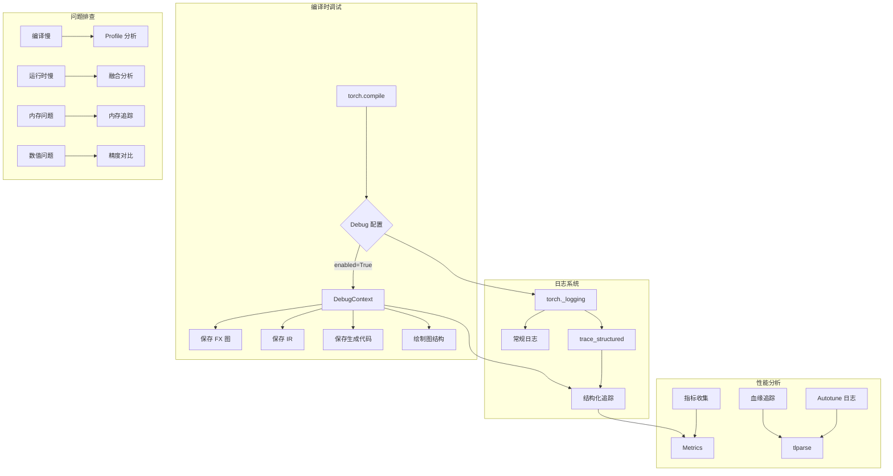

# PyTorch Inductor 源码解析（十）：调试与实战

**系列前一课**：[Part 9: max-autotune 深度解析](09-max-autotune.md)

---

## 10.1 编译日志系统

### 10.1.1 torch._logging 架构

PyTorch 编译日志系统位于 [`torch/_logging/__init__.py`](torch/_logging/__init__.py)，提供统一的日志管理接口。

**核心入口**：

```python
from torch._logging import set_logs, trace_structured

# 启用特定模块日志
set_logs(dynamo=logging.INFO, inductor=logging.DEBUG)
```

**日志分类**：

| 类别 | 说明 | 启用方式 |
|------|------|----------|
| **常规日志** | 编译过程、优化决策等 | `set_logs(inductor=INFO)` |
| **Artifact 日志** | 图、代码、IR 等调试产物 | `trace_structured` |
| **结构化追踪** | 可被 tlparse 解析的 JSON | 自动收集 |

### 10.1.2 结构化追踪 (trace_structured)

源码位置：[`torch/_logging/_internal.py`](torch/_logging/_internal.py#L46)

```python
# trace_structured 定义
trace_log = logging.getLogger("torch.__trace")

def trace_structured(
    event_type: str,
    metadata_fn: Callable[[], dict[str, Any]],
    payload_fn: Callable[[], Any],
    suppress_context: bool = False,
) -> None:
    """
    记录结构化日志，可被 tlparse 解析。
    
    Args:
        event_type: 事件类型，如 "artifact", "str", "dump_file"
        metadata_fn: 延迟计算元数据的函数
        payload_fn: 延迟计算 payload 的函数
        suppress_context: 是否抑制上下文信息
    """
    if not trace_log.handlers:
        return  # 无处理器时不执行，避免性能损失
    
    # 懒执行：只有实际写入时才调用 fn
    metadata = metadata_fn()
    payload = payload_fn()
    
    trace_log.info(json.dumps({
        "type": event_type,
        "metadata": metadata,
        "payload": payload,
    }))
```

**关键设计**：

1. **懒执行**：`metadata_fn` 和 `payload_fn` 只有在 `trace_log.handlers` 非空时才执行
2. **零开销**：无处理器时直接返回，不影响正常编译
3. **可扩展**：通过 `event_type` 区分不同类型的 artifact

### 10.1.3 DebugContext 调试上下文

源码位置：[`torch/_inductor/debug.py`](torch/_inductor/debug.py#L393)

```python
class DebugContext:
    """
    管理编译调试信息的上下文类。
    
    当 config.trace.enabled=True 时，自动创建调试目录并保存各类产物。
    """
    _counter = itertools.count()
    
    def __init__(self) -> None:
        self._prof = None
        self._path = None
        self._stack = contextlib.ExitStack()
    
    @staticmethod
    def create_debug_dir(folder_name: str) -> Optional[str]:
        """创建调试目录，命名格式：{debug_dir}/torchinductor/{folder_name}.{n}"""
        debug_dir = config.trace.debug_dir or get_debug_dir()
        for n in DebugContext._counter:
            dirname = os.path.join(debug_dir, "torchinductor", f"{folder_name}.{n}")
            if not os.path.exists(dirname):
                os.makedirs(dirname)
                return dirname
        return None
    
    def __enter__(self) -> None:
        if not config.trace.enabled:
            return
        
        self._path = self.create_debug_dir(get_aot_graph_name())
        
        # 设置日志捕获
        if config.trace.debug_log:
            self._setup_log_capture("debug.log", logging.DEBUG)
        if config.trace.info_log:
            self._setup_log_capture("info.log", logging.INFO)
    
    def _setup_log_capture(self, filename: str, level: int) -> None:
        """设置日志文件捕获"""
        log = logging.getLogger("torch._inductor")
        fd = self._stack.enter_context(self.fopen(filename))
        ch = logging.StreamHandler(fd)
        ch.setLevel(level)
        ch.setFormatter(logging.Formatter("[%(filename)s:%(lineno)d %(levelname)s] %(message)s"))
        log.addHandler(ch)
        log.setLevel(min(log.level, level))
        self._stack.callback(log.removeHandler, ch)
    
    def __getattr__(self, name: str) -> Optional[Callable[..., None]]:
        """
        动态方法分发：当 config.trace.enabled 且对应属性为 True 时，
        返回 DebugFormatter 的对应方法。
        """
        if config.trace.enabled and getattr(config.trace, name):
            try:
                return getattr(DebugFormatter(self), name)
            except Exception:
                log.warning("Ignoring exception in debug code", exc_info=True)
                return None
        else:
            def ignored(*args: Any, **kwargs: Any) -> None:
                pass
            return ignored
```

**使用示例**：

```python
from torch._inductor.virtualized import V

with V.debug:  # 自动进入 DebugContext
    # 编译过程
    V.debug.fx_graph(gm, inputs)      # 保存 FX 图
    V.debug.ir_pre_fusion(nodes)      # 保存融合前 IR
    V.debug.output_code(filename)     # 复制生成代码
```

### 10.1.4 DebugFormatter 调试格式化器

源码位置：[`torch/_inductor/debug.py`](torch/_inductor/debug.py#L549)

```python
class DebugFormatter:
    """将调试信息格式化为文件保存。"""
    
    def __init__(self, handler: DebugContext) -> None:
        self.fopen = handler.fopen
        self.fopen_context = handler.fopen_context
        self.filename = handler.filename
        self.handler = handler
    
    def fx_graph(
        self,
        gm: torch.fx.GraphModule,
        inputs: list[torch.Tensor],
    ) -> None:
        """保存 FX 图为可运行和可读版本"""
        with self.fopen("fx_graph_runnable.py") as fd:
            # 保存可运行的图（含真实张量）
            save_graph_repro(fd, gm, inputs, "inductor")
        
        with self.fopen("fx_graph_readable.py") as fd:
            # 保存可读版本
            fd.write(gm.print_readable(print_output=False))
    
    def ir_pre_fusion(self, nodes: SchedulerNodeList) -> None:
        """保存融合前的 IR 节点"""
        with self.fopen("ir_pre_fusion.txt") as fd:
            fd.write(self._write_ir(nodes))
    
    def ir_post_fusion(self, nodes: SchedulerNodeList) -> None:
        """保存融合后的 IR 节点"""
        with self.fopen("ir_post_fusion.txt") as fd:
            fd.write(self._write_ir(nodes))
    
    @staticmethod
    def _write_ir(nodes: SchedulerNodeList) -> str:
        """将 IR 节点转换为字符串表示"""
        buf = io.StringIO()
        for node in nodes:
            buf.write(node.debug_str())
            buf.write("\n\n\n")
        return buf.getvalue()
    
    def graph_diagram(self, nodes: SchedulerNodeList) -> None:
        """绘制融合后的图（SVG 格式）"""
        draw_buffers(nodes, fname=self.filename("graph_diagram.svg"))
    
    def output_code(self, filename: str, extension: str = "py") -> None:
        """复制生成的代码到调试目录"""
        shutil.copy(filename, self.filename(f"output_code.{extension}"))
    
    def log_autotuning_results(
        self,
        name: str,
        input_nodes: list[ir.IRNode],
        timings: dict["ChoiceCaller", float],
        elapse: float,
        precompile_elapse: float,
        prescreening_elapse: Optional[float],
    ) -> None:
        """记录 autotune 结果为 JSON"""
        with self.fopen_context("autotuning_result_json_list.txt", "at") as fd:
            for caller, time in timings.items():
                info_dict = dict(caller.info_dict())
                info_dict["benchmark_result"] = time
                json.dump(info_dict, fd)
                fd.write("\n")
```

### 10.1.5 启用编译调试

**方法 1：环境变量**
```bash
# 启用基础调试
export TORCH_COMPILE_DEBUG=1

# 保存真实张量（用于复现）
export TORCH_COMPILE_DEBUG_SAVE_REAL=1

# 自定义调试目录
export TORCH_COMPILE_DEBUG_DIR=/path/to/debug

# 启用详细日志
export TORCH_LOGS=inductor:DEBUG
```

**方法 2：代码配置**
```python
import torch._inductor.config as config

# 启用调试
config.trace.enabled = True
config.trace.debug_log = True  # DEBUG 级别日志
config.trace.info_log = True   # INFO 级别日志

# 保存所有调试产物
config.trace.fx_graph = True
config.trace.ir_pre_fusion = True
config.trace.ir_post_fusion = True
config.trace.output_code = True
config.trace.graph_diagram = True
```

---

## 10.2 性能分析工具

### 10.2.1 tlparse：编译产物解析器

`tlparse` 是 PyTorch 编译工具链的核心解析器，用于解析结构化追踪日志并生成可视化报告。

**安装**：
```bash
pip install tlparse
```

**使用**：
```bash
# 解析日志目录
tlparse /path/to/logs

# 生成报告
tlparse --output report /path/to/logs
```

**解析的 artifact 类型**：

| Artifact | 说明 |
|----------|------|
| `inductor_runtime_and_tensor_meta` | 每个 Kernel 的运行时估计和输出张量元数据 |
| `graph_execution` | 图执行顺序追踪 |
| `inductor_provenance_tracking` | Kernel 到 FX 节点的血缘追踪 |
| `autotune_result` | Autotune 配置和性能对比 |

### 10.2.2 运行时和 Tensor 元数据日志

源码位置：[`torch/_inductor/debug.py`](torch/_inductor/debug.py#L761)

```python
def log_runtime_and_tensor_meta(node_runtimes: Sequence[tuple[Any, float]]) -> None:
    """
    记录每个 op 的运行时估计和输出 Tensor 元数据，供 TLParse 使用。
    
    Args:
        node_runtimes: (SchedulerNode, estimated_runtime_ns) 的序列
    """
    to_optimization_hints = V.graph.sizevars.optimization_hints
    
    def to_list(x: Optional[Sequence[Any]]) -> list[Any]:
        return list(to_optimization_hints(x)) if x is not None else []
    
    def dtype_to_str(dtype: Any) -> Optional[str]:
        if dtype is None:
            return None
        s = str(dtype)
        s = s.removeprefix("torch.")
        return s
    
    ops: list[dict[str, Any]] = []
    for s, runtime_ns in node_runtimes:
        name = getattr(s.node, "python_kernel_name", s.get_name())
        op_type = "collective" if utils.is_collective(s.node) else "compute"
        
        outputs: list[dict[str, Any]] = []
        for buf in s.get_outputs():
            irnode = buf.node
            shape = irnode.maybe_get_size()
            stride = irnode.get_stride() if isinstance(irnode.layout, ir.Layout) else None
            dtype = irnode.maybe_get_dtype()
            
            outputs.append({
                "shape": to_list(shape),
                "stride": to_list(stride),
                "dtype": dtype_to_str(dtype),
            })
        
        ops.append({
            "name": name,
            "type": op_type,
            "estimated_runtime_ns": runtime_ns,
            "outputs": outputs,
        })
    
    trace_structured(
        "artifact",
        metadata_fn=lambda: {
            "name": "inductor_runtime_and_tensor_meta",
            "encoding": "json",
        },
        payload_fn=lambda: {"ops": ops},
    )
```

### 10.2.3 血缘追踪 (Provenance Tracking)

源码位置：[`torch/_inductor/debug.py`](torch/_inductor/debug.py#L1104)

```python
def set_kernel_post_grad_provenance_tracing(
    node_schedule: Union[Sequence[BaseSchedulerNode], ExternKernel],
    kernel_name: str,
    is_extern: bool = False,
) -> Optional[int]:
    """
    建立 Kernel 与 post_grad 节点之间的映射关系。
    
    Returns:
        唯一的 debug handle ID
    """
    if config.trace.provenance_tracking_level == 0:
        return None
    
    _inductor_kernel_provenance_debug_handle += 1
    stack_traces: list[str] = []
    kernel_name = f"{kernel_name}:{_inductor_kernel_provenance_debug_handle}"
    
    if is_extern:
        # Extern Kernel：从 origins 获取
        curr_node_info = _inductor_triton_kernel_to_post_grad_node_info.setdefault(
            kernel_name, []
        )
        if node_schedule.origin_node:
            origin_node_name = node_schedule.origin_node.name
            if origin_node_name not in curr_node_info:
                curr_node_info.append(origin_node_name)
        else:
            curr_node_info.extend(
                origin.name for origin in node_schedule.origins
                if origin.name not in curr_node_info
            )
        stack_traces = list(node_schedule.get_stack_traces())
    else:
        # 融合 Kernel：遍历所有 fused 节点
        stack_traces_set: OrderedSet[str] = OrderedSet()
        for snode in node_schedule:
            if snode not in (EnableReduction, DisableReduction):
                if snode.node is not None:
                    curr_node_info = (
                        _inductor_triton_kernel_to_post_grad_node_info.setdefault(
                            kernel_name, []
                        )
                    )
                    stack_traces_set.update(snode.node.get_stack_traces())
                    curr_node_info.extend(
                        origin.name for origin in snode.node.origins
                        if origin.name not in curr_node_info
                    )
        stack_traces = list(stack_traces_set)
    
    _inductor_kernel_stack_trace.setdefault(kernel_name, []).extend(stack_traces)
    return _inductor_kernel_provenance_debug_handle
```

**血缘映射生成**：

```python
def dump_inductor_provenance_info() -> dict[str, Any]:
    """
    生成 Inductor 血缘追踪 JSON，包含：
    - pre_grad <-> post_grad 节点映射
    - Triton Kernel <-> post_grad 节点映射
    - stack traces
    """
    node_mapping: dict[str, Any] = {}
    
    if _pre_grad_graph_id:
        # Kernel 级别映射
        node_mapping_kernel = create_node_mapping_kernel_to_post_grad(
            _inductor_triton_kernel_to_post_grad_node_info
        )
        # 合并映射
        node_mapping = {
            **_inductor_post_to_pre_grad_nodes,
            **node_mapping_kernel,
        }
        
        if config.trace.enabled:
            with V.debug.fopen("inductor_provenance_tracking_node_mappings.json", "w") as fd:
                json.dump(node_mapping, fd)
    
    node_mapping["version"] = 2.0  # 版本标识
    return node_mapping
```

### 10.2.4 指标收集系统

源码位置：[`torch/_inductor/metrics.py`](torch/_inductor/metrics.py)

**核心指标**：

```python
# 编译统计
generated_kernel_count = 0          # 生成的 Kernel 数量
generated_cpp_vec_kernel_count = 0  # C++ 向量 Kernel 数量
ir_nodes_pre_fusion = 0             # 融合前 IR 节点数

# 性能指标
num_bytes_accessed = 0              # 访问的字节数
node_runtimes: list[tuple[BaseSchedulerNode, float]] = []  # 运行时估计

# 优化指标
num_loop_reordering = 0             # 循环重排序次数
parallel_reduction_count = 0        # 并行归约次数
num_auto_chunking = 0               # 自动分块次数
```

**指标表 (MetricTable) 系统**：

```python
@dataclass
class MetricTable:
    """CSV 格式的指标表"""
    table_name: str
    column_names: list[str]
    
    def add_row(self, row_fn: Callable[[], dict[str, Optional[Union[str, float]]]]) -> None:
        if self.table_name not in enabled_metric_tables():
            return
        
        row_dict = row_fn()
        row = [get_benchmark_name()] + [row_dict[col] for col in self.column_names]
        self._write_row(row)
    
    def _write_row(self, row: list[str | float | None]) -> None:
        filename = self.output_filename()
        with open(filename, "a") as fd:
            writer = csv.writer(fd, lineterminator="\n")
            writer.writerow(row)


# 注册的指标表
MetricTable.register_table(
    "kernel_autotune",
    ["kernel_path", "kernel_name", "triton_config", "latency_ms"],
)

MetricTable.register_table(
    "kernel_metadata",
    [
        "kernel_name", "kernel_path", "kernel_category",
        "size_hints", "reduction_hint", "line_of_code",
        "num_load", "num_store", "num_for_loop",
        "num_atomic_add", "num_args",
        "xnumel", "ynumel", "rnumel", "kernel_args_num_gb",
    ],
)
```

**启用指标收集**：
```bash
# 启用特定指标表
export TORCHINDUCTOR_ENABLED_METRIC_TABLES=kernel_autotune,kernel_metadata
```

### 10.2.5 内存追踪 (BufferMemoryTracker)

源码位置：[`torch/_inductor/runtime/debug_utils.py`](torch/_inductor/runtime/debug_utils.py#L16)

```python
class BufferMemoryTracker:
    """
    追踪 Inductor 运行时的内存分配和释放，用于验证内存规划是否符合预期。
    """
    
    def __init__(self) -> None:
        self.tensor_tracker: dict[str, torch.storage.UntypedStorage] = (
            weakref.WeakValueDictionary()
        )
        self.died_since_last_step: OrderedSet[str] = OrderedSet()
        self.added_since_last_step: OrderedSet[str] = OrderedSet()
        self.error = (
            torch._inductor.config.test_configs.track_memory_lifecycle == "assert"
        )
    
    def set_tensor(self, name: str, tensor: torch.Tensor) -> None:
        """追踪 Tensor 的分配"""
        storage = tensor.untyped_storage()
        self.added_since_last_step.add(name)
        self.tensor_tracker[name] = storage
        
        def on_tensor_death() -> None:
            self.died_since_last_step.add(name)
        
        weakref.finalize(storage, on_tensor_death)
    
    def check_step_delta(
        self,
        expected_allocated: list[str],
        expected_freed: list[str],
        is_final_step: bool,
    ) -> None:
        """验证每一步的内存变化是否符合预期"""
        # 检查预期释放的
        missing_deaths = OrderedSet(expected_freed) - self.died_since_last_step
        if missing_deaths:
            self.log_or_raise(
                f"Expected tensors to die but still alive: {missing_deaths}"
            )
        
        # 检查意外释放的
        unexpected_deaths = self.died_since_last_step - OrderedSet(expected_freed)
        if unexpected_deaths:
            self.log_or_raise(f"Unexpected tensor deaths: {unexpected_deaths}")
        
        # 检查新分配的
        extra_alive = self.added_since_last_step - OrderedSet(expected_allocated)
        if extra_alive:
            self.log_or_raise(f"Unexpected allocated tensors: {extra_alive}")
        
        # 检查缺失分配的
        missing_alive = OrderedSet(expected_allocated) - self.added_since_last_step
        if missing_alive:
            self.log_or_raise(f"Expected allocated tensors but missing: {missing_alive}")
```

**使用**：
```python
from torch._inductor.runtime.debug_utils import track_tensor, check_memory_step

# 追踪 Tensor
track_tensor(tensor, "buffer_name")

# 验证每一步
check_memory_step(
    allocated=["buf1", "buf2"],
    freed=["buf0"],
    is_final_step=False
)
```

---

## 10.3 常见问题排查

### 10.3.1 问题排查速查表

| 问题 | 可能原因 | 诊断方法 | 解决方案 |
|------|----------|----------|----------|
| **编译慢** | Autotune 配置过多 | 查看 `TORCH_COMPILE_DEBUG` 目录的 autotune 日志 | 1. 使用缓存 `config.autotune_local_cache=True`<br>2. 限制配置数 `config.max_autotune_gemm_config_count=10`<br>3. 禁用多进程 `config.autotune_multi_process=False` |
| **运行时慢** | 未融合 | 检查 `ir_post_fusion.txt` 的节点数 | 1. 查看 fusion 失败原因<br>2. 调整 `max_fusion_size`<br>3. 检查 `can_fuse` 条件 |
| **内存溢出** | Buffer 未复用 | 使用 `BufferMemoryTracker` 追踪 | 1. 启用 `config.memory_planning=True`<br>2. 调整 `reorder_for_peak_memory` |
| **Aten Fallback** | 缺少 lowering | 搜索日志 "fallback" | 1. 添加自定义 lowering<br>2. 使用 decomposition 分解<br>3. 检查算子是否支持 |
| **max-autotune 卡住** | 单个配置超时 | 查看 worker 进程状态 | 1. 调整 `precompilation_timeout_seconds`<br>2. 禁用问题配置类型 |
| **缓存不命中** | Kernel 哈希变化 | 检查源码改动 | 1. 稳定 Kernel 源码<br>2. 使用 `bundle_triton_into_fx_graph_cache` |
| **数值精度问题** | TF32/精度不匹配 | 比较 eager 和 compile 输出 | 1. 设置 `config.force_same_precision=True`<br>2. 禁用 `use_fast_math` |

### 10.3.2 编译慢排查

**诊断步骤**：

```python
import torch._inductor.config as config
import logging

# 1. 启用详细日志
logging.basicConfig(level=logging.INFO)
config.verbose_progress = True

# 2. 查看 autotune 进度
config.disable_progress = False

# 3. 限制配置数量
config.max_autotune_gemm_config_count = 10

# 4. 使用缓存
config.autotune_local_cache = True
config.autotune_remote_cache = True

# 5. 禁用多进程（便于调试）
config.autotune_multi_process = False

model = torch.compile(MyModel(), mode="max-autotune")
```

**日志分析**：
```bash
# 查看 autotune 时间分布
grep "\[autotune\]" /path/to/debug.log | head -100

# 查看编译 profile
snakeviz /path/to/debug_dir/compile.prof
```

### 10.3.3 运行时慢排查

**诊断步骤**：

```python
import torch._inductor.config as config

# 1. 保存融合前后 IR
config.trace.enabled = True
config.trace.ir_pre_fusion = True
config.trace.ir_post_fusion = True

# 2. 绘制融合图
config.trace.graph_diagram = True

# 3. 启用指标收集
config.enabled_metric_tables = "kernel_metadata"

model = torch.compile(MyModel())
output = model(input)

# 4. 查看生成的 Kernel
import torch._inductor.metrics as metrics
print(f"Generated kernels: {metrics.generated_kernel_count}")
```

**融合失败原因分析**：

```python
# 在 scheduler.py 中添加调试
from torch._logging import trace_structured

def can_fuse(node1, node2):
    # ... 现有逻辑 ...
    
    if not _can_fuse_valid_reads(node1, node2, common_read_buffers):
        trace_structured(
            "artifact",
            metadata_fn=lambda: {
                "name": "fusion_failure",
                "reason": "invalid_reads",
                "node1": node1.get_name(),
                "node2": node2.get_name(),
            },
            payload_fn=lambda: {
                "common_reads": list(common_read_buffers),
            },
        )
        return False
```

### 10.3.4 内存溢出排查

**诊断步骤**：

```python
import torch._inductor.config as config

# 1. 启用内存重排序
config.reorder_for_peak_memory = True
config.reorder_for_peak_memory_debug = True

# 2. 启用内存追踪
config.test_configs.track_memory_lifecycle = "log"  # 或 "assert"

# 3. 保存调试信息
config.trace.enabled = True

model = torch.compile(MyModel())
```

**内存规划配置**：

```python
# 内存池策略
config.memory_pool = "intermediates"  # 默认
# 选项：
# - "none": 不池化，仅复用
# - "intermediates": 中间结果共享存储
# - "outputs": 中间结果和输出分别池化
# - "combined": 单一池
```

### 10.3.5 Aten Fallback 排查

**诊断步骤**：

```python
import logging
logging.basicConfig(level=logging.DEBUG)

# 启用 fallback 日志
from torch._logging import set_logs
set_logs(inductor=logging.DEBUG)

model = torch.compile(MyModel())
```

**查看 fallback 算子**：

```bash
grep "fallback" /path/to/debug.log
# 输出示例：
# Fallback to Aten: aten.some_op
```

**添加 lowering**：

```python
from torch._inductor import lowering
from torch._inductor.ir import Pointwise

@lowering.register(aten.my_op)
def my_op_lowering(x, y):
    return Pointwise.create(...)
```

### 10.3.6 数值精度问题排查

**诊断步骤**：

```python
import torch
import torch._inductor.config as config

# 1. 禁用快速数学
config.use_fast_math = False

# 2. 强制精度一致
config.force_same_precision = True

# 3. 启用断言
config.size_asserts = True
config.nan_asserts = True

# 4. 比较输出
eager_output = MyModel()(input)
compiled_output = torch.compile(MyModel())(input)

torch.testing.assert_close(eager_output, compiled_output, rtol=1e-4, atol=1e-4)
```

---

## 10.4 调试配置选项汇总

### 10.4.1 核心调试配置

```python
import torch._inductor.config as config

# ===== 编译调试 =====

# 主开关：启用所有调试
config.trace.enabled = True  # 或 TORCH_COMPILE_DEBUG=1

# 调试目录
config.trace.debug_dir = "/path/to/debug"

# 保存真实张量（用于复现）
config.trace.save_real_tensors = True

# 日志级别
config.trace.debug_log = True   # DEBUG 级别
config.trace.info_log = True    # INFO 级别

# ===== 调试产物 =====

config.trace.fx_graph = True           # 保存输入 FX 图
config.trace.fx_graph_transformed = True  # 保存变换后 FX 图
config.trace.ir_pre_fusion = True      # 保存融合前 IR
config.trace.ir_post_fusion = True     # 保存融合后 IR
config.trace.output_code = True        # 保存生成代码
config.trace.graph_diagram = True      # 绘制融合图 (SVG)
config.trace.draw_orig_fx_graph = True # 绘制原始 FX 图

# ===== 血缘追踪 =====

config.trace.provenance_tracking_level = 1  # 0=禁用，1=正常，2=基础

# ===== 性能分析 =====

config.trace.compile_profile = True  # 保存 cProfile
config.trace.log_autotuning_results = True  # 记录 autotune 结果

# ===== 上传 =====

def upload_handler(tar_path: str):
    # 自定义上传逻辑
    pass

config.trace.upload_tar = upload_handler
```

### 10.4.2 日志配置

```python
import logging
from torch._logging import set_logs

# 启用模块日志
set_logs(
    dynamo=logging.INFO,
    aot=logging.INFO,
    inductor=logging.DEBUG,
    fsdp=logging.INFO,
)

# 结构化日志
from torch._logging import trace_structured

trace_structured(
    "artifact",
    metadata_fn=lambda: {"name": "my_artifact"},
    payload_fn=lambda: {"data": ...},
)
```

### 10.4.3 性能调试配置

```python
# Autotune 调试
config.max_autotune = True
config.verbose_progress = True
config.disable_progress = False
config.max_autotune_gemm_config_count = 10  # 限制配置数
config.autotune_multi_process = False  # 禁用多进程便于调试

# 融合调试
config.debug_fusion = True  # 输出融合注释
config.benchmark_fusion = True  # Benchmark 融合决策
config.score_fusion_memory_threshold = 10  # 融合内存阈值

# 内存调试
config.reorder_for_peak_memory_debug = True
config.test_configs.track_memory_lifecycle = "log"
```

### 10.4.4 缓存配置

```python
# 本地缓存
config.autotune_local_cache = True
config.autotune_cache_dir = "~/.cache/torchinductor"

# 远程缓存
config.autotune_remote_cache = True
config.remote_gemm_autotune_cache = True

# 缓存目录管理
# 清除缓存
rm -rf ~/.cache/torchinductor/

# 自定义缓存目录
export TORCHINDUCTOR_CACHE_DIR=/path/to/cache
```

---

## 10.5 实战技巧

### 10.5.1 复现编译问题

**保存编译参数**：

```python
from torch._inductor.debug import save_args_for_compile_fx_inner

config.save_args = True  # 自动保存

# 或者手动保存
save_args_for_compile_fx_inner(*args, **kwargs)
# 输出：Arguments saved to /tmp/inductor_saved_args/compile_fx_inner_0.pkl
```

**加载并重放**：

```python
from torch._inductor.debug import load_args_and_run_compile_fx_inner

result = load_args_and_run_compile_fx_inner(
    "/tmp/inductor_saved_args/compile_fx_inner_0.pkl"
)
```

### 10.5.2 AOTInductor 调试

**启用 AOT 复现**：

```python
import torch._inductor.config as config

# 复现级别
config.aot_indductor.repro_level = 3  # 0=禁用，1=错误，2=警告，3=全部

# 保存 minifier 输入
config.aot_inductor.dump_aoti_minifier = True
```

**使用 minifier**：

```python
from torch._inductor import aoti_compile_and_package

# 编译失败时自动保存最小复现
model_pt2 = aoti_compile_and_package(
    exported_program,
    package_path="model.pt2",
)
```

### 10.5.3 分布式调试

**启用分布式 autotune**：

```python
config.distributed_max_autotune_gemm = True
config.pipeline_max_autotune_gemm = True
```

**查看各 rank 的 autotune 结果**：

```bash
# 每个 rank 会生成独立的调试目录
ls /path/to/debug/rank_*/
```

### 10.5.4 自定义 Artifact 日志

```python
from torch._logging import trace_structured, getArtifactLogger

# 方式 1：使用 trace_structured
trace_structured(
    "artifact",
    metadata_fn=lambda: {
        "name": "my_custom_artifact",
        "encoding": "json",
    },
    payload_fn=lambda: my_data,
)

# 方式 2：使用 Artifact Logger
my_logger = getArtifactLogger(__name__, "my_artifact")
my_logger.info(my_data)
```

---

## 10.6 调试工具链总结



---

## 总结

本文介绍了 PyTorch Inductor 的调试工具和实战技巧：

1. **编译日志系统**：`torch._logging` 提供统一的日志管理，`trace_structured` 支持结构化追踪
2. **调试上下文**：`DebugContext` 和 `DebugFormatter` 自动保存各类调试产物
3. **性能分析工具**：`tlparse` 解析结构化日志，`metrics` 收集编译指标
4. **内存追踪**：`BufferMemoryTracker` 验证内存规划
5. **问题排查**：编译慢、运行时慢、内存溢出、Aten Fallback 等常见问题的诊断方法
6. **配置选项**：完整的调试配置选项汇总

**关键源码文件**：

- [`torch/_logging/__init__.py`](torch/_logging/__init__.py) - 日志入口
- [`torch/_logging/_internal.py`](torch/_logging/_internal.py) - 结构化追踪
- [`torch/_inductor/debug.py`](torch/_inductor/debug.py) - 调试上下文和格式化器
- [`torch/_inductor/metrics.py`](torch/_inductor/metrics.py) - 指标收集
- [`torch/_inductor/runtime/debug_utils.py`](torch/_inductor/runtime/debug_utils.py) - 内存追踪

---

**系列完结**

至此，PyTorch Inductor 源码解析 10 Part 系列全部完成：

1. [Part 1: 整体架构](01-overview.md)
2. [Part 2: IR 系统设计](02-ir-design.md)
3. [Part 3: Lowering 机制](03-lowering.md)
4. [Part 4: FX Passes](04-fx-passes.md)
5. [Part 5: 调度与融合](05-scheduler.md)
6. [Part 6: 代码生成](06-codegen.md)
7. [Part 7: AOTInductor](07-aotinductor.md)
8. [Part 8: 性能优化](08-performance.md)
9. [Part 9: max-autotune](09-max-autotune.md)
10. [Part 10: 调试与实战](10-debugging.md)

系列源码索引详见：[inductor_blog_series.md](inductor_blog_series.md)
