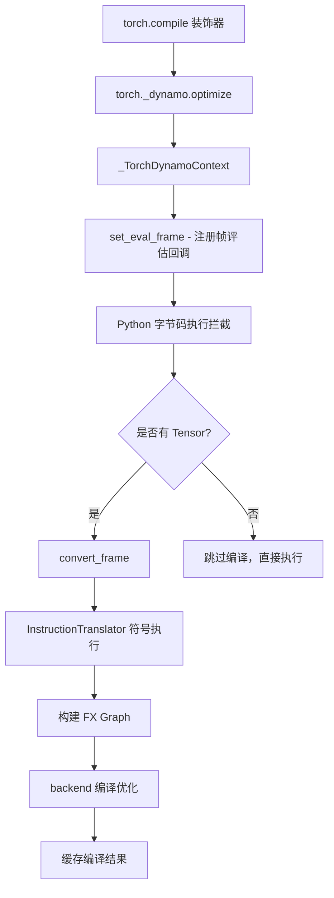
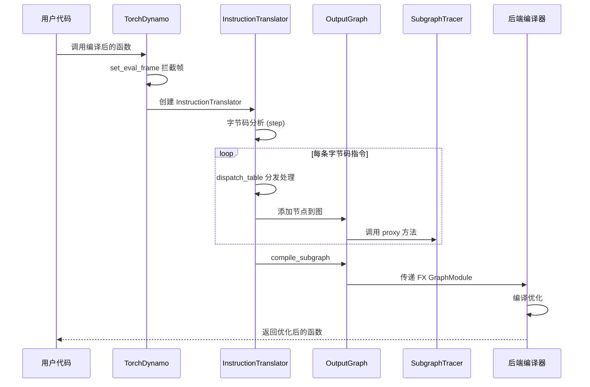
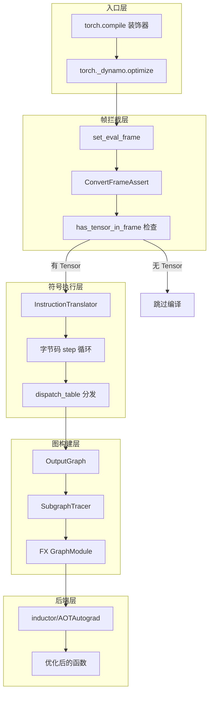
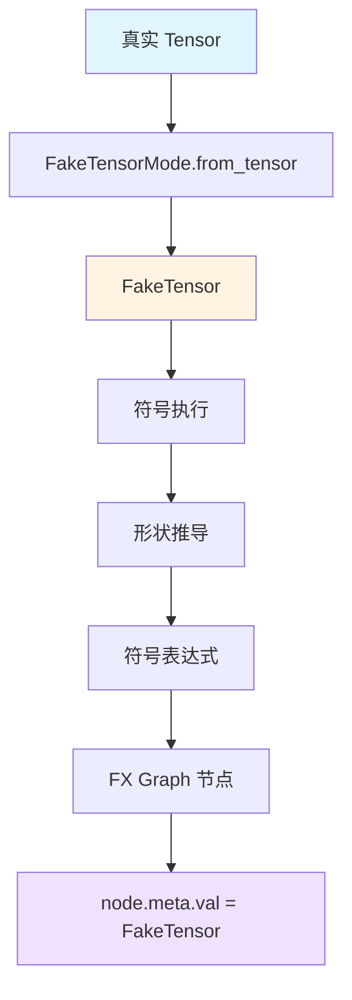

# torch.compile 图捕获过程详解

本文档详细解析 PyTorch 中 `torch.compile` 的图捕获 (Graph Capture) 过程，结合源码分析其核心机制。

## 1. 整体架构概览



## 2. 入口点：torch.compile

**源码位置**: `torch/__init__.py:2572-2764`

```python
def compile(
    model: _Callable[_InputT, _RetT] | None = None,
    *,
    fullgraph: builtins.bool = False,
    dynamic: builtins.bool | None = None,
    backend: str | _Callable = "inductor",
    mode: str | None = None,
    options: dict[str, str | builtins.int | builtins.bool | _Callable] | None = None,
    disable: builtins.bool = False,
) -> ...
```

关键流程：
1. 参数验证和配置处理
2. 调用 `torch._dynamo.optimize()` 包装目标函数

## 3. Dynamo 优化上下文

**源码位置**: `torch/_dynamo/eval_frame.py:1476-1600`

### 3.1 optimize 函数

```python
def optimize(*args: Any, **kwargs: Any) -> Union[OptimizeContext, _NullDecorator]:
    return _optimize(rebuild_ctx, *args, **kwargs)
```

### 3.2 _optimize 核心逻辑

**源码位置**: `torch/_dynamo/eval_frame.py:1491-1600`

```python
def _optimize(
    rebuild_ctx: Callable[[], Union[OptimizeContext, _NullDecorator]],
    backend: Union[str, Callable[..., Any]] = "inductor",
    *,
    nopython: bool = False,
    error_on_graph_break: Optional[bool] = None,
    guard_export_fn: Optional[Callable[[_guards.GuardsSet], None]] = None,
    guard_fail_fn: Optional[Callable[[GuardFail], None]] = None,
    guard_filter_fn: Callable[[Sequence[GuardFilterEntry]], Sequence[bool]] | None = None,
    disable: bool = False,
    dynamic: Optional[bool] = None,
    package: Optional[CompilePackage] = None,
) -> Union[OptimizeContext, _NullDecorator]:
    hooks = Hooks(
        guard_export_fn=guard_export_fn,
        guard_fail_fn=guard_fail_fn,
        guard_filter_fn=guard_filter_fn,
    )
    
    backend = get_compiler_fn(backend)
    
    return _optimize_catch_errors(
        convert_frame.convert_frame(backend, hooks, package=package),
        hooks,
        backend_ctx_ctor,
        fullgraph=False,
        error_on_graph_break=error_on_graph_break,
        dynamic=dynamic,
        ...
    )
```

### 3.3 _TorchDynamoContext 类

**源码位置**: `torch/_dynamo/eval_frame.py:734-1049`

核心机制：通过 `set_eval_frame` 注册自定义帧评估回调

```python
def __enter__(self) -> None:
    self.prior = set_eval_frame(None)
    _maybe_set_eval_frame(_callback_from_stance(self.callback))
```

## 4. 帧评估拦截机制

### 4.1 C 层帧评估接口

**源码位置**: `torch/_C/_dynamo/eval_frame.pyi`

```python
def set_eval_frame(callback: DynamoCallback) -> DynamoCallback: ...
def set_skip_guard_eval_unsafe(value: bool) -> bool: ...
```

这些 C 扩展函数负责在 CPython 层面拦截帧评估。

### 4.2 帧转换入口

**源码位置**: `torch/_dynamo/convert_frame.py:612-758`

`ConvertFrameAssert.__call__` 方法处理帧转换：

```python
def __call__(
    self,
    frame: DynamoFrameType,
    cache_entry: Optional[CacheEntry],
    hooks: Hooks,
    frame_state: dict[str, Union[int, FrameStateSizeEntry]],
    *,
    skip: int = 0,
) -> ConvertFrameReturn:
    # 1. 检查是否有 Tensor
    if not has_tensor_in_frame(frame):
        return ConvertFrameReturn()  # 跳过编译
    
    # 2. 调用 _compile 进行实际编译
    result = _compile(
        frame.f_code,
        frame.f_globals,
        frame.f_locals,
        frame.f_builtins,
        frame.closure,
        self._torchdynamo_orig_backend,
        self._one_graph,
        self._export,
        self._export_constraints,
        hooks,
        cache_entry,
        ...
    )
```

## 5. 符号执行与图构建

### 5.1 InstructionTranslator 类

**源码位置**: `torch/_dynamo/symbolic_convert.py:5286`

`InstructionTranslator` 继承自 `InstructionTranslatorBase`，负责将 Python 字节码转换为符号执行。

```python
class InstructionTranslator(InstructionTranslatorBase):
    """Main translator for function bytecode"""
```

### 5.2 字节码执行循环

**源码位置**: `torch/_dynamo/symbolic_convert.py:1416-1527`

```python
def step(self) -> bool:
    """Process exactly one instruction, return False we should exit"""
    ip = self.instruction_pointer
    if ip is None:
        return False
    self.current_instruction = inst = self.instructions[ip]
    self.instruction_pointer = ip + 1
    
    # 处理行号变化
    if inst.starts_line:
        self.starts_line(inst.starts_line)
    
    # 尝试部分图编译
    if (
        not self.stack
        and self.should_compile_partial_graph()
        and self.is_non_empty_graph()
    ):
        self.current_speculation = self.speculate()
        if self.current_speculation.failed(self):
            self.step_graph_break(inst)
            return False
    
    # 分发指令处理
    try:
        self.dispatch_table[inst.opcode](self, inst)
        return not self.output.should_exit
    except Unsupported as e:
        # 处理图断点
        ...
```

### 5.3 图断点处理

**源码位置**: `torch/_dynamo/symbolic_convert.py:1585-1650`

```python
def step_graph_break(self, continue_inst: Instruction) -> None:
    assert not self.output.output_instructions
    assert self.current_speculation is not None
    
    # 编译当前子图
    all_stack_locals_metadata = self.output.compile_subgraph(
        self,
        reason=GraphCompileReason("step_unsupported", [self.frame_summary()]),
        ...
    )
```

## 6. FX 图构建流程



### 6.1 OutputGraph 类

**源码位置**: `torch/_dynamo/output_graph.py`

负责管理图构建和编译的核心类：

```python
class OutputGraph:
    """Manages the overall graph construction and compilation process"""
```

关键方法：
- `compile_subgraph`: 编译子图
- `create_proxy`: 创建 FX 代理
- `add_subgraph`: 添加子图

## 7. 完整数据流



## 8. 关键数据结构

### 8.1 SpeculationLog

**源码位置**: `torch/_dynamo/symbolic_convert.py:271-339`

用于处理图断点重启分析的日志机制：

```python
@dataclasses.dataclass
class SpeculationLog:
    """
    替代之前的 copy_graphstate/restore_graphstate 检查点机制。
    当遇到图断点时，重新启动 dynamo 转换过程，
    但在遇到失败的推测起点时，生成图断点。
    """
    entries: list[SpeculationEntry] = dataclasses.field(default_factory=list)
    index: int = 0
```

### 8.2 VariableTracker

**源码位置**: `torch/_dynamo/variables/base.py`

所有变量追踪器的基类，用于跟踪程序状态。

## 9. 缓存机制

### 9.1 代码缓存

**源码位置**: `torch/_dynamo/eval_frame.py`

```python
# 缓存结构
cache_entries: list[CacheEntry]
```

每个 `CacheEntry` 包含：
- `code`: 原始代码对象
- `compile_id`: 编译 ID
- `guard_manager`: 守卫管理器
- `backend`: 编译后的函数

### 9.2 守卫 (Guards) 机制

守卫用于在运行时验证编译假设是否仍然有效：

```python
class RootGuardManager:
    """管理守卫的根类"""
```

## 10. Fake Tensor 机制

Fake Tensor 是 torch.compile 图捕获过程中的核心基础设施，用于在**不执行实际计算**的情况下追踪张量的形状、dtype、stride 等元数据。

### 10.1 FakeTensorMode 类

**源码位置**: `torch/_subclasses/fake_tensor.py`

```python
class FakeTensorMode(torch.nn.Module):
    """
    一个调度模式 (Dispatch Mode)，用于创建和管理 FakeTensor。
    FakeTensor 是具有元数据 (形状、dtype、stride 等) 但不占用实际 GPU/CPU 内存的张量。
    """
```

### 10.2 TracingContext 与 Fake Mode

**源码位置**: `torch/_guards.py:887-960`

```python
class TracingContext:
    """
    提供当前追踪上下文的访问，包括 fake_mode。
    """
    
    def __init__(self, fake_mode: FakeTensorMode | None) -> None:
        self.guards_context = GuardsContext()
        self.module_context = ModuleContext()
        self.global_context = GlobalContext()
        self.fake_mode: FakeTensorMode | None = fake_mode  # FakeTensorMode 实例
        self.frame_summary_stack: list[traceback.FrameSummary] = []
        self.loc_in_frame: tuple[str, int, str] | None = None
        self.tensor_to_context = WeakTensorKeyDictionary()  # Tensor 到上下文的映射
        self.traced_code: list[CodeType] = []  # 已追踪的代码对象列表
```

### 10.3 Fake Mode 检测

**源码位置**: `torch/_guards.py:1276-1338`

```python
def detect_fake_mode(inputs: Any = None) -> FakeTensorMode | None:
    """
    尝试检测当前的 fake mode。优先级顺序：
    
    1. TracingContext 中的 fake_mode (最权威)
    2. 当前激活的调度模式栈上的 fake mode
    3. 输入张量关联的 fake mode
    """
    # 1. 优先使用 TracingContext 的 fake_mode
    if context := TracingContext.try_get():
        fake_mode = context.fake_mode
        if fake_mode is not None:
            return fake_mode
    
    # 2. 检查调度模式栈
    for i, m in enumerate(reversed(_get_current_dispatch_mode_stack())):
        if isinstance(m, FakeTensorMode):
            fake_modes.append((m, "active fake mode", i))
    
    # 3. 从输入 FakeTensor 中提取
    flat_inputs = pytree.tree_leaves(inputs)
    for i, flat_input in enumerate(flat_inputs):
        if isinstance(flat_input, FakeTensor):
            fake_modes.append((flat_input.fake_mode, "fake tensor input", i))
    
    if fake_modes:
        return fake_modes[0][0]  # 返回第一个匹配的 fake mode
    return None
```

### 10.4 OutputGraph 中的 Fake Mode 初始化

**源码位置**: `torch/_dynamo/output_graph.py:684-692`

```python
class OutputGraph:
    def __init__(self, ...):
        # 创建 ShapeEnv 用于符号形状分析
        shape_env = ShapeEnv(
            dynamic_size_ranges=config.dynamic_size_ranges,
            dynamic_propagation=config.dynamic_propagation,
            ...
        )
        
        # 创建 FakeTensorMode
        fake_mode = torch._subclasses.FakeTensorMode(
            shape_env=shape_env,
            allow_non_fake_inputs=bool(self.export),
            export=self.export,
        )
        
        # 安装到 TracingContext
        self.tracing_context: TracingContext = TracingContext(fake_mode)
```

### 10.5 VariableBuilder 中的 Tensor 处理

**源码位置**: `torch/_dynamo/variables/builder.py`

VariableBuilder 负责将 Python 值（包括 Tensor）转换为 VariableTracker：

```python
class VariableBuilder:
    """
    处理源追踪对象的转换，为输入、模块属性等创建带有守卫的符号表示。
    """
    
    def __call__(self, value: Any) -> VariableTracker:
        # 处理 Tensor 类型
        if isinstance(value, torch.Tensor):
            return self._wrap_tensor(value)
        # ... 其他类型处理
```

### 10.6 Fake Tensor 在图捕获中的作用



**关键特点**：
1. **零内存开销**: FakeTensor 不分配实际存储，仅保留元数据
2. **符号形状追踪**: 通过 ShapeEnv 支持动态形状的符号推导
3. **dispatch 拦截**: 通过 torch dispatch 机制拦截所有张量操作
4. **元数据传播**: 每个 FX 节点的 `node.meta['val']` 存储 FakeTensor

### 10.7 示例：FakeTensor 元数据传播

**源码位置**: `torch/_dynamo/eval_frame.py:2310-2320`

```python
# 在 export 过程中，为 placeholder 节点设置 FakeTensor 元数据
fake_mode = torch._subclasses.FakeTensorMode(shape_env=ShapeEnv(), export=True)
fx_graph = torch.fx.Graph()

for i, name in enumerate(parameter_names):
    if torch.is_tensor(flat_args[i]):
        node = fx_graph.placeholder(name)
        # 关键：将真实 Tensor 转换为 FakeTensor 存储在 meta 中
        node.meta["val"] = fake_mode.from_tensor(
            flat_args[i], static_shapes=True
        )
```

## 11. 图断点类型

以下是常见的图断点 (Graph Break) 场景：

| 场景 | 原因 | 处理方式 |
|------|------|----------|
| 控制流 | if/for/while 等 | 部分图编译 |
| 不支持的操作 | 某些 Python 内置函数 | 回退到 eager 执行 |
| 数据依赖 | 张量形状/值依赖 | 运行时守卫检查 |
| 高阶操作 | 高阶函数调用 | 内联或图断点 |

## 12. 调试工具

### 12.1 explain

**源码位置**: `torch/_dynamo/eval_frame.py:1605-1675`

```python
@torch._dynamo.explain
def my_function(x):
    return torch.sin(x) + torch.cos(x)

# 或者
result = torch._dynamo.explain(my_function)(x)
```

### 12.2 日志配置

```bash
# 启用详细日志
export TORCH_LOGS="+dynamo"
export TORCHDYNAMO_VERBOSE=1
```

## 13. 总结

torch.compile 的图捕获过程可以概括为以下几个阶段：

1. **装饰器包装**: `torch.compile` → `torch._dynamo.optimize`
2. **帧评估拦截**: 通过 CPython 的 `set_eval_frame` API 拦截
3. **Tensor 检测**: `has_tensor_in_frame` 检查是否需要编译
4. **符号执行**: `InstructionTranslator` 逐条处理字节码
5. **图构建**: `OutputGraph` 和 `SubgraphTracer` 构建 FX 图
6. **Fake Tensor 追踪**: 通过 FakeTensorMode 进行符号形状推导和元数据传播
7. **后端编译**: 将 FX GraphModule 交给后端 (如 inductor)
8. **缓存**: 存储编译结果和守卫用于后续调用
