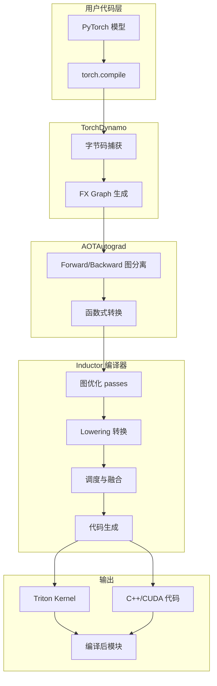
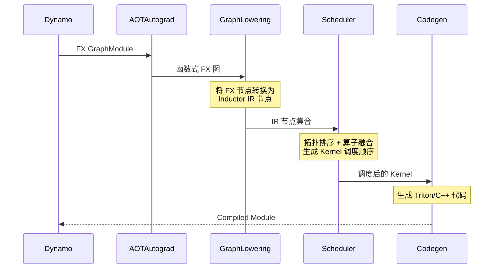
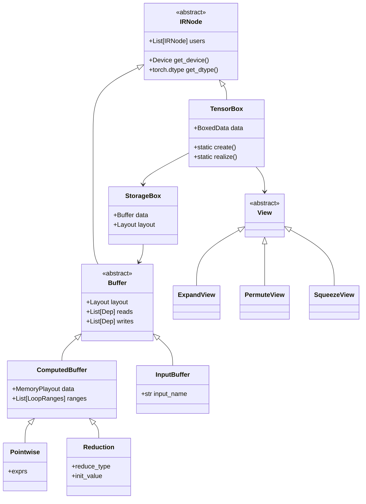
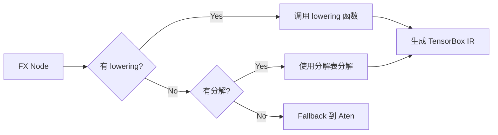
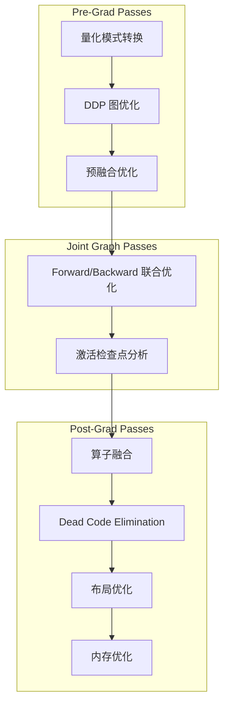
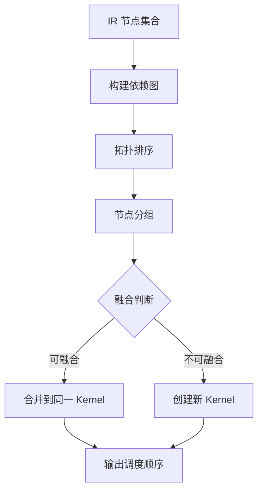
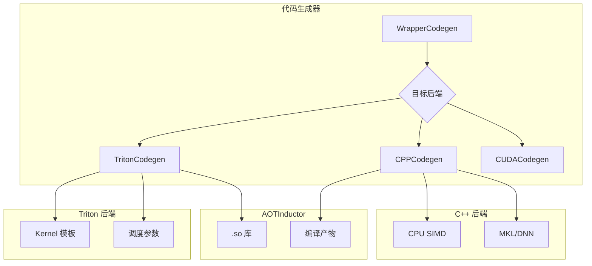
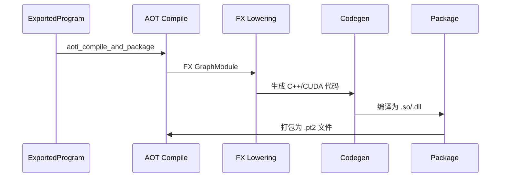
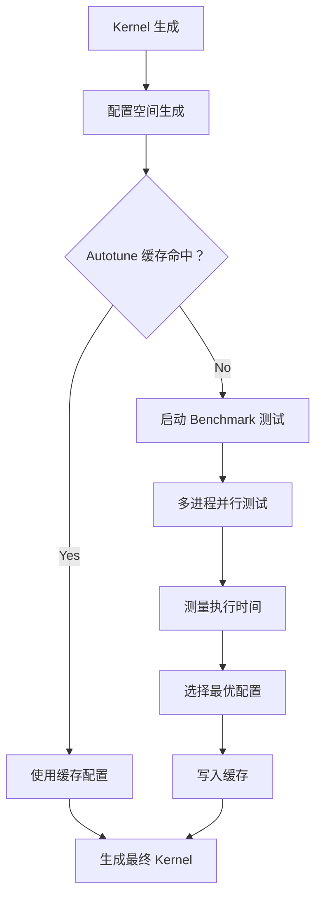
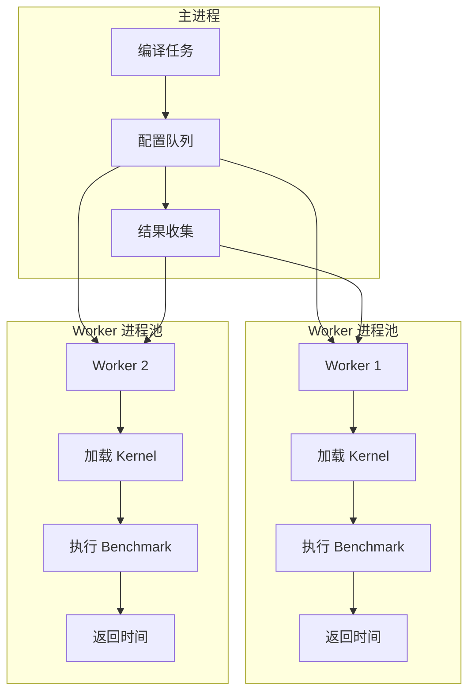

# PyTorch Inductor 编译器源码解析 - 博客系列大纲

## 概述

PyTorch Inductor 是 PyTorch 2.0 引入的新一代深度学习编译器，作为 `torch.compile` 的默认后端，负责将 FX 图转换为优化的机器代码。本系列文章将从源码角度深入剖析 Inductor 的架构设计和工作原理。

---

## 第一部分：Inductor 整体架构概览

### 1.1 Inductor 在 PyTorch 编译栈中的位置



### 1.2 核心组件总览

| 组件 | 源码位置 | 功能 |
|------|----------|------|
| **GraphLowering** | `torch/_inductor/graph.py` | 核心图 lowering，将 FX 图转为 Inductor IR |
| **IR 系统** | `torch/_inductor/ir.py` | 中间表示：TensorBox, StorageBox, Buffer, View |
| **Lowerings** | `torch/_inductor/lowering.py` | 算子到 Inductor IR 的转换规则 |
| **Scheduler** | `torch/_inductor/scheduler.py` | 调度算法与算子融合 |
| **Codegen** | `torch/_inductor/codegen/` | 代码生成：Triton/C++/CUDA |
| **FX Passes** | `torch/_inductor/fx_passes/` | 图优化 passes |

### 1.3 编译流程概览



---

## 第二部分：Inductor IR 系统设计

### 2.1 IR 核心概念

Inductor 的 IR 设计遵循"Box-Storage-Buffer"模式，核心类位于 [`torch/_inductor/ir.py`](torch/_inductor/ir.py):



### 2.2 TensorBox：张量操作的统一表示

- **设计目的**：所有 lowering 函数的输入/输出都是 TensorBox
- **实现要点**：
  - 延迟物化（Lazy realization）
  - 自动视图追踪
  - 原地操作处理（通过 StorageBox 重定向）

### 2.3 视图（View）机制

Inductor 通过视图链支持张量变换操作：

```
TensorBox → View → StorageBox → Buffer
```

视图类型包括：
- `ExpandView` - 广播操作
- `PermuteView` - 转置/重排
- `SqueezeView` - 维度压缩
- `DtypeView` - 类型转换
- `BaseView` - 切片/索引

### 2.4 Buffer 与 计算表示

- **InputBuffer**: 图输入或编译时常量
- **ComputedBuffer**: 计算产生的缓冲区
  - **Pointwise**: 逐元素操作（add, mul, sigmoid...）
  - **Reduction**: 归约操作（sum, mean, max...）

---

## 第三部分：Lowering 机制详解

### 3.1 Lowering 注册系统

源码位置：[`torch/_inductor/lowering.py`](torch/_inductor/lowering.py)

```python
# Lowering 注册表示例
@lowerings.register(aten.add.Tensor)
def add_lowering(a: TensorBox, b: TensorBox) -> TensorBox:
    return Pointwise.create(...)
```

### 3.2 Lowering 工作流程



### 3.3 关键 Lowering 类型

| 类型 | 示例算子 | 实现策略 |
|------|----------|----------|
| **逐元素** | `add`, `mul`, `relu` | Pointwise.create 融合 |
| **归约** | `sum`, `mean`, `argmax` | Reduction 节点 |
| **视图** | `view`, `transpose`, `squeeze` | View 链 |
| **复杂** | `conv2d`, `mm`, `softmax` | 专用 Kernel 模板 |

### 3.4 Fallback 机制

当算子没有 lowering 实现时：
1. 尝试使用分解表（decomposition table）分解
2. 若无法分解，回退到 Aten 实现（通过 `make_fallback`）

---

## 第四部分：图优化 Passes

### 4.1 Pass 执行阶段

源码位置：[`torch/_inductor/fx_passes/`](torch/_inductor/fx_passes/)



### 4.2 核心优化 Passes

| Pass | 文件 | 功能 |
|------|------|------|
| **预融合** | `fusion_regions.py` | 识别可融合区域 |
| **算子融合** | `fuse_attention.py` | Flash Attention 融合 |
| **Conv-BN 融合** | `efficient_conv_bn_eval.py` | Conv+BatchNorm 合并 |
| **DDP 融合** | `ddp_fusion.py` | 分布式梯度融合 |
| **内存优化** | `memory_estimator.py` | 内存峰值估计 |
| **重叠调度** | `overlap_scheduling.py` | 计算/通信重叠 |

### 4.3 算子融合原理

```python
# 融合条件判断
def can_fuse(node1, node2):
    # 1. 数据依赖检查
    # 2. 设备兼容性
    # 3. 内存带宽分析
    # 4. 计算强度评估
    pass
```

---

## 第五部分：调度算法与算子融合

### 5.1 Scheduler 架构

源码位置：[`torch/_inductor/scheduler.py`](torch/_inductor/scheduler.py)



### 5.2 融合决策策略

融合决策考虑因素：
1. **数据局部性**:  fusion 减少全局内存访问
2. **计算强度**: 避免融合后寄存器溢出
3. **并行度**: 保持足够的并行性
4. **硬件约束**: GPU SM 数量、共享内存限制

### 5.3 Scheduler 节点类型

```python
class SchedulerNode:
    # 表示一个待调度的计算单元
    - group: 融合组标识
    - deps: 依赖关系
    - write_buffers: 输出缓冲区
    
    def is_reduction(): ...
    def is_pointwise(): ...
    def get_read_deps(): ...
```

---

## 第六部分：代码生成系统

### 6.1 Codegen 架构

源码位置：[`torch/_inductor/codegen/`](torch/_inductor/codegen/)



### 6.2 Triton 代码生成

关键文件：
- `triton.py` - Triton Kernel 生成
- `cuda_combined_scheduling.py` - CUDA 融合调度
- `triton_combo_kernel.py` - 组合 Kernel

生成的 Triton Kernel 特点：
- 自动调优参数（block size, num_warps...）
- 内存合并优化
- 共享内存利用

### 6.3 C++/CPU 代码生成

关键文件：
- `cpp.py` - 通用 C++ 代码生成
- `cpp_wrapper_cpu.py` - CPU Wrapper 生成
- `simd.py` - SIMD 指令生成
- `mkldnn_lowerings.py` - MKL-DNN 集成

---

## 第七部分：AOTInductor

### 7.1 AOTInductor 概述

AOTInductor（Ahead-Of-Time Inductor）支持离线编译，生成独立的可部署产物。

源码入口：[`torch/_inductor/__init__.py`](torch/_inductor/__init__.py)

```python
# API 使用示例
torch._inductor.aoti_compile_and_package(
    exported_program,
    package_path="model.pt2"
)

# 加载
compiled_model = torch._inductor.aoti_load_package("model.pt2")
```

### 7.2 AOTInductor 编译流程



### 7.3 .pt2 包格式

- 编译后的共享库（.so/.dll）
- 权重文件（可选分离）
- 元数据（设备信息、版本等）

---

## 第八部分：性能优化技术

### 8.1 Autotune 系统

源码位置：`torch/_inductor/runtime/`

```python
# 配置项
torch._inductor.config.max_autotune = True
```

Autotune 调优参数：
- `BLOCK_SIZE`: 线程块大小
- `NUM_WARPS`: Warp 数量
- `NUM_STAGES`: 流水线级数
- `SPLIT_K`: 矩阵乘法分块

### 8.2 内存优化

1. **Buffer 复用**: 原地操作减少分配
2. **内存规划**: 基于依赖分析的内存复用
3. **CUDAGraphs**: 减少内核启动开销

### 8.3 通信优化

- `ddp_fusion.py`: 梯度融合减少通信次数
- `overlap_scheduling.py`: 计算/通信重叠
- `micro_pipeline_tp.py`: 张量并行微流水线

---

## 第九部分（进阶）：max-autotune 深度解析

### 9.1 什么是 max-autotune

`max-autotune` 是 Inductor 的最激进性能优化模式，通过 exhaustive search（穷举搜索）找到最优的 Kernel 配置组合。

```python
# 启用方式
torch.compile(model, mode="max-autotune")

# 或等价配置
torch._inductor.config.max_autotune = True
```

**三种编译模式对比**：

| 模式 | 编译速度 | 运行性能 | 适用场景 |
|------|----------|----------|----------|
| `default` | 快 | 良好 | 开发调试 |
| `reduce-overhead` | 中 | 好 | 减少 CUDA 启动开销 |
| `max-autotune` | 慢 | 最佳 | 生产部署 |
| `max-autotune-no-cudagraphs` | 慢 | 最佳 | 不支持 CUDAGraphs 的场景 |

### 9.2 max-autotune 工作流程



### 9.3 核心源码文件

| 文件 | 功能 |
|------|------|
| `torch/_inductor/runtime/triton_heuristics.py` | 配置启发式生成 |
| `torch/_inductor/runtime/benchmarking.py` | Benchmark 执行 |
| `torch/_inductor/autotune_process.py` | 多进程调优 |
| `torch/_inductor/choices.py` | Triton 配置生成 |
| `torch/_inductor/coordinate_descent_tuner.py` | 坐标下降调优 |

### 9.4 配置空间生成

源码位置：[`torch/_inductor/runtime/triton_heuristics.py`](torch/_inductor/runtime/triton_heuristics.py)

```python
# 简化示例：GEMM 配置空间
def get_gemm_configs():
    for BLOCK_M in [16, 32, 64, 128, 256]:
        for BLOCK_N in [16, 32, 64, 128, 256]:
            for BLOCK_K in [32, 64, 128, 256]:
                for num_warps in [4, 8]:
                    for num_stages in [2, 3, 4, 5]:
                        yield Config({
                            'BLOCK_M': BLOCK_M,
                            'BLOCK_N': BLOCK_N,
                            'BLOCK_K': BLOCK_K,
                        }, num_warps=num_warps, num_stages=num_stages)
```

**调优参数维度**：

```
BLOCK_M, BLOCK_N, BLOCK_K   → 矩阵分块大小
num_warps                   → Warp 数量 (4, 8, 16)
num_stages                  → 流水线级数 (2-7)
split_k                     → Split-K 分块数
```

### 9.5 多进程调优架构

源码位置：[`torch/_inductor/autotune_process.py`](torch/_inductor/autotune_process.py)



**关键设计**：

1. **进程隔离**：每个 worker 独占 GPU，避免上下文切换
2. **环境变量继承**：`CUDA_VISIBLE_DEVICES` 正确传递
3. **超时处理**：防止单个配置卡死
4. **结果缓存**：避免重复测试

```python
# 配置 worker 进程池
class AutotuneProcessPool:
    def __init__(self, device=None, max_workers=4):
        self.executor = ProcessPoolExecutor(max_workers=max_workers)
        self.device = device  # 绑定的 GPU 设备
        
    def benchmark(self, kernel_fn, configs):
        # 提交到 worker 进程执行
        futures = [
            self.executor.submit(run_benchmark, kernel_fn, cfg, self.device)
            for cfg in configs
        ]
        return [f.result() for f in futures]
```

### 9.6 Autotune 缓存机制

源码位置：`torch/_inductor/runtime/autotune_cache.py`

```python
# 缓存键生成
cache_key = (
    kernel_hash,        # Kernel 源码哈希
    config_hash,        # 配置参数哈希
    device_capability,  # GPU Compute Capability
    dtype,              # 数据类型
)
```

**缓存策略**：

| 策略 | 说明 |
|------|------|
| **本地缓存** | `~/.cache/torchinductor/` 存储最佳配置 |
| **远程缓存** | 企业环境可配置共享缓存服务器 |
| **缓存失效** | Triton 版本变化、Kernel 源码变化时失效 |

```python
# 检查缓存
from torch._inductor.runtime.autotune_cache import AutotuneCache

autotune_cache = AutotuneCache.create(inductor_meta, filename, configs_hash)
if best_config := autotune_cache.read_best(inductor_meta, configs):
    # 缓存命中，跳过 benchmark
    configs = [best_config]
```

### 9.7 Coordinate Descent Tuning（坐标下降调优）

源码位置：`torch/_inductor/runtime/coordinate_descent_tuner.py`

当配置空间过大时，使用坐标下降算法进行启发式搜索：


**适用场景**：
- 配置空间 > 1000 种组合
- 时间预算有限
- 接近最优解即可接受

### 9.8 配置项详解

```python
import torch._inductor.config as config

# ===== Autotune 核心配置 =====

# 启用最大 autotune（等价于 mode="max-autotune"）
config.max_autotune = True

# 启用 coordinate descent tuning（用于大配置空间）
config.coordinate_descent_tuning = True

# 启用 Triton 的 cudagraphs 优化
config.triton.cudagraphs = True

# 每个 Kernel 最多测试多少个配置（0=全部测试）
config.max_autotune_gemm_config_count = 0

# 是否使用多进程进行 autotune
config.autotune_multi_process = True

# 缓存配置
config.autotune_cache_dir = "~/.cache/torchinductor"
config.autotune_remote_cache = None  # 远程缓存 URL

# ===== 性能调优配置 =====

# 矩阵乘法分块策略
config.split_kernel = False  # 启用 split-k 融合

# 混合精度 GEMM 配置
config.use_mixed_mm = False

# 卷积算法选择
config.cuda.conv_default_precision = "autotune"
```

### 9.9 实战：查看 Autotune 日志

```python
import logging
import torch._inductor.config as config

# 启用详细日志
config.verbose = True
logging.basicConfig(level=logging.INFO)

# 运行模型
model = torch.compile(MyModel(), mode="max-autotune")
output = model(input)

# 输出示例：
# [autotune] Testing config {'BLOCK_M': 128, 'BLOCK_N': 64, ...}
# [autotune] Best config: 0.234ms (vs baseline 0.456ms, 48% faster)
```

### 9.10 性能提升案例

**典型性能提升**（相比 default 模式）：

| 算子 | 输入规模 | 提升幅度 |
|------|----------|----------|
| GEMM | 4096x4096 | 20-40% |
| Conv2d | ResNet-50 | 15-25% |
| Attention | 512 seq len | 30-50% |
| LayerNorm | 大 batch | 10-20% |

**注意事项**：
- 首次编译时间长（可能数分钟到数小时）
- 建议使用缓存或分布式 autotune
- 生产环境可预编译后部署

---

## 第十部分：实战与调试

### 10.1 编译日志分析

源码位置：[`torch/_logging/__init__.py`](torch/_logging/__init__.py)

```python
import logging
from torch._logging import set_logs, trace_structured

# 启用特定模块日志
set_logs(inductor=logging.DEBUG)

# 结构化追踪（可被 tlparse 解析）
trace_structured(
    "artifact",
    metadata_fn=lambda: {"name": "my_artifact", "encoding": "json"},
    payload_fn=lambda: my_data,
)
```

### 10.2 调试上下文 (DebugContext)

源码位置：[`torch/_inductor/debug.py`](torch/_inductor/debug.py#L393)

```python
from torch._inductor.virtualized import V

# 当 config.trace.enabled=True 时自动保存调试产物
with V.debug:
    V.debug.fx_graph(gm, inputs)         # 保存 FX 图
    V.debug.ir_pre_fusion(nodes)         # 保存融合前 IR
    V.debug.ir_post_fusion(nodes)        # 保存融合后 IR
    V.debug.output_code(filename)        # 保存生成代码
    V.debug.graph_diagram(nodes)         # 绘制 SVG 图
```

**启用调试**：
```bash
export TORCH_COMPILE_DEBUG=1
```

### 10.3 性能分析工具

**tlparse**：解析结构化追踪日志
```bash
pip install tlparse
tlparse /path/to/logs
```

**指标收集**：[`torch/_inductor/metrics.py`](torch/_inductor/metrics.py)
```bash
export TORCHINDUCTOR_ENABLED_METRIC_TABLES=kernel_autotune,kernel_metadata
```

**内存追踪**：[`torch/_inductor/runtime/debug_utils.py`](torch/_inductor/runtime/debug_utils.py)
```python
from torch._inductor.runtime.debug_utils import track_tensor, check_memory_step
```

### 10.4 常见问题排查

| 问题 | 诊断方法 | 解决方案 |
|------|----------|----------|
| 编译慢 | 查看 autotune 日志 | 使用缓存/限制配置数 |
| 运行时慢 | 检查融合前后 IR | 调整 fusion 参数 |
| 内存溢出 | BufferMemoryTracker | 启用 memory_planning |
| Aten Fallback | 搜索 "fallback" 日志 | 添加 lowering/decomposition |

---

**完整文档**：[Part 10: 调试与实战](10-debugging.md)

### 10.1 编译日志分析

```python
import logging
logging.basicConfig(level=logging.DEBUG)

# 启用详细日志
torch._logging.set_logs(graph_breaks=True, recompiles=True)
```

### 10.2 性能分析工具

### 10.3 常见问题排查

**完整排查指南见**：[10-debugging.md#103-常见问题排查](10-debugging.md#103-常见问题排查)

---

## 附录 A：max-autotune 相关源码索引

```
torch/_inductor/runtime/
├── triton_heuristics.py       # 配置启发式生成（GEMM/Conv/Attention）
├── benchmarking.py            # Benchmark 执行和计时
├── autotune_cache.py          # 缓存读写逻辑
├── coordinate_descent_tuner.py # 坐标下降调优算法
├── hints.py                   # Autotune Hint 定义
└── runtime_utils.py           # 工具函数（设备属性、缓存目录等）

torch/_inductor/
├── autotune_process.py        # 多进程调优 worker
├── choices.py                 # Triton 配置生成
├── distributed_autotune.py    # 分布式调优（多机）
└── remote_gemm_autotune_cache.py # 远程 GEMM 缓存
```

---

## 附录 B：核心模块源码索引

### 核心模块
```
torch/_inductor/
├── __init__.py           # 公共 API 导出
├── config.py             # 配置系统
├── graph.py              # GraphLowering 核心
├── ir.py                 # IR 节点定义
├── lowering.py           # Lowering 注册
├── scheduler.py          # 调度与融合
├── compile_fx.py         # FX 编译入口
├── output_code.py        # 编译产物输出
```

### 代码生成
```
torch/_inductor/codegen/
├── triton.py             # Triton 代码生成
├── cpp.py                # C++ 代码生成
├── wrapper.py            # Wrapper 生成
├── common.py             # 公共代码生成逻辑
└── memory_planning.py    # 内存规划
```

### 优化 Passes
```
torch/_inductor/fx_passes/
├── pre_grad.py           # 前向优化
├── post_grad.py          # 后向优化
├── joint_graph.py        # 联合图优化
├── fuse_attention.py     # Attention 融合
├── ddp_fusion.py         # 分布式融合
└── split_cat.py          # Split+Cat 融合
```

### 运行时
```
torch/_inductor/runtime/
├── autotune_cache.py     # Autotune 缓存
├── benchmarking.py       # 性能测试
├── cache_dir_utils.py    # 缓存目录管理
└── hints.py              # 编译提示
```

---

## 总结

本系列文章从源码角度系统介绍了 PyTorch Inductor 编译器的设计原理。Inductor 作为 PyTorch 2.0 的核心编译后端，通过以下技术实现性能优化：

1. **IR 设计**: Box-Storage-Buffer 模式支持灵活的视图和原地操作
2. **Lowering 系统**: 将 FX 图转换为优化的 IR 表示
3. **算子融合**: 减少内核启动和内存访问
4. **代码生成**: 生成高效的 Triton/C++ 代码
5. **Autotune**: 自动搜索最优 Kernel 参数（含 max-autotune 深度解析）
6. **AOT 编译**: 支持离线编译部署

理解 Inductor 的源码架构对于：
- 开发自定义算子
- 调试编译问题
- 优化模型性能
- 理解编译器设计原理

都具有重要意义。

---

## 附录 C：max-autotune 使用技巧

### C.1 快速启用

```python
import torch

# 方式 1：使用 mode 参数（推荐）
model = torch.compile(MyModel(), mode="max-autotune")

# 方式 2：使用配置项
import torch._inductor.config as config
config.max_autotune = True
config.max_autotune_no_cudagraphs = False  # 如需禁用 CUDAGraphs

# 方式 3：环境变量（无需修改代码）
# TORCH_COMPILE_MODE=max-autotune python train.py
```

### C.2 缓存管理

```bash
# 查看缓存目录
ls -la ~/.cache/torchinductor/

# 清除缓存（重新 autotune）
rm -rf ~/.cache/torchinductor/

# 设置自定义缓存目录
export TORCHINDUCTOR_CACHE_DIR=/path/to/custom/cache
```

### C.3 分布式 Autotune

对于超大规模模型，可使用分布式 autotune：

```python
# 多机并行调优
config.distributed_autotune = True
config.remote_cache_url = "http://cache-server/api"
```

### C.4 性能基准测试

```python
import torch._inductor.metrics as metrics

# 启用指标收集
config.trace = True

# 运行后查看指标
print(metrics.compilation_metrics)
```

### C.5 调试技巧

```python
# 1. 查看哪些配置被测试
config.verbose = True

# 2. 限制配置数量（快速测试）
config.max_autotune_gemm_config_count = 10

# 3. 禁用多进程（便于调试）
config.autotune_multi_process = False

# 4. 强制禁用缓存
config.force_disable_caches = True
```
- 理解编译器设计原理

都具有重要意义。
